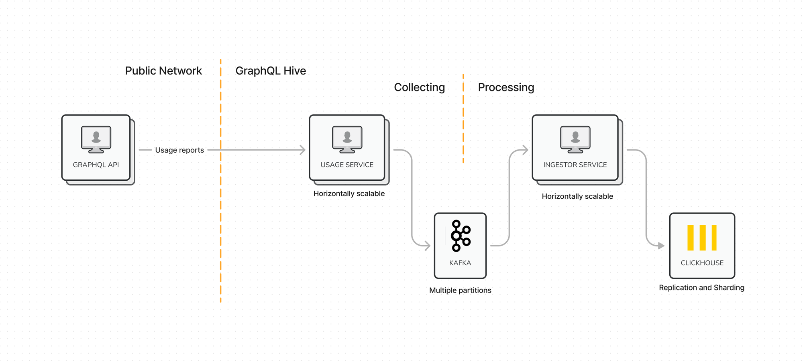
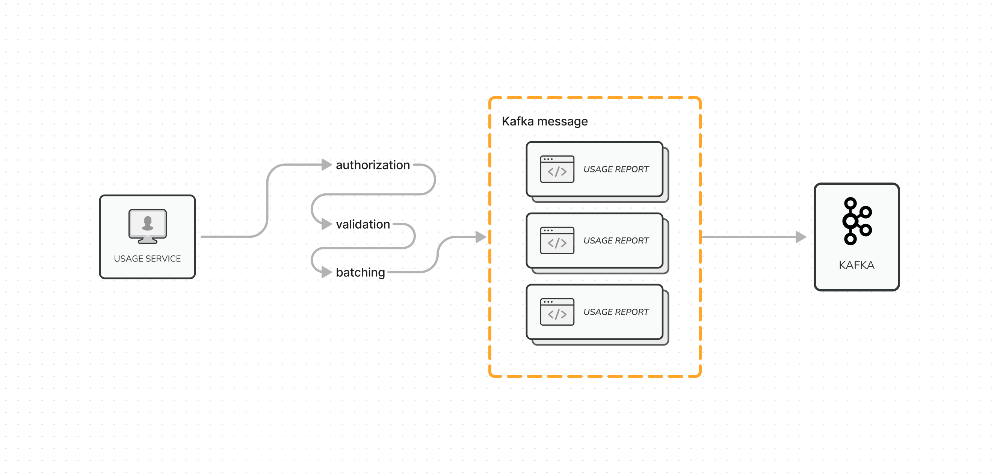
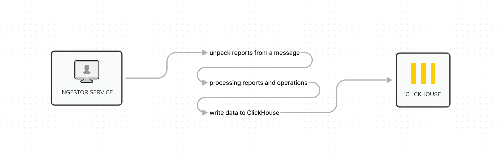
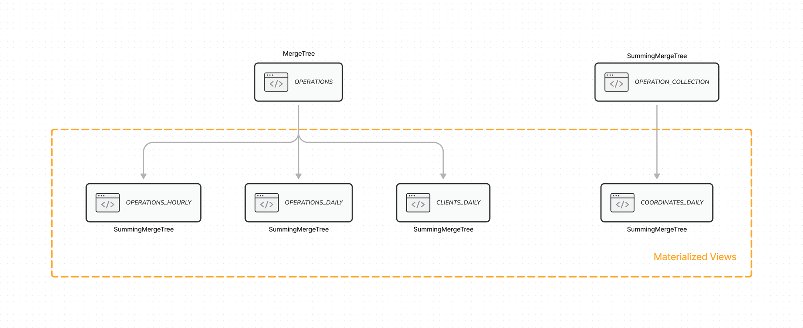
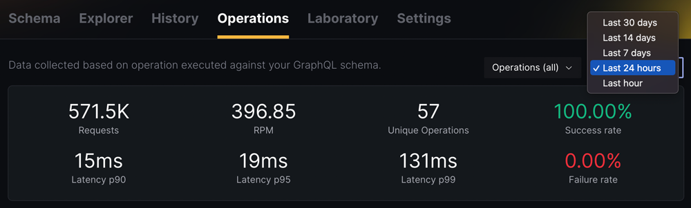
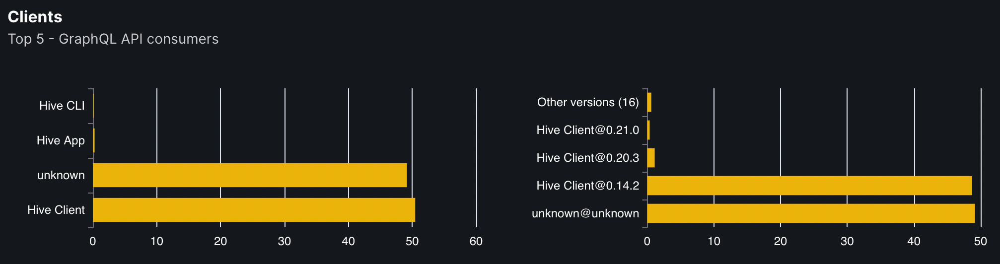
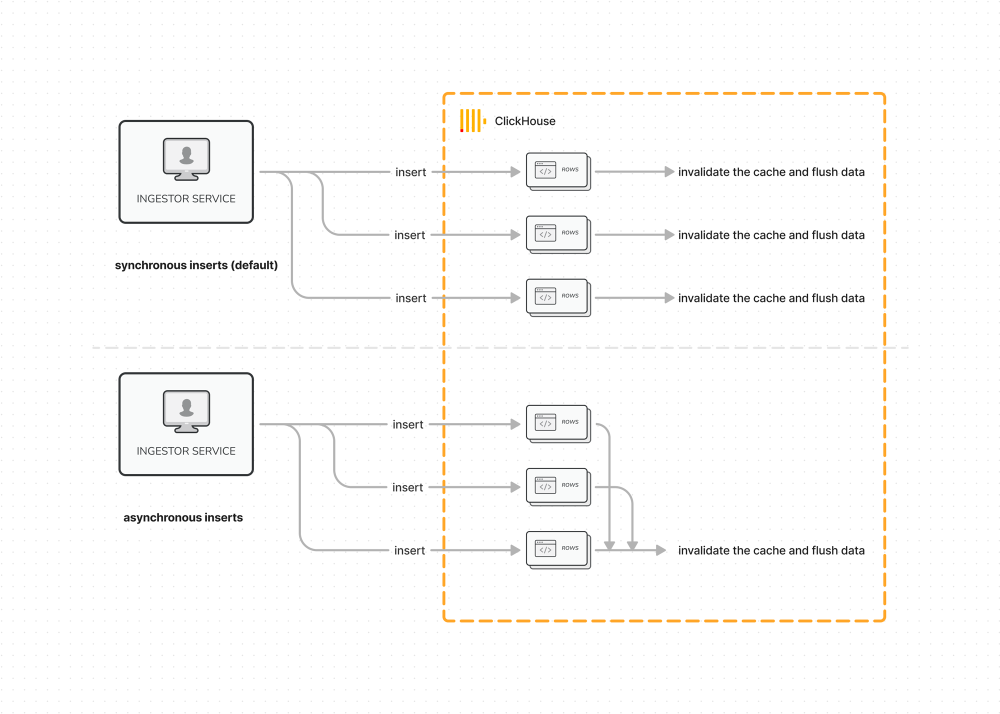

import { Callout } from "@hive/design-system/hive-components/callout";
import { LinkCard } from "@hive/design-system/hive-components/link-card";

You will learn how ClickHouse and Kafka enabled Hive Console to collect billions of requests monthly
without a drop of sweat. We will also cover the challenges we faced and how we overcame them by
covering Hive's architecture in detail.

## What Is Hive Console?

[Hive Console](https://the-guild.dev/graphql/hive) is a Schema Registry, Monitoring, and Analytics
solution for GraphQL APIs. A fully open-source tool that helps you to track the history of changes
prevents breaking the API and analyzing the traffic of your API.

Hive Console makes you aware of how your GraphQL API is used and what is the experience of its final
users.

We [launched Hive Console](https://www.the-guild.dev/blog/announcing-graphql-hive-release) a few
months ago,
[after a year-long preview program](https://www.the-guild.dev/blog/graphql-hive-preview). In case
you missed it, we recently
[announced a self-hosted version](https://www.the-guild.dev/blog/announcing-self-hosted-graphql-hive).

## Monitoring Performance and Usage of GraphQL API

It is important to be aware of how a GraphQL API is used and what is the experience of its final
users. To answer these questions Hive Console collects
[Usage Reports](https://the-guild.dev/graphql/hive/docs/api-reference/usage-reports). By looking at
the sample below, you can get an idea of how Hive Console knows when it's safe to delete a type or a
field of your GraphQL API. This is the most important building block of all data available in
Hive Console.

```json
{
  "size": 1,
  "map": {
    "762a45e3": {
      "operationName": "users",
      "operation": "query users { users { id } }",
      "fields": ["Query", "Query.users", "User", "User.id"]
    }
    /* ... */
  },
  "operations": [
    {
      "operationMapKey": "762a45e3", // points to the 'users' query
      "timestamp": 1663158676589,
      "execution": {
        "ok": true,
        "duration": 150000000, // 150ms in nanoseconds
        "errorsTotal": 0
      },
      "metadata": {
        "client": {
          "name": "demo", // Name of the GraphQL API consumer
          "version": "0.0.1" // Version of the GraphQL API consumer
        }
      }
    }
    /* ... */
  ]
}
```

## Why ClickHouse?

The kind of data Hive Console deals with is not meant to be mutated (it never changes) and the
database has to support a good set of functions for analytics and data aggregation.

Our first choice was **ElasticSearch**. It seemed like a good option, but we hit the first scaling
issues very quickly. **After reaching the goal of 100M operations per month, the queries to
ElasticSearch were unusable.** We tried to improve it, but we weren't happy with ElasticSearch
anyway.

After looking for alternatives we decided to switch to ClickHouse. We highly recommend reading the
["100x Faster: Hive Console migration from Elasticsearch to ClickHouse"](https://clickhouse.com/blog/100x-faster-graphql-hive-migration-from-elasticsearch-to-clickhouse)
article we wrote with the [ClickHouse Cloud](https://clickhouse.com/cloud) team. It covers in detail
the problems we were facing and the decision-making process that lead us to love ClickHouse.

## An Overview of the Architecture

The data pipeline in Hive Console is relatively simple but has proven to be highly scalable and
reliable. Here's a high-level data flow of the usage reporting part of Hive Console.



We can distinguish two parts here, the **collecting** and **processing** of data.

The `Usage service` is responsible for receiving and validating the usage report and of course the
token-based authorization. Once the report is validated, it is added to the batch of reports and
sent to **Kafka** (in one message).

Besides the batching we also perform a **_self-learning Kafka message size estimation_**.

In short, Kafka message has a limit of 1MB, with the size estimator, we make sure to not go over the
limit but squeeze the most we can at a time. Instead of sending many small messages (~20kb), we send
less often but almost at full capacity (on average about 998kb). **It reduces the cost of the hosted
Kafka by 10 times**.

It sounds mysterious, but we find this part extremely interesting, that's why we're going to write a
dedicated article about it soon.



Thanks to Kafka and its persistence of messages, the collecting and processing parts are nicely and
reliably separated.

Now, let's take a look at the next piece of the puzzle.

The Usage Ingestor service receives the messages from Kafka, then it unpacks the usage reports from
each message and processes them. Once the processing of reports is done, the service writes data to
Clickhouse.



The data pipeline does not end here, there're still a few quite interesting techniques we use within
ClickHouse.

> ClickHouse supports Kafka natively, we could insert data directly from it, but the reason why we
> decided not to was to reduce the traffic to Kafka and have better control of the writes.

## Squeezing the Most Performance

To understand the things we do with ClickHouse, you first need to understand the core of it, the
MergeTree family and Materialized Views. This is what ClickHouse documentation says about the
MergeTree family.

> Table engines from the MergeTree family are the core of ClickHouse data storage capabilities. They
> provide most features for resilience and high-performance data retrieval: columnar storage, custom
> partitioning, sparse primary index, secondary data-skipping indexes, etc.

It sounds very technical, but you can think of the MergeTree family as a group of table engines
built for a different purposes, dedicated to many different use cases.

We will cover only the regular `MergeTree` and `SummingMergeTree`.

Think of `MergeTree` table engine as a regular table, the one you're familiar with from PostgreSQL.
Nothing special here.

An overview of our ClickHouse tables.



In Hive Console, we use `MergeTree` to store received GraphQL requests in the
[`operations` table](https://github.com/kamilkisiela/graphql-hive/blob/64e53f207b413f8bb222eabd6aeb437e3300dbfd/packages/services/storage/migrations/clickhouse.ts#L29-L49).

```sql
CREATE TABLE 'operations' (
  target STRING,
  timestamp DateTime ('UTC'),
  expires_at DateTime ('UTC'),
  hash STRING,
  ok UInt8,
  errors UInt16,
  duration UInt64,
  client_name STRING,
  client_version STRING
)
```

Every GraphQL request from the collected billions of requests monthly is represented by a row in the
`operations` table.

Even though ClickHouse is extremely fast, it's still quite a lot of rows to read and analyze data
from, every second.

That's why we use the `SummingMergeTree`. It is a bit unique version of `MergeTree`.

In short, it replaced all rows (grouped by a combination of columns) with one row which contains
summarized values for the columns.

Sounds like a good table engine for grouping GraphQL operations and aggregating data! We use it in
the
[`operation_collection` table](https://github.com/kamilkisiela/graphql-hive/blob/64e53f207b413f8bb222eabd6aeb437e3300dbfd/packages/services/storage/migrations/clickhouse.ts#L7-L25).
It allows us to read all GraphQL operations within milliseconds and get the total number of calls.
Without the `SummingMergeTree` we would have to either maintain our own aggregation logic and write
data to the `MergeTree` table or always scan through billions of rows of the `operations` table.

<Callout emoji="🤓" type="info">
  We are not data scientists, at least not yet… but what we learned by
  developing Hive Console is that in order to squeeze the most performance of a
  database, you need to design the DB structure with the end goal in mind.
</Callout>

What do we mean by that? Here's a good example.

Hive Console has the "Operations" page that presents the total number of requests, latency (p90,
p95, p99) of all and individual operations, and a lot more other things.

The page contains a date range filter.



Calculating the percentiles of the latency for a large number of GraphQL requests (stored as rows)
might be a challenge, even for ClickHouse. Maybe not for "Last 24 hours" as we get only 1/30 of all
rows, compared to the "Last 30 days" option. Obviously, it won't be performant enough at some point.

Here's where the `Materialized Views` become super handy. Hive Console defines two "virtual" tables,
[`operations_hourly`](https://github.com/kamilkisiela/graphql-hive/blob/64e53f207b413f8bb222eabd6aeb437e3300dbfd/packages/services/storage/migrations/clickhouse.ts#L52-L82)
and
[`operations_daily`](https://github.com/kamilkisiela/graphql-hive/blob/64e53f207b413f8bb222eabd6aeb437e3300dbfd/packages/services/storage/migrations/clickhouse.ts#L86-L117)
that are Materialized Views of the original `operations` table.

In short, the `operations_hourly` stores summarized data of all GraphQL requests that happen during
an hour. It allows us to store one row per hour instead of millions. How much impact it has on
ClickHouse performance? For a 24h window, ClickHouse needs to read only 24 rows instead of 100s of
millions.

<Callout emoji="🥳" type="info">
  Thanks to Materialized Views, the latency of our queries went from 4-10
  seconds to less than 1 second.
</Callout>

You can see how `SummingMergeTree` and `Materialized Views` are crucial to ClickHouse performance.

As you know, Hive Console is open source and built in public, which means you can watch our journey
and learn from our mistakes. Here's an excellent example of what we mean, it's an issue where we
discussed the new data structure of ClickHouse. It shows the latency of the existing queries and how
we improved it.

<LinkCard
  alt="See the GitHub issue to learn more on how to improve ClickHouse performance in Hive Console"
  href="https://github.com/kamilkisiela/graphql-hive/issues/302"
  src="https://opengraph.githubassets.com/979a5f6740ae58d53ca7d2c363c8457fde46d7ffaac13987efe96dd98e78bbf6/kamilkisiela/graphql-hive/issues/302"
/>

Here's yet another, this time extreme example of a table designed with an end goal in mind.



Hive Console allows you to understand who are the consumers of your GraphQL API.

Here's the SQL query that we previously used to generate the charts:

```sql
SELECT
  COUNT(*) AS total,
  client_name,
  client_version
FROM
  operations
WHERE
  timestamp >= subtractDays (now(), 30)
GROUP BY
  client_name,
  client_version
```

The latency was awfully slow, the more data we had, the slower it was. For a few billion rows, **it
took 56 seconds**, a ridiculously poor performance.

We decided to create a special materialized view, designed specifically for the UI component.

```sql
CREATE MATERIALIZED VIEW 'clients_daily' (
  target STRING,
  client_name STRING,
  client_version STRING,
  hash STRING,
  timestamp DateTime ('UTC'),
  expires_at DateTime ('UTC'),
  total UInt32
)
```

Here's
[a full SQL definition](https://github.com/kamilkisiela/graphql-hive/blob/64e53f207b413f8bb222eabd6aeb437e3300dbfd/packages/services/storage/migrations/clickhouse.ts#L121-L150)
of that table.

Now the SQL query looks like this:

```sql
SELECT
  sum(total) AS total,
  client_name,
  client_version
FROM
  clients_daily
WHERE
  timestamp >= subtractDays (now(), 30)
GROUP BY
  client_name,
  client_version
```

<Callout emoji="🤯" type="info">
  After we shipped a dedicated table (for the component we showed you), the numbers went down from 56 seconds to **56
  milliseconds**.

**It was a 1000x improvement.**

</Callout>

Another fantastic feature of ClickHouse is **Asynchronous Inserts**. This opt-in mode allows to pile
up inserted data and flush it in a single batch. Thanks to the async inserts we're able to accept a
higher rate of INSERT queries, without worrying about the performance.



Every read operation in ClickHouse is being cached, writing too often translates to a lot of cache
misses. To avoid that, we either use the async inserts mode or synchronously write data less often
but in higher volumes. We decided to use the async inserts mode, as it's a built-in feature and
makes our setup less complex.

## Conclusion

We did many, many mistakes, and we still do, but what we learned by working on Hive Console and a
large set of data is that the end goal should dictate the shape of data and tables.

> You can use the fastest database on earth and still experience poor performance.

Our advice is also to not think too much ahead of time, you can always iterate and improve your
setup as you scale up. There's really no need to overcomplicate things just for the sake of making
it "highly scalable". We think it's better to make mistakes and learn from them, instead of copying
the architecture of Cloudflare and other big tech companies.

<Callout emoji="🙋">
  If you find this article interesting, please let us know and tell us what else
  you wish to learn about. We're going to write a couple of articles about
  technical bits and pieces of Hive Console in the upcoming weeks, so stay
  tuned!
</Callout>
