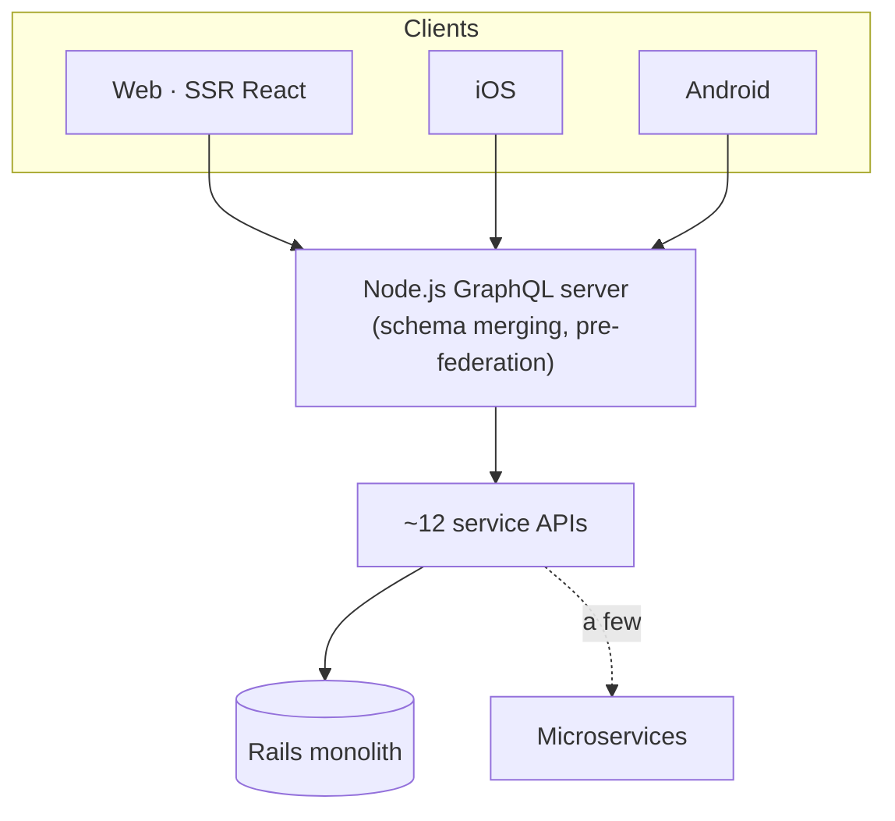
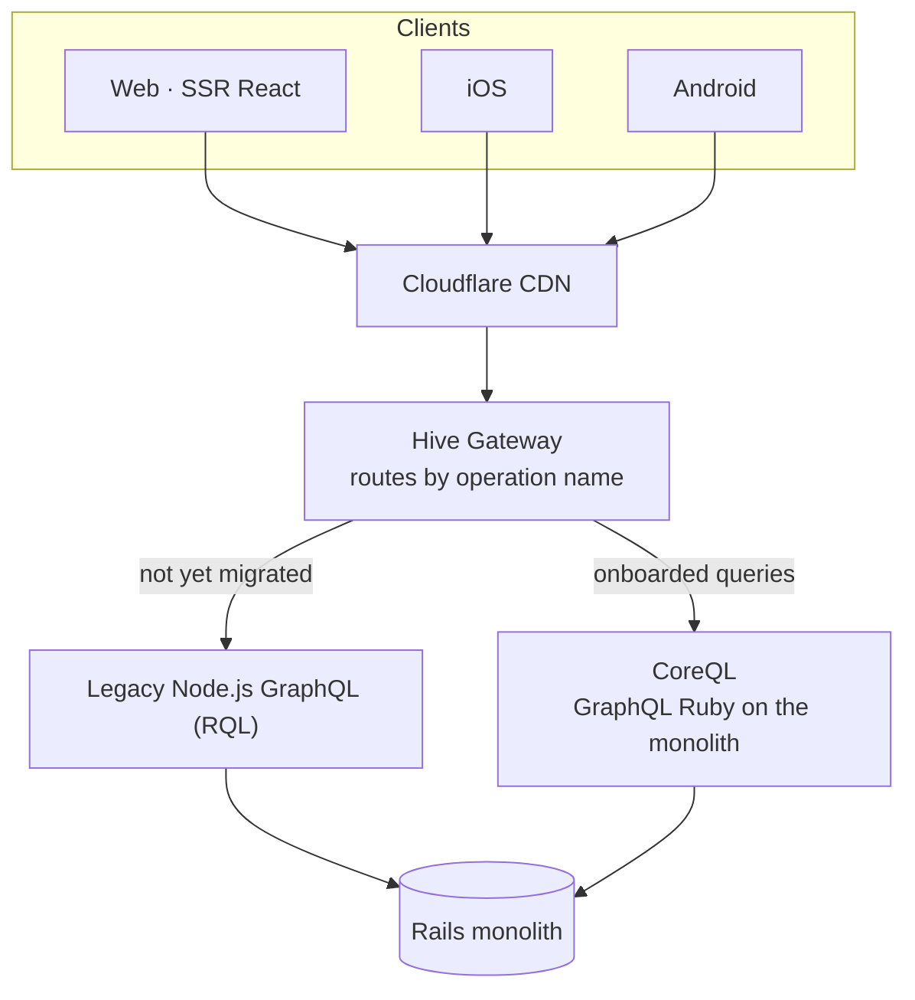
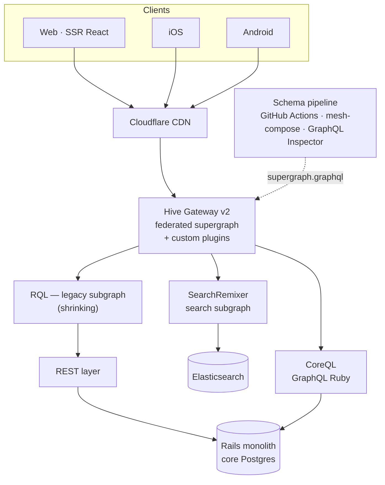

import { CallToAction } from "@hive/design-system/call-to-action";
import { ContactButton } from "@hive/design-system/contact-us";

import { DocsIcon, LargeCallout } from "#components/large-callout";
import { Lede } from "#components/lede";

<Lede>
  [Reverb](https://reverb.com) is the world's largest online marketplace for
  new, used, and vintage musical instruments. Founded in Chicago in 2013 — and
  newly independent again after six years as part of Etsy — Reverb serves
  millions of musicians through its web, iOS, and Android apps. Most of those
  requests flow through a single front door: [Hive Gateway](/gateway).
</Lede>

## An early adopter's inheritance

Reverb bet on GraphQL early — in the days before federation existed. That early bet came with an
architecture that, a decade later, had become the thing to escape.

The original stack was a Node.js GraphQL server that used schema merging — a pre-federation-era
solution — to combine roughly a dozen service APIs into one schema. Architecturally, Reverb was
(and, by design, remains) a "monolith with arms": a strong Rails core with a few purpose-built
microservices around it. Much of the joining and aggregation work, though, was happening in the
GraphQL layer — work the monolith's database could have done natively.

Meanwhile, three client platforms — server-rendered React on the web, iOS, and Android — all
depended on that schema staying exactly as it was.

_Phase 1 — the legacy stack: one Node.js server merging a dozen APIs over the Rails core, with a
few microservices around it._

## The plan: migrate queries, not nodes

Rather than a risky big-bang rewrite, Reverb's platform team designed an incremental path, with a
federation gateway at the center of it.

The team built a new GraphQL server, CoreQL, directly on the Rails monolith using GraphQL Ruby —
same schema as the legacy server, with about 90% of resolution happening as straightforward
ActiveRecord data loading. Then they put [Hive Gateway](/gateway) in front of both stacks and migrated query by
query: the gateway inspects each incoming operation name, and if that query has been onboarded to
the new stack, it routes there; otherwise it falls back to the legacy server.

Strict schema parity meant web, iOS, and Android clients never noticed a thing.

_Phase 2 — the migration: [Hive Gateway](/gateway) in front of both stacks, moving traffic query by query with
the schema held at parity._

The gateway also unlocked the end-state the team actually wanted: true federation for the systems
that genuinely are separate services. Today the supergraph composes three subgraphs: SearchRemixer,
the search service backed by Elasticsearch; RQL, the legacy Node.js server still serving the
not-yet-migrated remainder through a REST layer on the monolith; and CoreQL, running directly on
the monolith — one less hop per request, with domain logic colocated where the data lives.
Cloudflare fronts it all as the CDN.

_Phase 3 — today: a true federated supergraph, composed and validated by Reverb's
open-source-based schema pipeline._

## A schema registry built from open source parts

One of the most interesting things about Reverb's setup is what they built around the gateway —
a custom schema pipeline backed by The Guild's open source tooling.

Reverb runs a GitOps deployment model with ephemeral sandbox environments, where every sandbox
needs its own schema version. So the team assembled their own schema pipeline: every subgraph PR
regenerates its schema; on merge, a bot commits it to the gateway repository; GitHub Actions then
run supergraph composition with mesh-compose, validate the federation, and use GraphQL Inspector to
check every client operation — gathered from the actual client codebases — against the proposed
change. Only then does the supergraph deploy, and clients regenerate their types with GraphQL Code
Generator.

That's schema registry, composition, breaking-change detection, and client safety — composed from
unbundled open source libraries. It's exactly how the Hive platform is designed to be used: every
piece works standalone, with no lock-in, and teams can graduate to Hive Console whenever the
home-grown pipeline stops being the best use of their time. And because Hive Console is fully open
source (MIT) like the rest of the platform, "graduating" doesn't mean giving up control — it can be
self-hosted inside your own infrastructure, which fits a GitOps model with ephemeral sandbox
environments like Reverb's just as well as the hosted cloud version does.

What Console adds on top of a pipeline like Reverb's is everything that's hard to hand-roll:

- **Usage insights** down to the individual field and coordinate.
- **Conditional breaking-change detection** that judges every schema change not just against
  static client code, but against real production traffic, stored trusted documents (persisted
  queries), and exposed MCP tools.
- **Schema-change notifications** to Slack or anywhere a webhook reaches.
- **Metric Alerts** — threshold and relative-change alerting on error rates, latency percentiles,
  and traffic drops, delivered to Slack, MS Teams, or webhooks so the platform team hears about an
  incident before users do.
- **A schema explorer** that gives every engineer — not just the platform team — visibility into
  the supergraph: who owns what, and how and by whom it's being used.
- **Schema contracts** for serving tailored views of the graph to different consumers.
- **Distributed tracing** of every operation across the gateway and subgraphs, with Gateway v2's
  OpenTelemetry support.

And for a team in Reverb's exact position — a working registry pipeline, no usage reporting yet —
the on-ramp is free: using the hosted Hive Console purely as a schema registry, without traffic
reporting, costs nothing.

The team's creativity didn't stop there. Reverb wrote a custom [Hive Gateway](/gateway) plugin — a "node
multiplexer" — that splits large incoming queries at the root, fans them out as smaller parallel
queries to the Ruby server, and merges the responses. A very big graph becomes many small graphs,
and the monolith stays responsive. It's the kind of off-label extension the gateway's plugin system
exists for.

## Support that reads your code

Reverb's collaboration with The Guild started the way many do: with a bug. In December 2024, the
team reported a memory leak that appeared whenever they enabled upstream timeouts. Days after the
first call in January 2025, The Guild had reproduced it, fixed it, and shipped a stable release —
with follow-up improvements rolled out the same month.

That set the tone for what came next:

- When Reverb needed the original operationName preserved in subgraph requests for their query
  tracking, The Guild shipped a fix in an alpha release within days; Reverb tested it and it went
  stable.
- When a v2 migration test suddenly requested 8.27GB of memory instead of 2GB, the teams debugged
  it together — through Slack threads, a shared look at Reverb's gateway repository, and a live
  profiling session — until the culprit emerged: automatic process forking spawning ~20 gateway
  workers. The fix was one config line, and The Guild wrote a new Concurrency and Scaling
  documentation page so the next team wouldn't have to ask.
- When a stubborn request-waterfall was adding over 100ms to the p50 of a high-traffic query, The
  Guild's engineers dug in — and found the bottleneck not in [Hive Gateway](/gateway), but in Reverb's own
  multiplexer plugin, where a `Promise.all` was holding merged responses hostage to the slowest
  sub-query. "Thanks so much for catching this in our code," the team wrote back.

In April 2026, Reverb's Web Architecture Team posted this, unprompted, in the shared Slack channel:

> Just wanted to extend an appreciation for how responsive and helpful The Guild has been with our
> questions — whether it's about the Gateway code or us stepping on our own toes. The team has been
> incredibly quick to help and consistently follows through.

<cite>
  Web Architecture Team, Reverb
</cite>

## Measurable results

In May 2026, Reverb completed the upgrade to [Hive Gateway](/gateway) v2 in production. Thirty days of Datadog
data later:

- **30% lower CPU usage** (median total cores)
- **20% faster p90 latency and 30% faster p95** — "much better at higher percentiles"
- A deliberate trade-off of ~30% higher memory usage, which the team flagged as a non-issue: "Not a
  concern for us, but sharing as a datapoint."

And from their APM waterfalls: the gateway itself accounts for only 10–15% of total request time —
the platform layer stays out of the way.

## What's next

The migration from the legacy Node.js server continues query by query, with more true subgraphs
joining the federation. The team is exploring splitting mutation and query workloads across
separate upstream instances of the same schema — working around request-cancellation limits in the
upstream runtime — and evaluating a self-hosted Hive Console to layer usage insights, conditional
breaking-change checks, and schema-change alerts on top of the registry pipeline they already have.

> We're benefiting greatly from the open source software The Guild is sharing — happy to contribute
> back whenever we can.

<cite>
  Nguyen Nguyen
  Principal Engineer, Reverb
</cite>

<LargeCallout
  cta={<ContactButton variant="secondary-inverted" />}
  heading="Run Your Federated Graph on Hive"
  icon={<DocsIcon />}
  variant="primary"
>
  [Hive Gateway](/gateway) and the Hive schema registry are fully open source
  (MIT) — use every piece standalone, self-host the whole platform, or start
  with the hosted registry for free.
</LargeCallout>
