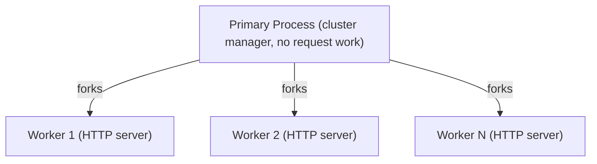

import { Callout } from "@hive/design-system/hive-components/callout";

Hive Gateway CLI runs as an HTTP server. Because Node.js is single-threaded, a single gateway
process can only handle one request at a time at the JavaScript level. Forking lets you run multiple
gateway workers in parallel, each capable of independently handling incoming HTTP requests, which
directly increases your request throughput.

## How Forking Works

Under the hood, forking uses [Node.js Cluster](https://nodejs.org/api/cluster.html). The primary
process spawns one or more child processes - each child is a full, independent Hive Gateway instance
with its own event loop, memory heap, and connection pool. The primary process accepts all incoming
connections and distributes them across workers using round-robin scheduling, which is
the default on all platforms except Windows. This is a deliberate design choice - when left to the
OS, distribution tends to be severely unbalanced; [Node.js's own docs note cases where over 70% of
all connections ended up in just two processes out of eight](https://nodejs.org/api/cluster.html#how-it-works).



Each worker is a completely independent Node.js process with its own full HTTP server. They do not
share memory - every worker holds its own separate copy of all in-memory data such as
caches, schema, and connection pools.

## Configuring Forking

Forking is only available in **CLI mode**. If you are using Hive Gateway as a runtime library
(i.e. calling `createGatewayRuntime` directly in your own server), forking is your responsibility -
you can use Node.js `cluster` or any other process manager yourself.

<Callout>
  Hive Gateway CLI **does not** fork automatically, even in production. You must
  explicitly configure it.
</Callout>

### Using the `FORK` Environment Variable

```sh
FORK=4 hive-gateway supergraph
```

### Using the Config File

```ts title="gateway.config.ts"
import { defineConfig } from "@graphql-hive/gateway";

export const gatewayConfig = defineConfig({
  fork: 4,
});
```

Setting `fork` to a number greater than `1` starts that many worker processes. Setting it to `1` or
leaving it unset runs the gateway in a single process with no forking.

## Memory Implications

Because each worker is a separate Node.js process, memory is **not shared**. Every worker carries
its own full copy of the gateway state, caches, schema, connection pools, and everything else.

If a single gateway worker consumes **1 GB** of memory under load, then:

| Workers (`fork`) | Approximate Memory Usage |
| ---------------- | ------------------------ |
| 1                | ~1 GB                    |
| 2                | ~2 GB                    |
| 3                | ~3 GB                    |
| 4                | ~4 GB                    |
| N                | ~N GB                    |

Plan your pod or VM memory limits accordingly before increasing the fork count.

## Throughput Gains

Each worker has its own event loop, so requests no longer queue behind each other waiting for the
single event loop to free up. This is the primary reason throughput increases with more workers -
not just raw parallelism, but the elimination of event queue congestion. Each additional worker adds
roughly the same amount of request-handling capacity as the previous one, as long as:

- the host has enough CPU threads to keep all workers busy, and
- downstream services (subgraphs, databases, etc.) are not the bottleneck.

## Choosing the Right Fork Count

A good rule of thumb:

- **Start with half** of your system's available CPU threads (i.e. `os.availableParallelism() / 2`)
  as a safe baseline.
- **Scale up to two-thirds or the full parallelism** if the gateway is the primary workload on the
  host and other services are not competing for CPU.
- **Do not exceed available CPU threads.** More workers than CPU threads means workers will compete
  for CPU time and you'll get context-switching overhead without throughput gains.

For example, on a 8-thread host running only the gateway, try `fork: 4` first, then `fork: 6` or
`fork: 8` while monitoring CPU saturation and memory pressure.

<Callout type="warning">
  Always measure memory usage under realistic load **before** committing to a
  fork count in production. Profile with your actual traffic patterns, not just
  idle memory.
</Callout>

If other services share the same host or pod (e.g. a sidecar, a metrics exporter, or a local
subgraph), reduce the fork count to leave headroom for those processes.

## Running on Bun

Bun is a fast JavaScript runtime with a built-in HTTP server that can handle significantly more
concurrent connections than Node.js in certain workloads. If you're hitting throughput limits even
after tuning your fork count, switching to Bun is worth trying.

Hive Gateway provides official Docker images for Bun. Simply append `-bun` to any image tag:

| Node.js image                         | Bun equivalent                            |
| ------------------------------------- | ----------------------------------------- |
| `ghcr.io/graphql-hive/gateway:latest` | `ghcr.io/graphql-hive/gateway:latest-bun` |
| `ghcr.io/graphql-hive/gateway:2`      | `ghcr.io/graphql-hive/gateway:2-bun`      |

```dockerfile title="Dockerfile"
FROM ghcr.io/graphql-hive/gateway:latest-bun
```

Forking is much less of a necessity on Bun. Bun's HTTP server is built on top of
[µWebSockets](https://github.com/uNetworking/uWebSockets), a high-performance C++ HTTP and
WebSocket library that handles concurrency very efficiently under the hood. A single Bun process can
handle a significantly higher volume of concurrent connections than a single Node.js process, often
making additional workers unnecessary.

That said, forking does work on Bun since it implements the Node.js `cluster` module, however it is
[not yet battle-tested](https://bun.com/reference/node/cluster). Notably, handles and file
descriptors cannot be passed between workers, which limits TCP server load-balancing across
processes to Linux only.

## Sizing Your Deployment

Once you have chosen a fork count, head over to
[Resources Requirements](/docs/gateway/deployment/resources-requirements) to translate that decision
into concrete CPU and memory allocations for your pods or VMs.

## Graceful Shutdown

When the gateway receives a `SIGTERM` or `SIGINT` signal it enters a graceful shutdown sequence:

1. The server stops accepting new incoming connections.
2. Existing keep-alive connections are idled out so clients move on naturally.
3. In-flight requests are given time to complete.
4. Once all active requests finish - or the timeout expires - all remaining connections are force-closed and the process exits.

The timeout is controlled by `gracefulShutdownTimeout` and defaults to **0** (immediate shutdown).

```ts title="gateway.config.ts"
import { defineConfig } from "@graphql-hive/gateway";

export const gatewayConfig = defineConfig({
  gracefulShutdownTimeout: 10_000, // 10 seconds, defaults to 0 (immediate shutdown)
});
```

<Callout type="warning">
  When using `fork`, each worker process runs its own graceful shutdown sequence
  independently. The primary process waits for all workers to exit before
  terminating.
</Callout>

## Scaling Considerations for Multiple Instances

When running multiple gateway workers (via forking) or multiple gateway instances (e.g. multiple
pods in Kubernetes), any state that lives in-memory is local to that process only. Two workers will
not see each other's in-memory caches, rate limit counters, or subscription state. This has two
important implications.

### Distributed Cache

Features like [response caching](/docs/gateway/other-features/performance/response-caching),
[rate limiting](/docs/gateway/other-features/security/rate-limiting), and
[persisted documents](/docs/gateway/persisted-documents) rely on a shared cache storage. With
multiple workers or instances, each process would maintain its own isolated cache, making those
features much less effective - or outright incorrect in the case of rate limiting.

To share cache state across all workers and instances, configure a
[Redis cache](/docs/gateway/other-features/performance#redis) as the cache storage:

```ts title="gateway.config.ts"
import { defineConfig } from "@graphql-hive/gateway";

export const gatewayConfig = defineConfig({
  fork: 4,
  cache: {
    type: "redis",
    url: "redis://localhost:6379",
  },
});
```

### Subscriptions and EDFS

Subscriptions have the same problem. By default, Hive Gateway uses an in-memory PubSub engine,
meaning a subscription event published to one worker will not reach subscribers connected to a
different worker or instance.

For multi-worker or multi-instance setups, use
[Event-Driven Federated Subscriptions (EDFS)](/docs/gateway/subscriptions#event-driven-federated-subscriptions-edfs)
with a message broker such as Redis, NATS, or Kafka. Events are published to the broker and all
workers subscribe to it, so every connected client receives the event regardless of which worker is
handling their connection.
