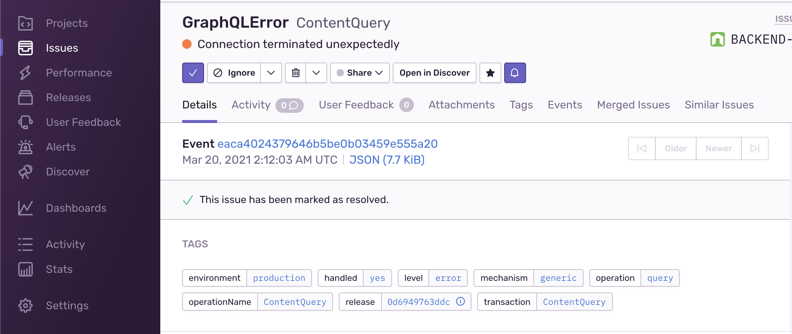
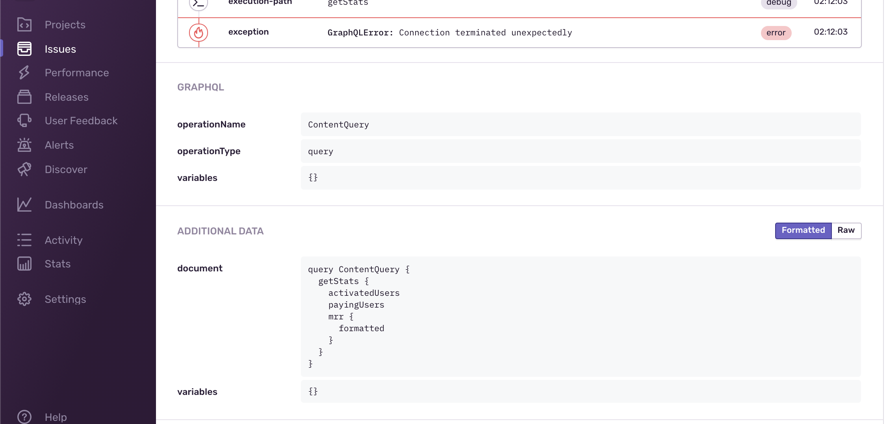

import { Callout } from "@hive/design-system/hive-components/callout";
import { Tabs } from "@hive/design-system/tabs";

If something is not working as it should within your GraphQL gateway, you would not want it to go
unnoticed.

Monitoring and tracing are essential for debugging and understanding the performance of your
gateway.

You can use Gateway plugins to trace and monitor your gateway's execution flow together with all
outgoing HTTP calls and internal query planning.

## Healthcheck

Hive Gateway is aware of the usefulness of a health check and gives the user maximum possibilities
to use the built-in check.

There are two types of health checks: **liveliness** and **readiness**, they both _are_ a health
check but convey a different meaning:

- **Liveliness** checks whether the service is alive and running
- **Readiness** checks whether the upstream services are ready to perform work and execute GraphQL
  operations

The difference is that a service can be _live_ but not _ready_ - for example, server has started and
is accepting requests (alive), but the read replica it uses is still unavailable (not ready).

Both endpoints are enabled by default.

### Liveliness

By default, you can check whether the gateway is alive by issuing a request to the `/healthcheck`
endpoint and expecting the response `200 OK`. A successful response is just `200 OK` without a body.

You can change this endpoint through the `healthCheckEndpoint` option:

<Tabs items={['CLI', "Programmatic Usage"]}>

<Tabs.Tab>

```ts title="gateway.config.ts"
import { defineConfig } from "@graphql-hive/gateway";

export const gatewayConfig = defineConfig({
  healthCheckEndpoint: "/healthcheck",
});
```

</Tabs.Tab>

<Tabs.Tab>

```ts title="index.ts"
import { createGatewayRuntime } from "@graphql-hive/gateway-runtime";

export const gateway = createGatewayRuntime({
  healthCheckEndpoint: "/healthcheck",
});
```

</Tabs.Tab>

</Tabs>

### Readiness

For readiness check, Hive Gateway offers another endpoint (`/readiness`) which checks whether the
services powering your gateway are ready to perform work. It returns `200 OK` if all the services
are ready to execute GraphQL operations.

It returns `200 OK` if all the services are ready to perform work.

You can customize the readiness check endpoint through the `readinessCheckEndpoint` option:

<Tabs items={['CLI', "Programmatic Usage"]}>

<Tabs.Tab>

```ts title="gateway.config.ts"
import { defineConfig } from "@graphql-hive/gateway";

export const gatewayConfig = defineConfig({
  readinessCheckEndpoint: "/readiness",
});
```

</Tabs.Tab>

<Tabs.Tab>

```ts title="index.ts"
import { createGatewayRuntime } from "@graphql-hive/gateway-runtime";

export const gateway = createGatewayRuntime({
  readinessCheckEndpoint: "/readiness",
});
```

</Tabs.Tab>

</Tabs>

## OpenTelemetry Traces

Hive Gateway supports OpenTelemetry for tracing and monitoring your gateway.

To send traces directly to Hive Console, follow the
[OpenTelemetry integration guide](/docs/other-integrations/opentelemetry).

[OpenTelemetry](https://opentelemetry.io/) is a set of APIs, libraries, agents, and instrumentation
to provide observability to your applications.

The following are available to use with this plugin:

- HTTP request: tracks the incoming HTTP request and the outgoing HTTP response
- GraphQL Lifecycle tracing: tracks the GraphQL execution lifecycle (parse, validate and execution).
- Upstream HTTP calls: tracks the outgoing HTTP requests made by the GraphQL execution.
- Context propagation: propagates the trace context between the incoming HTTP request and the
  outgoing HTTP requests.
- Custom Span and attributes: Add your own business spans and attributes from your own plugin.
- Logs and Traces correlation: Rely on standard OTEL shared context to correlate logs and traces


### OpenTelemetry Setup

For the OpenTelemetry tracing feature to work, OpenTelemetry JS API must be setup.

We recommend to place your OpenTelemetry setup in a `telemetry.ts` file that will be your first
import in your `gateway.config.ts` file. This allow instrumentations to be registered (if any)
before any other packages are imported.

For ease of configuration, we provide a `openTelemetrySetup` function, with sensible default and
straightforward API compatible with all runtimes.

But this utility is not mandatory, you can use any setup relevant to your specific use case and
infrastructure.

The most commonly used otel packages are available when using Hive Gateway with CLI. Please switch
to programmatic usage if you need more packages.

Please refer to [`opentelemetry-js` documentation](https://opentelemetry.io/docs/languages/js/) for
more details about OpenTelemetry setup and API.

#### Basic usage

<Tabs items={[<div key="gateway">Hive Gateway <code>openTelemetrySetup()</code> (recommended)</div>, <div key="otel">OpenTelemetry <code>NodeSDK</code></div>, "CLI"]}>

<Tabs.Tab>

This configuration API still rely on official `@opentelemetry/api` package, which means you can use
any official or standard compliant packages with it.

You will have to pick a
[Context Manager](https://opentelemetry.io/docs/languages/js/context/#context-manager) (we recommend
to use `AsyncLocalStorageContextManager` from `@opentelemetry/context-async-hooks` if your runtime
supports `AsyncLocalStorage` API), and a trace exporter depending on your traces backend (probably
`@opentelemetry/exporter-trace-otlp-http`).

```sh npm2yarn
npm i @opentelemetry/context-async-hooks @opentelemetry/exporter-trace-otlp-http
```

Depending on your usage, you will have to import `openTelemetrySetup` from a different module:

- CLI usage: `@graphql-hive/gateway/opentelemetry/setup`
- Programmatic usage : `@graphql-hive/plugin-opentelemetry/setup`

```ts title="telemetry.ts"
// For CLI usage
import { openTelemetrySetup } from "@graphql-hive/gateway/opentelemetry/setup";

// For Programmatic usage
import { openTelemetrySetup } from "@graphql-hive/plugin-opentelemetry/setup";

import { AsyncLocalStorageContextManager } from "@opentelemetry/context-async-hooks";
import { OTLPTraceExporter } from "@opentelemetry/exporter-trace-otlp-http";

openTelemetrySetup({
  // Mandatory: It depends on the available API in your runtime.
  // We recommend AsyncLocalStorage based manager when possible.
  // `@opentelemetry/context-zone` is also available for other runtimes.
  // Pass `false` to disable context manager usage.
  contextManager: new AsyncLocalStorageContextManager(),

  traces: {
    // Define your exporter, most of the time the OTLP HTTP one. Traces are batched by default.
    exporter: new OTLPTraceExporter({ url: "http://<otlp-endpoint>:4317" }),

    // You can easily enable a console exporter for quick debug
    console: process.env["DEBUG_TRACES"] === "1",
  },
});
```

<Callout type="info">

`traces.console` only adds a `ConsoleSpanExporter` writing spans to stdout, on
top of your real exporter. It's meant for debugging when you struggle to
receive spans, not as a replacement for a proper exporter in the examples
below.

</Callout>

After configuring and setting up the telemetry, make sure to import it as the first import in your
`gateway.config.ts` file and enable OpenTelemetry tracing:

```ts title="gateway.config.ts"
import "./telemetry";
import { defineConfig } from "@graphql-hive/gateway";

export const gatewayConfig = defineConfig({
  openTelemetry: {
    traces: true,
  },
});
```

</Tabs.Tab>

<Tabs.Tab>

<Callout>
  Official OpenTelemetry Node SDK is only working when Hive Gateway is used via
  the CLI or programmatically with a Node runtime.
</Callout>

OpenTelemetry provides an official SDK for Node (`@opentelemetry/sdk-node`). This SDK offers a
standard API compatible with OTEL SDK specification. You will also need an exporter depending on
your traces backend (probably `@opentelemetry/exporter-trace-otlp-http`)

```sh npm2yarn
npm i @opentelemetry/sdk-node @opentelemetry/exporter-trace-otlp-http
```

It ships with a lot of features, most of them being configurable via environment variables.

The most commonly used otel packages are available when using Hive Gateway with CLI, which means you
can follow official `@opentelemetry/sdk-node` documentation for your setup. Please switch to
programmatic usage if you need more packages.

```ts title="telemetry.ts"
import { OTLPTraceExporter } from "@opentelemetry/exporter-trace-otlp-http";
import { NodeSDK, resources, tracing } from "@opentelemetry/sdk-node";

new NodeSDK({
  // All configuration is optional. OTEL rely on env variables or sensible default value.

  // Defines the exporter, HTTP OTLP most of the time. Traces are batched by default
  traceExporter: new OTLPTraceExporter({ url: "http://<otlp-endpoint>:4317" }),

  // Optional, enables automatic instrumentation, adding traces like network spans.
  instrumentations: getNodeAutoInstrumentations(),

  // Optional, enables automatic resource attributes detection
  resourceDetectors: getResourceDetectors(),
}).start();
```

After configuring and setting up the telemetry, make sure to import it as the first import in your
`gateway.config.ts` file and enable OpenTelemetry tracing:

```ts title="gateway.config.ts"
import "./telemetry";
import { defineConfig } from "@graphql-hive/gateway";

export const gatewayConfig = defineConfig({
  openTelemetry: {
    traces: true,
  },
});
```

</Tabs.Tab>

<Tabs.Tab>

If your use case is simple enough, you can use CLI options to setup OpenTelemetry.

```bash
hive-gateway supergraph supergraph.graphql \
  --opentelemetry "http://localhost:4318"
```

By default, an HTTP OTLP exporter will be used, but you can change it with
`--opentelemetry-exporter-type`:

```bash
hive-gateway supergraph supergraph.graphql \
  --opentelemetry "http://localhost:4317" \
  --opentelemetry-exporter-type otlp-grpc
```

Please refer to `openTelemetrySetup()` usage if you need more control and options.

</Tabs.Tab>

</Tabs>

#### Service name and version

You can provide a service name, either by using standard `OTEL_SERVICE_NAME` and
`OTEL_SERVICE_VERSION` or by providing them programmatically via setup options

<Tabs items={[<div key="gateway">Hive Gateway <code>openTelemetrySetup()</code> (recommended)</div>, <div key="otel">OpenTelemetry <code>NodeSDK</code></div>]}>

<Tabs.Tab>

```ts title="telemetry.ts"
import { openTelemetrySetup } from "@graphql-hive/gateway/opentelemetry/setup";

openTelemetrySetup({
  resource: {
    serviceName: "my-service",
    serviceVersion: "1.0.0",
  },
});
```

</Tabs.Tab>

<Tabs.Tab>

```ts title="telemetry.ts"
import { NodeSDK, resources } from "@opentelemetry/sdk-node";

new NodeSDK({
  resource: resources.resourceFromAttributes({
    "service.name": "my-service",
    "service.version": "1.0.0",
  }),
}).start();
```

</Tabs.Tab>

</Tabs>

#### Custom resource attributes

Resource attributes can be defined by providing a `Resource` instance to the setup `resource`
option.

<Tabs items={[<div key="gateway">Hive Gateway <code>openTelemetrySetup()</code> (recommended)</div>, <div key="otel">OpenTelemetry <code>NodeSDK</code></div>]}>

<Tabs.Tab>

This resource will be merged with the resource created from env variables, which means
`service.name` and `service.version` are not mandatory if already provided through environment
variables.

```sh npm2yarn
npm i @opentelemetry/resources
```

```ts title="telemetry.ts"
import { openTelemetrySetup } from "@graphql-hive/gateway/opentelemetry/setup";
import { resourceFromAttributes } from "@opentelemetry/resources";

openTelemetrySetup({
  resource: resourceFromAttributes({
    "custom.attribute": "my custom value",
  }),
});
```

</Tabs.Tab>

<Tabs.Tab>

```ts title="telemetry.ts"
import { NodeSDK, resources } from "@opentelemetry/sdk-node";

new NodeSDK({
  resource: resources.resourceFromAttributes({
    "service.name": "my-service",
    "service.version": "1.0.0",
  }),
}).start();
```

</Tabs.Tab>

</Tabs>

#### Trace Exporter, Span Processors and Tracer Provider

Exporters are responsible of storing the traces recorded by OpenTelemetry. There is a large existing
range of exporters, Hive Gateway is compatible with any exporter using `@opentelemetry/api` standard
OpenTelemetry implementation.

Span Processors are responsible of processing recorded spans before they are stored. They generally
take an exporter in parameter, which is used to store processed spans.

Tracer Provider is responsible of creating Tracers that will be used to record spans.

You can setup OpenTelemetry by providing either:

- a Trace Exporter. A Span processor and a Tracer Provider will be created for you, with sensible
  production defaults like trace batching.
- a list of Span Processors. This gives you more control, and allows to define more than one
  exporter. The Tracer Provider will be created for you.
- a Tracer Provider. This is the manual setup mode where nothing is created automatically. The
  Tracer Provider will just be registered.

<Tabs items={[<div key="gateway">Hive Gateway <code>openTelemetrySetup()</code> (recommended)</div>, <div key="otel">OpenTelemetry <code>NodeSDK</code></div>]}>

<Tabs.Tab>

```ts title="telemetry.ts"
import { openTelemetrySetup } from '@graphql-hive/gateway/opentelemetry/setup'
import { AsyncLocalStorageContextManager } from '@opentelemetry/context-async-hooks'

openTelemetrySetup({
  contextManager: new AsyncLocalStorageContextManager(),
  traces: {
    // Define your exporter, most of the time the OTLP HTTP one. Traces are batched by default.
    exporter: ...,

    // To ease debug, you can also add a non-batched console exporter easily with `console` option
    console: true,
  },
})

// or

openTelemetrySetup({
  contextManager: new AsyncLocalStorageContextManager(),
  traces: {
    // Define your span processors.
    processors: [...],
  },
})

// or

openTelemetrySetup({
  contextManager: new AsyncLocalStorageContextManager(),
  traces: {
    // Define your span processors.
    tracerProvider: ...,
  },
})
```

</Tabs.Tab>

<Tabs.Tab>

```ts title="telemetry.ts"
import { NodeSDK } from '@opentelemetry/sdk-node'

new NodeSDK({
  // Define your exporter, most of the time the OTLP HTTP one. Traces are batched by default.
  traceExporter: ...,
}).start()

// or

new NodeSDK({
  // Define your processors
  spanProcessors: [...],
}).start()
```

OpenTelemetry's `NodeSDK` doesn't allow to manually provide a Tracer Provider. You have to register
it separately.

```ts title="telemetry.ts"
import { trace } from '@graphql-hive/gateway/opentelemetry/api'
import { NodeSDK } from '@opentelemetry/sdk-node'

// Manually set the Tracer Provider, NodeSDK will detect that it is already registered
trace.setGlobalTracerProvider(...)

new NodeSDK({
  //...
}).start()
```

</Tabs.Tab>

</Tabs>

Hive Gateway CLI embeds every official OpenTelemetry exporters. Please switch manual deployment or
programmatic usage to install a non-official exporter.

<Tabs items={["Stdout", "OTLP (HTTP)", "OTLP (gRPC)", "Jaeger", "NewRelic", "Datadog", "Zipkin"]}>

<Tabs.Tab>

A simple exporter that writes the spans to the `stdout` of the process. It is mostly used for
debugging purpose.

[See official documentation for more details](https://open-telemetry.github.io/opentelemetry-js/classes/_opentelemetry_sdk-trace-base.ConsoleSpanExporter.html).

<Tabs items={[<div key="gateway">Hive Gateway <code>openTelemetrySetup()</code> (recommended)</div>, <div key="otel">OpenTelemetry <code>NodeSDK</code></div>]}>

<Tabs.Tab>

```ts title="telemetry.ts"
import { openTelemetrySetup } from "@graphql-hive/gateway/opentelemetry/setup";

openTelemetrySetup({
  contextManager: new AsyncLocalStorageContextManager(),
});
```

</Tabs.Tab>

<Tabs.Tab>

```ts title="telemetry.ts"
import { NodeSDK, tracing } from "@opentelemetry/sdk-node";

new NodeSDK({
  // Use `spanProcessors` instead of `traceExporter` to avoid the default batching configuration
  spanProcessors: [
    new tracing.SimpleSpanProcessor(new tracing.ConsoleSpanExporter()),
  ],
}).start();
```

</Tabs.Tab>

</Tabs>

</Tabs.Tab>

<Tabs.Tab>

An exporter that writes the spans to an OTLP-supported backend using HTTP.

```sh npm2yarn
npm i @opentelemetry/exporter-trace-otlp-http
```

<Tabs items={[<div key="gateway">Hive Gateway <code>openTelemetrySetup()</code> (recommended)</div>, <div key="otel">OpenTelemetry <code>NodeSDK</code></div>]}>

<Tabs.Tab>

```ts title="telemetry.ts"
import { openTelemetrySetup } from "@graphql-hive/gateway/opentelemetry/setup";
import { AsyncLocalStorageContextManager } from "@opentelemetry/context-async-hooks";
import { OTLPTraceExporter } from "@opentelemetry/exporter-trace-otlp-http";

openTelemetrySetup({
  contextManager: new AsyncLocalStorageContextManager(),
  traces: {
    exporter: new OTLPTraceExporter({ url: "http://<otlp-endpoint>:4318" }),
  },
});
```

</Tabs.Tab>

<Tabs.Tab>

```ts title="telemetry.ts"
import { OTLPTraceExporter } from "@opentelemetry/exporter-trace-otlp-http";
import { NodeSDK } from "@opentelemetry/sdk-node";

new NodeSDK({
  traceExporter: new OTLPTraceExporter({ url: "http://<otlp-endpoint>:4318" }),
}).start();
```

</Tabs.Tab>

</Tabs>

</Tabs.Tab>

<Tabs.Tab>

An exporter that writes the spans to an OTLP-supported backend using gRPC.

```sh npm2yarn
npm i @opentelemetry/exporter-trace-otlp-grpc
```

<Tabs items={[<div key="gateway">Hive Gateway <code>openTelemetrySetup()</code> (recommended)</div>, <div key="otel">OpenTelemetry <code>NodeSDK</code></div>]}>

<Tabs.Tab>

```ts title="telemetry.ts"
import { openTelemetrySetup } from "@graphql-hive/gateway/opentelemetry/setup";
import { AsyncLocalStorageContextManager } from "@opentelemetry/context-async-hooks";
import { OTLPTraceExporter } from "@opentelemetry/exporter-trace-otlp-grpc";

openTelemetrySetup({
  contextManager: new AsyncLocalStorageContextManager(),
  traces: {
    exporter: new OTLPTraceExporter({ url: "http://<otlp-endpoint>:4317" }),
  },
});
```

</Tabs.Tab>

<Tabs.Tab>

```ts title="telemetry.ts"
import { OTLPTraceExporter } from "@opentelemetry/exporter-trace-otlp-grpc";
import { NodeSDK } from "@opentelemetry/sdk-node";

new NodeSDK({
  traceExporter: new OTLPTraceExporter({ url: "http://<otlp-endpoint>:4317" }),
}).start();
```

</Tabs.Tab>

</Tabs>

</Tabs.Tab>

<Tabs.Tab>

[Jaeger](https://www.jaegertracing.io/) supports [OTLP over HTTP/gRPC](#otlp-over-http), so you can
use it by pointing the
`@opentelemetry/exporter-trace-otlp-http`/`@opentelemetry/exporter-trace-otlp-grpc` to the Jaeger
endpoint. In the following example, we are using the HTTP exporter.

```sh npm2yarn
npm i @opentelemetry/exporter-trace-otlp-http
```

Your Jaeger instance needs to have OTLP ingestion enabled, so verify that you have the
`COLLECTOR_OTLP_ENABLED=true` environment variable set, and that ports `4317` and `4318` are
accessible.

<Tabs items={[<div key="gateway">Hive Gateway <code>openTelemetrySetup()</code> (recommended)</div>, <div key="otel">OpenTelemetry <code>NodeSDK</code></div>]}>

<Tabs.Tab>

```ts title="telemetry.ts"
import { openTelemetrySetup } from "@graphql-hive/gateway/opentelemetry/setup";
import { AsyncLocalStorageContextManager } from "@opentelemetry/context-async-hooks";
import { OTLPTraceExporter } from "@opentelemetry/exporter-trace-otlp-http";

openTelemetrySetup({
  contextManager: new AsyncLocalStorageContextManager(),
  traces: {
    exporter: new OTLPTraceExporter({
      url: "http://<jaeger-endpoint>:4318/v1/traces",
    }),
  },
});
```

</Tabs.Tab>

<Tabs.Tab>

```ts title="telemetry.ts"
import { OTLPTraceExporter } from "@opentelemetry/exporter-trace-otlp-http";
import { NodeSDK } from "@opentelemetry/sdk-node";

new NodeSDK({
  traceExporter: new OTLPTraceExporter({
    url: "http://<jaeger-endpoint>:4318/v1/traces",
  }),
}).start();
```

</Tabs.Tab>

</Tabs>

</Tabs.Tab>

<Tabs.Tab>

[NewRelic](https://newrelic.com/) supports [OTLP over HTTP/gRPC](#otlp-over-http), so you can use it
by configuring the
`@opentelemetry/exporter-trace-otlp-http`/`@opentelemetry/exporter-trace-otlp-grpc` to the NewRelic
endpoint. In the following example, we are using the HTTP exporter.

```sh npm2yarn
npm i @opentelemetry/exporter-trace-otlp-http
```

Please refer to the
[NewRelic OTLP documentation](https://docs.newrelic.com/docs/opentelemetry/best-practices/opentelemetry-otlp/#configure-endpoint-port-protocol)
for complete documentation and to find the appropriate endpoint.

<Tabs items={[<div key="gateway">Hive Gateway <code>openTelemetrySetup()</code> (recommended)</div>, <div key="otel">OpenTelemetry <code>NodeSDK</code></div>]}>

<Tabs.Tab>

```ts title="telemetry.ts"
import { openTelemetrySetup } from "@graphql-hive/gateway/opentelemetry/setup";
import { AsyncLocalStorageContextManager } from "@opentelemetry/context-async-hooks";
import { OTLPTraceExporter } from "@opentelemetry/exporter-trace-otlp-http";

openTelemetrySetup({
  contextManager: new AsyncLocalStorageContextManager(),
  traces: {
    exporter: new OTLPTraceExporter({
      url: "https://otlp.nr-data.net", // For US users, or https://otlp.eu01.nr-data.net for EU users
      headers: { "api-key": "<your-license-key>" },
      compression: "gzip", // Compression is recommended by NewRelic
    }),
    batching: {
      // Depending on your traces size and network quality, you will probably need to tweak batching
      // configuration. A batch should not be larger than 1Mo.
    },
  },
});
```

</Tabs.Tab>

<Tabs.Tab>

```ts title="telemetry.ts"
import { OTLPTraceExporter } from "@opentelemetry/exporter-trace-otlp-http";
import { NodeSDK } from "@opentelemetry/sdk-node";

new NodeSDK({
  traceExporter: new OTLPTraceExporter({
    url: "https://otlp.nr-data.net", // For US users, or https://otlp.eu01.nr-data.net for EU users
    headers: { "api-key": "<your-license-key>" },
    compression: "gzip", // Compression is recommended by NewRelic
  }),
}).start();
```

</Tabs.Tab>

</Tabs>

</Tabs.Tab>

<Tabs.Tab>

[DataDog Agent](https://docs.datadoghq.com/agent/) supports [OTLP over HTTP/gRPC](#otlp-over-http),
so you can use it by pointing the `@opentelemetry/exporter-trace-otlp-http` to the DataDog Agent
endpoint

You can also use the official DataDog Tracer Provider by using manual Hive Gateway deployment and
installing the dependency.

<Tabs items={['DataDog Tracer Provider', <div key="gateway">Hive Gateway <code>openTelemetrySetup()</code> (recommended)</div>, <div key="otel">OpenTelemetry <code>NodeSDK</code></div>]}>

<Tabs.Tab>

The official DataDog's `TracerProvider` is the recommended approach, because it enable and sets up
the correlation with DataDog APM spans.

```sh npm2yarn
npm i dd-trace
```

```ts title="telemetry.ts"
import ddTrace from "dd-trace";
import { openTelemetrySetup } from "@graphql-hive/gateway/opentelemetry/setup";

const { TracerProvider } = ddTrace.init({
  // Your configuration
});

openTelemetrySetup({
  contextManager: null, // Don't register a context manager, DataDog Agent registers its own.
  propagators: [], // Disable default propagators; dd-trace already set the global one (DD headers propagate to backends).
  traces: {
    tracerProvider: new TracerProvider(),
  },
});
```

</Tabs.Tab>

<Tabs.Tab>

It is possible to not use DataDog Agent if you want to only use DataDog as a tracing backend.

DataDog is compatible with standard OTLP over HTTP export format.

```sh npm2yarn
npm i @opentelemetry/exporter-trace-otlp-http
```

```ts title="telemetry.ts"
import { openTelemetrySetup } from "@graphql-hive/gateway/opentelemetry/setup";
import { AsyncLocalStorageContextManager } from "@opentelemetry/context-async-hooks";
import { OTLPTraceExporter } from "@opentelemetry/exporter-trace-otlp-http";

openTelemetrySetup({
  contextManager: new AsyncLocalStorageContextManager(),
  traces: {
    exporter: new OTLPTraceExporter({
      url: "http://<datadog-agent-host>:4318",
    }),
  },
});
```

</Tabs.Tab>

<Tabs.Tab>

It is possible to not use DataDog Agent if you want to only use DataDog as a tracing backend.

DataDog is compatible with standard OTLP over HTTP export format.

```ts title="telemetry.ts"
import { OTLPTraceExporter } from "@opentelemetry/exporter-trace-otlp-http";
import { NodeSDK } from "@opentelemetry/sdk-node";

new NodeSDK({
  traceExporter: new OTLPTraceExporter({
    url: "http://<datadog-agent-host>:4318",
  }),
}).start();
```

</Tabs.Tab>

</Tabs>

</Tabs.Tab>

<Tabs.Tab>

[Zipkin](https://zipkin.io/) is using a custom protocol to send the spans, so you can use the Zipkin
exporter to send the spans to a Zipkin backend.

```sh npm2yarn
npm i @opentelemetry/exporter-zipkin
```

<Tabs items={[<div key="gateway">Hive Gateway <code>openTelemetrySetup()</code> (recommended)</div>, <div key="otel">OpenTelemetry <code>NodeSDK</code></div>]}>

<Tabs.Tab>

```ts title="telemetry.ts"
import { openTelemetrySetup } from "@graphql-hive/gateway/opentelemetry/setup";
import { AsyncLocalStorageContextManager } from "@opentelemetry/context-async-hooks";
import { ZipkinExporter } from "@opentelemetry/exporter-zipkin";

openTelemetrySetup({
  contextManager: new AsyncLocalStorageContextManager(),
  traces: {
    exporter: new ZipkinExporter({
      url: "<your-zipkin-endpoint>",
    }),
  },
});
```

</Tabs.Tab>

<Tabs.Tab>

```ts title="telemetry.ts"
import { ZipkinExporter } from "@opentelemetry/exporter-zipkin";
import { NodeSDK } from "@opentelemetry/sdk-node";

new NodeSDK({
  traceExporter: new ZipkinExporter({
    url: "<your-zipkin-endpoint>",
  }),
}).start();
```

</Tabs.Tab>

</Tabs>

</Tabs.Tab>

</Tabs>

#### Context Propagation

By default, Hive Gateway will
[propagate the trace context](https://opentelemetry.io/docs/concepts/context-propagation/) between
the incoming HTTP request and the outgoing HTTP requests using standard Baggage and Trace Context
propagators.

You can configure the list of propagators that will be used. All official propagators are bundled
with Hive Gateway CLI. To use other non-official propagators, please switch to manual deployment.

You will also have to pick a Context Manager. It will be responsible to keep track of the current
OpenTelemetry Context at any point of program. We recommend using the official
`AsyncLocalStorageContextManager` from `@opentelemetry/context-async-hooks` when `AsyncLocalStorage`
API is available. In other cases, you can either try `@opentelemetry/context-zone`, or pass `null`
to not use any context manager.

If no Context Manager compatible with async is registered, automatic parenting of custom spans will
not work. You will have to retrieve the current OpenTelemetry context from the GraphQL context, or
from the `getActiveContext` method of the plugin instance.

<Tabs items={[<div key="gateway">Hive Gateway <code>openTelemetrySetup()</code> (recommended)</div>, <div key="otel">OpenTelemetry <code>NodeSDK</code></div>]}>

<Tabs.Tab>

```sh npm2yarn
npm i @opentelemetry/context-async-hooks @opentelemetry/exporter-trace-otlp-grpc @opentelemetry/propagator-b3
```

```ts title="telemetry.ts"
import { openTelemetrySetup } from "@graphql-hive/gateway/opentelemetry/setup";
import { AsyncLocalStorageContextManager } from "@opentelemetry/context-async-hooks";
import { OTLPTraceExporter } from "@opentelemetry/exporter-trace-otlp-grpc";
import { B3Propagator } from "@opentelemetry/propagator-b3";

openTelemetrySetup({
  contextManager: new AsyncLocalStorageContextManager(),
  traces: {
    exporter: new OTLPTraceExporter({ url: "http://<otlp-endpoint>:4317" }),
  },
  propagators: [new B3Propagator()],
});
```

</Tabs.Tab>

<Tabs.Tab>

```sh npm2yarn
npm i @opentelemetry/sdk-node @opentelemetry/exporter-trace-otlp-grpc @opentelemetry/propagator-b3
```

```ts title="telemetry.ts"
import { OTLPTraceExporter } from "@opentelemetry/exporter-trace-otlp-grpc";
import { B3Propagator } from "@opentelemetry/propagator-b3";
import { NodeSDK } from "@opentelemetry/sdk-node";

new NodeSDK({
  traceExporter: new OTLPTraceExporter({ url: "http://<otlp-endpoint>:4317" }),
  textMapPropagator: new B3Propagator(),
}).start();
```

</Tabs.Tab>

</Tabs>

#### Span Batching

By default, if you provide only a Trace Exporter, it will be wrapped into a `BatchSpanProcessor` to
batch spans together and reduce the number of request to you backend.

This is an important feature for a real world production environment, and you can configure its
behavior to exactly suites your infrastructure limits.

By default, the batch processor will send the spans every 5 seconds or when the buffer is full.

<Tabs items={[<div key="gateway">Hive Gateway <code>openTelemetrySetup()</code> (recommended)</div>, <div key="otel">OpenTelemetry <code>NodeSDK</code></div>]}>

<Tabs.Tab>

The following configuration are allowed:

- `true` (default): enables batching and use
  [`BatchSpanProcessor`](https://opentelemetry.io/docs/specs/otel/trace/sdk/#batching-processor)
  default config.
- `object`: enables batching and use
  [`BatchSpanProcessor`](https://opentelemetry.io/docs/specs/otel/trace/sdk/#batching-processor)
  with the provided configuration.
- `false` - disables batching and use
  [`SimpleSpanProcessor`](https://opentelemetry.io/docs/specs/otel/trace/sdk/#simple-processor)

```ts title="telemetry.ts"
import { openTelemetrySetup } from '@graphql-hive/gateway/opentelemetry/setup'

openTelemetrySetup({
  traces: {
    exporter: ...,
    batching: {
      exportTimeoutMillis: 30_000, // Default to 30_000ms
      maxExportBatchSize: 512, // Default to 512 spans
      maxQueueSize: 2048, // Default to 2048 spans
      scheduledDelayMillis: 5_000, // Default to 5_000ms
    }
  },
})
```

</Tabs.Tab>

<Tabs.Tab>

```ts title="telemetry.ts"
import { NodeSDK, tracing } from '@opentelemetry/sdk-node'

const exporter = ...

new NodeSDK({
  spanProcessors: [
    new tracing.BatchSpanProcessor(
      exporter,
      {
        exportTimeoutMillis: 30_000, // Default to 30_000ms
        maxExportBatchSize: 512, // Default to 512 spans
        maxQueueSize: 2048, // Default to 2048 spans
        scheduledDelayMillis: 5_000, // Default to 5_000ms
      },
    ),
  ],
}).start()
```

</Tabs.Tab>

</Tabs>

You can learn more about the batching options in the
[Picking the right span processor](https://opentelemetry.io/docs/languages/js/instrumentation/#picking-the-right-span-processor)
page.

#### Sampling

When your gateway have a lot of traffic, tracing every requests can become a very expensive
approach.

A mitigation for this problem is to trace only some requests, using a strategy to choose which
request to trace or not.

The most common strategy is to combine both a parent first (a span is picked if parent is picked)
and a ratio based on trace id (each trace, one by request, have a chance to be picked, with a given
rate).

By default, all requests are traced. You can either provide you own Sampler, or provide a sampling
rate which will be used to setup a Parent + TraceID Ratio strategy.

<Tabs items={[<div key="gateway">Hive Gateway <code>openTelemetrySetup()</code> (recommended)</div>, <div key="otel">OpenTelemetry <code>NodeSDK</code></div>]}>

<Tabs.Tab>

```ts title="telemetry.ts"
import { openTelemetrySetup } from "@graphql-hive/gateway/opentelemetry/setup";
import { JaegerRemoteSampler } from "@opentelemetry/sampler-jaeger-remote";
import { AlwaysOnSampler } from "@opentelemetry/sdk-trace-base";

openTelemetrySetup({
  // Use Parent + TraceID Ratio strategy
  samplingRate: 0.1,

  // Or use a custom Sampler
  sampler: new JaegerRemoteSampler({
    endpoint: "http://your-jaeger-agent:14268/api/sampling",
    serviceName: "your-service-name",
    initialSampler: new AlwaysOnSampler(),
    poolingInterval: 60000, // 60 seconds
  }),
});
```

</Tabs.Tab>

<Tabs.Tab>

```ts title="telemetry.ts"
import { JaegerRemoteSampler } from "@opentelemetry/sampler-jaeger-remote";
import { NodeSDK, tracing } from "@opentelemetry/sdk-node";

new NodeSDK({
  // Use Parent + TraceID Ratio strategy
  sampler: new ParentBasedSampler({
    root: new TraceIdRatioBasedSampler(0.1),
  }),

  // Or use a custom Sampler
  sampler: new JaegerRemoteSampler({
    endpoint: "http://your-jaeger-agent:14268/api/sampling",
    serviceName: "your-service-name",
    initialSampler: new tracing.AlwaysOnSampler(),
    poolingInterval: 60000, // 60 seconds
  }),
}).start();
```

</Tabs.Tab>

</Tabs>

#### Limits

To ensure that you don't overwhelm your tracing ingestion infrastructure, you can set limits for
both cardinality and amount of data the OpenTelemetry SDK will be allowed to generate.

<Tabs items={[<div key="gateway">Hive Gateway <code>openTelemetrySetup()</code> (recommended)</div>, <div key="otel">OpenTelemetry <code>NodeSDK</code></div>]}>

<Tabs.Tab>

```ts title="telemetry.ts"
import { openTelemetrySetup } from "@graphql-hive/gateway/opentelemetry/setup";

openTelemetrySetup({
  generalLimits: {
    //...
  },
  traces: {
    spanLimits: {
      //...
    },
  },
});
```

</Tabs.Tab>

<Tabs.Tab>

```ts title="telemetry.ts"
import { NodeSDK } from "@opentelemetry/sdk-node";

new NodeSDK({
  generalLimits: {
    //...
  },
  spanLimits: {
    //...
  },
}).start();
```

</Tabs.Tab>

</Tabs>

### Configuration

Once you have an OpenTelemetry setup file, you must import it from you `gateway.config.ts` file. It
must be the very first import so that any other package relying on OpenTelemetry have access to the
correct configuration.

You can then enable OpenTelemetry Tracing support in the Gateway configuration.

<Tabs items={['CLI', 'Programmatic Usage']}>

<Tabs.Tab>

with CLI, you can either enable OpenTelemetry tracing by using `--opentelemetry` option or by using
the configuration file.

<Tabs items={["CLI", "Configuration file"]}>

<Tabs.Tab>

```bash
hive-gateway supergraph --opentelemetry
```

</Tabs.Tab>

<Tabs.Tab>

```ts title="gateway.config.ts"
import { defineConfig } from "@graphql-hive/gateway";
import { openTelemetrySetup } from "@graphql-hive/gateway/opentelemetry/setup";

openTelemetrySetup({
  //...
});

export const gatewayConfig = defineConfig({
  openTelemetry: {
    traces: true,
  },
});
```

</Tabs.Tab>

</Tabs>

</Tabs.Tab>

<Tabs.Tab>

```sh npm2yarn
npm i @graphql-hive/plugin-opentelemetry
```

```ts title="index.ts"
import { createGatewayRuntime } from "@graphql-hive/gateway-runtime";
import { useOpenTelemetry } from "@graphql-hive/plugin-opentelemetry";
import { openTelemetrySetup } from "@graphql-hive/plugin-opentelemetry/setup";

openTelemetrySetup({
  //...
});

export const gateway = createGatewayRuntime({
  plugins: (ctx) => [
    useOpenTelemetry({
      ...ctx,
      traces: true,
    }),
  ],
});
```

</Tabs.Tab>

</Tabs>

#### OpenTelemetry Context

To correlate all observability events (like tracing, metrics, logs...), OpenTelemetry have a global
and standard Context API.

This context also allows to keep the link between related spans (for parenting or linking of spans).

You can configure the behavior of the plugin with this context.

```ts title="gateway.config.ts"
const openTelemetryConfig = {
  useContextManager: true, // If false, the parenting of spans will not rely on OTEL Context
  inheritContext: true, // If false, the root span will not be based on OTEL Context, it will always be a root span
  propagateContext: true // If false, the context will not be propagated to subgraphs
})
```

#### OpenTelemetry Diagnostics

If you encounter an issue with you OpenTelemetry setup, you can enable the Diagnostics API. This
will enable logging of OpenTelemetry SDK based on `OTEL_LOG_LEVEL` env variable.

By default, Hive Gateway configure the Diagnostics API to output logs using Hive Gateway's logger.
You can disable this using `configureDiagLogger` option.

```ts title="gateway.config.ts"
const openTelemetryConfig = {
  // Use the default DiagLogger, which outputs logs directly to stdout
  configureDiagLogger: false,
};
```

#### Graceful shutdown

Since spans are batched by default, it is possible to miss some traces if the batching processor is
not properly flushed when the process exits.

To avoid this kind of data loss, Hive Gateway is calling `forceFlush` method on the registered
Tracer Provider by default. You can customize which method to call or entirely disable this behavior
by using the `flushOnDispose` option.

```ts title="gateway.config.ts"
const openTelemetryConfig = {
  // Disable the auto-flush on shutdown
  flushOnDispose: false,
  // or call a custom method
  flushOnDispose: "flush",
};
```

#### Tracer

By default, Hive Gateway will create a tracer named `gateway`. You can provide your own tracer if
needed.

```ts title="gateway.config.ts"
const openTelemetryConfig = {
  traces: {
    tracer: trace.getTracer("my-custom-tracer"),
  },
};
```

### Reported Spans

The plugin exports the following OpenTelemetry Spans:

#### Background Spans

<details>

<summary>Gateway Initialization</summary>

By default, the plugin will create a span from the start of the gateway process to the first schema
load.

All spans happening during this time will be parented under this initialization span, including the
schema loading span.

You may disable this by setting `traces.spans.initialization` to `false`:

```ts
const openTelemetryConfig = {
  traces: {
    spans: {
      initialization: false,
    },
  },
};
```

</details>

<details>

<summary>Schema Loading</summary>

By default, the plugin will create a span covering each loading of a schema. It can be useful when
polling or file watch is enabled to identify when the schema changes.

Schema loading in Hive Gateway can be lazy, which means it can be triggered as part of the handling
of a request. If it happens, the schema loading span will be added as a link to the current span.

You may disable this by setting `traces.spans.schema` to `false`:

```ts
const openTelemetryConfig = {
  traces: {
    spans: {
      schema: false,
    },
  },
};
```

</details>

#### Request Spans

<details>

<summary>HTTP Request</summary>

<Callout>
  This span is created for each incoming HTTP request, and acts as a root span
  for the entire request. Disabling this span will also disable the other hooks
  and spans.
</Callout>

By default, the plugin will create a root span for the HTTP layer as a span (`<METHOD> /path`, eg.
`POST /graphql`) with the following attributes:

- `http.method`: The HTTP method
- `http.url`: The HTTP URL
- `http.route`: The HTTP status code
- `http.scheme`: The HTTP scheme
- `http.host`: The HTTP host
- `net.host.name`: The hostname
- `http.user_agent`: The HTTP user agent (based on the `User-Agent` header)
- `http.client_ip`: The HTTP connecting IP (based on the `X-Forwarded-For` header)

And the following attributes for the HTTP response:

- `http.status_code`: The HTTP status code

<Callout>
  An error in the this phase will be reported as an [error
  span](https://opentelemetry.io/docs/specs/semconv/exceptions/exceptions-spans/)
  with the HTTP status text and as an OpenTelemetry
  [`Exception`](https://opentelemetry.io/docs/specs/otel/trace/exceptions/).
</Callout>

You may disable this by setting `traces.spans.http` to `false`:

```ts
const openTelemetryConfig = {
  traces: {
    spans: {
      http: false,
    },
  },
};
```

Or, you may filter the spans by setting the `traces.spans.http` configuration to a function:

```ts title="gateway.config.ts"
const openTelemetryConfig = {
  traces: {
    spans: {
      http: ({ request }) => {
        // Filter the spans based on the request
        return true;
      },
    },
  },
};
```

</details>

<details>

<summary>GraphQL Operation</summary>

<Callout>
  This span is created for each GraphQL operation found in incoming HTTP
  requests, and acts as a parent span for the entire graphql operation.
  Disabling this span will also disable the other hooks and spans related to the
  execution of operation.
</Callout>

By default, the plugin will create a span for the GraphQL layer as a span
(`graphql.operation <operation name>` or `graphql.operation` for unexecutable operations) with the
following attributes:

- `graphql.operation.type`: The type of operation (`query`, `mutation` or `subscription`).
- `graphql.operation.name`: The name of the operation to execute, `Anonymous` for operations without
  name.
- `graphql.document`: The operation document as a GraphQL string

<Callout>
  An error in the parse phase will be reported as an [error
  span](https://opentelemetry.io/docs/specs/semconv/exceptions/exceptions-spans/),
  including the error message and as an OpenTelemetry
  [`Exception`](https://opentelemetry.io/docs/specs/otel/trace/exceptions/).
</Callout>

You may disable this by setting `traces.spans.graphql` to `false`:

```ts
const openTelemetryConfig = {
  traces: {
    traces: {
      spans: {
        graphql: false,
      },
    },
  },
};
```

Or, you may filter the spans by setting the `traces.spans.graphql` configuration to a function which
takes the GraphQL context as parameter:

```ts title="gateway.config.ts"
const openTelemetryConfig = {
  traces: {
    spans: {
      graphql: ({ context }) => {
        // Filter the span based on the GraphQL context
        return true;
      },
    },
  },
};
```

</details>

<details>

<summary>GraphQL Parse</summary>

By default, the plugin will report the validation phase as a span (`graphql.validate`) with the
following attributes:

- `graphql.document`: The GraphQL query string
- `graphql.operation.name`: The operation name

If a parsing error is reported, the following attribute will also be present:

- `graphql.error.count`: `1` if a parse error occurred

<Callout>
  An error in the parse phase will be reported as an [error
  span](https://opentelemetry.io/docs/specs/semconv/exceptions/exceptions-spans/),
  including the error message and as an OpenTelemetry
  [`Exception`](https://opentelemetry.io/docs/specs/otel/trace/exceptions/).
</Callout>

You may disable this by setting `traces.spans.graphqlParse` to `false`:

```ts title="gateway.config.ts"
const openTelemetryConfig = {
  traces: {
    spans: {
      graphqlParse: false,
    },
  },
};
```

Or, you may filter the spans by setting the `traces.spans.graphqlParse` configuration to a function:

```ts title="gateway.config.ts"
const openTelemetryConfig = {
  traces: {
    spans: {
      graphqlParse: ({ context }) => {
        // Filter the spans based on the GraphQL context
        return true;
      },
    },
  },
};
```

</details>

<details>

<summary>GraphQL Validate</summary>

By default, the plugin will report the validation phase as a span (`graphql.validate`) with the
following attributes:

- `graphql.document`: The GraphQL query string
- `graphql.operation.name`: The operation name

If a validation error is reported, the following attribute will also be present:

- `graphql.error.count`: The number of validation errors

<Callout>
  An error in the validate phase will be reported as an [error
  span](https://opentelemetry.io/docs/specs/semconv/exceptions/exceptions-spans/),
  including the error message and as an OpenTelemetry
  [`Exception`](https://opentelemetry.io/docs/specs/otel/trace/exceptions/).
</Callout>

You may disable this by setting `traces.spans.graphqlValidate` to `false`:

```ts title="gateway.config.ts"
const openTelemetryConfig = {
  traces: {
    spans: {
      graphqlValidate: false,
    },
  },
};
```

Or, you may filter the spans by setting the `traces.spans.graphqlValidate` configuration to a
function:

```ts title="gateway.config.ts"
const openTelemetryConfig = {
  traces: {
    spans: {
      graphqlValidate: ({ context }) => {
        // Filter the spans based on the GraphQL context
        return true;
      },
    },
  },
};
```

</details>

<details>

<summary>Graphql Context Building</summary>

By default, the plugin will report the validation phase as a span (`graphql.context`). This span
doesn't have any attribute.

<Callout>
  An error in the context building phase will be reported as an [error
  span](https://opentelemetry.io/docs/specs/semconv/exceptions/exceptions-spans/),
  including the error message and as an OpenTelemetry
  [`Exception`](https://opentelemetry.io/docs/specs/otel/trace/exceptions/).
</Callout>

You may disable this by setting `traces.spans.graphqlContextBuilding` to `false`:

```ts title="gateway.config.ts"
const openTelemetryConfig = {
  traces: {
    spans: {
      graphqlContextBuilding: false,
    },
  },
};
```

Or, you may filter the spans by setting the `traces.spans.graphqlContextBuilding` configuration to a
function:

```ts title="gateway.config.ts"
const openTelemetryConfig = {
  traces: {
    spans: {
      graphqlContextBuilding: ({ context }) => {
        // Filter the spans based on the GraphQL context
        return true;
      },
    },
  },
};
```

</details>

<details>

<summary>GraphQL Execute</summary>

By default, the plugin will report the execution phase as a span (`graphql.execute`) with the
following attributes:

- `graphql.document`: The GraphQL query string
- `graphql.operation.name`: The operation name (`Anonymous` for operations without name)
- `graphql.operation.type`: The operation type (`query`/`mutation`/`subscription`)

If an execution error is reported, the following attribute will also be present:

- `graphql.error.count`: The number of errors in the execution result

<Callout>
  An error in the execute phase will be reported as an [error
  span](https://opentelemetry.io/docs/specs/semconv/exceptions/exceptions-spans/),
  including the error message and as an OpenTelemetry
  [`Exception`](https://opentelemetry.io/docs/specs/otel/trace/exceptions/).
</Callout>

You may disable this by setting `traces.spans.graphqlExecute` to `false`:

```ts title="gateway.config.ts"
const openTelemetryConfig = {
  traces: {
    spans: {
      graphqlExecute: false,
    },
  },
};
```

Or, you may filter the spans by setting the `traces.spans.graphqlExecute` configuration to a
function:

```ts title="gateway.config.ts"
const openTelemetryConfig = {
  traces: {
    spans: {
      graphqlExecute: ({ context }) => {
        // Filter the spans based on the GraphQL context
        return true;
      },
    },
  },
};
```

</details>

<details>

<summary>Subgraph Execute</summary>

By default, the plugin will report the subgraph execution phase as a client span
(`subgraph.execute`) with the following attributes:

- `graphql.document`: The GraphQL query string executed to the upstream
- `graphql.operation.name`: The operation name
- `graphql.operation.type`: The operation type (`query`/`mutation`/`subscription`)
- `gateway.upstream.subgraph.name`: The name of the upstream subgraph

You may disable this by setting `traces.spans.subgraphExecute` to `false`:

```ts title="gateway.config.ts"
const openTelemetryConfig = {
  traces: {
    spans: {
      subgraphExecute: false,
    },
  },
};
```

Or, you may filter the spans by setting the `traces.spans.subgraphExecute` configuration to a
function:

```ts title="gateway.config.ts"
const openTelemetryConfig = {
  traces: {
    spans: {
      subgraphExecute: ({ executionRequest, subgraphName }) => {
        // Filter the spans based on the target SubGraph name and the Execution Request
        return true;
      },
    },
  },
};
```

</details>

<details>

<summary>Upstream Fetch</summary>

By default, the plugin will report the upstream fetch phase as a span (`http.fetch`) with the
information about outgoing HTTP calls.

The following attributes are included in the span:

- `http.method`: The HTTP method
- `http.url`: The HTTP URL
- `http.route`: The HTTP status code
- `http.scheme`: The HTTP scheme
- `net.host.name`: The hostname
- `http.host`: The HTTP host
- `http.request.resend_count`: Number of retry attempt. Only present starting from the first retry.

And the following attributes for the HTTP response:

- `http.status_code`: The HTTP status code

<Callout>
  An error in the fetch phase (including responses with a non-ok status code)
  will be reported as an [error
  span](https://opentelemetry.io/docs/specs/semconv/exceptions/exceptions-spans/),
  including the error message and as an OpenTelemetry
  [`Exception`](https://opentelemetry.io/docs/specs/otel/trace/exceptions/).
</Callout>

You may disable this by setting `traces.spans.upstreamFetch` to `false`:

```ts title="gateway.config.ts"
const openTelemetryConfig = {
  traces: {
    spans: {
      upstreamFetch: false,
    },
  },
};
```

Or, you may filter the spans by setting the `traces.spans.upstreamFetch` configuration to a
function:

```ts title="gateway.config.ts"
const openTelemetryConfig = {
  traces: {
    spans: {
      upstreamFetch: ({ executionRequest }) => {
        // Filter the spans based on the Execution Request
        return true;
      },
    },
  },
};
```

</details>

### Reported Events

The plugin exports the following OpenTelemetry Events.

Events are attached to the current span, meaning that they will be attached to your custom spans if
you use them. It also means that events can be orphans if you didn't properly setup an async
compatible Context Manager

<details>

<summary>Cache Read and Write</summary>

By default, the plugin will report any cache read or write as an event. The possible event names
are:

- `gateway.cache.miss`: A cache read happened, but the key didn't match any entity
- `gateway.cache.hit`: A cache read happened, and the key did match an entity
- `gateway.cache.write`: A new entity have been added to the cache store

All those events have the following attributes:

- `gateway.cache.key`: The key of the cache entry
- `gateway.cache.ttl`: The ttl of the cache entry

You may disable this by setting `traces.events.cache` to `false`:

```ts title="gateway.config.ts"
const openTelemetryConfig = {
  traces: {
    events: {
      cache: false,
    },
  },
};
```

Or, you may filter the spans by setting the `traces.spans.upstreamFetch` configuration to a
function:

```ts title="gateway.config.ts"
const openTelemetryConfig = {
  traces: {
    events: {
      cache: ({ key, action }) => {
        // Filter the event based on action ('read' or 'write') and the entity key
        return true;
      },
    },
  },
};
```

</details>

<details>

<summary>Cache Error</summary>

By default, the plugin will report any cache error as an event (`gateway.cache.error`). This events
have the following attributes:

- `gateway.cache.key`: The key of the cache entry
- `gateway.cache.ttl`: The ttl of the cache entry
- `gateway.cache.action`: The type of action (`read` or `write`)
- `exception.type`: The type of error (the `code` if it exists, the message otherwise)
- `exception.message`: The message of the error
- `exception.stacktrace`: The error stacktrace as a string

You may disable this by setting `traces.events.cache` to `false`:

```ts title="gateway.config.ts"
const openTelemetryConfig = {
  traces: {
    events: {
      cache: false,
    },
  },
};
```

Or, you may filter the spans by setting the `traces.spans.upstreamFetch` configuration to a
function:

```ts title="gateway.config.ts"
const openTelemetryConfig = {
  traces: {
    events: {
      cache: ({ key, action }) => {
        // Filter the event based on action ('read' or 'write') and the entity key
        return true;
      },
    },
  },
};
```

</details>

### Custom spans

Hive Gateway relies on official OpenTelemetry API, which means it is compatible with
`@opentelemetry/api`.

You can use any tool relying on it too, or directly use it to create your own custom spans.

To parent spans correctly, an async compatible Context Manager is highly recommended, but we also
provide an alternative if your runtime doesn't implement `AsyncLocalStorage` or you want to avoid
the related performance cost.

<Tabs items={["With Context Manager", "Without Context Manager"]}>

<Tabs.Tab>

If you are using an async compatible context manager, you can simply use the standard
`@opentelemetry/api` methods, as shown in
[OpenTelemetry documentation](https://opentelemetry.io/docs/languages/js/instrumentation/#create-spans).

<Tabs items={['CLI', 'Programmatic Usage']}>

<Tabs.Tab>

The Gateway's tracer is available can be accessed through the Hive Gateway OpenTelemetry API
(`@graphql-hive/gateway/opentelemetry/api`).

Note that the `tracer` will be defined only once the OpenTelemetry plugin has been instantiated,
which means it will not be defined at import time or if `openTelemetry` option is `false`.

You can also create your own tracer instead of reusing the Gateway one.

```ts title="gateway.config.ts"
import { defineConfig } from "@graphql-hive/gateway";
import { openTelemetrySetup } from "@graphql-hive/gateway/opentelemetry/setup";
import { hive } from "@graphql-hive/gateway/opentelemetry/api";
import { AsyncLocalStorageContextManager } from "@opentelemetry/context-async-hooks";
import { OTLPTraceExporter } from "@opentelemetry/exporter-trace-otlp-http";
import { useGenericAuth } from "@envelop/generic-auth";

openTelemetrySetup({
  contextManager: new AsyncLocalStorageContextManager(),
  traces: {
    exporter: new OTLPTraceExporter({ url: "http://<otlp-endpoint>:4317" }),
  },
});

export const gatewayConfig = defineConfig({
  openTelemetry: {
    traces: true,
  },
  genericAuth: {
    resolveUserFn: (context) => {
      // `startActiveSpan` will rely on the current context to parent the new span correctly
      // You can also use your own tracer instead of Hive Gateway's one.
      return hive.tracer!.startActiveSpan("users.fetch", (span) => {
        const user = await fetchUser(extractUserIdFromContext(context));
        span.end();
        return user;
      });
    },
  },
});
```

</Tabs.Tab>

<Tabs.Tab>

The Gateway's tracer is available can be accessed through the Hive Gateway OpenTelemetry API
(`@graphql-hive/gateway/opentelemetry/api`).

Note that the `tracer` will be defined only once the OpenTelemetry plugin has been instantiated,
which means it will not be defined at import time or if no OpenTelemetry plugin is used.

You can also create your own tracer instead of reusing the Gateway one.

```ts title="index.ts"
import { createGatewayRuntime } from '@graphql-hive/gateway-runtime'
import { useOpenTelemetry } from '@graphql-hive/plugin-opentelemetry'
import { hive } from '@graphql-hive/plugin-opentelemetry/api'
import { openTelemetrySetup } from '@graphql-hive/plugin-opentelemetry/setup'
import { AsyncLocalStorageContextManager } from '@opentelemetry/context-async-hooks'
import { OTLPTraceExporter } from '@opentelemetry/exporter-trace-otlp-http'
import { useGenericAuth } from '@envelop/generic-auth'

openTelemetrySetup({
  contextManager: new AsyncLocalStorageContextManager(),
  traces: { exporter: new OTLPTraceExporter({ url: "http://<otlp-endpoint>:4317"  }) },
})

export const gateway = createGatewayRuntime({
  plugins: ctx => {
    return [
      useOpenTelemetry({
        ...ctx,
        traces: true
      }),
      useGenericAuth({
        resolveUserFn: (context) => {
          // `startActiveSpan` will rely on the current context to parent the new span correctly
          // You can also use your own tracer instead of Hive Gateway's one.
          return hive.tracer!.startActiveSpan('users.fetch', (span) => {
            const user = await fetchUser(extractUserIdFromContext(context))
            span.end();
            return user
          })
        },
      }),
    ],
  }
})
```

</Tabs.Tab>

</Tabs>

</Tabs.Tab>

<Tabs.Tab>

If you can't or don't want to use the Context Manager, Hive Gateway provides a cross platform
context tracking mechanism.

To parent spans correctly, you will have to manually provide the current OTEL context. You can
retrieve the current OTEL context by either using the Hive Gateway OpenTelemetry API
(`@graphql-hive/gateway/opentelemetry/api`) utility function `getActiveContext` with a matcher. This
matcher is an object containing either the HTTP `request`, the GraphQL `context` or an
`executionRequest`, depending on the situation. You should always provide the most specific matcher
to get the proper context.

<Tabs items={['CLI', 'Programmatic Usage']}>

<Tabs.Tab>

```ts title="gateway.config.ts"
import { defineConfig } from "@graphql-hive/gateway";
import { openTelemetrySetup } from "@graphql-hive/gateway/opentelemetry/setup";
import { hive } from "@graphql-hive/gateway/opentelemetry/api";
import { OTLPTraceExporter } from "@opentelemetry/exporter-trace-otlp-http";
import { useGenericAuth } from "@envelop/generic-auth";

openTelemetrySetup({
  contextManager: null, // Don't register any context manager
  traces: {
    exporter: new OTLPTraceExporter({ url: "http://<otlp-endpoint>:4317" }),
  },
});

export const gatewayConfig = defineConfig({
  openTelemetry: {
    useContextManager: false, // Make sure to disable context manager usage
    traces: true,
  },
  plugins: () => [
    useGenericAuth({
      resolveUserFn: (context) => {
        const otelCtx = hive.getActiveContext({ context });

        // Explicitly pass the parent context as the third argument.
        return hive.tracer!.startActiveSpan(
          "users.fetch",
          {},
          otelCtx,
          (span) => {
            const user = await fetchUser(extractUserIdFromContext(context));
            span.end();
            return user;
          },
        );
      },
    }),
  ],
});
```

</Tabs.Tab>

<Tabs.Tab>

```ts title="index.ts"
import { createGatewayRuntime } from '@graphql-hive/gateway-runtime'
import { useOpenTelemetry } from '@graphql-hive/plugin-opentelemetry'
import { hive } from '@graphql-hive/plugin-opentelemetry/api'
import { openTelemetrySetup } from '@graphql-hive/plugin-opentelemetry/setup'
import { OTLPTraceExporter } from '@opentelemetry/exporter-trace-otlp-http'
import { useGenericAuth } from '@envelop/generic-auth'

openTelemetrySetup({
  contextManager: null, // Don't register any context manager
  traces: { exporter: new OTLPTraceExporter({ url: "http://<otlp-endpoint>:4317"  }) },
})

export const gateway = createGatewayRuntime({
  plugins: ctx => {
    return [
      useOpenTelemetry({
        ...ctx,
        useContextManager: false, // Make sure to disable context manager usage
        traces: true
      }),
      useGenericAuth({
        resolveUserFn: (context) => {
          const otelCtx = hive.getActiveContext({ context });

          // Explicitly pass the parent context as the third argument.
          return hive.tracer!.startActiveSpan('users.fetch', {}, otelCtx, (span) => {
            const user = await fetchUser(extractUserIdFromContext(context))
            span.end();
            return user
          })
        }
      }),
    ],
  }
})
```

</Tabs.Tab>

</Tabs>

</Tabs.Tab>

</Tabs>

### Custom Span Attributes, Events and Links

You can add custom attribute to Hive Gateway's spans by using the standard `@opentelemetry/api`
package. You can use the same package to record custom
[Events](https://opentelemetry.io/docs/languages/js/instrumentation/#span-events) or
[Links](https://opentelemetry.io/docs/languages/js/instrumentation/#span-links).

This can be done by getting access to the current span.

If you have an async compatible Context Manager setup, you can use the standard OpenTelemetry API to
retrieve the current span as shown in
[OpenTelemetry documentation](https://opentelemetry.io/docs/languages/js/instrumentation/#get-the-current-span).

Otherwise, Hive Gateway provide it's own cross-runtime Context tracking mechanism. In this case, you
can use
[`trace.getSpan` standard function](https://opentelemetry.io/docs/languages/js/instrumentation/#get-a-span-from-context)
to get access to the current span.

<Tabs items={["With Context Manager", "Without Context Manager"]}>

<Tabs.Tab>

If you are using an async compatible context manager, you can simply use the standard
`@opentelemetry/api` methods, as shown in
[OpenTelemetry documentation](https://opentelemetry.io/docs/languages/js/instrumentation/#create-spans).

```ts title="gateway.config.ts"
import { defineConfig } from "@graphql-hive/gateway";
import { openTelemetrySetup } from "@graphql-hive/gateway/opentelemetry/setup";
import { trace } from "@graphql-hive/gateway/opentelemetry/api";
import { AsyncLocalStorageContextManager } from "@opentelemetry/context-async-hooks";
import { OTLPTraceExporter } from "@opentelemetry/exporter-trace-otlp-http";
import { useGenericAuth } from "@envelop/generic-auth";

openTelemetrySetup({
  contextManager: new AsyncLocalStorageContextManager(),
  traces: {
    exporter: new OTLPTraceExporter({ url: "http://<otlp-endpoint>:4317" }),
  },
});

export const gatewayConfig = defineConfig({
  openTelemetry: {
    traces: true,
  },
  plugins: () => [
    useGenericAuth({
      resolveUserFn: (context) => {
        const span = trace.getActiveSpan();
        const user = await fetchUser(extractUserIdFromContext(context));
        span.setAttribute("user.id", user.id);
        return user;
      },
    }),
  ],
});
```

</Tabs.Tab>

<Tabs.Tab>

If you can't or don't want to use the Context Manager, Hive Gateway provides a cross platform
context tracking mechanism.

You can retrieve the current OTEL context by using the Hive Gateway OpenTelemetry API
(`@graphql-hive/gateway/opentelemetry/api`) utility function `getActiveContext` with a matcher. This
matcher is an object containing either the HTTP `request`, the GraphQL `context` or an
`executionRequest`, depending on the situation. You should always provide the most specific matcher
to get the proper context.

```ts title="gateway.config.ts"
import { defineConfig } from "@graphql-hive/gateway";
import { openTelemetrySetup } from "@graphql-hive/gateway/opentelemetry/setup";
// This package re-export official @opentelemetry/api package for ease of use
import { trace, hive } from "@graphql-hive/gateway/opentelemetry/api";
import { OTLPTraceExporter } from "@opentelemetry/exporter-trace-otlp-http";

openTelemetrySetup({
  contextManager: null, // Don't register any context manager
  traces: {
    exporter: new OTLPTraceExporter({ url: "http://<otlp-endpoint>:4317" }),
  },
});

export const gatewayConfig = defineConfig({
  openTelemetry: {
    useContextManager: false, // Make sure to disable context manager usage
    traces: true,
  },
  plugins: () => [
    useGenericAuth({
      resolveUserFn: (context) => {
        const user = await fetchUser(extractUserIdFromContext(context));

        const otelCtx = hive.getActiveContext({ context });
        const span = trace.getSpan(otelCtx);
        span.setAttribute("user.id", user.id);

        return user;
      },
    }),
  ],
});
```

When using `hive.getActiveContext` function, you have to make sure to provide the relevant http
`request`, the graphql `context` and the `executionRequest`. The context is internally stored by
referencing those objects. Missing one of the matcher can lead to unexpected parenting.

</Tabs.Tab>

</Tabs>

#### Access root spans

Sometimes, you don't want to add the custom attribute on the current span, but on one of the root
spans (http, operation, subgraph execution).

You can access those spans by using `getHttpContext(request)`, `getOperationContext(context)` and
`getExecutionRequestContext(executionRequest)` functions from
`@graphql-hive/gateway/opentelemetry/api`.

They are also accessible under `openTelemetry` key of the graphql and configuration context, and on
the plugin. When using the graphql context, the argument is optional and functions will return the
current appropriate root context.

```ts title="gateway.config.ts"
import { hive, trace } '@graphql-hive/gateway/opentelemetry/api'
import { defineConfig } from '@graphql-hive/gateway'

export config gatewayConfig = defineConfig({
  openTelemetry: {
    traces: true
  },

  plugin: () => [{
    onRequest({ request }) {
      const httpSpan = trace.getSpan(hive.getHttpContext(request))
    },
    onExecute({ context }) {
      const operationSpan = trace.getSpan(hive.getOperationContext(context))
    },
    onSubgraphExecute({ executionRequest }) {
      const executionRequestSpan = trace.getSpan(hive.getExecutionRequestContext(executionRequest))
    },
  }]
})
```

#### Setting attributes from request headers

A common need is forwarding an incoming HTTP header (a tenant id, a feature flag, a correlation id,
...) as an attribute on the trace, so you can filter or group traces by it in your tracing backend.

`onRequest` runs before the GraphQL operation span exists, so the active span at that point is the
HTTP root span. Remember that `openTelemetrySetup` must have run (as the first import of your config
file) for `traces: true` to actually produce spans.

<Tabs items={["With Context Manager", "Without Context Manager"]}>

<Tabs.Tab>

```ts title="gateway.config.ts"
import { defineConfig } from "@graphql-hive/gateway";
import { openTelemetrySetup } from "@graphql-hive/gateway/opentelemetry/setup";
import { trace } from "@graphql-hive/gateway/opentelemetry/api";
import { AsyncLocalStorageContextManager } from "@opentelemetry/context-async-hooks";
import { OTLPTraceExporter } from "@opentelemetry/exporter-trace-otlp-http";

openTelemetrySetup({
  contextManager: new AsyncLocalStorageContextManager(),
  traces: {
    exporter: new OTLPTraceExporter({ url: "http://<otlp-endpoint>:4317" }),
  },
});

export const gatewayConfig = defineConfig({
  openTelemetry: {
    traces: true,
  },
  plugins: () => [
    {
      onRequest({ request }) {
        const span = trace.getActiveSpan();
        const tenantId = request.headers.get("x-tenant-id");
        if (tenantId) {
          span.setAttribute("tenant.id", tenantId);
        }
      },
    },
  ],
});
```

</Tabs.Tab>

<Tabs.Tab>

Use `hive.getHttpContext(request)` instead of `trace.getActiveSpan()`, as described in
[Access root spans](#access-root-spans):

```ts title="gateway.config.ts"
import { defineConfig } from "@graphql-hive/gateway";
import { openTelemetrySetup } from "@graphql-hive/gateway/opentelemetry/setup";
import { hive, trace } from "@graphql-hive/gateway/opentelemetry/api";
import { OTLPTraceExporter } from "@opentelemetry/exporter-trace-otlp-http";

openTelemetrySetup({
  contextManager: null, // Don't register any context manager
  traces: {
    exporter: new OTLPTraceExporter({ url: "http://<otlp-endpoint>:4317" }),
  },
});

export const gatewayConfig = defineConfig({
  openTelemetry: {
    useContextManager: false, // Make sure to disable context manager usage
    traces: true,
  },
  plugins: () => [
    {
      onRequest({ request }) {
        const span = trace.getSpan(hive.getHttpContext(request));
        const tenantId = request.headers.get("x-tenant-id");
        if (tenantId) {
          span.setAttribute("tenant.id", tenantId);
        }
      },
    },
  ],
});
```

</Tabs.Tab>

</Tabs>

#### Setting attributes on the response

You can also add attributes once the response is known, for example the size of the payload or a
cache status header, using `onResponse`:

<Tabs items={["With Context Manager", "Without Context Manager"]}>

<Tabs.Tab>

```ts title="gateway.config.ts"
import { defineConfig } from "@graphql-hive/gateway";
import { openTelemetrySetup } from "@graphql-hive/gateway/opentelemetry/setup";
import { trace } from "@graphql-hive/gateway/opentelemetry/api";
import { AsyncLocalStorageContextManager } from "@opentelemetry/context-async-hooks";
import { OTLPTraceExporter } from "@opentelemetry/exporter-trace-otlp-http";

openTelemetrySetup({
  contextManager: new AsyncLocalStorageContextManager(),
  traces: {
    exporter: new OTLPTraceExporter({ url: "http://<otlp-endpoint>:4317" }),
  },
});

export const gatewayConfig = defineConfig({
  openTelemetry: {
    traces: true,
  },
  plugins: () => [
    {
      onResponse({ response }) {
        const span = trace.getActiveSpan();
        const cacheStatus = response.headers.get("x-cache-status");
        if (cacheStatus) {
          span.setAttribute("cache.status", cacheStatus);
        }
      },
    },
  ],
});
```

</Tabs.Tab>

<Tabs.Tab>

`onResponse` still runs within the HTTP request's context, so the same `hive.getHttpContext(request)`
lookup applies:

```ts title="gateway.config.ts"
import { defineConfig } from "@graphql-hive/gateway";
import { openTelemetrySetup } from "@graphql-hive/gateway/opentelemetry/setup";
import { hive, trace } from "@graphql-hive/gateway/opentelemetry/api";
import { OTLPTraceExporter } from "@opentelemetry/exporter-trace-otlp-http";

openTelemetrySetup({
  contextManager: null, // Don't register any context manager
  traces: {
    exporter: new OTLPTraceExporter({ url: "http://<otlp-endpoint>:4317" }),
  },
});

export const gatewayConfig = defineConfig({
  openTelemetry: {
    useContextManager: false, // Make sure to disable context manager usage
    traces: true,
  },
  plugins: () => [
    {
      onResponse({ request, response }) {
        const span = trace.getSpan(hive.getHttpContext(request));
        const cacheStatus = response.headers.get("x-cache-status");
        if (cacheStatus) {
          span.setAttribute("cache.status", cacheStatus);
        }
      },
    },
  ],
});
```

</Tabs.Tab>

</Tabs>

#### Adding attributes from the GraphQL context

Once the operation is executing, prefer reading from the GraphQL `context` instead of the request,
for example to tag the trace with the authenticated user resolved by an auth plugin:

<Tabs items={["With Context Manager", "Without Context Manager"]}>

<Tabs.Tab>

```ts title="gateway.config.ts"
import { defineConfig } from "@graphql-hive/gateway";
import { openTelemetrySetup } from "@graphql-hive/gateway/opentelemetry/setup";
import { trace } from "@graphql-hive/gateway/opentelemetry/api";
import { AsyncLocalStorageContextManager } from "@opentelemetry/context-async-hooks";
import { OTLPTraceExporter } from "@opentelemetry/exporter-trace-otlp-http";

openTelemetrySetup({
  contextManager: new AsyncLocalStorageContextManager(),
  traces: {
    exporter: new OTLPTraceExporter({ url: "http://<otlp-endpoint>:4317" }),
  },
});

export const gatewayConfig = defineConfig({
  openTelemetry: {
    traces: true,
  },
  plugins: () => [
    {
      onExecute({ args }) {
        const span = trace.getActiveSpan();
        span.setAttribute("user.id", args.contextValue.user?.id ?? "anonymous");
      },
    },
  ],
});
```

</Tabs.Tab>

<Tabs.Tab>

Use `hive.getOperationContext(context)` to retrieve the operation span instead:

```ts title="gateway.config.ts"
import { defineConfig } from "@graphql-hive/gateway";
import { openTelemetrySetup } from "@graphql-hive/gateway/opentelemetry/setup";
import { hive, trace } from "@graphql-hive/gateway/opentelemetry/api";
import { OTLPTraceExporter } from "@opentelemetry/exporter-trace-otlp-http";

openTelemetrySetup({
  contextManager: null, // Don't register any context manager
  traces: {
    exporter: new OTLPTraceExporter({ url: "http://<otlp-endpoint>:4317" }),
  },
});

export const gatewayConfig = defineConfig({
  openTelemetry: {
    useContextManager: false, // Make sure to disable context manager usage
    traces: true,
  },
  plugins: () => [
    {
      onExecute({ args }) {
        const span = trace.getSpan(hive.getOperationContext(args.contextValue));
        span.setAttribute("user.id", args.contextValue.user?.id ?? "anonymous");
      },
    },
  ],
});
```

</Tabs.Tab>

</Tabs>

#### Recording events and links

Events let you record something that happened during a span without creating a whole new span, and
links let you relate the current span to another trace (e.g. a message queue producer/consumer
relationship):

<Tabs items={["With Context Manager", "Without Context Manager"]}>

<Tabs.Tab>

```ts title="gateway.config.ts"
import { defineConfig } from "@graphql-hive/gateway";
import { openTelemetrySetup } from "@graphql-hive/gateway/opentelemetry/setup";
import { trace } from "@graphql-hive/gateway/opentelemetry/api";
import { AsyncLocalStorageContextManager } from "@opentelemetry/context-async-hooks";
import { OTLPTraceExporter } from "@opentelemetry/exporter-trace-otlp-http";

openTelemetrySetup({
  contextManager: new AsyncLocalStorageContextManager(),
  traces: {
    exporter: new OTLPTraceExporter({ url: "http://<otlp-endpoint>:4317" }),
  },
});

export const gatewayConfig = defineConfig({
  openTelemetry: {
    traces: true,
  },
  plugins: () => [
    {
      onRequest({ request }) {
        const span = trace.getActiveSpan();

        // Record an event with its own attributes
        span?.addEvent("rate-limit.checked", {
          "rate-limit.remaining": Number(
            request.headers.get("x-ratelimit-remaining"),
          ),
        });
      },
      onSubgraphExecute({ executionRequest }) {
        const span = trace.getActiveSpan();

        // Link this span to a trace carried in a custom header, e.g. from a queue message
        const linkedTraceId = executionRequest.context?.linkedTraceId;
        if (linkedTraceId) {
          span.addLink({ context: linkedTraceId });
        }
      },
    },
  ],
});
```

</Tabs.Tab>

<Tabs.Tab>

Use `hive.getHttpContext(request)` and `hive.getExecutionRequestContext(executionRequest)` to reach
the relevant spans:

```ts title="gateway.config.ts"
import { defineConfig } from "@graphql-hive/gateway";
import { openTelemetrySetup } from "@graphql-hive/gateway/opentelemetry/setup";
import { hive, trace } from "@graphql-hive/gateway/opentelemetry/api";
import { OTLPTraceExporter } from "@opentelemetry/exporter-trace-otlp-http";

openTelemetrySetup({
  contextManager: null, // Don't register any context manager
  traces: {
    exporter: new OTLPTraceExporter({ url: "http://<otlp-endpoint>:4317" }),
  },
});

export const gatewayConfig = defineConfig({
  openTelemetry: {
    useContextManager: false, // Make sure to disable context manager usage
    traces: true,
  },
  plugins: () => [
    {
      onRequest({ request }) {
        const span = trace.getSpan(hive.getHttpContext(request));

        // Record an event with its own attributes
        span?.addEvent("rate-limit.checked", {
          "rate-limit.remaining": Number(
            request.headers.get("x-ratelimit-remaining"),
          ),
        });
      },
      onSubgraphExecute({ executionRequest }) {
        const span = trace.getSpan(
          hive.getExecutionRequestContext(executionRequest),
        );

        // Link this span to a trace carried in a custom header, e.g. from a queue message
        const linkedTraceId = executionRequest.context?.linkedTraceId;
        if (linkedTraceId) {
          span.addLink({ context: linkedTraceId });
        }
      },
    },
  ],
});
```

</Tabs.Tab>

</Tabs>

#### Recording errors

When you catch an error yourself (instead of letting it bubble up and be reported automatically),
record it as an [`Exception`](https://opentelemetry.io/docs/specs/otel/trace/exceptions/) so it shows
up consistently with the rest of the plugin's error spans:

<Tabs items={["With Context Manager", "Without Context Manager"]}>

<Tabs.Tab>

```ts title="gateway.config.ts"
import { defineConfig } from "@graphql-hive/gateway";
import { openTelemetrySetup } from "@graphql-hive/gateway/opentelemetry/setup";
import { trace, SpanStatusCode } from "@graphql-hive/gateway/opentelemetry/api";
import { AsyncLocalStorageContextManager } from "@opentelemetry/context-async-hooks";
import { OTLPTraceExporter } from "@opentelemetry/exporter-trace-otlp-http";

openTelemetrySetup({
  contextManager: new AsyncLocalStorageContextManager(),
  traces: {
    exporter: new OTLPTraceExporter({ url: "http://<otlp-endpoint>:4317" }),
  },
});

export const gatewayConfig = defineConfig({
  openTelemetry: {
    traces: true,
  },
  plugins: () => [
    {
      async onRequest({ request }) {
        const span = trace.getActiveSpan();
        try {
          await someCustomAuthCheck(request);
        } catch (err) {
          span.recordException(err);
          span.setStatus({
            code: SpanStatusCode.ERROR,
            message: err.message,
          });
          throw err;
        }
      },
    },
  ],
});
```

</Tabs.Tab>

<Tabs.Tab>

```ts title="gateway.config.ts"
import { defineConfig } from "@graphql-hive/gateway";
import { openTelemetrySetup } from "@graphql-hive/gateway/opentelemetry/setup";
import {
  hive,
  trace,
  SpanStatusCode,
} from "@graphql-hive/gateway/opentelemetry/api";
import { OTLPTraceExporter } from "@opentelemetry/exporter-trace-otlp-http";

openTelemetrySetup({
  contextManager: null, // Don't register any context manager
  traces: {
    exporter: new OTLPTraceExporter({ url: "http://<otlp-endpoint>:4317" }),
  },
});

export const gatewayConfig = defineConfig({
  openTelemetry: {
    useContextManager: false, // Make sure to disable context manager usage
    traces: true,
  },
  plugins: () => [
    {
      async onRequest({ request }) {
        const span = trace.getSpan(hive.getHttpContext(request));
        try {
          await someCustomAuthCheck(request);
        } catch (err) {
          span.recordException(err);
          span.setStatus({
            code: SpanStatusCode.ERROR,
            message: err.message,
          });
          throw err;
        }
      },
    },
  ],
});
```

</Tabs.Tab>

</Tabs>

### Troubleshooting

The default behavior of the plugin is to log errors and warnings to the console.

You can customize this behavior by changing the value of the
[`OTEL_LOG_LEVEL`](https://opentelemetry.io/docs/specs/otel/configuration/sdk-environment-variables/)
environment variable on your gateway process/runtime.

In addition, you can use the stdout exporter to log the traces to the console:

<Tabs items={[<div key="gateway">Hive Gateway <code>openTelemetrySetup()</code> (recommended)</div>, <div key="otel">OpenTelemetry <code>NodeSDK</code></div>]}>

<Tabs.Tab>

```ts title="telemetry.ts"
// For CLI usage
import { openTelemetrySetup } from "@graphql-hive/plugin-opentelemetry/setup";

// For Programmatic usage
import { openTelemetrySetup } from "@graphql-hive/plugin-opentelemetry/setup";
import { AsyncLocalStorageContextManager } from "@opentelemetry/context-async-hooks";

openTelemetrySetup({
  contextManager: new AsyncLocalStorageContextManager(),
});
```

</Tabs.Tab>

<Tabs.Tab>

```ts title="telemetry.ts"
import { NodeSDK, tracing } from "@opentelemetry/sdk-node";

new NodeSDK({
  // Use `spanProcessors` instead of `traceExporter` to avoid the default batching configuration
  spanProcessors: [
    new tracing.SimpleSpanProcessor(new tracing.ConsoleSpanExporter()),
  ],
}).start();
```

</Tabs.Tab>

</Tabs>

This will log the traces to the console, which can be useful for debugging and troubleshooting.

## Prometheus Metrics

[Prometheus](https://www.prometheus.io/) is a utility for producing, scraping and storing metrics
from services and utilities.

You can use this feature of the gateway to expose and collect metrics from all phases of your
GraphQL execution including internal query planning and outgoing HTTP requests.

The metrics gathered are then exposed in a format that Prometheus can scrape on a regular basis on
an HTTP endpoint (`/metrics` by default).

### Usage Example

<Tabs items={["CLI", "Programmatic Usage"]}>

<Tabs.Tab>

```ts title="gateway.config.ts"
import { defineConfig } from "@graphql-hive/gateway";

export const gatewayConfig = defineConfig({
  prometheus: {
    // Enable the metrics you want to expose
    // The following represent the default config of the plugin.
    metrics: {
      graphql_gateway_fetch_duration: true,
      graphql_gateway_subgraph_execute_duration: true,
      graphql_gateway_subgraph_execute_errors: true,
      graphql_envelop_deprecated_field: true,
      graphql_envelop_request: true,
      graphql_envelop_request_duration: true,
      graphql_envelop_request_time_summary: true,
      graphql_envelop_phase_parse: true,
      graphql_envelop_phase_validate: true,
      graphql_envelop_phase_context: true,
      graphql_envelop_error_result: true,
      graphql_envelop_phase_execute: true,
      graphql_envelop_phase_subscribe: true,
      graphql_envelop_schema_change: true,
      graphql_yoga_http_duration: true,
    },
  },
});
```

</Tabs.Tab>

<Tabs.Tab>

```sh npm2yarn
npm i @graphql-mesh/plugin-prometheus
```

```ts title="index.ts"
import { createGatewayRuntime } from "@graphql-hive/gateway-runtime";
import usePrometheus from "@graphql-mesh/plugin-prometheus";

export const gateway = createGatewayRuntime({
  plugins: (ctx) => [
    usePrometheus({
      ...ctx,
      // Enable the metrics you want to expose
      // The following represent the default config of the plugin.
      metrics: {
        graphql_gateway_fetch_duration: true,
        graphql_gateway_subgraph_execute_duration: true,
        graphql_gateway_subgraph_execute_errors: true,
        graphql_envelop_deprecated_field: true,
        graphql_envelop_request: true,
        graphql_envelop_request_duration: true,
        graphql_envelop_request_time_summary: true,
        graphql_envelop_phase_parse: true,
        graphql_envelop_phase_validate: true,
        graphql_envelop_phase_context: true,
        graphql_envelop_error_result: true,
        graphql_envelop_phase_execute: true,
        graphql_envelop_phase_subscribe: true,
        graphql_envelop_schema_change: true,
        graphql_yoga_http_duration: true,
      },
    }),
  ],
});
```

</Tabs.Tab>

</Tabs>

You can now start your Hive Gateway and make some requests to it. The plugin will start collecting
metrics, and you can access them by visiting the `/metrics` endpoint.

In most cases, you'll need to setup a Prometheus server to scrape the metrics from your gateway, we
recommend using the official
[Prometheus Server](https://prometheus.io/docs/prometheus/latest/getting_started/) or tools like
[Vector](https://vector.dev/docs/setup/installation/).

### Grafana Dashboard

If you are using Grafana to visualize your metrics, you can
[import this pre-configured Grafana dashboard from Grafana's marketplace](https://grafana.com/grafana/dashboards/21777),
or
[you can use/import this dashboard JSON file directly](https://github.com/graphql-hive/gateway/blob/main/packages/plugins/prometheus/grafana.json)
to easily visualize the metrics for your gateway.


For additional instructions, please refer to
[Import dashboards instruction in Grafana documentation](https://grafana.com/docs/grafana/latest/dashboards/build-dashboards/import-dashboards/).

### Reported Metrics

You will find the timing of each GraphQL execution phase. If you are not familiar with the lifecycle
of a GraphQL operation in the gateway, please refer to the
[Plugin Lifecycle page](/docs/gateway/other-features/custom-plugins#gateway-lifecycle). Each plugin
hook has a corresponding metric which tracks timings as
[histograms](https://prometheus.io/docs/concepts/metric_types/#histogram) or
[summary](https://prometheus.io/docs/concepts/metric_types/#summary). You will also find some
[counters](https://prometheus.io/docs/concepts/metric_types/#counter) to track the number of
requests, errors, and other useful information.

To enable a metric, set the corresponding option to `true` in the `metrics` option's object. You can
also provide a string to customize the metric name, or an object to provide more options (see
[`siimon/prom-client` documentation](https://github.com/siimon/prom-client#custom-metrics)).
Histogram metrics can be passed an array of numbers to configure buckets.

<details>
  <summary>`graphql_yoga_http_duration` (default: **enabled**, type: **Histogram**)</summary>

This metric tracks the duration of incoming (downstream) HTTP requests. It reports the time spent to
process each incoming request as a
[histogram](https://prometheus.io/docs/concepts/metric_types/#histogram).

It is useful to track the responsiveness of your gateway. A spike in this metric could indicate a
performance issue and that further investigation is needed.

Please note that this metric is not specific to GraphQL, it tracks all incoming HTTP requests.

You can use labels to have a better understanding of the requests and group them together. A common
filter is to include only `statusCode` with `200` value and `method` with `POST` (the default method
for GraphQL requests, but it can also be `GET` depending on your client setup) value to get
execution time of successful GraphQL requests only.

This metric includes some useful labels to help you identify requests and group them together.

| Label           | Description                                                                                                                                                                                                                                                                                                                                                                             |
| --------------- | --------------------------------------------------------------------------------------------------------------------------------------------------------------------------------------------------------------------------------------------------------------------------------------------------------------------------------------------------------------------------------------- |
| `method`        | The HTTP method used to request the gateway endpoint.<br/><br/> Since GraphQL usually only uses `POST` requests, this can be used to filter out GraphiQL-related requests. <br/><br/> It can be any HTTP verb, including disallowed ones. Which means this metric can also be used to track malformed or malicious requests.                                                            |
| `statusCode`    | The HTTP status code returned by the gateway.<br/><br/>You probably want to filter out non-`200` responses to have a view of the successful requests.<br/><br/>This can help you identify which requests are failing and why. Since GraphQL errors are returned as `200 OK` responses, this can be useful to track errors that are not related to the GraphQL, like malformed requests. |
| `operationName` | If available, the name of the GraphQL operation requested, otherwise `Anonymous`.<br/><br/>This can help you identify which operations are slow or failing.<br/><br/>We recommend you always provide an operation name to your queries and mutations to help performance analysis and bug tracking.                                                                                     |
| `operationType` | The type of the GraphQL operation requested. It can be one of `query`, `mutation`, or `subscription`.<br/><br/>This can help you differentiate read and write performance of the system. It can for example help understand cache impact.                                                                                                                                               |
| `url`           | The URL of the request. Useful to filter graphql endpoint metrics (`/graphql` by default).                                                                                                                                                                                                                                                                                              |

</details>

<details>
  <summary>`graphql_gateway_fetch_duration` (default: **enabled**, type: **Histogram**)</summary>

This metric tracks the duration of outgoing HTTP requests. It reports the time spent on each request
made using the `fetch` function provided by the gateway. It is reported as a
[histogram](https://prometheus.io/docs/concepts/metric_types/#histogram).

This metric can provide insights into the network usage of your gateway. It does not only include
requests made to resolve GraphQL operation responses, but also include any other outgoing HTTP
requests made by the gateway or one of its plugins. It will for example include requests made to
fetch the supergraph schema from the configured Schema Registry.

These metrics include some useful labels to help you identify requests and group them together.

Since they can be heavy, `requestHeaders` and `responseHeaders` are disabled by default. You can
either set those options to `true` in the `label` configuration object to include all headers in the
label, but you can also provide a list of header names to include.

| Label             | Description                                                                                 |
| ----------------- | ------------------------------------------------------------------------------------------- |
| `url`             | The URL of the upstream request.                                                            |
| `method`          | The HTTP method of the upstream request.                                                    |
| `statusCode`      | The status code of the upstream response.                                                   |
| `statusText`      | The status text of the upstream response.                                                   |
| `requestHeaders`  | Disabled by default. A JSON encoded object containing the headers of the upstream request.  |
| `responseHeaders` | Disabled by default. A JSON encoded object containing the headers of the upstream response. |

</details>

<details>
  <summary>`graphql_gateway_subgraph_execute_duration` (default: **enabled**, type: **Histogram**)</summary>

This metric tracks the duration of subgraph execution. It reports the time spent on each subgraph
queries made to resolve incoming operations as a
[histogram](https://prometheus.io/docs/concepts/metric_types/#histogram).

This metric can provide insights into how the time is spent to resolve queries. It can help you
identify bottlenecks in your subgraphs.

| Label           | Description                                                                                                            |
| --------------- | ---------------------------------------------------------------------------------------------------------------------- |
| `subgraphName`  | The name of the targeted subgraph.                                                                                     |
| `operationType` | The type of the GraphQL operation executed by the subgraph. This can be one of `query`, `mutation`, or `subscription`. |
| `operationName` | The name of the GraphQL operation executed by the subgraph. It will be `Anonymous` if no `operationName` is found.     |

</details>

<details>
  <summary>`graphql_gateway_subgraph_execute_errors` (default: **enabled**, type: **Counter**)</summary>

This metric tracks the number of errors that occurred during the subgraph execution. It counts all
errors found in the response returned by the subgraph execution. It is exposed as a
[counter](https://prometheus.io/docs/concepts/metric_types/#counter).

This metric can help you identify subgraphs that are failing to execute operations. It can help
identify issues with the subgraph itself or the communication between the gateway and the subgraph.

| Label           | Description                                                                                                            |
| --------------- | ---------------------------------------------------------------------------------------------------------------------- |
| `subgraphName`  | The name of the targeted subgraph.                                                                                     |
| `operationType` | The type of the GraphQL operation executed by the subgraph. This can be one of `query`, `mutation`, or `subscription`. |
| `operationName` | The name of the GraphQL operation executed by the subgraph. It will be `Anonymous` if no `operationName` is found.     |

</details>

<details>
  <summary>`graphql_envelop_phase_parse` (default: **enabled**, type: **Histogram**)</summary>

This metric tracks the duration of the `parse` phase of the GraphQL execution. It reports the time
spent parsing the incoming GraphQL operation. It is reported as a
[histogram](https://prometheus.io/docs/concepts/metric_types/#histogram).

Since you don't have control over the parsing phase, this metric is mostly useful to track potential
attacks. A spike in this metric could indicate someone is trying to send malicious operations to
your gateway.

| Label           | Description                                                                                             |
| --------------- | ------------------------------------------------------------------------------------------------------- |
| `operationType` | The type of the GraphQL operation requested. This can be one of `query`, `mutation`, or `subscription`. |
| `operationName` | The name of the GraphQL operation requested. It will be `Anonymous` if no `operationName` is found.     |

</details>

<details>
  <summary>`graphql_envelop_phase_validate` (default: **enabled**, type: **Histogram**)</summary>

This metric tracks the duration of the `validate` phase of the GraphQL execution. It reports the
time spent validating the incoming GraphQL operation. It is reported as a
[histogram](https://prometheus.io/docs/concepts/metric_types/#histogram).

| Label           | Description                                                                                             |
| --------------- | ------------------------------------------------------------------------------------------------------- |
| `operationType` | The type of the GraphQL operation requested. This can be one of `query`, `mutation`, or `subscription`. |
| `operationName` | The name of the GraphQL operation requested. It will be `Anonymous` if no `operationName` is found.     |

</details>

<details>
  <summary>`graphql_envelop_phase_context` (default: **enabled**, type: **Histogram**)</summary>

This metric tracks the duration of the `context` phase of the GraphQL execution. It reports the time
spent building the context object that will be passed to the executors. It is reported as a
[histogram](https://prometheus.io/docs/concepts/metric_types/#histogram).

| Label           | Description                                                                                             |
| --------------- | ------------------------------------------------------------------------------------------------------- |
| `operationType` | The type of the GraphQL operation requested. This can be one of `query`, `mutation`, or `subscription`. |
| `operationName` | The name of the GraphQL operation requested. It will be `Anonymous` if no `operationName` is found.     |

</details>

<details>
  <summary>`graphql_envelop_phase_execute` (default: **enabled**, type: **Histogram**)</summary>

This metric tracks the duration of the `execute` phase of the GraphQL execution. It reports the time
spent actually resolving the response of the incoming operation. This includes the gathering of all
the data from all sources required to construct the final response. It is reported as a
[histogram](https://prometheus.io/docs/concepts/metric_types/#histogram).

It is the metric that will give you the most insights into the performance of your gateway, since
this is where most of the work is done.

| Label           | Description                                                                                             |
| --------------- | ------------------------------------------------------------------------------------------------------- |
| `operationType` | The type of the GraphQL operation requested. This can be one of `query`, `mutation`, or `subscription`. |
| `operationName` | The name of the GraphQL operation requested. It will be `Anonymous` if no `operationName` is found.     |

</details>

<details>
  <summary>`graphql_envelop_phase_subscribe` (default: **enabled**, type: **Histogram**)</summary>

This metric tracks the duration of the `subscribe` phase of the GraphQL execution. It reports the
time spent initiating a subscription (which doesn't include actually sending the first response). It
is reported as a [histogram](https://prometheus.io/docs/concepts/metric_types/#histogram).

It will notably include the time spent to setup upstream subscriptions with appropriate transport
for each source.

| Label           | Description                                                                                             |
| --------------- | ------------------------------------------------------------------------------------------------------- |
| `operationType` | The type of the GraphQL operation requested. This can be one of `query`, `mutation`, or `subscription`. |
| `operationName` | The name of the GraphQL operation requested. It will be `Anonymous` if no `operationName` is found.     |

</details>

<details>
  <summary>`graphql_envelop_request_duration` (default: **enabled**, type: **Histogram**)</summary>

This metric tracks the duration of the complete GraphQL operation execution. It reports the time
spent in the GraphQL specific processing, excluding the HTTP-level processing. It is reported as a
[histogram](https://prometheus.io/docs/concepts/metric_types/#histogram).

| Label           | Description                                                                                             |
| --------------- | ------------------------------------------------------------------------------------------------------- |
| `operationType` | The type of the GraphQL operation requested. This can be one of `query`, `mutation`, or `subscription`. |
| `operationName` | The name of the GraphQL operation requested. It will be `Anonymous` if no `operationName` is found.     |

</details>

<details>
  <summary>`graphql_envelop_request_time_summary` (default: **enabled**, type: **Summary**)</summary>

This metric provides a summary of the time spent on the GraphQL operation execution. It reports the
same timing than [`graphql_envelop_request_duration`](#graphql_envelop_request_duration) but as a
[summary](https://prometheus.io/docs/concepts/metric_types/#summary).

| Label           | Description                                                                                             |
| --------------- | ------------------------------------------------------------------------------------------------------- |
| `operationType` | The type of the GraphQL operation requested. This can be one of `query`, `mutation`, or `subscription`. |
| `operationName` | The name of the GraphQL operation requested. It will be `Anonymous` if no `operationName` is found.     |

</details>

<details>
  <summary>`graphql_envelop_error_result` (default: **enabled**, type: **Counter**)</summary>

This metric tracks the number of errors that was returned by the GraphQL execution.

Similarly to [`graphql_gateway_subgraph_execute_errors`](#graphql_gateway_subgraph_execute_errors),
it counts all errors found in the final response constructed by the gateway after it gathered all
subgraph responses, but it also includes errors from other GraphQL processing phases (parsing,
validation and context building). It is exposed as a
[counter](https://prometheus.io/docs/concepts/metric_types/#counter).

Depending on the phase when the error occurred, some labels may be missing. For example, if the
error occurred during the context phase, only the `phase` label will be present.

| Label           | Description                                                                                                                                                           |
| --------------- | --------------------------------------------------------------------------------------------------------------------------------------------------------------------- |
| `path`          | The path of the field that caused the error. It can be `undefined` if the error is not related to a given field.                                                      |
| `phase`         | The phase of the GraphQL execution where the error occurred. It can be `parse`, `validate`, `context`, `execute` (for every operation types including subscriptions). |
| `operationType` | The type of the GraphQL operation requested. This can be one of `query`, `mutation`, or `subscription`.                                                               |
| `operationName` | The name of the GraphQL operation requested. It will be `Anonymous` if no `operationName` is found.                                                                   |

</details>

<details>
  <summary>`graphql_envelop_request` (default: **enabled**, type: **Counter**)</summary>

This metric tracks the number of GraphQL operations executed. It counts all operations, either
failed or successful, including subscriptions. It is exposed as a
[counter](https://prometheus.io/docs/concepts/metric_types/#counter).

It can differ from the number reported by
[`graphql_yoga_http_duration_sum`](#graphql_yoga_http_duration) because a single HTTP request can
contain multiple GraphQL operations if batching has been enabled.

| Label           | Description                                                                                             |
| --------------- | ------------------------------------------------------------------------------------------------------- |
| `operationType` | The type of the GraphQL operation requested. This can be one of `query`, `mutation`, or `subscription`. |
| `operationName` | The name of the GraphQL operation requested. It will be `Anonymous` if no `operationName` is found.     |

</details>

<details>
  <summary>`graphql_envelop_deprecated_field` (default: **enabled**, type: **Counter**)</summary>

This metric tracks the number of deprecated fields used in the GraphQL operation.

| Label           | Description                                                                                             |
| --------------- | ------------------------------------------------------------------------------------------------------- |
| `fieldName`     | The name of the deprecated field that has been used.                                                    |
| `typeName`      | The name of the parent type of the deprecated field that has been used.                                 |
| `operationType` | The type of the GraphQL operation requested. This can be one of `query`, `mutation`, or `subscription`. |
| `operationName` | The name of the GraphQL operation requested. It will be `Anonymous` if no `operationName` is found.     |

</details>

<details>
  <summary>`graphql_envelop_schema_change` (default: **enabled**, type: **Counter**)</summary>

This metric tracks the number of schema changes that have occurred since the gateway started. When
polling is enabled, this will include the schema reloads.

If you are using a plugin that modifies the schema on the fly, be aware that this metric will also
include updates made by those plugins. Which means that one schema update can actually trigger
multiple schema changes.

</details>

<details>
  <summary>`graphql_envelop_execute_resolver` (default: **disabled**, type: **Histogram**)</summary>

<Callout type="warning">
  Enabling resolvers level metrics will introduce significant overhead. It is
  recommended to enable this metric only for debugging purposes.
</Callout>

This metric tracks the duration of each resolver execution. It reports the time spent only on
additional resolvers, not on fields that are resolved by a subgraph. It is up to the subgraph server
to implement resolver level metrics, the gateway can't remotely track their execution time.

| Label           | Description                                                                                             |
| --------------- | ------------------------------------------------------------------------------------------------------- |
| `operationType` | The type of the GraphQL operation requested. This can be one of `query`, `mutation`, or `subscription`. |
| `operationName` | The name of the GraphQL operation requested. It will be `Anonymous` if no `operationName` is found.     |
| `fieldName`     | The name of the field being resolved.                                                                   |
| `typeName`      | The name of the parent type of the field being resolved.                                                |
| `returnType`    | The name of the return type of the field being resolved.                                                |

**Filter resolvers to instrument**

To mitigate the cost of instrumenting all resolvers, you can explicitly list the fields that should
be instrumented by providing a list of field names to the `instrumentResolvers` option.

It is a list of strings in the form of `TypeName.fieldName`. For example, to instrument the `hello`
root query, you would use `Query.hello`.

You can also use wildcards to instrument all the fields for a type. For example, to instrument all
root queries, you would use `Query.*`.

</details>

### Troubleshooting

You can observe and troubleshoot the metrics by visiting the `/metrics` endpoint of your gateway.
Run your gateway and execute a few GraphQL operations to produce some metrics.

Then, use the following `curl` command will fetch the metrics from your gateway:

```sh
curl -v http://localhost:4000/metrics
```

<Callout>
  Change `http://localhost:4000` to the actual URL of your running gateway.
</Callout>

### Customizations

<Tabs items={["Introspection Queries", "Labels", "Metric Name", "Metric Config", "Registry", "Metric Volume"]}>

<Tabs.Tab>

By default, all operations are instrumented, including introspection queries. It is possible to
ignore introspection queries for all metrics prefixed by `graphql_envelop_` by setting the
`skipIntrospection` option to `true`.

</Tabs.Tab>

<Tabs.Tab>

By default, all labels are enabled, but each one can be disabled to reduce cardinality:

```ts title="gateway.config.ts"
const prometheusConfig = {
  labels: {
    url: false, // remove `url` labels from all relevant metrics
  },
};
```

</Tabs.Tab>

<Tabs.Tab>

By providing a string, you can change the name of the metric. For example, to change the name of the
name of the `graphql_yoga_http_duration` metric to `http_request_duration`, you would use:

```ts title="gateway.config.ts"
const prometheusConfig = {
  metrics: {
    graphql_yoga_http_duration: "http_request_duration",
  },
};
```

</Tabs.Tab>

<Tabs.Tab>

By providing an object, you can customize the metric configuration. These configuration objects
should be created using the provided factories for each metric type (`createCounter`,
`createHistogram`, `createSummary`).

<Callout type="info">
  By providing a custom configuration, the default configuration is completely overridden. This means
  you need to provide all options, including the name and the labels.

You can look at the source code of the plugin to see the default configuration for each metric to
use it as a base.

</Callout>

Available options depend on the metric type, and full details about them can be found in the
[`siimon/prom-client` documentation](https://github.com/siimon/prom-client#custom-metric).

For example, you can customize the buckets of the `graphql_yoga_http_duration` histogram metric:

<Tabs items={["CLI", 'Programmatic Usage']}>

<Tabs.Tab>

```ts title="gateway.config.ts"
import { register as registry } from "prom-client";
import { createHistogram, defineConfig } from "@graphql-hive/gateway";

export const gatewayConfig = defineConfig({
  prometheus: {
    metrics: {
      graphql_yoga_http_duration: createHistogram({
        registry,
        histogram: {
          name: "graphql_yoga_http_duration",
          help: "Time spent on HTTP connection",
          labels: ["method", "statusCode", "operationName", "operationType"],
          buckets: [0.1, 5, 15, 50, 100, 500],
        },
        fillLabelsFn(params, { request, response }) {
          return {
            method: request.method,
            statusCode: response.status,
            operationType: params.operationType,
            operationName: params.operationName || "Anonymous",
          };
        },
      }),
      // ... rest of metrics ...
    },
  },
});
```

</Tabs.Tab>

<Tabs.Tab>

```ts title="index.ts"
import { register as registry } from "prom-client";
import { createGatewayRuntime } from "@graphql-hive/gateway-runtime";
import usePrometheus, {
  createHistogram,
} from "@graphql-mesh/plugin-prometheus";

export const gateway = createGatewayRuntime({
  plugins: (ctx) => [
    usePrometheus({
      ...ctx,
      // Enable the metrics you want to expose
      // The following represent the default config of the plugin.
      metrics: {
        graphql_yoga_http_duration: createHistogram({
          registry,
          histogram: {
            name: "graphql_yoga_http_duration",
            help: "Time spent on HTTP connection",
            labels: ["method", "statusCode", "operationName", "operationType"],
            buckets: [0.1, 5, 15, 50, 100, 500],
          },
          fillLabelsFn(params, { request, response }) {
            return {
              method: request.method,
              statusCode: response.status,
              operationType: params.operationType,
              operationName: params.operationName || "Anonymous",
            };
          },
        }),
        // ... rest of metrics ...
      },
    }),
  ],
});
```

</Tabs.Tab>

</Tabs>

</Tabs.Tab>

<Tabs.Tab>

You can customize the client's registry by passing a custom registry to the `registry` option.

```ts title="gateway.config.ts"
import { Registry } from "prom-client";

const myRegistry = new Registry();

const prometheusConfig = {
  registry: myRegistry,
};
```

</Tabs.Tab>

<Tabs.Tab>

In some cases, the large variety of label values can lead to a huge amount of metrics being
exported. To save bandwidth or storage, you can reduce the amount of reported metrics by multiple
ways.

#### Monitor only some phases

Some metrics observe events in multiple phases of the graphql pipeline. The metric with the highest
chance causing large amount of metrics is `graphql_envelop_error_result`, because it can contain
information specific to the error reported.

You can lower the amount of reported errors by changing the phases monitored by this metric.

```ts
import { execute, parse, specifiedRules, subscribe, validate } from "graphql";
import { Registry } from "prom-client";
import { envelop, useEngine } from "@envelop/core";

const myRegistry = new Registry();

const getEnveloped = envelop({
  plugins: [
    useEngine({ parse, validate, specifiedRules, execute, subscribe }),
    usePrometheus({
      metrics: {
        // To ignore parsing and validation error, and only monitor errors happening during
        // resolvers executions, you can enable only the `execute` and `subscribe` phases
        graphql_envelop_error_result: ["execute", "subscribe"],
      },
    }),
  ],
});
```

#### Skip observation based on request context

To save bandwidth or storage, you can reduce the amount of reported values by filtering which events
are observed based on the request context.

For example, you can only monitor a subset of operations, because they are critical or that you want
to debug it's performance:

```ts
import { execute, parse, specifiedRules, subscribe, validate } from "graphql";
import { envelop, useEngine } from "@envelop/core";
import { usePrometheus } from "@envelop/prometheus";

const TRACKED_OPERATION_NAMES = [
  // make a list of operation that you want to monitor
];

const getEnveloped = envelop({
  plugins: [
    useEngine({ parse, validate, specifiedRules, execute, subscribe }),
    usePrometheus({
      metrics: {
        graphql_yoga_http_duration: createHistogram({
          registry,
          histogram: {
            name: "graphql_yoga_http_duration",
            help: "Time spent on HTTP connection",
            labelNames: ["operation_name"],
          },
          fillLabelsFn: ({ operationName }, _rawContext) => ({
            operation_name: operationName,
          }),
          shouldObserve: (context) =>
            TRACKED_OPERATIONS.includes(context?.params?.operationName),
        }),
      },
    }),
  ],
});
```

</Tabs.Tab>

</Tabs>

## StatsD

You can use `@graphql-mesh/plugin-statsd` plugin to collect and send metrics to Datadog's DogStatsD
and InfluxDB's Telegraf StatsD services.

```sh npm2yarn
npm i @graphql-mesh/plugin-statsd
```

Compatible with:

- Datadog's DogStatsD server
- InfluxDB's Telegraf StatsD server
- Etsy's StatsD serve

Available metrics:

- `graphql.operations.count` - the number of performed operations (including failures)
- `graphql.operations.error.count` - the number of failed operations
- `graphql.operations.latency` - a histogram of response times (in milliseconds)
- `graphql.delegations.count` - the number of delegated operations to the sources
- `graphql.delegations.error.count` - the number of failed delegated operations
- `graphql.delegations.latency` - a histogram of delegated response times (in milliseconds)
- `graphql.fetch.count` - the number of outgoing HTTP requests
- `graphql.fetch.error.count` - the number of failed outgoing HTTP requests
- `graphql.fetch.latency` - a histogram of outgoing HTTP response times (in milliseconds)

<Callout>
  You can also customize the `graphql` prefix and add custom tags to the
  metrics.
</Callout>

### Usage Example

<Tabs items={["CLI", "Programmatic Usage"]}>

<Tabs.Tab>

```ts title="gateway.config.ts"
import { defineConfig } from "@graphql-hive/gateway";
import useStatsD from "@graphql-mesh/plugin-statsd";

export const gatewayConfig = defineConfig({
  plugins: (pluginCtx) => [
    useStatsD({
      ...pluginCtx,
      // Configure `hot-shots` if only you need. You don't need to pass this if you don't need to configure it.
      client: {
        port: 8020,
      },
      // results in `my-graphql-gateway.operations.count` instead of `graphql.operations.count`
      prefix: "my-graphql-gateway",
      // If you wish to disable introspection logging
      skipIntrospection: true,
    }),
  ],
});
```

</Tabs.Tab>

<Tabs.Tab>

```ts title="index.ts"
import { StatsD } from "hot-shots";
import { createGatewayRuntime } from "@graphql-hive/gateway-runtime";
import useStatsD from "@graphql-mesh/plugin-statsd";

export const gateway = createGatewayRuntime({
  plugins: (pluginCtx) => [
    useStatsD({
      ...pluginCtx,
      // Configure `hot-shots` if only you need. You don't need to pass this if you don't need to configure it.
      client: new StatsD({
        port: 8020,
      }),
      // results in `my-graphql-gateway.operations.count` instead of `graphql.operations.count`
      prefix: "my-graphql-gateway",
      // If you wish to disable introspection logging
      skipIntrospection: true,
    }),
  ],
});
```

</Tabs.Tab>

</Tabs>

## Sentry

This plugin collects errors and performance tracing for your execution flow, and reports it to
[Sentry](https://sentry.io).

This is how it looks like in Sentry for error tracking:




<Callout>
  The operation name, document, variables are collected on errors, and the
  breadcrumbs that led to the error. You can also add any custom values that you
  need.
</Callout>

To get started with Sentry, you need to create a new project in Sentry and get the DSN:

1. Start by creating an account and a project in https://sentry.io
2. Follow the instructions to setup your Sentry instance in your application.
3. Setup Sentry global instance configuration.
4. Setup the Envelop plugin.

Then, install the following plugin in your project:

```sh npm2yarn
npm i @sentry/node @sentry/tracing @envelop/sentry
```

### Usage Example

<Tabs items={["CLI", 'Programmatic Usage']}>

<Tabs.Tab>

```ts title="gateway.config.ts"
import "@sentry/tracing"; // import only once in you entry file!
import { useSentry } from "@envelop/sentry";
import { defineConfig } from "@graphql-hive/gateway";

export const gatewayConfig = defineConfig({
  plugins: () => [
    useSentry({
      includeRawResult: false, // set to `true` in order to include the execution result in the metadata collected
      includeResolverArgs: false, // set to `true` in order to include the args passed to resolvers
      includeExecuteVariables: false, // set to `true` in order to include the operation variables values
      appendTags: (args) => {}, // if you wish to add custom "tags" to the Sentry transaction created per operation
      configureScope: (args, scope) => {}, // if you wish to modify the Sentry scope
      skip: (executionArgs) => {}, // if you wish to modify the skip specific operations
    }),
  ],
});
```

</Tabs.Tab>

<Tabs.Tab>

```ts title="index.ts"
import "@sentry/tracing"; // import only once in you entry file!
import { useSentry } from "@envelop/sentry";
import { createGatewayRuntime } from "@graphql-hive/gateway-runtime";

export const gateway = createGatewayRuntime({
  plugins: () => [
    useSentry({
      includeRawResult: false, // set to `true` in order to include the execution result in the metadata collected
      includeResolverArgs: false, // set to `true` in order to include the args passed to resolvers
      includeExecuteVariables: false, // set to `true` in order to include the operation variables values
      appendTags: (args) => {}, // if you wish to add custom "tags" to the Sentry transaction created per operation
      configureScope: (args, scope) => {}, // if you wish to modify the Sentry scope
      skip: (executionArgs) => {}, // if you wish to modify the skip specific operations
    }),
  ],
});
```

</Tabs.Tab>

</Tabs>

### Configuration

- `startTransaction` (default: `true`) - Starts a new transaction for every GraphQL Operation. When
  disabled, an already existing Transaction will be used.
- `renameTransaction` (default: `false`) - Renames Transaction.
- `includeRawResult` (default: `false`) - Adds result of each resolver and operation to Span's data
  (available under "result")
- `includeExecuteVariables` (default: `false`) - Adds operation's variables to a Scope (only in case
  of errors)
- `appendTags` - See example above. Allow you to manipulate the tags reports on the Sentry
  transaction.
- `configureScope` - See example above. Allow you to manipulate the tags reports on the Sentry
  transaction.
- `transactionName` (default: operation name) - Produces a name of Transaction (only when
  "renameTransaction" or "startTransaction" are enabled) and description of created Span.
- `traceparentData` (default: `{}`) - Adds tracing data to be sent to Sentry - this includes
  traceId, parentId and more.
- `operationName` - Produces a "op" (operation) of created Span.
- `skip` (default: none) - Produces a "op" (operation) of created Span.
- `skipError` (default: ignored `GraphQLError`) - Indicates whether or not to skip Sentry exception
  reporting for a given error. By default, this plugin skips all `GraphQLError` errors and does not
  report it to Sentry.
- `eventIdKey` (default: `'sentryEventId'`) - The key in the error's extensions field used to expose
  the generated Sentry event id. Set to `null` to disable.
