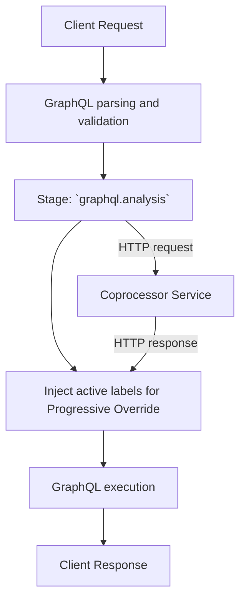

import { Callout } from "@hive/design-system/hive-components/callout";

Coprocessors are an external way to customize Hive Router.

With coprocessors, Hive Router calls your HTTP service during request processing. This lets you add
custom logic without building a custom router binary.

You can use this for policy checks, request changes, response redaction, and tenant-specific rules.
Your team can write this logic in any language.

## When to use coprocessors

Use coprocessors when you want custom behavior that is easy to deploy, update, and own outside the
router process.

They are not the best choice for logic that must be very low latency. Every enabled stage makes a
network call. Keep payloads small, keep logic simple, and keep response time low.

If you need maximum in-process performance and better APIs, use [Plugin System](/docs/router/customizations/plugin-system) instead.

## The Concept of Coprocessors

At a high level, a coprocessor is an external HTTP service that Hive Router calls at selected
points in the request lifecycle.

This lets you keep custom logic outside the router process. Hive Router sends stage-specific JSON
payloads to your service, your service returns a JSON decision, and the router applies that decision
before continuing.

The diagram below shows one concrete example using `graphql.analysis`.



For each enabled stage, Hive Router sends a JSON payload and waits for a response.

The example above focuses on `graphql.analysis`. After parsing and validation, Hive Router sends an
HTTP call to your coprocessor service. The coprocessor can return [context](/docs/router/customizations/coprocessors/stages-and-protocol#request-context) updates used to inject
active labels for [Progressive Override](/docs/router/configuration/override_labels) before GraphQL execution starts.

Your response decides if the router should continue and plan the query, or stop and return early.

### Network

Coprocessor calls run in the critical request path, so the location of the coprocessor service directly affects request latency. Run the coprocessor as close to Hive Router instance as possible. A shorter path means lower request latency.

Hive Router supports two transport options:

- `http://` for normal TCP networking
- `unix://` for Unix Domain Sockets (UDS)

Use `http://` when the coprocessor is a shared or remote service. This is usually easier to operate,
but every stage call pays network cost (additional hop latency and network failure risk).

Use `unix://` when the router and coprocessor run on the same node or pod. UDS avoids external
network hops and usually gives lower, more stable latency.

It also supports different HTTP protocol modes:

- `http1` for HTTP/1.1
- `http2` for HTTP/2 over TCP (with TLS)
- `h2c` for HTTP/2 without TLS

<Callout type="tip">
  Prefer Unix Domain Sockets (`unix://`) with `h2c` and run the coprocessor as a
  sidecar for lowest latency.
</Callout>

### Continue or Break Processing

Hive Router always expects a response from the coprocessor service, so when you simply want to continue,
without applying any changes to the state, send only `version` and `control` back to the router.

```json title="Continue with no modifications"
{
  "version": 1,
  "control": "continue"
}
```

It's possible to short-circuit the request's lifecycle, with an early HTTP response. You simply pass an object with `"break"` property with a status code as its value.

<Callout type="tip">
  It's highly recommended to include `body` and `headers` in the response.
</Callout>

```json title="Early 401 response"
{
  "version": 1,
  "control": { "break": 401 },
  "headers": {
    "content-type": "application/json"
  },
  "body": {
    "errors": [{ "message": "Unauthorized" }]
  }
}
```

### Apply Changes

To mutate allowed fields like `headers` and `context`, include them in the response.

<Callout type="warning">
  The `headers` object will override the headers of a request or response
  (depending on the stage), so we recommend to include the original headers as
  well.
</Callout>

```json title="Overwrite headers and add key-value to context"
{
  "version": 1,
  "control": "continue",
  "headers": {
    "x-custom-header": "your-value"
  },
  "context": {
    "hive::progressive_override::labels_to_override": ["feature-a"]
  }
}
```

## Stages

Each stage runs at a different point in the pipeline,
so each stage is best for a different kind of logic.

### `router.request`

Runs when the HTTP request enters Hive Router.
Use this stage for early traffic checks such as auth header checks and fast request rejection.

### `graphql.request`

Runs when GraphQL request payload is available and we know it's a GraphQL request. Use this stage for request shaping, variable
normalization, and request-level guardrails.

### `graphql.analysis`

Runs after GraphQL parsing and validation, but before query planning and execution.
This is the stage used in the progressive override label-injection example above.

### `graphql.response`

Runs after GraphQL execution returns a GraphQL response. Use this stage for response normalization,
error shaping, and redaction before final HTTP response handling.

### `router.response`

Runs at the very end, right before the response is sent to the client.

## Observability

Each stage call produces telemetry:

- Metrics expose per-stage throughput, latency, and failures.
- Traces include a `coprocessor` span that wraps each stage call (with `coprocessor.stage` and `coprocessor.id` attributes).
- Nested `http.client` spans show outbound calls to the coprocessor service (status code, latency, failures).
- Logs record lifecycle events with correlation fields (`coprocessor.stage`, `coprocessor.id`).

This is important for production. Coprocessors are in the critical path. Monitor them like your
subgraphs.

For telemetry setup, see [OpenTelemetry Metrics](/docs/router/observability/metrics#coprocessor) and
[OpenTelemetry Tracing](/docs/router/observability/tracing).

## Learn more

- [Get Started with Coprocessors](/docs/router/customizations/coprocessors/usage)
- [Stages and Protocol](/docs/router/customizations/coprocessors/stages-and-protocol)
- [Configuration Reference](/docs/router/configuration/coprocessor)
