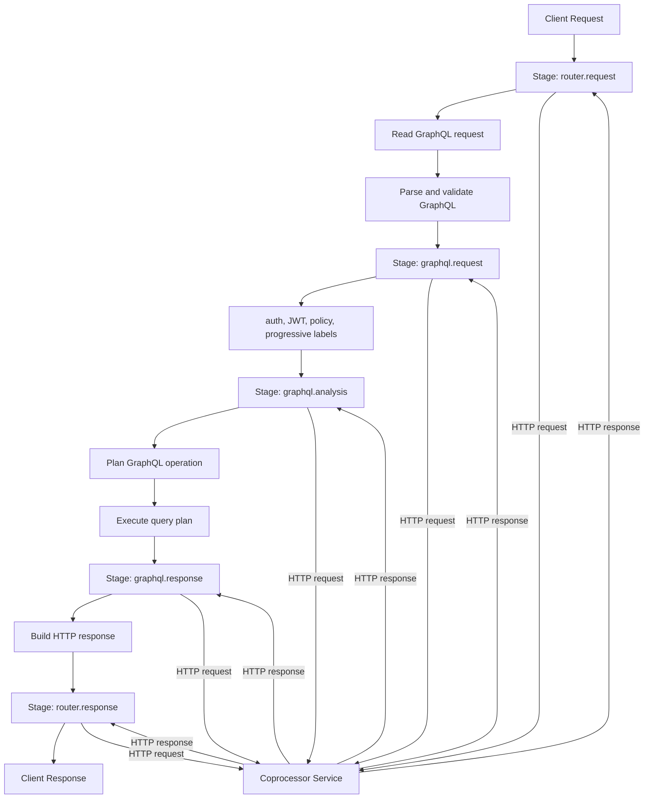

import { Callout } from "@hive/design-system/hive-components/callout";

This page describes how Hive Router and a coprocessor service communicate.

Each configured stage translates to a request-response exchange. Hive Router sends a JSON payload,
your service returns a JSON decision, and the router applies that decision before continuing.

Understanding this contract is key to building reliable and predictable coprocessors.

If you need the YAML option reference, see
[**coprocessor configuration reference**](/docs/router/configuration/coprocessor).

## Version

Every coprocessor request and response must include a `version` field. The version identifies the protocol contract used by Hive Router.

```json
{
  "version": 1,
  "control": "continue"
  // ...
}
```

Including an explicit version allows the protocol to evolve over time without breaking existing
integrations. Future versions may introduce new fields, stricter validation, or different mutation
rules.

<Callout type="warning">
  If the version is missing or unsupported, Hive Router treats the response as a
  coprocessor failure.
</Callout>

Hive Router always sends the current version in the request. Your coprocessor should echo the same
version in its response.

## Control flow

Each enabled stage sends a JSON payload to your coprocessor and waits for a JSON response.

The response must include a `control` field that determines the next step:

- `"continue"` - proceed to the next step in the pipeline
- `{ "break": <status> }` - stop processing and return an immediate HTTP response

### Continue

In case you do not want to modify anything and just let the router proceed to the next step, send back only `version` and `control`.

```json title="Simple continue decision"
{
  "version": 1,
  "control": "continue"
}
```

### Continue with mutations

However, if you want to modify the state to pass data to the next stages, adjust pipeline's behaviour or alter the request's body, you're able to send back more than just `version` and `control`.

```json title="Response for 'graphql.request' stage event"
{
  "version": 1,
  "control": "continue",
  "headers": {
    "x-custom-header": "value"
  },
  "context": {
    "custom.key": "value"
  }
}
```

In the example above, the `"custom.key": "value"` will be inserted to the context and available for the next stages and plugin hooks. The headers will be dropped and replaced with only `"x-custom-header": "value"` going forward. Every next step or a plugin hook, will receive new headers, that applies to header propagation feature as well.

### Break (short-circuit)

At every stage you're able to short-circuit the pipeline and return an early response. Be aware that sending back no `body` will result in an empty response for the client's request.

```json title="Early response with 401 status code, body and headers"
{
  "version": 1,
  "control": { "break": 401 },
  "headers": {
    "content-type": "application/json"
  },
  "body": {
    "errors": [{ "message": "Unauthorized" }]
  }
}
```

## Protocol envelope

Stage payloads sent by Hive Router to Coprocessors always include these fields:

- `version` (currently `1`)
- `stage` (current stage name)
- `control` (always starts as `"continue"`)
- `id` (request identifier)

Depending on `include` settings, payloads may also contain fields like `headers`, `body`, `context`, `method`, `path`, `status_code`, and `sdl`.

<Callout type="critical">
  Your coprocessor must return `OK 200` with valid JSON. Invalid JSON, invalid
  `control` values, unsupported `version`, or forbidden stage mutations are
  treated as coprocessor failures and **fail the entire client request**.
</Callout>

## Stages

The following diagram describes the execution order and available stages.



### `router.request`

Runs when the inbound HTTP request enters Hive Router.
Use this stage for early traffic checks such as auth header checks and fast request rejection.

Available properties in `include`:

| Property  | Mutable | Description                                   |
| --------- | :-----: | --------------------------------------------- |
| `headers` |   ✅    | Headers of the client request                 |
| `method`  |   ❌    | HTTP method of the client request             |
| `path`    |   ❌    | HTTP request's path of the client request     |
| `body`    |   ✅    | I think you know already, HTTP request's body |
| `context` |   ✅    | Serialized request context                    |

### `graphql.request`

Runs after the router recognizes GraphQL request data and extracts the GraphQL payload from either body or query params.
Use this stage for request shaping, variable normalization, and request-level guardrails.

| Property  | Mutable | Description                                                                               |
| --------- | :-----: | ----------------------------------------------------------------------------------------- |
| `headers` |   ✅    | Headers of the client request                                                             |
| `method`  |   ❌    | HTTP method of the client request                                                         |
| `path`    |   ❌    | HTTP request's path of the client request                                                 |
| `body`    |   ✅    | GraphQL request payload (contains `query`, `operationName`, `variables` and `extensions`) |
| `sdl`     |   ❌    | Text representation (SDL) of the public schema                                            |
| `context` |   ✅    | Serialized request context                                                                |

### `graphql.analysis`

Runs after GraphQL parsing and validation, but right before planning and execution.
This is the stage used in the progressive override label-injection example.

| Property  | Mutable | Description                                                                               |
| --------- | :-----: | ----------------------------------------------------------------------------------------- |
| `headers` |   ✅    | Headers of the client request                                                             |
| `method`  |   ❌    | HTTP method of the client request                                                         |
| `path`    |   ❌    | HTTP request's path of the client request                                                 |
| `body`    |   ❌    | GraphQL request payload (contains `query`, `operationName`, `variables` and `extensions`) |
| `sdl`     |   ❌    | Text representation (SDL) of the public schema                                            |
| `context` |   ✅    | Serialized request context                                                                |

### `graphql.response`

Runs after GraphQL execution produces a GraphQL response.
Use this stage for response normalization, error shaping, and redaction before final HTTP response handling.

| Property      | Mutable | Description                                    |
| ------------- | :-----: | ---------------------------------------------- |
| `headers`     |   ✅    | Headers of the client response                 |
| `status_code` |   ❌    | Status code of the client response             |
| `body`        |   ✅    | GraphQL response                               |
| `sdl`         |   ❌    | Text representation (SDL) of the public schema |
| `context`     |   ✅    | Serialized request context                     |

### `router.response`

Runs right before the final HTTP response is sent to the client.

| Property      | Mutable | Description                        |
| ------------- | :-----: | ---------------------------------- |
| `headers`     |   ✅    | Headers of the client response     |
| `status_code` |   ❌    | Status code of the client response |
| `body`        |   ✅    | Body of the response               |
| `context`     |   ✅    | Serialized request context         |

## Request context

Request context is key-value state attached to a single request lifecycle and shared with built-in features, custom plugins and coprocessors.

Use it to pass decisions between stages, for example:

- extract `tenant.id` from headers in `router.request`
- read `tenant.id` in `graphql.analysis` to select feature flags or routing behavior

Treat context keys as shared API contracts:

- use clear namespacing (`hive::` is reserved)
- keep values small and serializable

<Callout type="tip">Context updates are propagated to later stages.</Callout>

The `include.context` property supports three forms:

| Value      | Action                     |
| ---------- | -------------------------- |
| `false`    | Include no context         |
| `true`     | Include full context       |
| `[string]` | Include only selected keys |

### Operation

| Property                | Description                                                                    |
| ----------------------- | ------------------------------------------------------------------------------ |
| `hive::operation::name` | The name of the GraphQL operation.                                             |
| `hive::operation::kind` | The kind of the GraphQL operation (`"query"`, `"mutation"`, `"subscription"`). |

### Authentication

| Property                           | Description                                                                       |
| ---------------------------------- | --------------------------------------------------------------------------------- |
| `hive::authentication::jwt_scopes` | Scopes extracted from the current authenticated user's JWT.                       |
| `hive::authentication::jwt_status` | Authentication status. If `true`, the request has been verified as authenticated. |

### Authorization

| Property                                 | Mutable | Description                                                                                                                                                                                                                                                  |
| ---------------------------------------- | :-----: | ------------------------------------------------------------------------------------------------------------------------------------------------------------------------------------------------------------------------------------------------------------ |
| `hive::authorization::required_policies` |   ✅    | Map of `@policy` policy names to their decision (`true`, `false`, or `null` for undecided). Seeded by the router before `graphql.analysis`; a coprocessor decides by overwriting entries. See [Custom Authorization Policies](/docs/router/security/policy). |

### Progressive Override

| Property                                         | Description                                                  |
| ------------------------------------------------ | ------------------------------------------------------------ |
| `hive::progressive_override::unresolved_labels`  | The set of labels that require an external decision          |
| `hive::progressive_override::labels_to_override` | The set of labels that should be overridden for this request |

### Telemetry

| Property                          | Mutable | Description                           |
| --------------------------------- | :-----: | ------------------------------------- |
| `hive::telemetry::client_name`    |   ✅    | The name of the client application    |
| `hive::telemetry::client_version` |   ✅    | The version of the client application |

### Persisted Documents

| Property                                      | Mutable | Description                                                                       |
| --------------------------------------------- | :-----: | --------------------------------------------------------------------------------- |
| `hive::persisted_documents::skip_enforcement` |   ✅    | Skip the `require_id` check for this request. Set to `true` to bypass enforcement |

## Body

- Some stages allow body mutation, but `graphql.analysis` does not.
- Body patches must stay valid for the stage contract.
- Invalid body patches are rejected.

For `graphql.request` and `graphql.analysis`, `include.body` supports selective field inclusion:

| Value      | Action                                                                                                           |
| ---------- | ---------------------------------------------------------------------------------------------------------------- |
| `false`    | Include no body                                                                                                  |
| `true`     | Include full body                                                                                                |
| `[string]` | Include only selected properties<br /> Available properties: `query`, `operationName`, `variables`, `extensions` |

```yaml title="Selective body include"
stages:
  graphql:
    request:
      include:
        body: [query, variables]
```

You can also patch body fields selectively in your coprocessor response.
For example, in `graphql.request`, this response updates only variables:

```json title="Updates variables only"
{
  "version": 1,
  "control": "continue",
  "body": {
    "variables": {
      "first": 20
    }
  }
}
```

```json title="Overwrites 'extensions' that were never selected"
{
  "version": 1,
  "control": "continue",
  "body": {
    "extensions": {
      "code": "value"
    }
  }
}
```

## Headers

The `headers` property represents either request or response headers, depending on the stage. Headers can be returned and mutated even when not included in inbound stage payload.

```json title="Sets new request headers for in 'router.request' stage"
{
  "version": 1,
  "control": "continue",
  "headers": {
    "content-type": "application/json",
    "x-something": "true"
  }
}
```

To mutate headers without overwriting them you need to set `include.headers: true` and return them back, modified:

```js title="Pseudo code for mutating headers"
let headers = stage_payload.headers;
Response.json({
  version: 1,
  control: "continue",
  headers: {
    ...headers,
    "x-something": "true",
  },
});
```

## Include vs mutation semantics

The `include` property controls what Hive Router sends to your coprocessor in the request payload. It does not
strictly limit what fields your coprocessor can return for mutation.

Examples:

- `include.headers: false` can still return `headers` in response and overwrite headers.
- `include.context` may omit a key, but response can still patch that context key .

```yaml title="Example: only operation's name is sent to coprocessor"
stages:
  graphql:
    request:
      include:
        context: ["hive::operation::name"]
```

Even with selective inclusion, your response may still patch additional non-included keys:

```json
{
  "version": 1,
  "control": "continue",
  "context": {
    "custom::b": "patched-value"
  }
}
```

This is why `include` should be treated as payload minimization, not as mutation permission.

## Failure behavior

When a request from Hive Router to Coprocessor fails for some reason, the request lifecycle is stopped, the current progress is dropped and an HTTP response is returned to the client.

Common coprocessor failure causes:

- non-200 response from the coprocessor
- malformed JSON
- unsupported protocol `version`
- invalid `control` value
- forbidden stage mutation

How client response looks like:

- request fails (often HTTP `500`)
- GraphQL error message is masked as `Internal server error`
- codes remain in `extensions.code`

---

- [Get started with Coprocessors](/docs/router/customizations/coprocessors/usage)
- [Coprocessor configuration reference](/docs/router/configuration/coprocessor)
