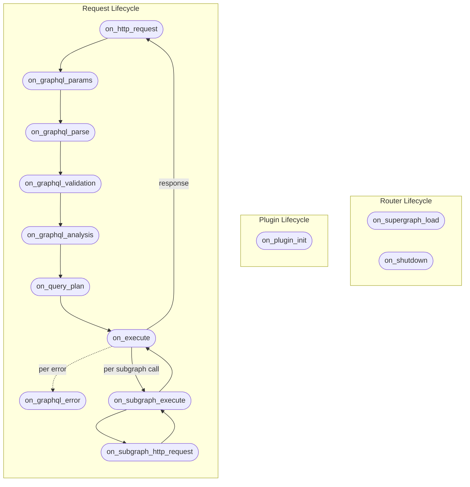

import { Callout } from "@hive/design-system/hive-components/callout";

The following chart describes the execution order and available hooks. Each hook can have a
**start**/**end** phase, where you can control different parts of the execution flow.



## Lifetimes

Throughout the implementation of the plugin lifecycle hooks, you'll notice two named lifetimes:

- `'req`: This lifetime is used for the HTTP request context and is valid for the duration of the
  request.
- `'exec`: This lifetime represents the lifetime of the GraphQL execution. It is used to ensure that
  the payload and result are valid for the duration of the GraphQL execution.

## Plugin Lifecycle Hooks

### `on_plugin_init`

This hook is called exactly once during Router initialization, when the plugin is first loaded.

You can use this hook to access the plugin configuration, create the initial state of the plugin,
and register background tasks to be handled by the router.

```rust
fn on_plugin_init(payload: OnPluginInitPayload<Self>) -> OnPluginInitResult<Self>
```

#### Usage Examples

**Access the plugin configuration**

Use `payload.config()` to read the plugin's configuration from the Router YAML. The `?` propagates
initialization errors back to the router.

```rust
fn on_plugin_init(payload: OnPluginInitPayload<Self>) -> OnPluginInitResult<Self> {
    let config = payload.config()?;

    payload.initialize_plugin_with_defaults()
}
```

**Access the resolved router configuration**

Use `payload.router_config()` for read-only access to the router's fully resolved configuration
(not just this plugin's own scoped config), so the plugin can adapt its behavior to router-wide
settings such as the configured GraphQL path or telemetry setup.

```rust
fn on_plugin_init(payload: OnPluginInitPayload<Self>) -> OnPluginInitResult<Self> {
    let graphql_path = payload.router_config().graphql_path();
    // use router-wide settings to initialize the plugin...
    payload.initialize_plugin_with_defaults()
}
```

**Customize plugin instance**

Build the plugin's initial state from the parsed configuration before the router starts serving
requests.

```rust
fn on_plugin_init(payload: OnPluginInitPayload<Self>) -> OnPluginInitResult<Self> {
    payload.initialize_plugin(Self {
        my_thing: payload.config()?.my_config_flag,
    })
}
```

**Register background tasks**

Spawn long-running work tied to the router lifecycle. The `CancellationToken` is signaled when the
router shuts down.

```rust
use hive_router::background_tasks::BackgroundTask;

#[async_trait]
impl BackgroundTask for MyBackgroundTask {
    fn id(&self) -> &str {
        "my_task"
    }

    async fn run(&self, token: CancellationToken) {
        // Check token.is_cancelled() to handle graceful shutdown
    }
}

fn on_plugin_init(payload: OnPluginInitPayload<Self>) -> OnPluginInitResult<Self> {
    payload.bg_tasks_manager.register_task(MyBackgroundTask::new());
    payload.initialize_plugin_with_defaults()
}
```

#### Payload API Reference

- [`OnPluginInitPayload`](https://github.com/graphql-hive/router/blob/main/lib/executor/src/plugins/hooks/on_plugin_init.rs#:~:text=struct%20OnPluginInitPayload)

#### Plugin Examples

- [`root_field_limit`](https://github.com/graphql-hive/router/blob/main/plugin_examples/root_field_limit/src/lib.rs#:~:text=fn%20on_plugin_init)
- [`propagate_status_code`](https://github.com/graphql-hive/router/blob/main/plugin_examples/propagate_status_code/src/lib.rs#:~:text=fn%20on_plugin_init)

## Request Lifecycle Hooks

### `on_http_request`

This hook is called immediately after the router receives an HTTP request. It allows you to inspect
or modify the HTTP request before any further processing occurs. At this point, the Router doesn't
know yet if the request is a GraphQL request or not.

```rust
fn on_http_request<'req>(
    &'req self,
    payload: OnHttpRequestHookPayload<'req>
  ) -> OnHttpRequestHookFuture<'req>
```

`OnHttpRequestHookFuture<'req>` is a boxed, thread-local future (`Pin<Box<dyn Future<Output = OnHttpRequestHookResult<'req>> + 'req>>`),
so the hook body is an `async move` block you can `await` inside - for example to call an upstream
auth or feature-flag service before the rest of the request pipeline runs. The hook always runs on
the same worker thread it started on and is never moved across threads, so the future doesn't need
to be `Send`.

With this hook, you can add custom authentication and authorization logic based on HTTP headers,
method, path, and similar request properties. You can also implement custom restrictions, HTTP
validations, short-circuit responses, serve static assets, or await an external call before the
request continues.

<Callout type="warning">
  This hook also runs for the `/health` and `/readiness` [probe
  endpoints](/docs/router/observability/probes), so that a plugin can select a
  supergraph for a readiness request. A plugin that short-circuits the request
  (for example, rejecting requests without an `Authorization` header) will
  therefore also fail your probes unless it checks
  `payload.router_http_request.path()` first.
</Callout>

#### Usage Examples

##### Reject unauthenticated requests [!toc]

Check for required HTTP headers in the start phase and short-circuit with an error before any
GraphQL processing begins.

```rust
fn on_http_request<'req>(
    &'req self,
    payload: OnHttpRequestHookPayload<'req>,
) -> OnHttpRequestHookFuture<'req> {
    Box::pin(async move {
        if payload.router_http_request.headers().get("authorization").is_none() {
            return payload.end_with_graphql_error(
                GraphQLError::from_message_and_code("Unauthorized", "UNAUTHORIZED"),
                StatusCode::UNAUTHORIZED,
            );
        }

        payload.proceed()
    })
}
```

##### Select a supergraph for the request [!toc]

Construct and retain each `Arc<Supergraph>` in plugin state, then select one according to the
request. The selection is pinned for the complete HTTP request or WebSocket connection and is used
consistently by validation, introspection, planning, authorization, execution, coprocessors, usage
reporting, subscriptions, and request deduplication.

```rust
use std::sync::Arc;

use hive_router::{
    async_trait,
    plugins::{
        hooks::{
            on_http_request::{OnHttpRequestHookFuture, OnHttpRequestHookPayload},
            on_plugin_init::{OnPluginInitPayload, OnPluginInitResult},
            on_supergraph_load::{Supergraph, SupergraphOptions},
        },
        plugin_trait::{RouterPlugin, StartHookPayload},
    },
};

struct SchemaVariantsPlugin {
    basic: Arc<Supergraph>,
}

#[async_trait]
impl RouterPlugin for SchemaVariantsPlugin {
    type Config = ();

    fn plugin_name() -> &'static str {
        "schema_variants"
    }

    fn on_plugin_init(payload: OnPluginInitPayload<Self>) -> OnPluginInitResult<Self> {
        let mut options = SupergraphOptions::default();
        options.traffic_shaping.all.forward_operation_name = true;
        options.error_masking.redacted_error_message = "Basic variant error".to_string();
        options.hive_target = Some("organization/project/basic".to_string());

        let basic = Arc::new(Supergraph::from_sdl(
            include_str!("basic.supergraph.graphql"),
            options,
        )?);
        payload.initialize_plugin(Self { basic })
    }

    fn on_http_request<'req>(
        &'req self,
        payload: OnHttpRequestHookPayload<'req>,
    ) -> OnHttpRequestHookFuture<'req> {
        Box::pin(async move {
            if payload.router_http_request.headers().get("x-schema-variant").is_some() {
                payload.set_supergraph(self.basic.clone());
            }
            payload.proceed()
        })
    }
}
```

`Supergraph::from_document` accepts an already parsed document when the plugin needs to transform
its schema first. Both constructors take a complete `SupergraphOptions` value: planner options,
executor-side traffic shaping, header rules, URL overrides, override labels, demand control,
subgraph subscription transports, error masking, persisted documents, and the Hive target. A
plugin-owned variant does not inherit any of these from the router's configured supergraph — fields
left at `SupergraphOptions::default()` simply use the defaults. Live router infrastructure (HTTP
clients, caches, telemetry agents, storage runtimes) is still built by the router and stays out of
`SupergraphOptions`. See [Supergraph-bound configuration](/docs/router/supergraph#supergraph-bound-configuration)
for the complete field reference.

If a plugin selects a supergraph whose router runtime cannot be constructed, the request fails
without falling back to the configured supergraph. This prevents a request selected for one schema
from silently executing against another.

Dropping the plugin's final owning `Arc<Supergraph>` retires that variant. Existing ordinary
requests finish from their pinned snapshot, while active subscriptions close with
`SUBSCRIPTION_SCHEMA_RELOAD`. Retain reusable variants in plugin state for as long as new requests
may select them.

With [`supergraph.source: plugin`](/docs/router/configuration/supergraph#plugin), there is no
configured fallback. The plugin must select a supergraph for GraphQL and readiness requests.
Readiness passes through `on_http_request`; health also runs this hook but remains a liveness check.
WebSocket selection is pinned while processing the first message.

For complete examples, see
[`replace_schema`](https://github.com/graphql-hive/router/tree/main/plugin_examples/replace_schema),
which overrides a configured default when `x-schema-variant: basic` is present, and
[`feature_flags`](https://github.com/graphql-hive/router/tree/main/plugin_examples/feature_flags),
which uses `supergraph.source: plugin` and caches variants by normalized `x-feature-flags` values.

##### Add a response header [!toc]

Use `on_end` with `map_response` to attach custom headers to every outgoing HTTP response.

```rust
fn on_http_request<'req>(
    &'req self,
    payload: OnHttpRequestHookPayload<'req>,
) -> OnHttpRequestHookFuture<'req> {
    Box::pin(async move {
        payload.on_end(|payload| {
            payload.map_response(|mut response| {
                response.response_mut().headers_mut().insert(
                    "x-served-by",
                    "hive-router".parse().unwrap(),
                );
                response
            }).proceed()
        })
    })
}
```

##### Override the HTTP response status [!toc]

Use `map_response` in `on_end` to rewrite the status code on the outgoing response, for example, to
normalize all successful responses to `200 OK`.

```rust
use hive_router::http::StatusCode;

fn on_http_request<'req>(
    &'req self,
    payload: OnHttpRequestHookPayload<'req>,
) -> OnHttpRequestHookFuture<'req> {
    Box::pin(async move {
        payload.on_end(|end_payload| {
            end_payload.map_response(|mut response| {
                *response.response_mut().status_mut() = StatusCode::OK;
                response
            }).proceed()
        })
    })
}
```

##### Propagate subgraph status codes [!toc]

Read context data written by a downstream hook (e.g., `on_subgraph_http_request`) and apply it to
the final HTTP response status.

```rust
fn on_http_request<'req>(
    &'req self,
    payload: OnHttpRequestHookPayload<'req>,
) -> OnHttpRequestHookFuture<'req> {
    Box::pin(async move {
        payload.on_end(|payload| {
            let ctx = payload.context.get_ref::<PropagateStatusCodeCtx>();
            if let Some(ctx) = ctx {
                return payload.map_response(|mut response| {
                    *response.response_mut().status_mut() = ctx.status_code;
                    response
                }).proceed();
            }
            payload.proceed()
        })
    })
}
```

##### Customize logging for the request [!toc]

Attach a correlation id as soon as it's known, then customize the request summary line's message
once the request finishes. These functions are callable from any hook, and this one already runs
fully correlated (with `request_id`/`trace_id` already in scope) from the start.

```rust
use hive_router::{get_current_summary, set_log_correlation, set_summary_message};

fn on_http_request<'req>(
    &'req self,
    payload: OnHttpRequestHookPayload<'req>,
) -> OnHttpRequestHookFuture<'req> {
    Box::pin(async move {
        let project_id = payload.router_http_request.path().split('/').nth(1).unwrap_or("unknown");
        set_log_correlation("project_id", project_id);

        payload.on_end(|end_payload| {
            if let Some(summary) = get_current_summary() {
                set_summary_message(format!(
                    "status={}",
                    summary.status_code.load(std::sync::atomic::Ordering::Relaxed)
                ));
            }
            end_payload.proceed()
        })
    })
}
```

See [Customizing logs from plugins](/docs/router/observability/logging#customizing-logs-from-plugins)
for the full API reference.

##### Await an upstream call before proceeding [!toc]

Call out to an external service - an auth check, a feature-flag lookup, anything async - and await
the result before the rest of the pipeline (parsing, validation, planning, execution) runs. Store
the result in `context` so a later `on_end` can read it back onto the response.

```rust
struct FetchedGreeting(String);

fn on_http_request<'req>(
    &'req self,
    payload: OnHttpRequestHookPayload<'req>,
) -> OnHttpRequestHookFuture<'req> {
    Box::pin(async move {
        let greeting = fetch_greeting(&self.client, &self.upstream_url).await;
        payload.context.insert(FetchedGreeting(greeting));

        payload.on_end(|payload| {
            let greeting = payload
                .context
                .get_ref::<FetchedGreeting>()
                .map(|entry| entry.0.clone())
                .unwrap_or_default();
            payload
                .map_response(move |mut response| {
                    if let Ok(header_value) = HeaderValue::from_str(&greeting) {
                        response.response_mut().headers_mut().insert(
                            "x-fetched-greeting",
                            header_value,
                        );
                    }
                    response
                })
                .proceed()
        })
    })
}
```

##### Add a custom dedupe partition [!toc]

Call `add_inbound_dedupe_partition` to mix an extra value into the router's inbound
query/subscription dedupe fingerprint. Requests with different partitions are never coalesced into
the same in-flight response, even if [`traffic_shaping.router.dedupe.headers`](/docs/router/configuration/traffic_shaping#routerdedupeheaders)
would otherwise treat them as identical - useful for partitioning by an authenticated user extracted
from a header without hashing the entire header value. This method is only available from
`on_http_request` and `on_graphql_params`, since those are the only hooks that run before the router
computes the fingerprint.

```rust
fn on_http_request<'req>(
    &'req self,
    payload: OnHttpRequestHookPayload<'req>,
) -> OnHttpRequestHookFuture<'req> {
    Box::pin(async move {
        if let Some(user_id) = extract_user_id(&payload.router_http_request) {
            payload.add_inbound_dedupe_partition(hash_user_id(user_id));
        }
        payload.proceed()
    })
}
```

#### Payload API Reference

- [`OnHttpRequestHookPayload`](https://github.com/graphql-hive/router/blob/main/lib/executor/src/plugins/hooks/on_http_request.rs#:~:text=struct%20OnHttpRequestHookPayload)
- [`OnHttpRequestHookFuture`](https://github.com/graphql-hive/router/blob/main/lib/executor/src/plugins/hooks/on_http_request.rs#:~:text=type%20OnHttpRequestHookFuture)
- [`OnHttpResponseHookPayload`](https://github.com/graphql-hive/router/blob/main/lib/executor/src/plugins/hooks/on_http_request.rs#:~:text=struct%20OnHttpResponseHookPayload)

#### Plugin Examples

- [`propagate_status_code`](https://github.com/graphql-hive/router/blob/main/plugin_examples/propagate_status_code/src/lib.rs#:~:text=fn%20on_http_request)
- [`incoming_request_deduplication`](https://github.com/graphql-hive/router/blob/main/plugin_examples/incoming_request_deduplication/src/plugin.rs#:~:text=fn%20on_http_request)
- [`custom_logger_correlation`](https://github.com/graphql-hive/router/blob/main/plugin_examples/custom_logger_correlation/src/plugin.rs#:~:text=fn%20on_http_request)
- [`async_http_fetch`](https://github.com/graphql-hive/router/blob/main/plugin_examples/async_http_fetch/src/plugin.rs#:~:text=fn%20on_http_request)

### `on_graphql_params`

This hook is called after the router has determined that the incoming request is a GraphQL request,
and it decides to parse the GraphQL parameters (query, variables, operation name, etc.).

This hook allows you to customize how GraphQL request parameters are detected and extracted. You can
also prevent execution of the GraphQL request if certain conditions are met.

```rust
async fn on_graphql_params<'exec>(
    &'exec self,
    payload: OnGraphQLParamsStartHookPayload<'exec>
  ) -> OnGraphQLParamsStartHookResult<'exec>
```

#### Usage Examples

**Read extracted GraphQL parameters**

Use the `on_end` callback to access the fully extracted GraphQL parameters: `query`,
`operation_name`, `variables`, and `extensions` are all available here.

```rust
async fn on_graphql_params<'exec>(
    &'exec self,
    payload: OnGraphQLParamsStartHookPayload<'exec>,
) -> OnGraphQLParamsStartHookResult<'exec> {
    payload.on_end(|end_payload| {
        let maybe_operation_name = &end_payload.graphql_params.operation_name.as_ref();
        let maybe_query = &end_payload.graphql_params.query.as_ref();
        let variables = &end_payload.graphql_params.variables;

        end_payload.proceed()
    })
}
```

**Modify extracted GraphQL parameters**

Mutate the extracted GraphQL parameters inside `on_end` to override the query, operation name, or
variables before execution continues.

```rust
async fn on_graphql_params<'exec>(
    &'exec self,
    payload: OnGraphQLParamsStartHookPayload<'exec>,
) -> OnGraphQLParamsStartHookResult<'exec> {
    payload.on_end(|mut end_payload| {
        end_payload.graphql_params.query = Some("query { overridingTheOperation }".to_string());

        end_payload.proceed()
    })
}
```

**Reject anonymous operations**

Return a GraphQL error from `on_end` to short-circuit the request when a condition on the parsed
parameters is not met.

```rust
async fn on_graphql_params<'exec>(
    &'exec self,
    payload: OnGraphQLParamsStartHookPayload<'exec>,
) -> OnGraphQLParamsStartHookResult<'exec> {
    payload.on_end(|payload| {
        if payload.graphql_params.operation_name.is_none() {
            return payload.end_with_graphql_error(
                GraphQLError::from_message_and_code(
                    "Anonymous operations are not allowed",
                    "ANONYMOUS_OPERATION",
                ),
                StatusCode::BAD_REQUEST,
            );
        }
        payload.proceed()
    })
}
```

**Resolve a query from extensions (Persisted Queries)**

Read from `extensions` in `on_end` and rewrite `graphql_params.query` to implement patterns like
Automatic Persisted Queries (APQ).

```rust
async fn on_graphql_params<'exec>(
    &'exec self,
    payload: OnGraphQLParamsStartHookPayload<'exec>,
) -> OnGraphQLParamsStartHookResult<'exec> {
    payload.on_end(|mut payload| {
        let hash = payload
            .graphql_params
            .extensions
            .as_ref()
            .and_then(|ext| ext.get("persistedQuery"))
            .and_then(|pq| pq.as_object())
            .and_then(|obj| obj.get(&"sha256Hash"))
            .and_then(|h| h.as_str());

        if let Some(hash) = hash {
            if let Some(cached_query) = self.cache.get(hash) {
                payload.graphql_params.query = Some(cached_query.value().to_string());
            } else {
                return payload.end_with_graphql_error(
                    GraphQLError::from_message_and_code(
                        "PersistedQueryNotFound",
                        "PERSISTED_QUERY_NOT_FOUND",
                    ),
                    StatusCode::BAD_REQUEST,
                );
            }
        }
        payload.proceed()
    })
}
```

**Add a custom dedupe partition**

Call `add_inbound_dedupe_partition` to mix an extra value into the router's inbound
query/subscription dedupe fingerprint, based on data only available once GraphQL params are parsed.
See [Add a custom dedupe partition](#on_http_request) under `on_http_request` for the full
explanation.

```rust
async fn on_graphql_params<'exec>(
    &'exec self,
    payload: OnGraphQLParamsStartHookPayload<'exec>,
) -> OnGraphQLParamsStartHookResult<'exec> {
    let partition = compute_partition_from_identity(&payload);
    payload.add_inbound_dedupe_partition(partition);
    payload.proceed()
}
```

#### Payload API Reference

- [`OnGraphQLParamsStartHookPayload`](https://github.com/graphql-hive/router/blob/main/lib/executor/src/plugins/hooks/on_graphql_params.rs#:~:text=struct%20OnGraphQLParamsStartHookPayload)
- [`OnGraphQLParamsEndHookPayload`](https://github.com/graphql-hive/router/blob/main/lib/executor/src/plugins/hooks/on_graphql_params.rs#:~:text=struct%20OnGraphQLParamsEndHookPayload)

#### Plugin Examples

- [`forbid_anonymous_operations`](https://github.com/graphql-hive/router/blob/main/plugin_examples/forbid_anonymous_operations/src/plugin.rs#:~:text=fn%20on_graphql_params)
- [`apq`](https://github.com/graphql-hive/router/blob/main/plugin_examples/apq/src/plugin.rs#:~:text=fn%20on_graphql_params)
- [`multipart`](https://github.com/graphql-hive/router/blob/main/plugin_examples/multipart/src/plugin.rs#:~:text=fn%20on_graphql_params)
- [`async_auth`](https://github.com/graphql-hive/router/blob/main/plugin_examples/async_auth/src/plugin.rs#:~:text=fn%20on_graphql_params)
- [`incoming_request_deduplication`](https://github.com/graphql-hive/router/blob/main/plugin_examples/incoming_request_deduplication/src/plugin.rs#:~:text=fn%20on_graphql_params)

### `on_graphql_parse`

This hook is called after the request has been deserialized, and before the router parses the
GraphQL request body as specified by the
[GraphQL-over-HTTP spec](https://graphql.github.io/graphql-over-http/).

```rust
async fn on_graphql_parse<'exec>(
        &'exec self,
        payload: OnGraphQLParseStartHookPayload<'exec>,
    ) -> OnGraphQLParseHookResult<'exec>
```

#### Usage Examples

**Read the raw query string**

The start phase has access to the raw `GraphQLParams`, including the unparsed query string, before
the router parses it into a document.

```rust
async fn on_graphql_parse<'exec>(
    &'exec self,
    payload: OnGraphQLParseStartHookPayload<'exec>,
) -> OnGraphQLParseHookResult<'exec> {
    let raw_query = &payload.graphql_params.query;

    payload.proceed()
}
```

**Access the parsed document (AST)**

Use `on_end` to access the fully parsed `Document` AST after the router has completed parsing the
operation.

```rust
async fn on_graphql_parse<'exec>(
    &'exec self,
    payload: OnGraphQLParseStartHookPayload<'exec>,
) -> OnGraphQLParseHookResult<'exec> {
    payload.on_end(|end_payload| {
        let document = &end_payload.document;

        end_payload.proceed()
    })
}
```

#### Payload API Reference

- [`OnGraphQLParseStartHookPayload`](https://github.com/graphql-hive/router/blob/main/lib/executor/src/plugins/hooks/on_graphql_parse.rs#:~:text=struct%20OnGraphQLParseStartHookPayload)
- [`OnGraphQLParseEndHookPayload`](https://github.com/graphql-hive/router/blob/main/lib/executor/src/plugins/hooks/on_graphql_parse.rs#:~:text=struct%20OnGraphQLParseEndHookPayload)

### `on_graphql_validation`

This hook is called during the GraphQL validation phase of the Router. At this stage, the GraphQL
operation has been extracted and parsed from the incoming request, and validation rules are being
applied against the GraphQL schema.

Plugins can use this hook to add custom validation rules, skip validation entirely, or modify the
operation prior to validation. To replace the schema, select a `Supergraph` earlier with
[`OnHttpRequestHookPayload::set_supergraph`](#select-a-supergraph-for-the-request). Schema replacement
at validation time cannot keep the rest of the request pipeline on one consistent supergraph.

```rust
async fn on_graphql_validation<'exec>(
        &'exec self,
        payload: OnGraphQLValidationStartHookPayload<'exec>,
    ) -> OnGraphQLValidationStartHookResult<'exec>
```

#### Usage Examples

**Add a custom validation rule**

Implement `ValidationRule` and register it with `payload.with_validation_rule()` to enforce custom
constraints on every incoming operation.

```rust
impl ValidationRule for MyCustomValidationRule {
    fn error_code<'a>(&self) -> &'a str {
        "MAX_ALIASES_EXCEEDED"
    }

    fn validate(
        &self,
        ctx: &mut OperationVisitorContext<'_>,
        error_collector: &mut ValidationErrorContext,
    ) {
        // ...
    }
}

async fn on_graphql_validation<'exec>(
    &'exec self,
    payload: OnGraphQLValidationStartHookPayload<'exec>,
) -> OnGraphQLValidationStartHookResult<'exec> {
    payload.with_validation_rule(MyCustomValidationRule::new()).proceed()
}
```

#### Payload API Reference

- [`OnGraphQLValidationStartHookPayload`](https://github.com/graphql-hive/router/blob/main/lib/executor/src/plugins/hooks/on_graphql_validation.rs#:~:text=struct%20OnGraphQLValidationStartHookPayload)
- [`OnGraphQLValidationEndHookPayload`](https://github.com/graphql-hive/router/blob/main/lib/executor/src/plugins/hooks/on_graphql_validation.rs#:~:text=struct%20OnGraphQLValidationEndHookPayload)

#### Plugin Examples

- [`root_field_limit`](https://github.com/graphql-hive/router/blob/main/plugin_examples/root_field_limit/src/lib.rs#:~:text=fn%20on_graphql_validation)
- [`one_of`](https://github.com/graphql-hive/router/blob/main/plugin_examples/one_of/src/lib.rs#:~:text=fn%20on_graphql_validation)

### `on_graphql_analysis`

This hook runs right before query planning, after the operation has been parsed, validated, and normalized. It is the last place where you can inspect the operation with full context - the fields being requested, their types, and the request context - and make per-field decisions before the Router plans execution across subgraphs.

It is the ideal place for authorization, rate limiting, or field-level access control on the operation. In fact, the Router's built-in authorization pipeline uses the same field-filtering mechanism under the hood.

```rust
async fn on_graphql_analysis<'exec>(
    &'exec self,
    payload: &mut OnGraphqlAnalysisHookPayload<'exec>,
  ) -> OnGraphqlAnalysisHookResult
```

Unlike most request lifecycle hooks, this hook does not use the start/end pattern. It receives a mutable payload and returns either `OnGraphqlAnalysisHookResult::Proceed` to continue, or
`OnGraphqlAnalysisHookResult::EndWithResponse(...)` to short-circuit with a response.

#### Filtering fields

Rather than letting plugins replace the entire operation - which risks it getting out of sync with the projection plan - the hook exposes `payload.filter_operation`.

You register a visitor that is called once per field and inline fragment, and returns either `selection.keep()` or `selection.reject(error)`.

Rejected fields are removed from the operation and reported to the client as GraphQL errors.

The Router handles the correctness details for you: **null bubbling** (rejecting a non-null field propagates the null up to the nearest nullable parent) and the corresponding **field projection plan
adjustments**.

Fields hidden by `@skip`/`@include` are ignored, and each `(type, field)` pair is evaluated only once. The first `reject` for a given field wins.

The `Selection` passed to the visitor is either:

- `Selection::Field(field)` - exposes `field.field_name`, `field.response_key`, `field.parent_type_name` (the type declaring the field), `field.output_type_name`, and `field.is_non_null`.
- `Selection::Fragment(fragment)` - an inline fragment, exposing `fragment.type_condition` (e.g. `User` in `... on User`) and `fragment.parent_type_name`.

#### Usage Examples

**Deny access to a specific field**

Reject a field based on its parent type and name. The rejection becomes a GraphQL error in the
response, and any non-null constraints are handled via null bubbling.

```rust
async fn on_graphql_analysis<'exec>(
    &'exec self,
    payload: &mut OnGraphqlAnalysisHookPayload<'exec>,
) -> OnGraphqlAnalysisHookResult {
    payload.filter_operation(|selection| match selection {
        Selection::Field(field)
            if field.parent_type_name == "User" && field.field_name == "email" =>
        {
            selection.reject(GraphQLError::from_message_and_code(
                "Access to field 'email' is not allowed",
                "FIELD_ACCESS_DENIED",
            ))
        }
        _ => selection.keep(),
    });

    OnGraphqlAnalysisHookResult::Proceed
}
```

**Short-circuit the request**

Return `EndWithResponse` to skip query planning and execution entirely - useful for rate limiting or
rejecting the whole operation.

```rust
async fn on_graphql_analysis<'exec>(
    &'exec self,
    payload: &mut OnGraphqlAnalysisHookPayload<'exec>,
) -> OnGraphqlAnalysisHookResult {
    if self.rate_limiter.is_exceeded(&payload.client_request_details) {
        return OnGraphqlAnalysisHookResult::EndWithResponse(/* ... */);
    }

    OnGraphqlAnalysisHookResult::Proceed
}
```

**Decide [`@policy`](/docs/router/security/policy) grants**

This is the same hook a [coprocessor](/docs/router/customizations/coprocessors/stages-and-protocol)
answers at the `graphql.analysis` stage, so a plugin can decide `@policy` grants exactly like a
coprocessor does - by reading the policies the operation depends on off the request context, and
writing a `true`/`false` decision for each back onto it before returning:

```rust
async fn on_graphql_analysis<'exec>(
    &'exec self,
    payload: &mut OnGraphqlAnalysisHookPayload<'exec>,
) -> OnGraphqlAnalysisHookResult {
    let required_policies: Vec<String> = payload
        .request_context
        .read()
        .ok()
        .and_then(|read| read.authorization().required_policies().cloned())
        .map(|policies| policies.into_keys().collect())
        .unwrap_or_default();

    if let Ok(mut write) = payload.request_context.write() {
        let mut authorization = write.authorization();
        for policy in required_policies {
            let granted = self.user_has_policy(&payload.client_request_details, &policy);
            authorization.set_policy_decision(policy, granted);
        }
    }

    OnGraphqlAnalysisHookResult::Proceed
}
```

Any policy left undecided when this hook returns is denied - there's no need to explicitly deny one,
only to grant it.

#### Payload API Reference

- [`OnGraphqlAnalysisHookPayload`](https://github.com/graphql-hive/router/blob/main/bin/router/src/executor/plugins/hooks/on_graphql_analysis.rs#:~:text=struct%20OnGraphqlAnalysisHookPayload)
- [`OperationFilter`](https://github.com/graphql-hive/router/blob/main/bin/router/src/executor/operation_filter.rs#:~:text=struct%20OperationFilter)

#### Plugin Examples

- [`field_nulling`](https://github.com/graphql-hive/router/blob/main/plugin_examples/field_nulling/src/plugin.rs#:~:text=fn%20on_graphql_analysis)
- [`custom_policy`](https://github.com/graphql-hive/router/blob/main/plugin_examples/custom_policy/src/plugin.rs#:~:text=fn%20on_graphql_analysis)

### `on_query_plan`

This hook is invoked during the Federation query planning process. At this stage, the Router has
already extracted, parsed, and validated the GraphQL operation and is ready to plan how to execute
it across subgraphs.

This hook gives plugins access to the Router's internal query planning process, allowing them to
modify the operation being planned or inspect and modify the resulting plan.

```rust
async fn on_query_plan<'exec>(
    &'exec self,
    payload: OnQueryPlanStartHookPayload<'exec>,
  ) -> OnQueryPlanStartHookResult<'exec>
```

#### Usage Examples

**Inspect the query plan**

Use `on_end` to access the constructed `QueryPlan` after the planner has completed. This runs after
operation parsing and validation.

```rust
async fn on_query_plan<'exec>(
    &'exec self,
    payload: OnQueryPlanStartHookPayload<'exec>,
) -> OnQueryPlanStartHookResult<'exec> {
    payload.on_end(|end_payload| {
        let query_plan = &end_payload.query_plan;

        end_payload.proceed()
    })
}
```

**Reject based on query plan content**

Inspect the plan in `on_end` and short-circuit with an error if the operation exceeds a policy - for
example, too many root fields.

```rust
async fn on_query_plan<'exec>(
    &'exec self,
    payload: OnQueryPlanStartHookPayload<'exec>,
) -> OnQueryPlanStartHookResult<'exec> {
    payload.on_end(|end_payload| {
        let root_field_count = count_root_fields(&end_payload.query_plan);
        if root_field_count > self.max_root_fields {
            return end_payload.end_with_graphql_error(
                GraphQLError::from_message_and_code(
                    "Query exceeds the maximum number of root fields",
                    "TOO_MANY_ROOT_FIELDS",
                ),
                StatusCode::PAYLOAD_TOO_LARGE,
            );
        }
        end_payload.proceed()
    })
}
```

#### Payload API Reference

- [`OnQueryPlanStartHookPayload`](https://github.com/graphql-hive/router/blob/main/lib/executor/src/plugins/hooks/on_query_plan.rs#:~:text=struct%20OnQueryPlanStartHookPayload)
- [`OnQueryPlanEndHookPayload`](https://github.com/graphql-hive/router/blob/main/lib/executor/src/plugins/hooks/on_query_plan.rs#:~:text=struct%20OnQueryPlanEndHookPayload)

#### Plugin Examples

- [`root_field_limit`](https://github.com/graphql-hive/router/blob/main/plugin_examples/root_field_limit/src/lib.rs#:~:text=fn%20on_query_plan)

### `on_execute`

This hook is invoked during the Federation query execution process. At this stage, the Router has
already extracted, parsed, and validated the GraphQL operation, and a query plan has been
constructed and is ready to be executed.

Plugins can use this hook to observe the execution process or implement solutions such as response
caching that bypass it entirely.

```rust
async fn on_execute<'exec>(
    &'exec self,
    payload: OnExecuteStartHookPayload<'exec>,
  ) -> OnExecuteStartHookResult<'exec>
```

#### Usage Examples

**Return a cached response**

Bypass the execution pipeline entirely and return a pre-built response - useful for response
caching, where a cached result can be served without querying any subgraphs.

```rust
async fn on_execute<'exec>(
    &'exec self,
    payload: OnExecuteStartHookPayload<'exec>,
) -> OnExecuteStartHookResult<'exec> {
    if let Some(cached) = self.cache.get(&cache_key) {
        return payload.end_with_response(cached);
    }

    payload.proceed()
}
```

**Inspect the GraphQL response**

Use `on_end` to read the executed `data` and `errors` before they are serialized and sent to the
client - useful for caching the result or collecting metrics.

```rust
async fn on_execute<'exec>(
    &'exec self,
    payload: OnExecuteStartHookPayload<'exec>,
) -> OnExecuteStartHookResult<'exec> {
    payload.on_end(|end_payload| {
        let data = &end_payload.data;
        let errors = &end_payload.errors;

        end_payload.proceed()
    })
}
```

**Capture the operation for usage reporting**

Read `operation_for_plan` in the start phase to record the query string and operation name for
telemetry or analytics before execution proceeds.

```rust
async fn on_execute<'exec>(
    &'exec self,
    payload: OnExecuteStartHookPayload<'exec>,
) -> OnExecuteStartHookResult<'exec> {
    self.reports.lock().await.push(UsageReport {
        query: payload.operation_for_plan.to_string(),
        operation_name: payload.operation_for_plan.name.clone(),
    });

    payload.proceed()
}
```

**Read the Demand Control cost**

When [Demand Control](/docs/router/security/demand-control) is enabled, the operation's cost is
exposed on the payload. The `estimated` and `max` cost are available in the start phase
(`demand_control_estimate`); the `actual` cost is only known after execution, so the full
`estimated` / `max` / `actual` triple (`demand_control_cost`) is read in `on_end`. Both are `None`
when Demand Control is disabled.

```rust
async fn on_execute<'exec>(
    &'exec self,
    payload: OnExecuteStartHookPayload<'exec>,
) -> OnExecuteStartHookResult<'exec> {
    // Before execution: estimated + max are known.
    if let Some(estimate) = payload.demand_control_estimate {
        tracing::info!(
            estimated = estimate.estimated,
            max = estimate.max,
            "operation cost estimate"
        );
    }

    payload.on_end(|end_payload| {
        // After execution: estimated, max, and actual.
        if let Some(cost) = end_payload.demand_control_cost {
            self.billing.record(cost.actual);
        }
        end_payload.proceed()
    })
}
```

**Report per-subgraph call durations**

The request summary tracks `subgraph_calls_duration`, a map of subgraph name to the duration of
every call made to it. Read it via
[`get_current_summary()`](/docs/router/observability/logging#customizing-logs-from-plugins) in
`on_end` and expose it however you like, e.g. as a response extension.

```rust
use hive_router::get_current_summary;
use std::collections::BTreeMap;

async fn on_execute<'exec>(
    &'exec self,
    payload: OnExecuteStartHookPayload<'exec>,
) -> OnExecuteStartHookResult<'exec> {
    payload.on_end(|mut end_payload: OnExecuteEndHookPayload<'exec>| {
        let subgraph_calls: BTreeMap<String, u64> = get_current_summary()
            .and_then(|summary| {
                summary.subgraph_calls_duration.lock().ok().map(|durations| {
                    durations
                        .iter()
                        .map(|(name, calls)| {
                            let total_ms = calls.iter().map(|d| d.as_millis() as u64).sum();
                            (name.clone(), total_ms)
                        })
                        .collect()
                })
            })
            .unwrap_or_default();

        end_payload.add_extension("subgraph_calls", subgraph_calls);
        end_payload.proceed()
    })
}
```

#### Payload API Reference

- [`OnExecuteStartHookPayload`](https://github.com/graphql-hive/router/blob/main/lib/executor/src/plugins/hooks/on_execute.rs#:~:text=struct%20OnExecuteStartHookPayload)
- [`OnExecuteEndHookPayload`](https://github.com/graphql-hive/router/blob/main/lib/executor/src/plugins/hooks/on_execute.rs#:~:text=struct%20OnExecuteEndHookPayload)

#### Plugin Examples

- [`one_of`](https://github.com/graphql-hive/router/blob/main/plugin_examples/one_of/src/lib.rs#:~:text=fn%20on_execute)
- [`response_cache`](https://github.com/graphql-hive/router/blob/main/plugin_examples/response_cache/src/lib.rs#:~:text=fn%20on_execute)

### `on_subgraph_execute`

This hook is called during the preparation process of every subgraph request, based on the query
plan. At this stage, the subgraph name, the execution request to be sent, and other contextual
information are available.

Plugins can use this hook to control the planning process of subgraph requests, replace or modify a
subgraph response, pass custom data to subgraphs, and handle custom execution transports.

Unlike the `on_subgraph_http_request` hook, this hook does not yet have the complete HTTP request to
be sent to the subgraph.

```rust
async fn on_subgraph_execute<'exec>(
        &'exec self,
        payload: OnSubgraphExecuteStartHookPayload<'exec>,
    ) -> OnSubgraphExecuteStartHookResult<'exec>
```

#### Usage Examples

**Add a header to the subgraph request**

Mutate `payload.execution_request.headers` to inject custom headers into every request sent to a
subgraph before it is dispatched.

```rust
async fn on_subgraph_execute<'exec>(
    &'exec self,
    mut payload: OnSubgraphExecuteStartHookPayload<'exec>,
) -> OnSubgraphExecuteStartHookResult<'exec> {
    payload.execution_request.headers.insert(
        "x-internal-token",
        http::HeaderValue::from_static("secret"),
    );

    payload.on_end(|payload| payload.proceed())
}
```

**Filter by subgraph name**

Use `payload.subgraph_name` to apply logic selectively to specific subgraphs.

```rust
async fn on_subgraph_execute<'exec>(
    &'exec self,
    payload: OnSubgraphExecuteStartHookPayload<'exec>,
) -> OnSubgraphExecuteStartHookResult<'exec> {
    if payload.subgraph_name == "products" {
        tracing::info!("Dispatching request to the products subgraph");
    }

    payload.on_end(|payload| payload.proceed())
}
```

**Count subgraph calls per request**

Use context to track how many subgraph calls were made during a single GraphQL request and log the
total in `on_end`.

```rust
async fn on_subgraph_execute<'exec>(
    &'exec self,
    payload: OnSubgraphExecuteStartHookPayload<'exec>,
) -> OnSubgraphExecuteStartHookResult<'exec> {
    payload.on_end(|payload| {
        let count = payload.context.get_mut::<SubgraphCallCount>();
        if let Some(mut count) = count {
            count.value += 1;
        }
        payload.proceed()
    })
}
```

#### Payload API Reference

- [`OnSubgraphExecuteStartHookPayload`](https://github.com/graphql-hive/router/blob/main/lib/executor/src/plugins/hooks/on_subgraph_execute.rs#:~:text=struct%20OnSubgraphExecuteStartHookPayload)
- [`OnSubgraphExecuteEndHookPayload`](https://github.com/graphql-hive/router/blob/main/lib/executor/src/plugins/hooks/on_subgraph_execute.rs#:~:text=struct%20OnSubgraphExecuteEndHookPayload)

#### Plugin Examples

- [`context_data`](https://github.com/graphql-hive/router/blob/main/plugin_examples/context_data/src/plugin.rs#:~:text=fn%20on_subgraph_execute)

### `on_subgraph_http_request`

This hook is called during the actual HTTP call made to the subgraph. In this hook, you have access
to the full HTTP request that will be sent to the subgraph.

Plugins using this hook can extend or modify the HTTP request, HTTP headers, path and other aspects
of communicating with the subgraph.

You can also use this hook to capture or forward data returned from subgraphs.

```rust
async fn on_subgraph_http_request<'exec>(
        &'exec self,
        payload: OnSubgraphHttpRequestHookPayload<'exec>,
    ) -> OnSubgraphHttpRequestHookResult<'exec>
```

#### Usage Examples

**Track the subgraph response status**

Use `on_end` to capture the HTTP response status from each subgraph call and store it in context for
use in a later hook (e.g., `on_http_request`).

```rust
async fn on_subgraph_http_request<'exec>(
    &'exec self,
    payload: OnSubgraphHttpRequestHookPayload<'exec>,
) -> OnSubgraphHttpRequestHookResult<'exec> {
    payload.on_end(|payload| {
        let status = payload.response.status;
        if self.watched_codes.contains(&status) {
            payload.context.insert(SubgraphStatus { code: status });
        }
        payload.proceed()
    })
}
```

**Replace the subgraph HTTP request**

Bypass the default HTTP transport entirely and send a custom request.

```rust
async fn on_subgraph_http_request<'exec>(
    &'exec self,
    payload: OnSubgraphHttpRequestHookPayload<'exec>,
) -> OnSubgraphHttpRequestHookResult<'exec> {
    let response = self.client
        .post(payload.endpoint.to_string())
        .body(payload.body.clone())
        .send()
        .await
        .unwrap();

    payload.end_with_response(SubgraphHttpResponse {
        status: response.status(),
        headers: response.headers().clone().into(),
        body: response.bytes().await.unwrap(),
    })
}
```

#### Payload API Reference

- [`OnSubgraphHttpRequestHookPayload`](https://github.com/graphql-hive/router/blob/main/lib/executor/src/plugins/hooks/on_subgraph_http_request.rs#:~:text=struct%20OnSubgraphHttpRequestHookPayload)
- [`OnSubgraphHttpResponseHookPayload`](https://github.com/graphql-hive/router/blob/main/lib/executor/src/plugins/hooks/on_subgraph_http_request.rs#:~:text=struct%20OnSubgraphHttpResponseHookPayload)

#### Plugin Examples

- [`propagate_status_code`](https://github.com/graphql-hive/router/blob/main/plugin_examples/propagate_status_code/src/lib.rs#:~:text=fn%20on_subgraph_http_request)
- [`multipart`](https://github.com/graphql-hive/router/blob/main/plugin_examples/multipart/src/plugin.rs#:~:text=fn%20on_subgraph_http_request)

### `on_graphql_error`

This hook is called whenever a GraphQL error is about to be sent to the client during plan
execution. Use it to inspect or modify the error before it reaches the client.

You can use this hook to implement custom error handling logic, such as masking certain error
details, adding additional information to the error response, or transforming the error into a
different format.

Like other request-scoped hooks (`on_http_request`, `on_execute`, etc.), the payload exposes both
`context` and `request_context`, so you can accumulate per-request state across errors and read it
back from later hooks.

```rust
fn on_graphql_error<'req>(
    &'req self,
    payload: OnGraphQLErrorHookPayload<'req>,
) -> OnGraphQLErrorHookResult<'req>
```

#### Usage Examples

**Collect errors for monitoring**

Intercept errors before they reach the client and record them for analytics, alerting, or structured
logging.

```rust
fn on_graphql_error<'req>(
    &'req self,
    mut payload: OnGraphQLErrorHookPayload<'req>,
) -> OnGraphQLErrorHookResult<'req> {
    payload.collected_errors.push(payload.error.message.clone());

    payload.proceed()
}
```

**Mask sensitive error details**

Sanitize error output by replacing the message and clearing fields like `path` before the error is
sent to the client.

```rust
fn on_graphql_error<'req>(
    &'req self,
    mut payload: OnGraphQLErrorHookPayload<'req>,
) -> OnGraphQLErrorHookResult<'req> {
    payload.error.message = "An internal error occurred".to_string();
    payload.error.path = None;

    payload.proceed()
}
```

**Remap error codes and HTTP status**

Map known error codes to different codes or HTTP status codes based on plugin configuration - useful
for normalizing errors from subgraphs.

```rust
fn on_graphql_error<'req>(
    &'req self,
    mut payload: OnGraphQLErrorHookPayload<'req>,
) -> OnGraphQLErrorHookResult<'req> {
    if let Some(code) = &payload.error.extensions.code {
        if let Some(mapping) = self.config.get(code) {
            if let Some(new_code) = &mapping.code {
                payload.error.extensions.code = Some(new_code.clone());
            }
            if let Some(status) = mapping.status_code {
                if let Ok(status_code) = StatusCode::from_u16(status) {
                    payload.status_code = status_code;
                }
            }
        }
    }
    payload.proceed()
}
```

**Accumulate per-request state in context**

Use `payload.context` to track state across every error emitted during a single request, then read
it back from a later hook (e.g., `on_http_request`'s `on_end`) to surface it on the HTTP response.
For example, to add a header that reports how many errors were mapped.

```rust
struct MappedErrorsCtx {
    count: usize,
}

fn on_graphql_error<'req>(
    &'req self,
    mut payload: OnGraphQLErrorHookPayload<'req>,
) -> OnGraphQLErrorHookResult<'req> {
    if let Some(mut ctx) = payload.context.get_mut::<MappedErrorsCtx>() {
        ctx.count += 1;
    } else {
        payload.context.insert(MappedErrorsCtx { count: 1 });
    }

    payload.proceed()
}
```

#### Payload API Reference

- [`OnGraphQLErrorHookPayload`](https://github.com/graphql-hive/router/blob/main/lib/executor/src/plugins/hooks/on_graphql_error.rs#:~:text=struct%20OnGraphQLErrorHookPayload)

#### Plugin Examples

- [`error_mapping`](https://github.com/graphql-hive/router/blob/main/plugin_examples/error_mapping/src/plugin.rs#:~:text=fn%20on_graphql_error)

## Router Lifecycle

### `on_shutdown`

This hook is called when the router is shutting down.

Plugins can use this hook to implement cleanup and flush logic.

```rust
async fn on_shutdown<'exec>(&'exec self)
```

#### Usage Examples

**Flush buffered data before exit**

Collect and send any in-memory data (e.g., usage reports or metrics) to an external service before
the router process exits.

```rust
async fn on_shutdown<'exec>(&'exec self) {
    let reports = self.reports.lock().await;
    let _ = reqwest::Client::new()
        .post(&self.endpoint)
        .json(reports.as_slice())
        .send()
        .await;
}
```

#### Plugin Examples

- [`usage_reporting`](https://github.com/graphql-hive/router/blob/main/plugin_examples/usage_reporting/src/lib.rs#:~:text=fn%20on_shutdown)

### `on_supergraph_load`

This hook is called whenever a configured-source supergraph is loaded or reloaded. This occurs at
startup and whenever a file, Hive Console, or storage source reloads.

Supergraphs selected with `set_supergraph` do not invoke this hook.

Plugins can use this hook to inspect or modify a configured supergraph and to clear or reset state
that depends on its schema structure.

For configured sources, this hook is guaranteed to be called at least once for a healthy router
instance during startup. If the Router is configured to poll for schema updates, it is called each
time that configured schema reloads. It is not called in `supergraph.source: plugin` mode because
that mode has no configured load.

```rust
fn on_supergraph_reload<'exec>(
        &'exec self,
        start_payload: OnSupergraphLoadStartHookPayload,
    ) -> OnSupergraphLoadStartHookResult<'exec>
```

#### Usage Examples

**Scan the schema for directives**

Inspect the incoming `new_ast` to extract schema metadata, for example, collecting all types
annotated with a custom directive and caching them for use in later hooks.

```rust
fn on_supergraph_reload<'exec>(
    &'exec self,
    start_payload: OnSupergraphLoadStartHookPayload,
) -> OnSupergraphLoadStartHookResult<'exec> {
    let tagged_types: Vec<String> = start_payload.new_ast
        .definitions
        .iter()
        .filter(|def| has_directive(def, "myDirective"))
        .filter_map(|def| type_name(def))
        .collect();

    self.tagged_types.store(Arc::new(tagged_types));
    start_payload.proceed()
}
```

**Inspect the constructed supergraph**

Use the end hook's `new_supergraph` field to inspect or replace the schema-only `Supergraph` after
planner construction. This field was previously named `new_supergraph_data`.

```rust
fn on_supergraph_reload<'exec>(
    &'exec self,
    payload: OnSupergraphLoadStartHookPayload,
) -> OnSupergraphLoadStartHookResult<'exec> {
    payload.on_end(|payload| {
        println!("{}", payload.new_supergraph.public_schema.sdl);
        payload.proceed()
    })
}
```

**Invalidate caches on schema reload**

Clear any schema-dependent state whenever the supergraph is reloaded, so stale entries don't leak
across schema versions.

```rust
fn on_supergraph_reload<'exec>(
    &'exec self,
    start_payload: OnSupergraphLoadStartHookPayload,
) -> OnSupergraphLoadStartHookResult<'exec> {
    self.cache.clear();
    println!("Supergraph reloaded! cache invalidated!");

    start_payload.proceed()
}
```

#### Payload API Reference

- [`OnSupergraphLoadStartHookPayload`](https://github.com/graphql-hive/router/blob/main/lib/executor/src/plugins/hooks/on_supergraph_load.rs#:~:text=struct%20OnSupergraphLoadStartHookPayload)
- [`OnSupergraphLoadEndHookPayload`](https://github.com/graphql-hive/router/blob/main/lib/executor/src/plugins/hooks/on_supergraph_load.rs#:~:text=struct%20OnSupergraphLoadEndHookPayload)

#### Plugin Examples

- [`one_of`](https://github.com/graphql-hive/router/blob/main/plugin_examples/one_of/src/lib.rs#:~:text=fn%20on_supergraph_reload)
- [`response_cache`](https://github.com/graphql-hive/router/blob/main/plugin_examples/response_cache/src/lib.rs#:~:text=fn%20on_supergraph_reload)
