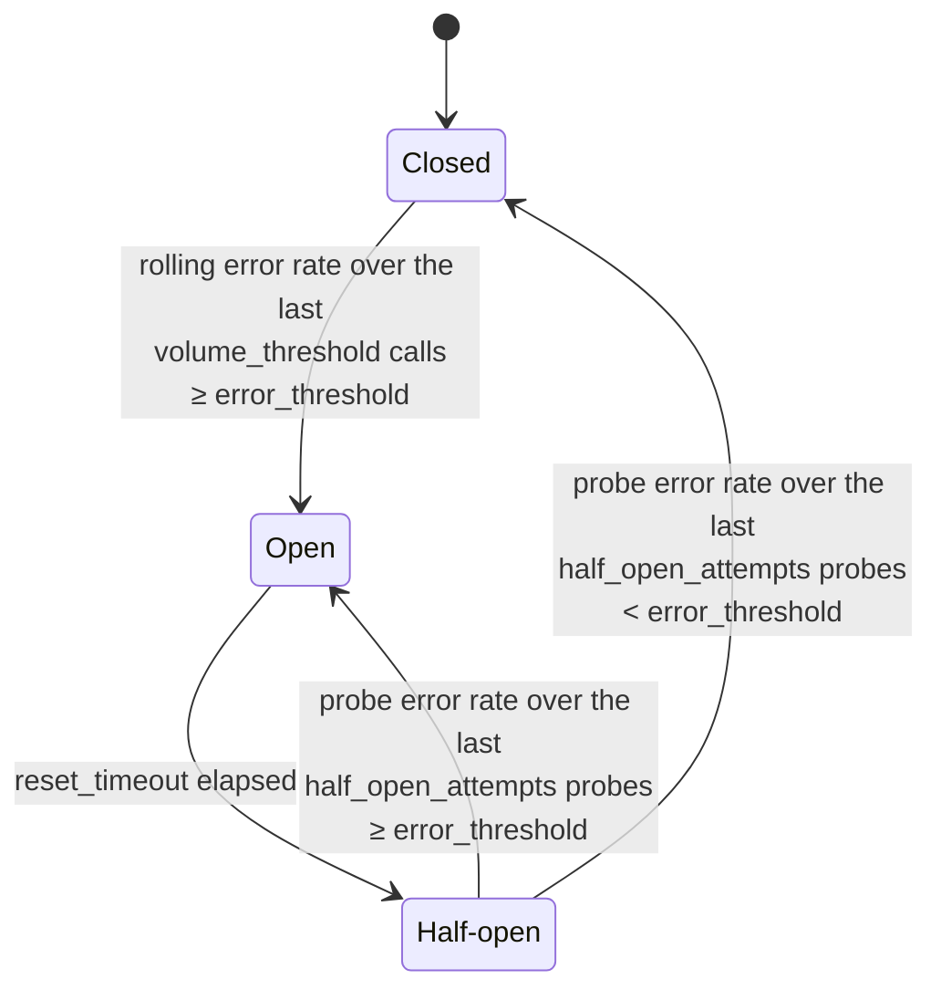

import { Callout } from "@hive/design-system/hive-components/callout";
import { Tabs } from "@hive/design-system/tabs";

Hive Router is built for performance right out of the box, but every production setup is different.
Tuning the router's traffic management settings to match your specific workload and subgraph
capabilities can unlock significantly better throughput and reliability.

This guide covers the `traffic_shaping` configuration in detail, explains the trade-offs of each
setting, and gives you a practical approach to benchmarking and optimizing your deployment.

For a quick reference of the configuration syntax, see the
[`traffic_shaping` configuration reference](/docs/router/configuration/traffic_shaping).

## Understanding Connection Limits

The most important setting for both performance and stability is `max_connections_per_host`. This
controls how many concurrent HTTP connections the router will open to each subgraph host (like
`products.api.example.com`).

- **Default Value:** `100`

### Finding the Sweet Spot

Getting this right is about balancing maximum throughput with protecting your subgraphs from
overload.

**Too low = bottleneck:**

- Even if your subgraphs have plenty of capacity, a low connection limit will queue requests inside
  the router, adding latency
- Your subgraph services might sit idle while the router artificially throttles traffic
- You're leaving performance on the table

**Too high = overload risk:**

- During traffic spikes, the router might flood subgraphs with more connections than they can handle
- This can overwhelm connection pools, CPU, or memory on your subgraphs
- Can trigger cascading failures or "thundering herd" problems where sudden traffic surges crash
  downstream services
- More open connections may lead to ephemeral port exhaustion

### How to Tune It

Start with the default and adjust based on your observations:

1. **Monitor subgraph performance** under normal and peak load
2. **Watch for connection pool exhaustion** in your subgraph logs
3. **Look for queuing in router metrics** - if requests are waiting for connections, you might need
   to increase the limit
4. **Load test gradually** - increase the limit incrementally and measure the impact

## Managing Idle Connections

The `pool_idle_timeout` setting controls how long unused connections stay open in the router's
connection pool before being closed.

- **Default Value:** `50s`

It takes a duration string (like `30s` for 30 seconds, or `1m` for 1 minute). This setting affects
how aggressively the router reuses existing connections versus closing them to free up resources.

### The Connection Reuse Trade-off

**Too short = latency overhead:**

- Connections get closed quickly, so new requests have to establish fresh TCP/TLS connections
- Each new connection adds handshake latency (especially noticeable with TLS)
- Your router and subgraphs spend more CPU on connection setup

**Too long = resource waste:**

- Idle connections consume memory and file descriptors on both the router and subgraph servers
- Network devices (load balancers, firewalls) might have shorter timeouts and silently drop
  connections, leading to "zombie" connections that fail when used

### Tuning Guidelines

- **High-traffic APIs:** Use longer timeouts (60-300 seconds) since connections are likely to be
  reused quickly
- **Low-traffic APIs:** Use shorter timeouts (10-30 seconds) to free up resources
- **Check your infrastructure:** Make sure this timeout is shorter than any load balancer or
  firewall timeouts in your stack
- **Monitor connection errors:** If you see connection failures, your timeout might be longer than
  network device timeouts

## Request Deduplication

The router supports two complementary levels of in-flight request deduplication that can be enabled
independently: **inbound** and **outbound**.

### Inbound Deduplication

Inbound deduplication (`traffic_shaping.router.dedupe`) operates at the entry point of the router
and applies to both queries and subscriptions.

- **Default:** `false` (opt-in)

```yaml
traffic_shaping:
  router:
    dedupe:
      enabled: true
```

#### Queries

When multiple clients send identical GraphQL `query` operations simultaneously, the router
executes the operation only once and shares the result with all waiting clients - subgraphs receive
just a single request regardless of how many clients are waiting.

#### Subscriptions

When multiple clients subscribe to the same operation with the same variables, the router opens
exactly one upstream subgraph connection. Events from that upstream are broadcast to all connected
clients via a shared channel.

This is fundamentally different from query deduplication because subscriptions are long-lived
streams. The upstream connection stays open as long as at least one client is subscribed. When
the upstream finishes or all clients disconnect, the entry is removed and the next matching client
starts a fresh upstream.

One consequence: **late joiners do not receive replayed events.** A client that joins an
already-running subscription receives events from the moment it subscribes onward. Events already
delivered to earlier clients are not replayed.

##### Transport-agnostic deduplication

The fingerprint space is shared between HTTP and WebSocket transports. A subscription started over
HTTP and an identical one over WebSocket produce the same fingerprint and can deduplicate against
each other. The same applies to queries: a query sent over WebSocket deduplicates with the same
query sent over HTTP.

However, the `Accept` header is part of the fingerprint when `headers` is set to `all` (the
default). HTTP streaming clients send `Accept: text/event-stream` or `Accept: multipart/mixed`
while WebSocket clients send no `Accept` header, so they produce different fingerprints by default
and do not deduplicate against each other.

To achieve cross-transport subscription deduplication - where a WebSocket subscription and an SSE
subscription for the same operation share one upstream connection - configure `headers: none` or
use an explicit include list that omits transport-specific headers:

```yaml
traffic_shaping:
  router:
    dedupe:
      enabled: true
      headers: none
```

or with an explicit include list:

```yaml
traffic_shaping:
  router:
    dedupe:
      enabled: true
      headers:
        include:
          - authorization
          - x-tenant-id
```

#### Deduplication key

Two requests are considered identical when the following all match:

- HTTP method and path
- Normalized operation text (whitespace/comment differences are ignored)
- GraphQL variables
- GraphQL extensions
- Schema checksum (prevents sharing across schema reload transitions)
- Selected request headers (controlled by the `headers` policy below)
- The supergraph selected to serve the request

#### Header policy

By default all headers are included in the fingerprint, so requests with different `Authorization`
or `Cookie` headers are **not** deduplicated with each other. You can narrow this down:

<Tabs items={["all (default)", "none", "include"]}>

<Tabs.Tab>

```yaml
traffic_shaping:
  router:
    dedupe:
      enabled: true
      headers: all # default — include every header
```

</Tabs.Tab>

<Tabs.Tab>

```yaml
traffic_shaping:
  router:
    dedupe:
      enabled: true
      headers: none # ignore all headers (requests from any user may be deduplicated)
```

</Tabs.Tab>

<Tabs.Tab>

```yaml
traffic_shaping:
  router:
    dedupe:
      enabled: true
      headers:
        include: # include only these headers in the fingerprint
          - authorization
          - cookie
```

</Tabs.Tab>

</Tabs>

#### Metrics

Inbound deduplication exposes the following metrics:

| Metric                                    | Type    | Description                                                                                                      |
| ----------------------------------------- | ------- | ---------------------------------------------------------------------------------------------------------------- |
| `hive.router.request_dedupe.joined_total` | counter | Number of inbound requests that joined an already in-flight deduplicated request instead of executing their own. |

The counter increments once per client request (HTTP or WebSocket) that was coalesced into an
in-flight leader request, carrying a `graphql.operation.type` attribute (`query` or
`subscription`). It stays at zero when `router.dedupe` is disabled, or when every request executes
independently.

**When to enable it:**

- Many clients frequently issue the same popular queries (dashboards, landing pages, product
  listings)
- Many clients subscribe to the same data (live scoreboards, shared feeds, broadcast events)
- You want to reduce overall execution pressure on your subgraphs under concurrent load

**When you might leave it disabled:**

- All operations are highly personalised and rarely identical
- You're debugging and want every request to execute independently

### Outbound Deduplication

Outbound deduplication (`dedupe_enabled`) deduplicates the requests the router makes
to individual subgraphs. When the router would send multiple identical requests to the same subgraph
simultaneously, it sends only one and fans the response back to all waiting parallel fetches.

- **Default Value:** `true`

This is almost always beneficial to keep enabled. It dramatically reduces load on subgraphs when
multiple clients request the same data at once (think of popular content or dashboard queries that
many users run simultaneously).

**When you might disable it:**

- Your queries are always unique (heavily personalized)
- You're debugging and want to see every request
- You have very low traffic where deduplication doesn't help

## Circuit Breaker

The circuit breaker pattern prevents the router from continuously sending requests to a subgraph
that is failing or unresponsive. When the subgraph's error rate rises above a configurable
threshold, the circuit "opens" and subsequent requests are immediately rejected with a
`SUBGRAPH_CIRCUIT_BREAKER_REJECTED` error, instead of waiting for the subgraph to time out. This
frees up router resources, fails fast for clients, and gives the subgraph time to recover.

- **Default:** disabled. The circuit breaker only becomes active when a `circuit_breaker` block is
  configured with `enabled: true`. Once that block is present, any omitted fields use the defaults
  listed below.

### How It Works

The circuit breaker has three states:

| State         | Behaviour                                                                                                                                                                                                      |
| ------------- | -------------------------------------------------------------------------------------------------------------------------------------------------------------------------------------------------------------- |
| **Closed**    | Normal operation. All requests pass through and the breaker tracks their outcome in a rolling sample of the last `volume_threshold` calls.                                                                     |
| **Open**      | Every request is rejected immediately with `SUBGRAPH_CIRCUIT_BREAKER_REJECTED`. No traffic reaches the subgraph.                                                                                               |
| **Half-open** | After `reset_timeout`, probe requests are allowed through and recorded in a rolling sample of the last `half_open_attempts` outcomes. Once that sample is full, the breaker re-closes or re-opens (see below). |



#### State transition logic

- **Closed → Open** is evaluated on every call after the rolling sample has filled. The first
  `volume_threshold` calls fill the sample; the next call is the one whose result is checked
  against `error_threshold`. In practice the breaker can only trip after at least
  `volume_threshold + 1` calls have been observed, so sending exactly `volume_threshold` failing
  requests is not enough on its own to flip the breaker open, even at a 100% error rate.
- **Open → Half-open** happens automatically once `reset_timeout` has elapsed. No external
  trigger is needed.
- **Half-open → Closed / Open** is evaluated the same way, on the rolling sample of the last
  `half_open_attempts` probe results. The first `half_open_attempts` probes fill the sample; the
  next probe is the one whose result decides the transition. If the error rate over those probes
  stays below `error_threshold`, the circuit closes; otherwise it returns to the open state and
  waits for another `reset_timeout`. In practice at least `half_open_attempts + 1` probes pass
  through before the breaker can transition.

#### Evaluation windows

The breaker evaluates the error rate over **count-based rolling samples** rather than
time-windows. There are two such samples:

- In the **closed** state, the rolling sample size is `volume_threshold`. Its outcome is checked
  on every call once it is full to decide whether to open the circuit.
- In the **half-open** state, the rolling sample size is `half_open_attempts`. Its outcome is
  checked on every probe once it is full to decide whether to close or re-open the circuit.

Because both samples are count-based, the breaker effectively waits until enough calls accumulate
before it can react during low-traffic periods. This is why `volume_threshold` and
`half_open_attempts` double as both the minimum sample size and the size of the rolling sample.

### What counts as a failure

The circuit breaker only reacts to outcomes that indicate the **subgraph itself is unhealthy**.
Concretely, a request is recorded as a **failure** in any of the following cases:

- **Network and transport errors**: DNS resolution failures, TCP connection refused, TLS handshake
  errors, broken connections, connection or read/write timeouts at the transport layer.
- **Invalid or empty subgraph responses**: invalid JSON payloads, empty response bodies, or any
  other condition that prevents the executor from producing a usable response.
- **Per-subgraph request timeouts**: when a request exceeds the
  [`request_timeout`](#request-timeout-and-circuit-breaker) configured for the subgraph.
- **HTTP responses whose status matches `error_status_codes`**: by default `500`, `502`, `503`,
  and `504`. Other 4xx/5xx codes are not counted unless you explicitly include them.
  See [Customizing failure status codes](#customizing-failure-status-codes) below.

### What does NOT count as a failure

- HTTP responses with a status code that is **not** in `error_status_codes`. These are treated as
  successes from the breaker's perspective, regardless of the response body. In particular, a
  `200 OK` carrying GraphQL errors in the body is not inspected.
- Client-initiated cancellations. If the caller drops the connection or cancels the request before
  the subgraph response arrives, the in-flight call is dropped without recording a success or a
  failure. This avoids tripping the breaker during traffic surges where many clients abort early.
- Subscription stream errors after the stream has been established. Only **subscription
  establishment** counts toward the breaker; errors mid-stream do not flip the breaker state.

### Behaviour when a response matches `error_status_codes`

When a subgraph response matches one of the configured `error_status_codes`, the breaker records
the request as a failure for trip-evaluation purposes, but the **original response is still
surfaced to the client** unchanged. The router does not replace it with a synthetic error.

This means clients keep seeing the upstream body, status, and headers (including `Retry-After`
if the subgraph sets one) until the breaker actually opens. Once the breaker is open, subsequent
requests no longer reach the subgraph and are rejected with `SUBGRAPH_CIRCUIT_BREAKER_REJECTED`.

### Subscription behaviour

Subscriptions are integrated with the breaker, with three important rules:

- **Establishment errors count.** If the upstream subgraph fails to establish a subscription
  (HTTP error, connection refused, invalid handshake, etc.), it is recorded as a failure just like
  a query.
- **Open-state subscription attempts are rejected.** When the breaker is open, new subscription
  attempts are short-circuited with `SUBGRAPH_CIRCUIT_BREAKER_REJECTED`, surfaced through the SSE
  stream body so clients can react.
- **Errors after the stream is up are ignored by the breaker.** Once a subscription stream is
  open, errors that occur mid-stream do not flip the breaker state. This prevents long-running
  subscriptions from poisoning the breaker for unrelated query traffic.

### Configuration

```yaml title="router.config.yaml"
traffic_shaping:
  all:
    circuit_breaker:
      enabled: true
      error_threshold: 50% # open when ≥ 50% of requests fail
      volume_threshold: 5 # evaluate after at least 5 requests
      reset_timeout: 30s # retry after 30s
```

| Option               | Type                    | Default                | Description                                                                                                                                                                                               |
| -------------------- | ----------------------- | ---------------------- | --------------------------------------------------------------------------------------------------------------------------------------------------------------------------------------------------------- |
| `enabled`            | `boolean`               | `false`                | Enable or disable the circuit breaker. At subgraph level, omit to inherit from global.                                                                                                                    |
| `error_threshold`    | `string`                | `50%`                  | Error rate percentage that triggers the breaker (e.g. `50%`).                                                                                                                                             |
| `volume_threshold`   | `integer`               | `5`                    | Size of the rolling sample of recent calls used to decide whether the circuit should open while closed. At least `volume_threshold + 1` calls must be observed before the breaker can trip.               |
| `reset_timeout`      | `string`                | `30s`                  | Duration the circuit stays open before transitioning to half-open and allowing probe calls through.                                                                                                       |
| `half_open_attempts` | `integer`               | `10`                   | Size of the rolling sample of probe calls used to decide whether the circuit should re-close from half-open. At least `half_open_attempts + 1` probes must be observed before the breaker can transition. |
| `error_status_codes` | `(integer \| string)[]` | `[500, 502, 503, 504]` | HTTP status codes (or wildcards) that count as failures.                                                                                                                                                  |

### Customizing failure status codes

`error_status_codes` accepts a mix of exact codes and wildcards (case-insensitive):

- **Exact code**: `503` or `"503"`.
- **`"5xx"`-style wildcard**: `"5xx"` matches `500`–`599`, `"4xx"` matches `400`–`499`, etc.
- **`"50x"`-style wildcard**: `"50x"` matches `500`–`509`, `"52x"` matches `520`–`529`, etc.

```yaml title="router.config.yaml"
traffic_shaping:
  all:
    circuit_breaker:
      enabled: true
      error_status_codes: [501, "5xx", "52x"]
```

<Callout type="info">
  When you provide `error_status_codes` in a per-subgraph override, the override
  **fully replaces** the global list. Entries from
  `traffic_shaping.all.circuit_breaker.error_status_codes` are not merged in.
  All other fields (`enabled`, `error_threshold`, `volume_threshold`,
  `reset_timeout`, `half_open_attempts`) are merged field-by-field, so you can
  omit them in a per-subgraph override to inherit the global value.
</Callout>

### Global vs Per-Subgraph Configuration

Circuit breaker settings can be applied globally to all subgraphs under `traffic_shaping.all`, and
selectively overridden for individual subgraphs under `traffic_shaping.subgraphs.<name>`. Most
per-subgraph fields are merged with the global configuration: omit any field to inherit the global
value (`error_status_codes` is the exception, see the note above).

<Tabs items={["Global only", "Per-subgraph only", "Mixed"]}>

<Tabs.Tab>

```yaml title="router.config.yaml"
traffic_shaping:
  all:
    circuit_breaker:
      enabled: true
      error_threshold: 50%
      volume_threshold: 5
      reset_timeout: 30s
```

</Tabs.Tab>

<Tabs.Tab>

```yaml title="router.config.yaml"
traffic_shaping:
  all:
    circuit_breaker:
      enabled: false # disabled globally
  subgraphs:
    accounts:
      circuit_breaker:
        enabled: true
        error_threshold: 60%
        volume_threshold: 3
        reset_timeout: 10s
    products:
      circuit_breaker:
        enabled: true
        error_threshold: 70%
        volume_threshold: 4
        reset_timeout: 15s
```

</Tabs.Tab>

<Tabs.Tab>

```yaml title="router.config.yaml"
traffic_shaping:
  all:
    circuit_breaker:
      enabled: true
      error_threshold: 50%
      volume_threshold: 10
      reset_timeout: 30s
  subgraphs:
    accounts:
      circuit_breaker:
        volume_threshold: 3 # override only volume_threshold; enabled and other settings inherit from global
```

</Tabs.Tab>

</Tabs>

### Request timeout and circuit breaker

The breaker honors the per-subgraph `request_timeout` (see
[`request_timeout`](/docs/router/configuration/traffic_shaping#request_timeout)). When a subgraph
exceeds its `request_timeout`, that timed-out request is recorded as a breaker failure. This means
chronic timeouts will eventually open the circuit and let the router fail fast instead of paying
the full timeout cost on every call.

### Metrics

The circuit breaker exposes the following OpenTelemetry instruments. All of them carry a
`subgraph.name` attribute so you can group / filter per subgraph in your metrics backend.

| Metric                                                | Type    | Description                                                                                                 |
| ----------------------------------------------------- | ------- | ----------------------------------------------------------------------------------------------------------- |
| `hive.router.circuit_breaker.short_circuits_total`    | counter | Number of requests rejected by the breaker without reaching the subgraph (i.e. while the circuit was open). |
| `hive.router.circuit_breaker.failures_total`          | counter | Number of subgraph responses or transport errors that the breaker counted as a failure.                     |
| `hive.router.circuit_breaker.state`                   | gauge   | Current breaker state per subgraph: `0` = closed (or half-open), `1` = open. See note below.                |
| `hive.router.circuit_breaker.state_transitions_total` | counter | Number of state transitions, with `circuit_breaker.from_state` and `circuit_breaker.to_state` attributes.   |

The transition counter exposes two extra attributes, `circuit_breaker.from_state` and
`circuit_breaker.to_state`, both with values `"closed"` or `"open"`. For example, the metric
fires with `from_state="closed"`, `to_state="open"` the moment a circuit trips.

<Callout type="info">
  The `hive.router.circuit_breaker.state` gauge collapses both the **closed**
  and **half-open** internal states into the same reported value (`0`). A
  reading of `1` therefore unambiguously means the breaker is rejecting traffic.
</Callout>

### Tracing & error reporting

When the breaker rejects a request, the rejection is also visible at the tracing layer. On the
corresponding `graphql.subgraph.operation` span the router records:

- `hive.graphql.error.count = 1`,
- `hive.graphql.error.codes` containing `SUBGRAPH_CIRCUIT_BREAKER_REJECTED`,
- a `graphql.error` span event with `error.type`, `error.message`, and `hive.error.subgraph_name`
  attributes.

This makes failed subgraph hops easy to spot in tracing UIs that highlight error spans, instead of
looking superficially "ok" because no upstream response was ever produced.

### Tuning Guidelines

- **`error_threshold`**: Lower values make the breaker more sensitive. Start at the default
  (`50%`) and tighten it only if you need to protect fragile subgraphs more aggressively.
- **`volume_threshold`**: Keep this high enough to avoid false positives during low-traffic
  periods. A value of `5`–`10` is reasonable for most deployments. The breaker will not trip
  until at least `volume_threshold` requests have been observed.
- **`reset_timeout`**: Should be long enough to give the subgraph time to recover, but short
  enough that you notice quickly when it does. `30s`–`60s` is a sensible starting point.
- **`half_open_attempts`**: Lower values close (or re-open) the circuit faster after a
  `reset_timeout`, but with fewer probe samples to base the decision on. Higher values trade off
  recovery latency for a more confident decision. The default (`10`) is a reasonable balance.
- **`error_status_codes`**: The default (`[500, 502, 503, 504]`) is a sensible production starting
  point. Add wildcards like `"5xx"` only if your subgraphs are well-behaved enough that any 5xx
  truly means "the subgraph is unhealthy".

**When to enable the circuit breaker:**

- You have subgraphs that are occasionally slow or unavailable, and you want to fail fast rather
  than accumulate timeout latency
- You want to give a struggling subgraph breathing room to recover instead of being overwhelmed by
  retried requests
- You want clear, attributable signals (metrics + spans) for "subgraph is currently unreachable"
  rather than chasing it down through stack traces

**When you might leave it disabled:**

- All subgraphs are highly reliable and well within their resource limits
- You prefer to surface subgraph errors directly to clients rather than short-circuiting them
