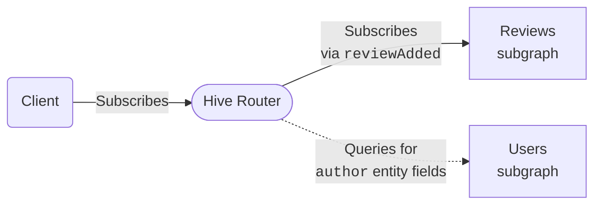

import { CallToAction } from "@hive/design-system/call-to-action";
import { Callout } from "@hive/design-system/hive-components/callout";

import { ArrowIcon } from "../../../../src/components/arrow-icon.tsx";

GraphQL subscriptions enable your clients to receive real-time data. This is essential for applications that need live updates - like notifications, live chat, stock tickers, collaborative editing, or IoT dashboards.

Hive Router provides full support for federated subscriptions out of the box. It works as a drop-in replacement for other federation routers, making it easy to add real-time capabilities to your federated GraphQL architecture.

## How Subscriptions Work

Consider this subscription query against Hive Router:

```graphql
subscription {
  reviewAdded {
    rating
    body
    author {
      name
    }
  }
}
```

This creates the following data flow:



Your client executes a subscription operation against Hive Router using any of the supported subscription protocols. The router then independently executes the same subscription against whichever subgraph defines the requested field - in this case, the Reviews subgraph that provides the `reviewAdded` field. The router communicates with subgraphs using whatever subscription protocol the subgraph supports, which does not have to match the protocol used by the client. For example, your client can subscribe using WebSockets while the router subscribes to subgraphs using HTTP callbacks or SSE.

When the Reviews subgraph sends new data, the router receives it and forwards it to the client. If the subscription includes federated entity fields from other subgraphs - like the `author` field that comes from the Users subgraph in this example - the router automatically resolves those fields by querying the corresponding subgraphs over HTTP. This allows you to subscribe to data that spans multiple subgraphs while maintaining a single subscription connection between your Router and the client.

## Entity Resolution

One of the most powerful features of federated subscriptions is automatic entity resolution. Your subscription can include fields from multiple subgraphs, and Hive Router handles all the coordination automatically.

```graphql
subscription {
  reviewAdded {
    # From the reviews subgraph
    id
    body
    rating
    # Entity field from the products subgraph
    product {
      name
      price
    }
    # Entity field from the users subgraph
    author {
      name
      email
    }
  }
}
```

In this example:

- The `reviewAdded` subscription is defined in the **reviews** subgraph
- The `product` fields are resolved from the **products** subgraph
- The `author` fields are resolved from the **users** subgraph

Hive Router intelligently determines the optimal way to resolve these entity fields, querying the necessary subgraphs as subscription events arrive. This works exactly like entity resolution for regular queries - no special configuration or considerations needed.

## Supported Protocols

Hive Router supports **all** subscriptions protocols in the ecosystem, both for client-to-router and router-to-subgraph communication.

### Server-Sent Events (SSE)

A simple, unidirectional protocol built on standard HTTP where the server streams events to the client over a persistent connection. Clients send a regular HTTP request with `Accept: text/event-stream` and the router keeps the response open, responding with a stream of events implementing the ["distinct connections mode" of the GraphQL over SSE spec](https://github.com/enisdenjo/graphql-sse/blob/master/PROTOCOL.md#distinct-connections-mode). No special transport library is needed - it works with the browser-native `EventSource` API or any HTTP client.

<CallToAction
  className="not-prose"
  href="/docs/router/subscriptions/sse"
  variant="primary-inverted"
>
  Learn more
  <ArrowIcon />
</CallToAction>

### Incremental Delivery over HTTP

A multipart HTTP protocol from the [Official GraphQL over HTTP spec RFC](https://github.com/graphql/graphql-over-http/blob/main/rfcs/IncrementalDelivery.md) where each subscription event is delivered as a separate part in a streamed `multipart/mixed` response. Clients send `Accept: multipart/mixed` and the router streams JSON payloads separated by boundary markers.

<CallToAction
  className="not-prose"
  href="/docs/router/subscriptions/incremental-delivery"
  variant="primary-inverted"
>
  Learn more
  <ArrowIcon />
</CallToAction>

### Multipart HTTP

[Apollo's Multipart HTTP protocol](https://www.apollographql.com/docs/graphos/routing/operations/subscriptions/multipart-protocol) where subscription events are streamed as `multipart/mixed` response chunks with `subscriptionSpec=1.0`. Clients send `Accept: multipart/mixed;subscriptionSpec=1.0` and the router delivers events as boundary-separated JSON payloads. This is the router's preferred protocol when connecting to subgraphs, and it is supported natively by Apollo Client with no extra configuration.

<CallToAction
  className="not-prose"
  href="/docs/router/subscriptions/multipart-http"
  variant="primary-inverted"
>
  Learn more
  <ArrowIcon />
</CallToAction>

### WebSockets

A full-duplex transport where clients and the router communicate over a persistent WebSocket connection using the [GraphQL over WebSocket protocol](https://github.com/enisdenjo/graphql-ws/blob/master/PROTOCOL.md). Unlike HTTP-based protocols, a single WebSocket connection can carry multiple concurrent operations - queries, mutations, and subscriptions alike. Every operation is treated as a synthetic HTTP request so all plugins, authorization, and header propagation apply uniformly. Requires explicit configuration and is disabled by default.

<CallToAction
  className="not-prose"
  href="/docs/router/subscriptions/websockets"
  variant="primary-inverted"
>
  Learn more
  <ArrowIcon />
</CallToAction>

### HTTP Callback

<Callout type="info">

Subgraph-only protocol. It controls how Hive Router communicates with subgraphs - not how clients connect to the router.

</Callout>

Instead of keeping a long-lived connection open to a subgraph, the router registers a callback URL with the subgraph over HTTP and the subgraph pushes events to that URL as they become available, as defined in the [Apollo HTTP Callback Protocol spec](https://www.apollographql.com/docs/graphos/routing/operations/subscriptions/callback-protocol). This avoids the overhead of maintaining persistent connections per subscription, making it a better fit than WebSockets or HTTP streams at high subscription counts. Subgraphs send periodic heartbeats to confirm the subscription is still alive, and the router can bind the callback endpoint to a dedicated port to isolate subgraph traffic from client traffic.

<CallToAction
  className="not-prose"
  href="/docs/router/subscriptions/http-callback"
  variant="primary-inverted"
>
  Learn more
  <ArrowIcon />
</CallToAction>

## Choosing a Transport

| Protocol                                                                   | Connection                                           | Client multiplexing                              | Router multiplexing                  | Firewall/proxy friendly                               |
| -------------------------------------------------------------------------- | ---------------------------------------------------- | ------------------------------------------------ | ------------------------------------ | ----------------------------------------------------- |
| [SSE](/docs/router/subscriptions/sse)                                      | Persistent HTTP stream                               | No - one connection per subscription             | No - one connection per subscription | Yes - plain HTTP                                      |
| [Incremental Delivery](/docs/router/subscriptions/incremental-delivery)    | Persistent HTTP stream                               | No - one connection per subscription             | No - one connection per subscription | Yes - plain HTTP                                      |
| [Multipart HTTP](/docs/router/subscriptions/multipart-http)                | Persistent HTTP stream                               | No - one connection per subscription             | No - one connection per subscription | Yes - plain HTTP                                      |
| [WebSockets](/docs/router/subscriptions/websockets)                        | Persistent WebSocket                                 | Yes - one connection carries multiple operations | No - one connection per subscription | Depends on network (WebSocket upgrade may be blocked) |
| [HTTP Callback](/docs/router/subscriptions/http-callback) ⚠️ subgraph only | Single HTTP request (subgraph posts to callback URL) | N/A                                              | No persistent connections held       | Yes - plain HTTP                                      |

Use SSE, Incremental Delivery, or Multipart HTTP when you want the simplest possible setup - they all work over standard HTTP, require no configuration, and are auto-negotiated by the router. The main difference between them is which client library you're using: Apollo Client works best with Multipart HTTP, urql and Relay work best with Incremental Delivery or SSE, and anything else can use SSE with [graphql-sse](https://the-guild.dev/graphql/sse).

Use WebSockets when you need to multiplex multiple GraphQL operations over a single connection, or when your client environment requires it. There is always [graphql-ws](https://the-guild.dev/graphql/ws) to bridge the gap.

The same protocols apply for router-to-subgraph communication, with one addition: [HTTP Callback](/docs/router/subscriptions/http-callback) is a subgraph-only protocol where the router registers a callback URL with the subgraph and the subgraph pushes events to it as they arrive. Because it avoids holding a persistent connection open per subscription, it is the preferred choice for subscriptions at scale.

## Protocol Negotiation

HTTP-based subscription protocols (SSE, Incremental Delivery, and Multipart HTTP) are not individually activated or configured. Once subscriptions are enabled, all three are available simultaneously - the router determines which one to use for each request based on the client's `Accept` header:

| `Accept` header                          | Protocol                                                                          |
| ---------------------------------------- | --------------------------------------------------------------------------------- |
| `text/event-stream`                      | [Server-Sent Events (SSE)](/docs/router/subscriptions/sse)                        |
| `multipart/mixed`                        | [Incremental Delivery over HTTP](/docs/router/subscriptions/incremental-delivery) |
| `multipart/mixed;subscriptionSpec="1.0"` | [Multipart HTTP](/docs/router/subscriptions/multipart-http)                       |

The protocols used between the router and subgraphs are independent from those used between clients and the router. For example, a client can use SSE while the router communicates with a subgraph over multipart HTTP. When connecting to subgraphs, the router prefers multipart first, then falls back to SSE.

If a client requests a subscription over an unsupported transport, the router returns `406 Not Acceptable`.

## Deduplication

Subscriptions participate in the same inbound deduplication mechanism as queries. When multiple clients subscribe to the same operation with the same deduplication parameters, the router opens exactly one upstream subgraph connection and fans events out to all connected clients via a broadcast channel.

See [Inbound Deduplication](/docs/router/guides/performance-tuning#inbound-deduplication) for how to enable and configure it.

## Supergraph Retirement

A subscription remains pinned to the supergraph selected when it started. When that supergraph
retires, the router sends a final error event with the `SUBSCRIPTION_SCHEMA_RELOAD` error code and
stops its producer. Clients should reconnect and resubscribe.

Reloading a configured supergraph retires only its previous configured generation. A
plugin-selected supergraph retires when the plugin drops its final owning `Arc<Supergraph>`.
Subscriptions using unrelated configured or plugin-selected supergraphs are not closed. Internal
runtime-cache eviction is not retirement and does not stop existing subscriptions.

## Configuration

Subscriptions are disabled by default. To enable them, set `enabled: true` in the `subscriptions` section of your router configuration:

```yaml
subscriptions:
  enabled: true
```

You can also enable subscriptions using the `SUBSCRIPTIONS_ENABLED` environment variable:

```bash
SUBSCRIPTIONS_ENABLED=true
```

### Subgraph Buffer Capacity

Controls the buffer between a subgraph and the router's internal processing pipeline.

When a subscription event arrives from a subgraph (over HTTP streaming or WebSocket), the router runs it through entity resolution before delivering it to clients. If entity resolution is slower than the rate at which the subgraph emits events, this buffer absorbs the difference so the subgraph is never throttled or disconnected by the router's processing speed.

When the buffer is full, the **newest** incoming event is dropped and logged. The subgraph connection stays open and keeps emitting unaffected.

A larger value gives the router more headroom to absorb bursts at the cost of memory. A smaller value keeps memory minimal and drops eagerly, which suits workloads where missing an event under pressure is acceptable.

```yaml
subscriptions:
  enabled: true
  subgraph_buffer_capacity: 1024 # default
```

### Broadcast Capacity

Controls the buffer size of the broadcast channel used to fan events out to clients **after** they have been processed by the router (entity resolution complete).

Each active subscription has its own broadcast channel. If a client consumer falls behind and the buffer fills up, it skips missed messages and continues from the latest available event. The client is not disconnected - a trace log is emitted when this happens.

Subscription events are typically low-frequency, so the default of 32 is sufficient for most workloads. Increase this value if clients are frequently falling behind on high-throughput subscriptions.

```yaml
subscriptions:
  enabled: true
  broadcast_capacity: 64 # defaults to 32
```

#### How the two buffers relate

These two buffers sit at different points in the subscription pipeline:

```
subgraph → [subgraph_buffer_capacity] → entity resolution → [broadcast_capacity] → clients
```

`subgraph_buffer_capacity` protects the subgraph: it decouples event ingestion from processing so the subgraph never stalls waiting for the router. Events are dropped here when the router's processing pipeline cannot keep up.

`broadcast_capacity` protects the router: it decouples event delivery from slow or lagging clients so one slow client cannot block others. Events are dropped here when a specific client cannot consume fast enough.

### Long-Lived Client Limit

HTTP streaming responses (SSE, Incremental Delivery, Multipart HTTP) and WebSocket connections are
long-lived - they hold an open connection for the duration of the subscription. To protect the
router from resource exhaustion, a global limit caps the number of these connections that can be
active at the same time. Regular HTTP requests (queries and mutations) are not counted toward this
limit.

When the limit is reached, new long-lived connection attempts are rejected with
`503 Service Unavailable` and a `Retry-After: 5` response header. The limit defaults to `128` and
is configurable via [`traffic_shaping.router.max_long_lived_clients`](/docs/router/configuration/traffic_shaping#routermax_long_lived_clients):

```yaml
traffic_shaping:
  router:
    max_long_lived_clients: 256
```

Set it to `0` to disable the limit entirely.
