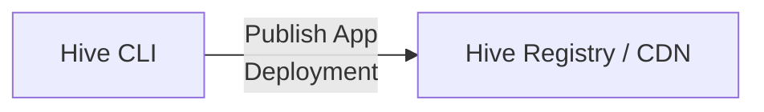
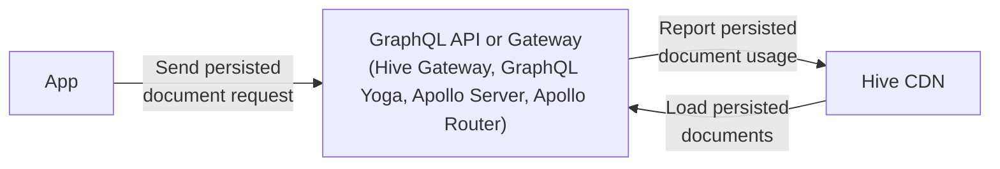
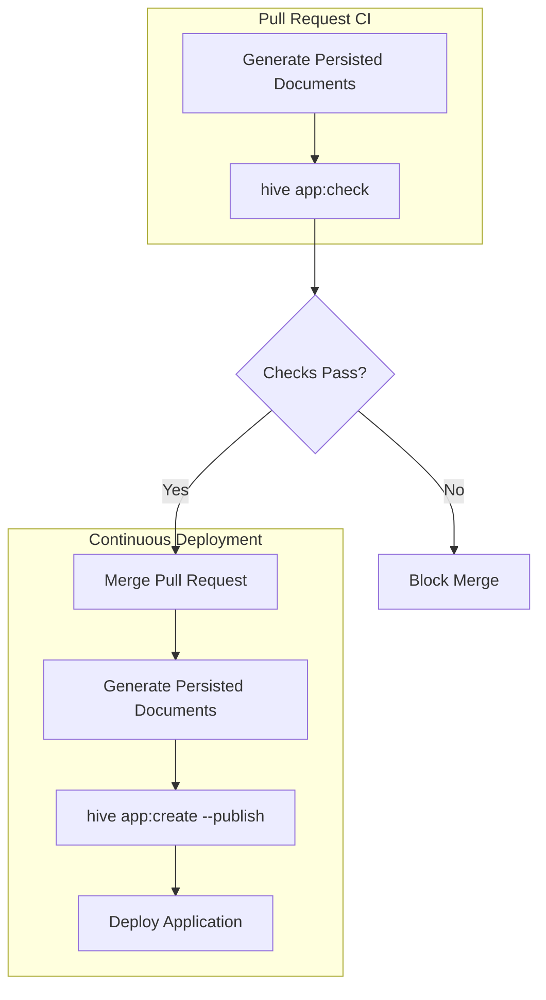

import { Callout } from "@hive/design-system/hive-components/callout";
import { Image } from "@hive/design-system/image";
import { Tabs } from "@hive/design-system/tabs";

App Deployments let you publish the GraphQL operations used by each version of your application as
Persisted Documents. Hive validates these operations against your schema,
makes published deployments available through the Hive CDN, and helps you identify which
applications are affected by schema changes.

This guide explains how to create, publish, and manage App Deployments and configure your clients
and GraphQL gateway to use them.

## Create an App Deployment

To create an app deployment with the extracted persisted documents, you need to have
[the Hive CLI installed](/docs/api-reference/cli#installation) and authenticated with your Hive
target, on which you want to deploy your app.

> **Note:** The GraphQL operations being uploaded must pass validation against the target schema.
> Otherwise, the app deployment creation will fail.

Once the pre-requisites are met, you can create an app deployment by running the following command.

```bash title="Create an App Deployment via CLI"
hive app:create \
  --registry.accessToken "<ACCESS_TOKEN>" \
  --target "<ORGANIZATION>/<PROJECT>/<TARGET>" \
  --name "my-app" \
  --version "1.0.0" \
  persisted-documents.json
```

The `--name` parameter is mandatory. The `--version` parameter is optional - if omitted, a random 7-character alphanumeric version is generated automatically.

The JSON file can use the GraphQL Code Generator, Relay, or Apollo persisted query manifest format.
Instead of a manifest, you can also pass a directory or a glob pattern. When a directory or glob is
provided, `app:create` scans for `*.graphql` files, normalizes each operation, computes a SHA-256
hash per operation, and builds the manifest directly.

```bash title="Create an App Deployment from a directory"
# from a directory
hive app:create --name my-app --version 1.0.0 ./src/operations

# from a glob pattern
hive app:create --name my-app --version 1.0.0 "./src/**/*.graphql"

# from an existing manifest file
hive app:create --name my-app --version 1.0.0 persisted-operations.json

# with auto-generated version
hive app:create --name my-app persisted-operations.json
```

You can also pass `--publish` to publish the app deployment immediately after creation, without needing to run `app:publish` separately.

```bash title="Create and publish in one step"
hive app:create \
  --registry.accessToken "<ACCESS_TOKEN>" \
  --target "<ORGANIZATION>/<PROJECT>/<TARGET>" \
  --name "my-app" \
  --version "1.0.0" \
  --publish \
  persisted-documents.json
```

| Parameter                 | Description                                                                                                                                     |
| ------------------------- | ----------------------------------------------------------------------------------------------------------------------------------------------- |
| `--name`                  | The name of the app deployment.                                                                                                                 |
| `--version`               | The version of the app deployment. Optional - a random version is generated if omitted.                                                         |
| `--publish`               | Publish the app deployment immediately after creation. Optional.                                                                                |
| `<file\|directory\|glob>` | Path to a GraphQL Code Generator, Relay, or Apollo manifest file, a directory of `.graphql` files, or a glob pattern matching `.graphql` files. |

An app deployment is uniquely identified by the combination of the `name` and `version` parameters
for each target.

After creating an app deployment, it is in the pending state. That means you can view it on the Hive
App UI.

Navigate to the Target page on the Hive Dashboard and click on the **Apps** tab to see it.

import pendingAppImage from "./pending-app.png";

By clicking on the app deployments name, you can navigate to the app deployment details page, where
you can see all the GraphQL operations that are uploaded as part of this app deployment.

import detailAppImage from "./detail-app.png";

**Further reading**:

- [`app:create` API Reference](https://github.com/graphql-hive/console/tree/main/packages/libraries/cli#hive-appcreate-file)

## Publish an App Deployment

A app deployment will be in the pending state until you publish it. By publishing the app
deployment, the persisted documents will be available via the Hive CDN and can be used by your
Gateway or GraphQL API for serving persisted documents to your app.

To publish an app deployment, you can run the following command. Make sure you utilize the same
`--name` and `--version` parameters as you used when creating the app deployment.

```bash title="Publish an App Deployment via CLI"
hive app:publish \
  --registry.accessToken "<ACCESS_TOKEN>" \
  --target "<ORGANIZATION>/<PROJECT>/<TARGET>" \
  --name "my-app" \
  --version "1.0.0"
```

| Parameter   | Description                        |
| ----------- | ---------------------------------- |
| `--name`    | The name of the app deployment.    |
| `--version` | The version of the app deployment. |

After publishing the app deployment, the persisted documents, the status of the app deployment on
the Hive dashboard will change to **active**.

import activeAppImage from "./active-app.png";

App deployments are a way to group and publish your GraphQL operations as a single app version to
the Hive Registry. This allows you to keep track of your different app versions, their operations
usage, and performance.

Making better decisions about:

- Which operations are being used by what app client version (mobile app, web app, etc.)
- Which team or developer is responsible for a specific operation and needs to be contacted for
  Schema change decisions



Furthermore, it allows you to leverage persisted documents (also knows as trusted documents or
persisted queries) on your GraphQL Gateway or server, which provides the following benefits:

- Reduce payload size of your GraphQL requests (reduce client bandwidth usage)
- Secure your GraphQL API by only allowing operations that are known and trusted by your Gateway



## Extracting Persisted Documents

We need to extract the persisted documents from within our app. The method for doing this may vary
depending on the tools you are using.

The persisted documents can be stored in a key-value JSON manifest generated by GraphQL Code
Generator or Relay, or in an Apollo persisted query manifest. The manifest includes each document
and its corresponding ID and is uploaded to the Hive Registry.

```json title="persisted-operations.json"
{
  "d9a00ec0c1ce": "query UsageEstimationQuery($input: UsageEstimationInput!) { __typename usageEstimation(input: $input) { __typename operations } }",
  "b8d98e796421": "mutation GenerateStripeLinkMutation($selector: OrganizationSelectorInput!) { __typename generateStripePortalLink(selector: $selector) }"
}
```

These persisted documents define all the possible operations that your app can execute against your
GraphQL API.

As long as the app deployment using these persisted documents is active, any change of the GraphQL
API that alters the GraphQL schema as used by any of the persisted documents would break that
specific app version and therefore be an unsafe/breaking change.

<Tabs items={["GraphQL Code Generator", "Relay Compiler", "Apollo Manifest"]}>

<Tabs.Tab>

For GraphQL Code Generator, you can configure the client preset to generate the persisted document
manifest.

```typescript title="codegen.ts" {9-11}
import { type CodegenConfig } from "@graphql-codegen/cli";

const config: CodegenConfig = {
  schema: "schema.graphql",
  documents: ["src/**/*.tsx"],
  generates: {
    "./src/gql/": {
      preset: "client",
      presetConfig: {
        persistedDocuments: true,
      },
    },
  },
};
```

After running GraphQL Code Generator, the file `persisted-documents.json` will be generated. This
file can be used for creating a new app deployment on Hive.

For more information,
[please refer to the GraphQL Code Generator documentation](https://the-guild.dev/graphql/codegen/plugins/presets/preset-client#enable-persisted-documents).

</Tabs.Tab>

<Tabs.Tab>

For Relay Compiler, you can configure the compiler to generate the persisted document manifest.

```js title="relay.config.js" {6-8}
module.exports = {
  src: "./src",
  language: "javascript",
  schema: "./data/schema.graphql",
  excludes: ["**/node_modules/**", "**/__mocks__/**", "**/__generated__/**"],
  persistConfig: {
    file: "./persisted-documents.json",
  },
};
```

After running the Relay Compiler, the file `persisted-documents.json` will be generated. This file
can be used for creating a new app deployment on Hive.

For more information,
[please refer to the Relay documentation](https://relay.dev/docs/router/guides/persisted-queries/#local-persisted-queries).

</Tabs.Tab>

<Tabs.Tab>

If your tooling emits an Apollo persisted query manifest, you can pass that file directly to
`hive app:create` instead of converting it to a key-value manifest. Version 1 of the format looks
like this:

```json title="persisted-query-manifest.json"
{
  "format": "apollo-persisted-query-manifest",
  "version": 1,
  "operations": [
    {
      "id": "e0321f6b438bb42c022f633d38c19549dea9a2d55c908f64c5c6cb8403442fef",
      "body": "query GetItem { thing { __typename } }",
      "name": "GetItem",
      "type": "query"
    }
  ]
}
```

Hive preserves each operation's `id` when creating the app deployment.

For more information,
[refer to the Apollo Client persisted queries documentation](https://www.apollographql.com/docs/react/data/persisted-queries#1-generate-operation-manifests).

</Tabs.Tab>

</Tabs>

<Image
  alt="Pending App Deployment"
  className="mt-10 max-w-2xl rounded-lg drop-shadow-md"
  src={pendingAppImage}
/>

<Image
  alt="App Deployment Detail View"
  className="mt-10 max-w-2xl rounded-lg drop-shadow-md"
  src={detailAppImage}
/>

<Image
  alt="Active App Deployment"
  className="mt-10 max-w-2xl rounded-lg drop-shadow-md"
  src={activeAppImage}
/>

**Further reading**:

- [`app:publish` API Reference](https://github.com/graphql-hive/console/tree/main/packages/libraries/cli#hive-apppublish)

## Retire an App Deployment

An app deployment can be retired, which means it is no longer active and the persisted documents are
no longer available on the Hive CDN. This is useful when you want to deprecate an old version of
your app.

To retire an app deployment, you can run the following command. Make sure you utilize the same
`--name` and `--version` parameters as you used when creating the app deployment.

```bash title="Retire an App Deployment via CLI"
hive app:retire \
  --registry.accessToken "<ACCESS_TOKEN>" \
  --target "<ORGANIZATION>/<PROJECT>/<TARGET>" \
  --name "my-app" \
  --version "1.0.0"
```

| Parameter   | Description                        |
| ----------- | ---------------------------------- |
| `--name`    | The name of the app deployment.    |
| `--version` | The version of the app deployment. |

After retiring the app deployment, the status of the app deployment on the Hive dashboard will
change to **retired**.

**Further reading**:

- [`app:retire` API Reference](https://github.com/graphql-hive/console/tree/main/packages/libraries/cli#hive-appretire)

## Finding Stale App Deployments

Hive tracks usage data for your app deployments. Each time a GraphQL request uses a persisted
document from an app deployment, Hive records when it was last used. This data helps you identify
app deployments that are candidates for retirement.

### Usage Tracking

When your GraphQL server or gateway reports usage to Hive, the `lastUsed` timestamp for the
corresponding app deployment is updated. You can see this information in the Hive dashboard or query
it via the GraphQL API.

### Querying Stale Deployments via GraphQL API

You can use the `activeAppDeployments` query to find app deployments that match specific criteria.
The date filters (`lastUsedBefore`, `neverUsedAndCreatedBefore`) use OR semantics. deployments
matching **either** date condition are returned. The `name` filter uses AND semantics to narrow down
results.

```graphql
query FindStaleDeployments($target: TargetReferenceInput!) {
  target(reference: $target) {
    activeAppDeployments(
      filter: {
        # Optional: filter by app name (case-insensitive partial match)
        name: "my-app"
        # Deployments last used more than 30 days ago
        lastUsedBefore: "2024-11-01T00:00:00Z"
        # OR deployments that have never been used and are older than 30 days
        neverUsedAndCreatedBefore: "2024-11-01T00:00:00Z"
      }
    ) {
      edges {
        node {
          name
          version
          createdAt
          lastUsed
        }
      }
    }
  }
}
```

| Filter Parameter            | Description                                                                                      |
| --------------------------- | ------------------------------------------------------------------------------------------------ |
| `name`                      | Filter by app deployment name (case-insensitive partial match). Uses AND semantics.              |
| `lastUsedBefore`            | Return deployments that were last used before this timestamp. Uses OR with other date filter.    |
| `neverUsedAndCreatedBefore` | Return deployments never used and created before this timestamp. Uses OR with other date filter. |

### Retirement Workflow

A typical workflow for retiring stale deployments:

1. **Query stale deployments** using the `activeAppDeployments` query with appropriate filters
2. **Review the results** to ensure you're not retiring deployments still in use
3. **Retire deployments** using the `app:retire` CLI command or GraphQL mutation

### Automated Cleanup

For teams with many app deployments (e.g., one per PR or branch), you can automate cleanup by
combining the GraphQL API with the Hive CLI.

Example script pattern:

```bash
# Query stale deployments via GraphQL API
# Parse the response to get app names and versions
# Retire each deployment using the CLI:
hive app:retire \
  --registry.accessToken "<ACCESS_TOKEN>" \
  --target "<ORGANIZATION>/<PROJECT>/<TARGET>" \
  --name "<app-name>" \
  --version "<app-version>"
```

<Callout type="warning">
  Always review deployments before retiring them programmatically. Consider
  protecting your latest production deployment to avoid accidentally retiring
  active versions.
</Callout>

## Schema Checks and Affected App Deployments

When you run a schema check that detects breaking changes, Hive automatically identifies which
active app deployments would be affected by those changes. This helps you understand the real-world
impact of schema changes before deploying them.

### How It Works

During a schema check, Hive analyzes the breaking changes and matches them against the persisted
documents in your active app deployments. Hive identifies all app deployments that have operations
using any of the affected schema coordinates (e.g., fields like `Query.hello` that are being
removed).

For each affected app deployment, you'll see:

- **The deployment** name and version
- **Which specific operations** within that deployment use the affected schema coordinates

This information is displayed alongside the breaking changes in the schema check results, helping
you understand the collective impact across all your active app deployments.

### Example

If you have a breaking change that removes the `Query.users` field, and you have an active app
deployment `mobile-app@2.1.0` with operations that query `Query.users`, the schema check will show:

- The breaking change: "Field 'users' was removed from object type 'Query'"
- Affected app deployment: `mobile-app` version `2.1.0`
- Affected operations: The specific operation names and hashes that use this field

### Benefits

- **Impact assessment**: Understand which client applications would break before deploying schema
  changes
- **Coordination**: Know which teams need to update their apps before a breaking change can be
  safely deployed
- **Risk mitigation**: Make informed decisions about whether to proceed with breaking changes or
  find alternative approaches

<Callout type="info">
  Only **active** app deployments (published and not retired) are checked for
  affected operations. Pending and retired deployments are not included in this
  analysis.
</Callout>

## Persisted Documents on GraphQL Server and Gateway

Persisted documents can be used on your GraphQL server or Gateway to reduce the payload size of your
GraphQL requests and secure your GraphQL API by only allowing operations that are known and trusted
by your Gateway.

Hive serves as the source of truth for the allowed persisted documents and provides a CDN for
fetching these documents as they are requested.

<Tabs items={['Hive Gateway', 'GraphQL Yoga', 'Apollo Server', 'Apollo Router', 'Custom Third-Party Integration']}>

{/* Hive Gateway */}

<Tabs.Tab>

For Hive Gateway you can use the Hive configuration for resolving persisted documents. Adjust your
`gateway.config.ts` file as follows.

```ts title="gateway.config.ts"
import { defineConfig } from "@graphql-hive/gateway";

export const gatewayConfig = defineConfig({
  persistedDocuments: {
    type: "hive",
    // The endpoint of Hive's CDN
    endpoint: [
      "https://cdn.graphql-hive.com/artifacts/v1/<target_id>",
      "https://cdn-mirror.graphql-hive.com/artifacts/v1/<target_id>",
    ],
    // The CDN token provided by Hive Registry
    key: "<cdn access token>",
  },
});
```

For further information, please refer to the
[Hive Gateway documentation for persisted documents](/docs/gateway/persisted-documents).

</Tabs.Tab>

{/* GraphQL Yoga */}

<Tabs.Tab>

For GraphQL Yoga you can use the Hive CDN for resolving persisted documents via the Hive SDK.

```sh npm2yarn
npm i -D @graphql-hive/yoga
```

```typescript title="Persisted Documents with GraphQL Yoga" {10-16}
import { createYoga } from "graphql-hive";
import { useHive } from "@graphql-hive/yoga";
import schema from "./schema.js";

const yoga = createYoga({
  schema,
  plugins: [
    useHive({
      enabled: false,
      persistedDocuments: {
        cdn: {
          // replace <target_id> and <cdn_access_token> with your values
          endpoint: [
            "https://cdn.graphql-hive.com/artifacts/v1/<target_id>",
            "https://cdn-mirror.graphql-hive.com/artifacts/v1/<target_id>",
          ],
          accessToken: "<cdn_access_token>",
        },
      },
    }),
  ],
});
```

For further configuration options, please refer to the
[Hive Client API reference](/docs/api-reference/client#persisted-documents).

#### Layer 2 Cache (Optional)

For serverless environments or multi-instance deployments, you can add a Layer 2 (L2) cache between
the in-memory cache and the CDN. This is useful when in-memory cache is lost between invocations or
to share cached documents across server instances.

```typescript title="Persisted Documents with L2 Cache (Redis)" {14-24}
import { createYoga } from "graphql-hive";
import { createClient } from "redis";
import { useHive } from "@graphql-hive/yoga";
import schema from "./schema.js";

const redis = createClient({ url: "redis://localhost:6379" });
await redis.connect();

const yoga = createYoga({
  schema,
  plugins: [
    useHive({
      enabled: false,
      persistedDocuments: {
        cdn: {
          endpoint: "https://cdn.graphql-hive.com/artifacts/v1/<target_id>",
          accessToken: "<cdn_access_token>",
        },
        layer2Cache: {
          cache: {
            get: (key) => redis.get(`hive:pd:${key}`),
            set: (key, value, opts) =>
              redis.set(
                `hive:pd:${key}`,
                value,
                opts?.ttl ? { EX: opts.ttl } : {},
              ),
          },
          ttlSeconds: 3600, // 1 hour for found documents
          notFoundTtlSeconds: 60, // 1 minute for not-found (negative caching)
        },
      },
    }),
  ],
});
```

The lookup flow is: **L1 (memory) -> L2 (Redis/external) -> CDN**

| Option               | Description                                                                                     |
| -------------------- | ----------------------------------------------------------------------------------------------- |
| `cache.get`          | Async function to get a value from the cache. Returns `null` for cache miss.                    |
| `cache.set`          | Async function to set a value in the cache. Receives an optional `ttl` option.                  |
| `ttlSeconds`         | TTL in seconds for successfully found documents.                                                |
| `notFoundTtlSeconds` | TTL in seconds for not-found documents (negative caching). Set to `0` to disable. Default: `60` |
| `waitUntil`          | Optional function for serverless environments to ensure cache writes complete.                  |

</Tabs.Tab>

{/* Apollo Server */}

<Tabs.Tab>

For Apollo Server you can use the Hive CDN for resolving persisted documents via the Hive SDK.

```sh npm2yarn
npm i -D @graphql-hive/apollo
```

```typescript title="Persisted Documents with Apollo Server" {10-16}
import { ApolloServer } from "@apollo/server";
import { useHive } from "@graphql-hive/apollo";
import schema from "./schema.js";

const server = new ApolloServer({
  schema,
  plugins: [
    useHive({
      persistedDocuments: {
        cdn: {
          // replace <target_id> and <cdn_access_token> with your values
          endpoint: "https://cdn.graphql-hive.com/artifacts/v1/<target_id>",
          accessToken: "<cdn_access_token>",
        },
      },
    }),
  ],
});
```

For further configuration options, please refer to the
[Hive Client API reference](/docs/api-reference/client#persisted-documents).

#### Layer 2 Cache (Optional)

Apollo Server automatically uses the server's
[cache backend](https://www.apollographql.com/docs/apollo-server/performance/cache-backends) for L2
caching if available. You can also configure a custom L2 cache:

```typescript title="Persisted Documents with L2 Cache" {10-20}
import { createClient } from "redis";
import { ApolloServer } from "@apollo/server";
import { useHive } from "@graphql-hive/apollo";
import schema from "./schema.js";

const redis = createClient({ url: "redis://localhost:6379" });
await redis.connect();

const server = new ApolloServer({
  schema,
  plugins: [
    useHive({
      persistedDocuments: {
        cdn: {
          endpoint: "https://cdn.graphql-hive.com/artifacts/v1/<target_id>",
          accessToken: "<cdn_access_token>",
        },
        layer2Cache: {
          cache: {
            get: (key) => redis.get(`hive:pd:${key}`),
            set: (key, value, opts) =>
              redis.set(
                `hive:pd:${key}`,
                value,
                opts?.ttl ? { EX: opts.ttl } : {},
              ),
          },
          ttlSeconds: 3600,
          notFoundTtlSeconds: 60,
        },
      },
    }),
  ],
});
```

</Tabs.Tab>

{/* Apollo Router */}

<Tabs.Tab>

To use App Deployments with Apollo-Router, you can use the Hive CDN for resolving persisted
documents.

Use the [Apollo Router custom build for Hive](/docs/other-integrations/apollo-router) as an
alternative to the official Apollo Router.

Enable the Persisted Document plugin by adding the following to your `router.yaml` configuration.

```yaml title="router.yaml"
# ... the rest of your configuration
plugins:
  hive.usage:
    target: "<ORGANIZATION>/<PROJECT>/<TARGET>"
  hive.persisted_documents:
    enabled: true
```

The plugin uses the `HIVE_CDN_ENDPOINT` and `HIVE_CDN_KEY` environment variables to resolve the
persisted documents IDs.

For additional information and configuration options, please refer to the
[Apollo-Router integration page](/docs/other-integrations/apollo-router).

</Tabs.Tab>

{/* Custom Third Party */}

<Tabs.Tab>

Any published app deployment is available via the Hive CDN. You can fetch a the persisted documents
by doing a HTTP GET request.

```text title="Fetch Persisted Document via HTTP"
GET https://cdn.graphql-hive.com/artifacts/v1/<target_id>/apps/<app_name>/<app_version>/<document_hash>
```

| Parameter       | Description                                                             |
| --------------- | ----------------------------------------------------------------------- |
| `target_id`     | The target ID of the Hive target where the app deployment is published. |
| `app_name`      | The name of the app deployment.                                         |
| `app_version`   | The version of the app deployment.                                      |
| `document_hash` | The hash of the persisted document.                                     |

**Example curl request:**

```bash title="Example curl request"
curl \
  -L \
  -H 'X-Hive-CDN-Key: CDN_ACCESS_TOKEN' \
  https://cdn.graphql-hive.com/artifacts/v1/<target_id>/apps/<app_name>/<app_version>/<document_hash>
```

**Expected responses:**

| Response Status | Description                                                             |
| --------------- | ----------------------------------------------------------------------- |
| 200             | The persisted document was found and is returned in the response body.  |
| 404             | The persisted document does not exist.                                  |
| 401             | The request is unauthorized. A valid CDN access token must be provided. |

</Tabs.Tab>

</Tabs>

## Sending Persisted Document Requests from your App

Once you have the persisted documents available on your GraphQL server or Gateway, you can send a
GraphQL request with the persisted document ID following the GraphQL over HTTP specification.

<Tabs items={["curl", "Apollo Client", "Urql", "Relay"]}>

<Tabs.Tab>

```text title="GraphQL Request with Persisted Document"
POST /graphql
Content-Type: application/json
{
  "documentId": "<app_name>~<app_version>~<document_hash>",
}
```

| Parameter       | Description                         |
| --------------- | ----------------------------------- |
| `app_name`      | The name of the app deployment.     |
| `app_version`   | The version of the app deployment.  |
| `document_hash` | The hash of the persisted document. |

**Example curl request:**

```bash title="Example curl request"
curl \
  -X POST \
  -H 'Content-Type: application/json' \
  -d '{"documentId": "<app_name>~<app_version>~<document_hash>"}' \
  http://localhost:4000/graphql
```

</Tabs.Tab>

<Tabs.Tab>

The code demonstrates how to send a persisted document request using Apollo Client. Make sure to
replace the placeholders with your actual values.

```typescript title="Apollo Client Persisted Document Configuration"
import { ApolloClient, HttpLink, InMemoryCache } from "@apollo/client";
import { createPersistedQueryLink } from "@apollo/client/link/persisted-queries";

// replace <app_name>, <app_version>, and with your values
const appVersionPrefix = "<app_name>~<app_version>~";

const persistedQueriesLink = createPersistedQueryLink({
  generateHash(document) {
    // GraphQL Code Generator Client Preset generates
    // the persisted document ID within the document node.
    // For other implementations return the hash prefixed with the app version.
    if (document?.["__metadata__"]?.["hash"]) {
      throw Error("Hash not available for document");
    }
    return appVersionPrefix + document["__metadata__"]["hash"];
  },
});

const httpLink = new HttpLink({
  uri: "/graphql",
  fetch(url, init) {
    const parsedBody = JSON.parse(init!.body as string);
    return fetch(url, {
      ...init,
      body: JSON.stringify({
        variables: parsedBody.variables,
        documentId: parsedBody.extensions.persistedQuery.sha256Hash,
        extensions: { ...parsedBody.extensions, persistedQuery: undefined },
      }),
    });
  },
});

const client = new ApolloClient({
  cache: new InMemoryCache(),
  link: persistedQueriesLink.concat(httpLink),
});
```

| Parameter       | Description                        |
| --------------- | ---------------------------------- |
| `<app_name>`    | The name of the app deployment.    |
| `<app_version>` | The version of the app deployment. |

</Tabs.Tab>

<Tabs.Tab>

The code demonstrates how to send a persisted document request using Urql. Make sure to replace the
placeholders with your actual values.

```typescript title="Urql Persisted Document Configuration"
import { createClient, fetchExchange, mapExchange } from "urql";

// replace <app_name>, <app_version>, and with your values
const appVersionPrefix = "<app_name>~<app_version>~";

const urqlClient = createClient({
  url: "/graphql",
  exchanges: [
    mapExchange({
      onOperation(op) {
        if (op.query?.["__metadata__"]?.["hash"]) {
          throw Error("Hash not available for document");
        }

        return {
          ...op,
          query: {
            documentId:
              // GraphQL Code Generator Client Preset generates
              // the persisted document ID within the document node.
              // For other implementations return the hash prefixed with the app version.
              appVersionPrefix + op.query["__meta__"]["hash"],
            definitions: [],
          },
        };
      },
    }),
    fetchExchange,
  ],
});
```

| Parameter       | Description                        |
| --------------- | ---------------------------------- |
| `<app_name>`    | The name of the app deployment.    |
| `<app_version>` | The version of the app deployment. |

</Tabs.Tab>

<Tabs.Tab>

Update your Relay environment configuration to send persisted document requests instead of the
document.

```typescript title="Relay Persisted Document Configuration"
// replace <app_name>, <app_version>, and with your values
const appVersionPrefix = "<app_name>~<app_version>~";

function fetchQuery(operation, variables) {
  if (!operation.id) {
    throw new Error("No persisted document hash provided.");
  }

  return fetch("/graphql", {
    method: "POST",
    headers: {
      "content-type": "application/json",
    },
    body: JSON.stringify({
      documentId: appVersionPrefix + operation.id,
      variables,
    }),
  }).then((response) => response.json());
}
```

| Parameter       | Description                        |
| --------------- | ---------------------------------- |
| `<app_name>`    | The name of the app deployment.    |
| `<app_version>` | The version of the app deployment. |

</Tabs.Tab>

</Tabs>

## Continuous Integration and Deployment

We recommend checking persisted documents on every pull request and publishing a new app deployment
from your CD pipeline:

1. In CI, generate the persisted documents and run `hive app:check`. The command validates the
   operations against the target's latest valid schema without creating an app deployment.
2. In CD, generate the persisted documents again and run `hive app:create --publish` before deploying
   the application.



`app:check` accepts a GraphQL Code Generator, Relay, or Apollo persisted operations manifest, a
directory containing `.graphql` files, or a glob pattern. It exits with a non-zero status when an
operation is invalid, so it can block a pull request before incompatible operations are merged.

```bash title="Check Persisted Documents in CI"
hive app:check \
  --registry.accessToken "<ACCESS_TOKEN>" \
  --target "<ORGANIZATION>/<PROJECT>/<TARGET>" \
  persisted-documents.json
```

Publishing must happen before deploying the application. This ensures the Hive CDN contains every
persisted document ID that the new application version can send.

```bash title="Publish an App Deployment in CD"
hive app:create \
  --registry.accessToken "<ACCESS_TOKEN>" \
  --target "<ORGANIZATION>/<PROJECT>/<TARGET>" \
  --name "my-app" \
  --version "<APP_VERSION>" \
  --publish \
  persisted-documents.json
```

### GitHub Actions Example

The following workflow checks operations on pull requests and publishes an app deployment after a
change is merged to `main`. Replace the build command and manifest path with those used by your
application.

```yaml title=".github/workflows/app-deployment.yml"
name: App deployment

on:
  pull_request:
    branches: [main]
  push:
    branches: [main]

jobs:
  check:
    if: github.event_name == 'pull_request'
    runs-on: ubuntu-22.04
    steps:
      - uses: actions/checkout@v4
      - uses: actions/setup-node@v4
        with:
          node-version: 24
          cache: npm
      - run: npm ci
      - name: Generate persisted documents
        run: npm run build
      - name: Check persisted documents
        env:
          HIVE_TOKEN: ${{ secrets.HIVE_TOKEN }}
        run: |
          curl -sSL https://graphql-hive.com/install.sh | sh
          hive app:check persisted-documents.json \
            --registry.accessToken "$HIVE_TOKEN" \
            --target "<ORGANIZATION>/<PROJECT>/<TARGET>"

  publish:
    if: github.event_name == 'push'
    runs-on: ubuntu-22.04
    steps:
      - uses: actions/checkout@v4
      - uses: actions/setup-node@v4
        with:
          node-version: 24
          cache: npm
      - run: npm ci
      - name: Generate persisted documents
        run: npm run build
      - name: Publish app deployment
        env:
          HIVE_TOKEN: ${{ secrets.HIVE_TOKEN }}
        run: |
          curl -sSL https://graphql-hive.com/install.sh | sh
          hive app:create persisted-documents.json \
            --registry.accessToken "$HIVE_TOKEN" \
            --target "<ORGANIZATION>/<PROJECT>/<TARGET>" \
            --name "my-app" \
            --version "${{ github.sha }}" \
            --publish
      - name: Deploy application
        run: npm run deploy
```

<Callout type="info">

We are using the publish workflow ourselves for [deploying the Hive Console Dashboard using Pulumi](https://github.com/graphql-hive/platform/blob/main/deployment/utils/publish-app-deployment.ts).

</Callout>
