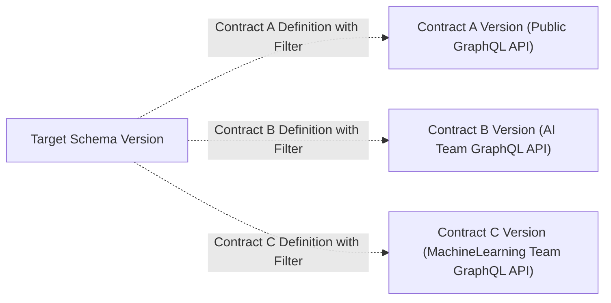

import { Callout } from "@hive/design-system/hive-components/callout";
import { Image } from "@hive/design-system/image";

A GraphQL schema contract allows you to define subsets of your schema that can be distributed to
different consumers.

## Overview

You may have a GraphQL schema that contains a lot of information that is only relevant to your
internal business, but also want to share parts of your GraphQL schema with external developers and
teams. Schema contracts allow you to split your GraphQL schema into multiple subsets that can be
shared with different consumers.



Each defined contract is deeply embedded into the Hive workflows for schema publishing and schema
checks.

For each contract definition, Hive runs:

- **Schema Checks.** Ensure you are not accidentally breaking contract schema consumers.
- **Schema Publishing.** Contract schemas are published to the schema registry as part of the schema
  publishing process. Each valid contract version is published to the high-availability CDN (SDL and
  Supergraph).

### Federation Contracts

In [Federation](/federation) subgraphs, fields can be tagged with the `@tag` directive.

```graphql title="Example Subgraph" {6,11,12,13}
extend schema
  @link(
    url: "https://specs.apollo.dev/federation/v2.0"
    import: [
      "@key"
      "@tag" # Tag Directive Import
    ]
  )

type Product @key(fields: "id") {
  id: ID! @tag(name: "public")
  name: String! @tag(name: "public")
  price: Int! @tag(name: "public")
  topCustomers: [User!]!
}

type Query {
  product(id: ID!): Product @tag(name: "public")
}
```

The provided value for the `name` argument is used to tag fields or types. Later on the values (e.g.
`public`) can be used to define a contract within Hive.

If you have the following subgraph.

```graphql
extend schema
  @link(
    url: "https://specs.apollo.dev/federation/v2.0"
    import: [
      "@key"
      "@tag" # Tag Directive Import
    ]
  )

type Query {
  a(id: ID!): Int @tag(name: "public")
  b(id: ID!): Int
}
```

The public graph will look like the following.

```graphql title="Supergraph"
type Query {
  a(id: ID!): Int
  b(id: ID!): Int
}
```

If you now set up a contract that only includes fields tagged with `@tag(name: "public")` the
contract graph will look like the following.

```graphql title="Contract Graph"
type Query {
  a(id: ID!): Int
}
```

## Define a Contract

Contracts are defined within the Hive application. You can define a contract by navigating to the
Target settings.

import settingsPageImage from "./settings-page.png";

On the settings page, there is a schema contracts section.

import schemaContractsSettingsEmptyImage from "./schema-contracts-settings-empty.png";

Click the "Create new contract" button to create a new contract.

import createSchemaContractModalImage from "./create-schema-contract-modal.png";

Within the dialogue, you need to define the name of the contract and the filter.

The contract name must be unique within the target. There can not be two contracts with the same
name.

For the filter, you at least need to define one include or one exclude tag. We recommend using
include tags over exclude tags as they are more explicit (and it is less likely you accidentally add
something to a contract schema that you wanted to omit).

E.g. if you are using Apollo Federation you should use the `name` argument value of `@tag`
directives.

Additionally, you can also remove unreachable types from the public API schema. That means that all
types that are not accessible from the root Query, Mutation and Subscription type will be removed
from the public API schema.

After that, press the "Create Contract" button to create the contract.

import createSchemaContractModalConfirmImage from "./create-schema-contract-modal-confirm.png";

If the contract creation succeeds you will see the success modal. Close the modal and you will now
see the contract in the schema contracts section.

import schemaContractsSettingsContractImage from "./schema-contracts-settings-contract.png";

The contract is now active and used for subsequent schema checks and schema publishing runs within
the target. Note that the first contract version will only be published after the next schema is
published within the target.

## Contracts in Schema Checks

When you run a schema check, Hive will run the schema check for each contract definition. That means
if the composition of the contract schema is not valid, or the contract schema contains breaking
changes, the schema check will fail.

import schemaChecksContractExample from "./schema-checks-contract-example.png";

## Contracts in Schema Publishing

Hive will publish the contract schema to the schema registry when you run a schema publishing run.
Within the History view of a target, you can see how the contract schema has evolved.

import schemaHistoryContractDiffTextImage from "./schema-history-contract-diff-text.png";

You can also see the direct changes on the SDL or Supergraph to the previous schema version.

import schemaHistoryContractDiffGitStyle from "./schema-history-contract-diff-git-style.png";

## Access Contract CDN Artifacts

Artifacts such as the SDL and Supergraph of a contract are available on the High-Availability CDN.
Within the "Connect to CDN" modal, you can find the URLs for accessing the contract artifacts.

import hiveCdnAccessContractImage from "./hive-cdn-access-contract.png";

<Callout type="warning">
  Right now, contracts are only supported for **Federation** projects. If you
  want to use contracts with a non-federated project [please let us
  know](https://github.com/graphql-hive/platform/issues/3856).
</Callout>

<Image
  alt="Target Settings"
  className="mx-auto mt-10 rounded-lg drop-shadow-md"
  src={settingsPageImage}
/>

<Image
  alt="Schema contract section in target settings"
  className="mx-auto mt-10 rounded-lg drop-shadow-md"
  src={schemaContractsSettingsEmptyImage}
/>

<Image
  alt="Create Schema Contract Modal"
  className="mx-auto mt-10 rounded-lg drop-shadow-md"
  src={createSchemaContractModalImage}
/>

<Image
  alt="create schema contract confirmation modal"
  className="mx-auto mt-10 rounded-lg drop-shadow-md"
  src={createSchemaContractModalConfirmImage}
/>

<Image
  alt="Schema contract section in target settings with created contract"
  className="mx-auto mt-10 rounded-lg drop-shadow-md"
  src={schemaContractsSettingsContractImage}
/>

<Image
  alt="Contract in Schema Checks"
  className="mx-auto mt-10 rounded-lg drop-shadow-md"
  src={schemaChecksContractExample}
/>

<Image
  alt="Changes listed in the schema version history for a contract"
  className="mx-auto mt-10 rounded-lg drop-shadow-md"
  src={schemaHistoryContractDiffTextImage}
/>

<Image
  alt="Supergraph Diff from one contract version to the next using a diff view"
  className="mx-auto mt-10 rounded-lg drop-shadow-md"
  src={schemaHistoryContractDiffGitStyle}
/>

<Image
  alt="Selecting the contract in the connect to CDN modal"
  className="mx-auto mt-10 rounded-lg drop-shadow-md"
  src={hiveCdnAccessContractImage}
/>

## Serving a Contract Schema

Point your Hive Gateway, Hive Router, or Apollo Router instance to the supergraph of the contract
schema. The contract supergraph endpoint follows this pattern:

```text title="Example: Contract Supergraph Endpoint"
https://cdn.graphql-hive.com/artifacts/v1/<target_id>/contracts/<contract_name>/supergraph
```

### Hive Gateway

```bash
docker run --name hive-gateway --rm -p 4000:4000 \
  ghcr.io/graphql-hive/gateway supergraph \
  "https://cdn.graphql-hive.com/artifacts/v1/<target_id>/contracts/<contract_name>" \
  --hive-cdn-key "<hive_cdn_access_key>"
```

For more information, refer to the
[Hive Gateway documentation](/docs/gateway/supergraph-proxy-source).

### Hive Router

Configure Hive Router to load the contract supergraph from the Hive CDN by setting `source: hive`
in your `router.config.yaml`:

```yaml title="router.config.yaml"
supergraph:
  source: hive
  endpoint: https://cdn.graphql-hive.com/artifacts/v1/<target_id>/contracts/<contract_name>
  key: <hive_cdn_access_key>
```

Then mount the config file and start the router:

```bash
docker run --name hive-router --rm -p 4000:4000 \
  -v ./router.config.yaml:/app/router.config.yaml \
  ghcr.io/graphql-hive/router:latest
```

For more information, refer to the [Hive Router documentation](/docs/router/supergraph).

### Apollo Router

```bash
docker run --name apollo-router -p 4000:4000 --rm \
  --env HIVE_CDN_ENDPOINT="https://cdn.graphql-hive.com/artifacts/v1/<target_id>/contracts/<contract_name>" \
  --env HIVE_CDN_KEY="<hive_cdn_access_key>" \
  ghcr.io/graphql-hive/apollo-router
```

For more information, refer to the
[Apollo Router documentation](/docs/other-integrations/apollo-router).

## Understanding Tag Filtering Behavior

When generating a contract schema, the composition filters schema elements based on the configured
**included and excluded tags**. After filtering, the resulting schema must still be a **valid
GraphQL schema**. If filtering produces an invalid schema (for example, a field referencing a
removed type), the contract composition fails, and thus the schema check or published schema version
becomes invalid.

### Tag Filtering Rules

Contract filtering operates on individual schema elements:

- Object, interface, union, input, enum, and scalar types
- Fields of object and interface types
- Arguments
- Enum values

When an element is removed due to tag filtering, the following applies:

- Fields referencing removed types must also be removed to maintain schema validity.
- Failure to remove dependent fields will result in an invalid schema.
- An invalid final schema will cause contract composition to fail with an error.

### Examples

#### Tag applied to both field and type

```graphql
type Query {
  myFeature: Boolean
  myNewFeature: MyNewFeatureResult @tag(name: "preview")
}

type MyNewFeatureResult @tag(name: "preview") {
  value: String!
}
```

Contract configuration:

```
excludeTags: ["preview"]
```

Resulting contract schema:

```graphql
type Query {
  myFeature: Boolean
}
```

Both the field and the type are removed because they are tagged.

**Note**: A supergraph without any root field types is invalid.

#### Tag applied only to the field

```graphql
type Query {
  myFeature: Boolean
  myNewFeature: MyNewFeatureResult @tag(name: "preview")
}

type MyNewFeatureResult {
  value: String!
}
```

Contract configuration:

```
excludeTags: ["preview"]
```

Resulting schema:

```
type Query {
  myFeature: Boolean
}
type MyNewFeatureResult {
  value: String!
}
```

If **Remove unreachable types** is enabled, the type may be pruned because it is no longer
referenced.

#### Tag applied only on type

```graphql
type Query {
  myFeature: Boolean
  myNewFeature: MyNewFeatureResult
}

type MyNewFeatureResult @tag(name: "preview") {
  value: String!
}
```

Contract configuration:

```
excludeTags: ["preview"]
```

Filtering removes the type:

```graphql
type MyNewFeatureResult
```

But the Query field still references it.

This produces an **invalid schema**, so contract composition fails with an error.

You must update the schema to ensure consistency, for example:

```graphql
type Query {
  myFeature: Boolean
  myNewFeature: MyNewFeatureResult @tag(name: "preview")
}
```

#### Recommended Tagging Strategy

To avoid composition errors:

1. Tag both the type and all fields that return it.
2. Treat tags as feature boundaries rather than isolated annotations.
3. Use Remove unreachable types to automatically prune leftover types.
4. Prefer **include** over **exclude** filters

```graphql
type Query {
  myFeature: Boolean @tag(name: "stable")
  myNewFeature: MyNewFeatureResult
}

type MyNewFeatureResult {
  value: String!
}
```
