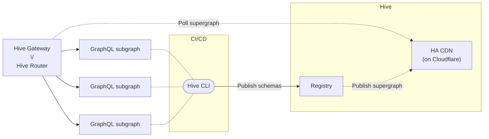

import { Callout } from "@hive/design-system/hive-components/callout";
import { Card, Cards } from "@hive/design-system/hive-components/card";
import { Image } from "@hive/design-system/image";
import { Tabs } from "@hive/design-system/tabs";
import { File, Files, Folder } from "#mdx-shims/files";
import { Step, Steps } from "#mdx-shims/steps";

import accessTokensConfirmImage from "./access-tokens-confirm.png";
import accessTokensCreateNewImage from "./access-tokens-create-new.png";
import accessTokensPermissionsImage from "./access-tokens-permissions.png";
import accessTokensResourcesImage from "./access-tokens-resources.png";
import accessTokensSuccessImage from "./access-tokens-success.png";
import cdnAccessTokenSettings from "./cdn-access-token-settings.png";
import cdnAccessTokenCreate from "./create-cdn-access-token.png";
import cdnAccessTokenCreated from "./created-cdn-access-token.png";
import HiveDashboardInsightsImage from "./hive-dashboard-insights.png";
import HiveGatewayGraphiqlImage from "./hive-gateway-graphiql.png";
import HiveGatewayLandingPageImage from "./hive-gateway-landing-page.png";
import publishFirstSchemaVersionUi from "./publish-first-schema-version-ui.png";
import publishSecondSchemaVersionUi from "./publish-second-schema-version-ui.png";
import publishThirdSchemaVersionUi from "./publish-third-schema-version-ui.png";
import targetOverview from "./target-overview.png";

Once you've created a Hive project of type **Federation**, you can start pushing your GraphQL
Federation subgraph schemas to the Hive registry.

> Learn more about [GraphQL federation and its benefits](/federation).

This guide will walk you through the basics of schema pushing, checking, and spin up the Hive
Gateway serving the federated GraphQL schema.

<Steps>
<Step>
### Prerequisites

For this guide, we are going to use the following Subgraphs that we are going to publish to Hive.

> **Note**: If you want you can also use your own subgraphs instead of the ones we provide.

<Files>
  <Folder defaultOpen name="subgraphs">
    <File name="users.graphql" />
    <File name="products.graphql" />
    <File name="reviews.graphql" />
  </Folder>
</Files>

We provide the actual URLs for these running subgraphs, so we can later on send some real GraphQL
requests with our federation gateway.

- **Users**: https://federation-demo.theguild.workers.dev/users
- **Products**: https://federation-demo.theguild.workers.dev/products
- **Reviews**: https://federation-demo.theguild.workers.dev/reviews

Here's the GraphQL schema (SDL) for every subgraph we are going to publish to Hive. Save these to
files on your machine.

<Tabs items={['Users', 'Products', 'Reviews']}>

<Tabs.Tab>

```graphql title="subgraphs/users.graphql"
extend type Query {
  me: User
  user(id: ID!): User
  users: [User]
}

type User @key(fields: "id") {
  id: ID!
  name: String
  username: String
}
```

</Tabs.Tab>

<Tabs.Tab>

```graphql title="subgraphs/products.graphql"
extend type Query {
  topProducts(first: Int = 5): [Product]
}

type Product @key(fields: "upc") {
  upc: String!
  name: String
  price: Int
  weight: Int
}
```

</Tabs.Tab>
<Tabs.Tab>

```graphql title="subgraphs/reviews.graphql"
type Review @key(fields: "id") {
  id: ID!
  body: String
  author: User @provides(fields: "username")
  product: Product
}

extend type User @key(fields: "id") {
  id: ID! @external
  username: String @external
  reviews: [Review]
}

extend type Product @key(fields: "upc") {
  upc: String! @external
  reviews: [Review]
}
```

</Tabs.Tab>

</Tabs>
</Step>

<Step>
### Create Access Token

In order to publish our subgraph schemas to the schema registry, we first need to create an access
token with the necessary permissions for the Hive CLI.

Within your organization, open the `Settings` tab and select the `Access Token` section.

Click `Create new access token` and enter a name for the access token.

<Image
  alt="Create new access token button within the organization settings access token section"
  className="mt-10 max-w-xl rounded-lg drop-shadow-md"
  src={accessTokensCreateNewImage}
/>

Click `Next` and select `Allowed` for `Check schema/service subgraph`,
`Publish schema/service/subgraph`, and `Report usage data`.

<Image
  alt="Grant the permissions required for publishing and checking schemas"
  className="mt-10 max-w-xl rounded-lg drop-shadow-md"
  src={accessTokensPermissionsImage}
/>

Click `Next` and in the next step keep the `Full Access` selection for the resources. For the
purpose of this guide there is no need to further restirct the resources.

<Image
  alt="Grant full access on all resources"
  className="mt-10 max-w-xl rounded-lg drop-shadow-md"
  src={accessTokensResourcesImage}
/>

One last time click `Next` and review the access token.

<Image
  alt="Review the permissions"
  className="mt-10 max-w-xl rounded-lg drop-shadow-md"
  src={accessTokensConfirmImage}
/>

Then click the `Create Access Token` button. A confirmation dialogue will open that shows the you
generated token.

<Image
  alt="Successful access token creation"
  className="mt-10 max-w-xl rounded-lg drop-shadow-md"
  src={accessTokensSuccessImage}
/>

Make sure to copy your token and keep it safe. **You won't be able to see it again.**

</Step>

<Step>
### Publish subgraphs

As you may have noticed, Hive has created three targets under your project: `development`,
`staging`, and `production`. Each of these targets represent a different environment. You can remove
or create new targets as needed, for modelling the different environments of your project.

<Image
  alt="Project overview showing the available targets"
  className="mt-10 max-w-xl rounded-lg drop-shadow-md"
  src={targetOverview}
/>

For this guide we will use the `development` target.

Now that you have your access token, and you have the base schema defined, you can publish your
schema to the registry.

We'll start with the **Users** subgraph.

If you did not yet copy the contents of the `subgraphs/users.graphql` to a local file, you can do so
now.

Run the following command in your terminal, to publish your `subgraphs/users.graphql` to the
registry.

- Replace `<YOUR_ORGANIZATION>` with the slug of your organization
- Replace `<YOUR_PROJECT>` with the slug of your project within the organization
- Replace `<YOUR_TOKEN_HERE>` with the access token we just created.

<Tabs items={['Binary', 'NodeJS', 'Docker']} storageKey="cli-distribution-choice">

{/* Binary */}

<Tabs.Tab>

```bash
hive schema:publish \
  --registry.accessToken "<YOUR_TOKEN_HERE>" \
  --target "<YOUR_ORGANIZATION>/<YOUR_PROJECT>/development" \
  --service "users" \
  --url "https://federation-demo.theguild.workers.dev/users" \
  --author "John Doe" \
  --commit "First Version" \
  subgraphs/users.graphql
```

</Tabs.Tab>

{/* NodeJS */}

<Tabs.Tab>

```bash
npx hive schema:publish \
  --registry.accessToken "<YOUR_TOKEN_HERE>" \
  --target "<YOUR_ORGANIZATION>/<YOUR_PROJECT>/development" \
  --service "users" \
  --url "https://federation-demo.theguild.workers.dev/users" \
  --author "John Doe" \
  --commit "First Version" \
  subgraphs/users.graphql
```

</Tabs.Tab>

{/* Docker */}

<Tabs.Tab>

For Docker, we need to mount the subgraph schema file into the container.

```bash
docker run --name graphql-hive-cli --rm \
  -v $(pwd)/subgraphs/users.graphql/:/usr/src/app/subgraphs/users.graphql \
  ghcr.io/graphql-hive/cli \
  schema:publish \
  --registry.accessToken "<YOUR_TOKEN_HERE>" \
  --target "<YOUR_ORGANIZATION>/<YOUR_PROJECT>/development" \
  --service "users" \
  --url "https://federation-demo.theguild.workers.dev/users" \
  --author "John Doe" \
  --commit "First Version" \
  ./subgraphs/users.graphql
```

</Tabs.Tab>

</Tabs>

If everything goes well, you should see the following output, containing a link pointing you to the
schema version on the Hive dashboard.

```bash copy=false
✔ Published initial schema.
```

If you'll get to your target's page on Hive dashboard, you should see that it was updated with the
new schema you just published 🎉

<Image
  alt="First published schema version on the Hive dashboard"
  className="mt-10 max-w-2xl rounded-lg drop-shadow-md"
  src={publishFirstSchemaVersionUi}
/>

<Callout type="tip">
  You should also check out the **Explorer** tab: you can see the schema you
  just published, and explore the API types, fields, and arguments.
</Callout>

Next, we will publish the **Products** subgraph schema to Hive. Again, let's start by copying the
schema to a local file.

<Tabs items={['Binary', 'NodeJS', 'Docker']} storageKey="cli-distribution-choice">

{/* Binary */}

<Tabs.Tab>

```bash
hive schema:publish \
  --registry.accessToken YOUR_TOKEN_HERE \
  --target "<YOUR_ORGANIZATION>/<YOUR_PROJECT>/development" \
  --service "products" \
  --url "https://federation-demo.theguild.workers.dev/products" \
  --author "John Doe" \
  --commit "Second Version" \
  subgraphs/products.graphql
```

</Tabs.Tab>

{/* NodeJS */}

<Tabs.Tab>

```bash
npx hive schema:publish \
  --registry.accessToken YOUR_TOKEN_HERE \
  --target "<YOUR_ORGANIZATION>/<YOUR_PROJECT>/development" \
  --service "products" \
  --url "https://federation-demo.theguild.workers.dev/products" \
  --author "John Doe" \
  --commit "Second Version" \
  subgraphs/products.graphql
```

</Tabs.Tab>

{/* Docker */}

<Tabs.Tab>

For Docker, we need to mount the subgraph schema file into the container.

```bash
docker run --name graphql-hive-cli --rm \
  -v $(pwd)/subgraphs/products.graphql/:/usr/src/app/subgraphs/products.graphql \
  ghcr.io/graphql-hive/cli \
  schema:publish \
  --registry.accessToken "<YOUR_TOKEN_HERE>" \
  --target "<YOUR_ORGANIZATION>/<YOUR_PROJECT>/development" \
  --service "products" \
  --url "https://federation-demo.theguild.workers.dev/reviews" \
  --author "John Doe" \
  --commit "Second Version" \
  ./subgraphs/products.graphql
```

</Tabs.Tab>

</Tabs>

If everything goes well, you should see the following output:

```bash copy=false
✔ Schema published
```

After the publish process, if we had over to the Hive dashboard, we can see our new schema version
published.

<Image
  alt="Second published schema version on the Hive dashboard"
  className="mt-10 max-w-2xl rounded-lg drop-shadow-md"
  src={publishSecondSchemaVersionUi}
/>

Last, we will publish the **Reviews** subgraph schema to Hive. Again, let's start by copying the
schema to a local file.

Then, we run the following command in your terminal.

<Tabs items={['Binary', 'NodeJS', 'Docker']} storageKey="cli-distribution-choice">

{/* Binary */}

<Tabs.Tab>

```bash
hive schema:publish \
  --registry.accessToken YOUR_TOKEN_HERE \
  --target "<YOUR_ORGANIZATION>/<YOUR_PROJECT>/development" \
  --service "reviews" \
  --url "https://federation-demo.theguild.workers.dev/reviews" \
  --author "John Doe" \
  --commit "My second commit" \
  subgraphs/reviews.graphql
```

</Tabs.Tab>

{/* NodeJS */}

<Tabs.Tab>

```bash
npx hive schema:publish \
  --registry.accessToken YOUR_TOKEN_HERE \
  --target "<YOUR_ORGANIZATION>/<YOUR_PROJECT>/development" \
  --service "reviews" \
  --url "https://federation-demo.theguild.workers.dev/reviews" \
  --author "John Doe" \
  --commit "My second commit" \
  subgraphs/reviews.graphql
```

</Tabs.Tab>

{/* Docker */}

<Tabs.Tab>

For Docker, we need to mount the subgraph schema file into the container.

```bash
docker run --name graphql-hive-cli --rm \
  -v $(pwd)/subgraphs/reviews.graphql/:/usr/src/app/subgraphs/reviews.graphql \
  ghcr.io/graphql-hive/cli \
  schema:publish \
  --registry.accessToken "<YOUR_TOKEN_HERE>" \
  --target "<YOUR_ORGANIZATION>/<YOUR_PROJECT>/development" \
  --service "reviews" \
  --url "https://federation-demo.theguild.workers.dev/reviews" \
  --author "John Doe" \
  --commit "My second commit" \
  ./subgraphs/reviews.graphql
```

</Tabs.Tab>

</Tabs>

Again, if everything goes well, you should see the following output:

```bash copy=false
✔ Schema published
```

On your target's **Explorer** page now, you'll be able to see the schema of all three subgraphs 🎉

<Image
  alt="Third published schema version on the Hive dashboard"
  className="mt-10 max-w-2xl rounded-lg drop-shadow-md"
  src={publishThirdSchemaVersionUi}
/>

Congratulations on publishing and composing your first subgraphs with the Hive schema registry!

</Step>

<Step>
### Gateway

The next step is to spin up our GraphQL gateway that will serve the federated GraphQL schema
composed out of the subgraphs we published to the Hive schema registry.

The gateway will delegate the requests from the clients to the appropriate subgraph services, and
then merge the results into a single response.

The Hive schema registry publishes the supergraph (artifact of the composed schemas that contains
all the information about the subgraphs and fields available) to the high-availability CDN on
Cloudflare.

The gateway can poll the supergraph from the CDN and serve the composed GraphQL schema.



#### CDN Access

For accessing the supergraph, we need to create the CDN access token from the Hive dashboard.

Navigate to your target's settings page and select the **CDN Tokens** tab.

<Image
  alt="CDN Token Form"
  className="mt-10 max-w-2xl rounded-lg drop-shadow-md"
  src={cdnAccessTokenSettings}
/>

Click the **Create new CDN token** button, give your token a name and click **Create**.

<Image
  alt="CDN Token Form"
  className="mt-10 max-w-2xl rounded-lg drop-shadow-md"
  src={cdnAccessTokenCreate}
/>

There will be a confirmation screen showing the CDN token you just created. Make sure to copy it and
keep it safe.

<Image
  alt="CDN Token Form"
  className="mt-10 max-w-2xl rounded-lg drop-shadow-md"
  src={cdnAccessTokenCreated}
/>

#### Run the gateway

Hive platform supports two orchestrators for GraphQL Federation:
[Hive Gateway (JavaScript)](/docs/gateway) and [Hive Router (Rust)](/docs/router). They provide the
same core functionality but differ in performance characteristics and runtime.

<Tabs items={['Hive Gateway (JavaScript)', 'Hive Router (Rust)']} storageKey="gateway-choice">

<Tabs.Tab>

Hive Gateway is the Federation Gateway that seamlessly integrates with the Hive registry. You can
run Hive Gateway either as a Docker image, binary or NPM package.

<Tabs items={['Binary', 'Docker', 'Node.js Package']} storageKey="gateway-distribution-choice">

{/* Binary */}

<Tabs.Tab>

The single executable binary for the Hive Gateway is available without any dependencies. You can
download and setup the binary on your machine.

```sh
curl -sSL https://graphql-hive.com/install-gateway.sh | sh
```

To install a specific Hive Gateway version, pass a valid release version (for example `X.Y.Z`) to the script:

```sh
curl -sSL https://graphql-hive.com/install-gateway.sh | sh -s -- X.Y.Z
```

Then you can run the Hive Gateway with the following command.

```sh
hive-gateway supergraph \
  "https://cdn.graphql-hive.com/artifacts/v1/<target_id>" \
  --hive-cdn-key "<hive_cdn_access_key>"
```

| Parameter             | Description                      |
| --------------------- | -------------------------------- |
| `hive_cdn_endpoint`   | The endpoint of your Hive target |
| `hive_cdn_access_key` | The Hive CDN access key          |

</Tabs.Tab>

{/* Docker */}

<Tabs.Tab>

The Docker image for Hive Gateway is published to the GitHub docker registry. You can simply run the
following command to start a Hive Gateway instance from your existing Hive target.

```sh
docker run --name hive-gateway -rm \
  ghcr.io/graphql-hive/gateway supergraph \
  "https://cdn.graphql-hive.com/artifacts/v1/<target_id>" \
  --hive-cdn-key "<hive_cdn_access_key>"
```

| Parameter               | Description                |
| ----------------------- | -------------------------- |
| `<target_id>`           | The ID of your Hive target |
| `<hive_cdn_access_key>` | The Hive CDN access key    |

</Tabs.Tab>

{/* Node.js Package */}

<Tabs.Tab>

The Gateway CLI is available as a Node.js package. You can install it using your favorite package
manager.

```sh npm2yarn
npm install @graphql-hive/gateway
```

You can then run the Gateway CLI from your existing Hive target using the following command.

```sh title="Run Hive Gateway"
npx hive-gateway supergraph \
  "https://cdn.graphql-hive.com/artifacts/v1/<target_id>" \
  --hive-cdn-key "<hive_cdn_access_key>"
```

| Parameter             | Description                      |
| --------------------- | -------------------------------- |
| `hive_cdn_endpoint`   | The endpoint of your Hive target |
| `hive_cdn_access_key` | The Hive CDN access key          |

</Tabs.Tab>

</Tabs>

If you now navigate to `http://localhost:4000`, you should see the Hive Gateway page with
information about the supergraph and subgraphs.

<Image
  alt="Hive Gateway Landing Page"
  className="mt-10 max-w-2xl rounded-lg drop-shadow-md"
  src={HiveGatewayLandingPageImage}
/>

Now, if you navigate to `http://localhost:4000/graphql`, you should see the GraphiQL interface where
you can write and execute queries against the supergraph.

<Image
  alt="Hive Gateway GraphiQL"
  className="mt-10 max-w-2xl rounded-lg drop-shadow-md"
  src={HiveGatewayGraphiqlImage}
/>

Here you can execute GraphQL operations against the supergraph, which will be delegate to the single
subgraph services.

Here is a sample query to execute:

```graphql title="Sample Query using multiple Subgraphs"
query TopProductsWithReview {
  topProducts(first: 2) {
    upc
    name
    price
    reviews {
      body
      author {
        id
        username
      }
    }
  }
}
```

[Execute Query on Hive Gateway GraphiQL](http://localhost:4000/graphql?query=query+TopProductsWithReview+%7B%0A++topProducts%28first%3A+2%29+%7B%0A++++upc%0A++++name%0A++++price%0A++++reviews+%7B%0A++++++body%0A++++++author+%7B%0A++++++++id%0A++++++++username%0A++++++%7D%0A++++%7D%0A++%7D%0A%7D)

</Tabs.Tab>

<Tabs.Tab>

Hive Router is the Federation Gateway that seamlessly integrates with the Hive registry. You can run
Hive Router either as a Docker image or binary.

To start, create a configuration file `router.config.yaml` with the following content:

```yaml title="router.config.yaml"
supergraph:
  source: hive
  endpoint: "<hive_cdn_endpoint>"
  key: "<hive_cdn_access_key>"
```

| Parameter             | Description                      |
| --------------------- | -------------------------------- |
| `hive_cdn_endpoint`   | The endpoint of your Hive target |
| `hive_cdn_access_key` | The Hive CDN access key          |

<Tabs items={['Binary', 'Docker']} storageKey="router-distribution-choice">

{/* Binary */}

<Tabs.Tab>

The single executable binary for the Hive Router is available without any dependencies. You can
download and setup the binary on your machine.

```sh
curl -o- https://raw.githubusercontent.com/graphql-hive/router/main/install.sh | sh
```

and start the Hive Router with this command:

```sh
./hive-router
```

</Tabs.Tab>

{/* Docker */}

<Tabs.Tab>

The Docker image for Hive Router is published to the GitHub docker registry. You can simply run the
following command to start a Hive Router instance from your existing Hive target.

```sh
docker run \
  --name hive-router -rm \
  -p 4000:4000 \
  -v ./router.config.yaml:/app/router.config.yaml \
  ghcr.io/graphql-hive/router:latest
```

</Tabs.Tab>

</Tabs>

If you now navigate to `http://localhost:4000`, you should see the Hive Router default page. This
page points to `http://localhost:4000/graphql`, where you can access the GraphQL IDE to write and
execute queries against the supergraph.

<Image
  alt="Hive Gateway GraphiQL"
  className="mt-10 max-w-2xl rounded-lg drop-shadow-md"
  src={HiveGatewayGraphiqlImage}
/>

Here you can execute GraphQL operations against the supergraph, which will be delegated to the
single subgraph services.

Here is a sample query to execute:

```graphql title="Sample Query using multiple Subgraphs"
query TopProductsWithReview {
  topProducts(first: 2) {
    upc
    name
    price
    reviews {
      body
      author {
        id
        username
      }
    }
  }
}
```

[Execute Query on Hive Router GraphiQL](http://localhost:4000/graphql?query=query+TopProductsWithReview+%7B%0A++topProducts%28first%3A+2%29+%7B%0A++++upc%0A++++name%0A++++price%0A++++reviews+%7B%0A++++++body%0A++++++author+%7B%0A++++++++id%0A++++++++username%0A++++++%7D%0A++++%7D%0A++%7D%0A%7D)

</Tabs.Tab>

</Tabs>

#### Usage reporting

Up next let's report the usage from our gateway to the registry, so we can see on the dashboard how
the API is being used.

For this, we will reuse the previously create access token that already has the `Report usage data`
permissions.

You will also need to know the target ID of your project's target.

<Callout title="What is Target ID?" type="info">

Target can either be an UUID or a slug following the format
`$organizationSlug/$projectSlug/$targetSlug`:

- `the-guild/graphql-hive/staging`
- `a0f4c605-6541-4350-8cfe-b31f21a4bf80`

Be aware that using the UUID is more resilient in case you rename either your organization, project
or target.

</Callout>

<Tabs items={['Hive Gateway (JavaScript)', 'Hive Router (Rust)']} storageKey="gateway-choice">

<Tabs.Tab>

<Tabs items={['Binary', 'Docker', 'Node.js Package']} storageKey="gateway-distribution-choice">

{/* Binary */}

<Tabs.Tab>

```sh title="Run Mesh Gateway with registry token"
hive-gateway supergraph \
  "https://cdn.graphql-hive.com/artifacts/v1/<target_id>" \
  --hive-cdn-key "<hive_cdn_access_key>" \
  --hive-target "<hive_usage_target>" \
  --hive-access-token "<hive_usage_access_token>"
```

| Parameter               | Description                                                    |
| ----------------------- | -------------------------------------------------------------- |
| `<target_id>`           | The ID of your Hive target                                     |
| `<hive_cdn_access_key>` | The Hive CDN access key                                        |
| `<hive_usage_target>`   | The registry target which the usage data should be reported to |
| `<hive_registry_token>` | The Hive registry token for usage reporting                    |

</Tabs.Tab>

{/* Docker */}

<Tabs.Tab>

The Docker image for Hive Gateway is published to the GitHub docker registry. You can simply run the
following command to start a Hive Gateway instance from your existing Hive target.

```sh
docker run --name hive-gateway -rm \
  ghcr.io/graphql-hive/gateway supergraph \
  "https://cdn.graphql-hive.com/artifacts/v1/<target_id>" \
  --hive-cdn-key "<hive_cdn_access_key>" \
  --hive-target "<hive_usage_target>" \
  --hive-access-token "<hive_usage_access_token>"
```

| Parameter               | Description                                                    |
| ----------------------- | -------------------------------------------------------------- |
| `<target_id>`           | The ID of your Hive target                                     |
| `<hive_cdn_access_key>` | The Hive CDN access key                                        |
| `<hive_usage_target>`   | The registry target which the usage data should be reported to |
| `<hive_registry_token>` | The Hive registry token for usage reporting                    |

</Tabs.Tab>

{/* Node.js Package */}

<Tabs.Tab>

```sh title="Run Mesh Gateway with registry token"
npx hive-gateway supergraph \
  "https://cdn.graphql-hive.com/artifacts/v1/<target_id>" \
  --hive-cdn-key "<hive_cdn_access_key>" \
  --hive-target "<hive_usage_target>" \
  --hive-access-token "<hive_usage_access_token>"
```

| Parameter               | Description                                                    |
| ----------------------- | -------------------------------------------------------------- |
| `<target_id>`           | The ID of your Hive target                                     |
| `<hive_cdn_access_key>` | The Hive CDN access key                                        |
| `<hive_usage_target>`   | The registry target which the usage data should be reported to |
| `<hive_registry_token>` | The Hive registry token for usage reporting                    |

</Tabs.Tab>

</Tabs>

</Tabs.Tab>

<Tabs.Tab>

To enable usage reporting, we need to update our configuration file:

```diff title="router.config.yaml"
supergraph:
  type: hive
  endpoint: "https://cdn.graphql-hive.com/artifacts/v1/<target_id>"
  key: "<hive_cdn_access_key>"
+ usage_reporting:
+   enabled: true
+   target_id: "<hive_usage_target>"
+   access_token: "<hive_registry_token>"
```

| Parameter               | Description                                                    |
| ----------------------- | -------------------------------------------------------------- |
| `<target_id>`           | The ID of your Hive target                                     |
| `<hive_cdn_access_key>` | The Hive CDN access key                                        |
| `<hive_usage_target>`   | The registry target which the usage data should be reported to |
| `<hive_registry_token>` | The Hive registry token for usage reporting                    |

Once the configuration file is ready, you can start the Hive Router with the following command:

<Tabs items={['Binary', 'Docker']} storageKey="router-distribution-choice">

{/* Binary */}

<Tabs.Tab>

```sh
./hive-router
```

</Tabs.Tab>

{/* Docker */}

<Tabs.Tab>

```sh
docker run \
  --name hive-router -rm \
  -p 4000:4000 \
  -v ./router.config.yaml:/app/router.config.yaml \
  ghcr.io/graphql-hive/router:latest
```

</Tabs.Tab>

</Tabs>

</Tabs.Tab>

</Tabs>

After starting the gateway with the usage reporting token, we can now execute some queries using the
built-in GraphiQL interface.

```graphql title="Sample Query using multiple Subgraphs"
query TopProductsWithReview {
  topProducts(first: 2) {
    upc
    name
    price
    reviews {
      body
      author {
        id
        username
      }
    }
  }
}
```

After executing the query, a few times, let's switch back to the Hive dashboard and navigate to the
insights page.

<Image
  alt="Hive Gateway GraphiQL"
  className="mt-10 max-w-2xl rounded-lg drop-shadow-md"
  src={HiveDashboardInsightsImage}
/>

Here we can now see the GraphQL operations from our gateway being reported to the registry.

</Step>

<Step>
### Schema checks

Hive can perform several checks on your schema before publishing it to the registry. You can use
Hive CLI to run these check and find potential breaking changes or composition issues.

To see how schema checks works, let's make a small change to our local schema file. First, we'll
start with a non-breaking change - we'll add a new field to the `Review` type under the **Reviews**
subgraph:

```graphql {6}title="subgraphs/reviews.graphql"
type Review @key(fields: "id") {
  id: ID!
  body: String
  author: User @provides(fields: "username")
  product: Product
  verified: Boolean # new field added
}

extend type User @key(fields: "id") {
  id: ID! @external
  username: String @external
  reviews: [Review]
}

extend type Product @key(fields: "upc") {
  upc: String! @external
  reviews: [Review]
}
```

Now, run the Hive CLI with the `schema:check` command and your modified `subgraphs/reviews.graphql`
file:

<Tabs items={['Binary', 'NodeJS', 'Docker']} storageKey="cli-distribution-choice">

{/* Binary */}

<Tabs.Tab>

```bash
hive schema:check \
  --registry.accessToken "<YOUR_TOKEN_HERE>" \
  --target "<YOUR_ORGANIZATION>/<YOUR_PROJECT>/development" \
  --service "reviews" \
  subgraphs/reviews.graphql
```

</Tabs.Tab>

{/* NodeJS */}

<Tabs.Tab>

```bash
npx hive schema:check \
  --registry.accessToken "<YOUR_TOKEN_HERE>" \
  --target "<YOUR_ORGANIZATION>/<YOUR_PROJECT>/development" \
  --service "reviews" \
  subgraphs/reviews.graphql
```

</Tabs.Tab>

{/* Docker */}

<Tabs.Tab>

For Docker, we need to mount the subgraph schema file into the container.

```bash
docker run --name graphql-hive-cli --rm \
  -v $(pwd)/subgraphs/reviews.graphql/:/usr/src/app/subgraphs/reviews.graphql \
  ghcr.io/graphql-hive/cli \
  schema:check \
  --registry.accessToken "<YOUR_TOKEN_HERE>" \
  --target "<YOUR_ORGANIZATION>/<YOUR_PROJECT>/development" \
  --service "reviews" \
  ./subgraphs/reviews.graphql
```

</Tabs.Tab>

</Tabs>

You should see that Hive successfully detect the change you made, and exists with a `0` exit code,
meaning that the schema is compatible, valid and has no breaking changes:

```bash copy=false
ℹ Detected 1 change

- Field verified was added to object type Review
```

Now, are going to try introduce a breaking change. To do that, we'll rename an existing field in the
GraphQL schema of the **Reviews** subgraph:

```graphql {3}title="subgraphs/reviews.graphql"
type Review @key(fields: "id") {
  id: ID!
  bodyContents: String # renamed from body
  author: User @provides(fields: "username")
  product: Product
}

extend type User @key(fields: "id") {
  id: ID! @external
  username: String @external
  reviews: [Review]
}

extend type Product @key(fields: "upc") {
  upc: String! @external
  reviews: [Review]
}
```

<Tabs items={['Binary', 'NodeJS', 'Docker']} storageKey="cli-distribution-choice">

{/* Binary */}

<Tabs.Tab>

```bash
hive schema:check \
  --registry.accessToken "<YOUR_TOKEN_HERE>" \
  --target "<YOUR_ORGANIZATION>/<YOUR_PROJECT>/development" \
  --service "reviews" \
  subgraphs/reviews.graphql
```

</Tabs.Tab>

{/* NodeJS */}

<Tabs.Tab>

```bash
npx hive schema:check \
  --registry.accessToken "<YOUR_TOKEN_HERE>" \
  --target "<YOUR_ORGANIZATION>/<YOUR_PROJECT>/development" \
  --service "reviews" \
  subgraphs/reviews.graphql
```

</Tabs.Tab>

{/* Docker */}

<Tabs.Tab>

For Docker, we need to mount the subgraph schema file into the container.

```bash
docker run --name graphql-hive-cli --rm \
  -v $(pwd)/subgraphs/reviews.graphql/:/usr/src/app/subgraphs/reviews.graphql \
  ghcr.io/graphql-hive/cli \
  schema:check \
  --registry.accessToken "<YOUR_TOKEN_HERE>" \
  --target "<YOUR_ORGANIZATION>/<YOUR_PROJECT>/development" \
  --service "reviews" \
  ./subgraphs/reviews.graphql
```

</Tabs.Tab>

</Tabs>

In that case, you'll notice that Hive CLI exists with a `1` exit code, meaning that the schema has
breaking changes, and it's not compatible with the current schema in the registry:

```bash copy=false
✖ Detected 1 error

- Breaking Change: Field rating was removed from object type Review

ℹ Detected 2 changes

- Field rating was removed from object type Review
- Field averageRating was added to object type Review
```

In addition to detecting simple breaking changes, Hive is capable of detecting composability and
compatibility issues across your subgraphs. To see how it works, let's make a small change to our
schema.

We are going to add a conflict to the **Reviews** service. We are going to add a new field (`price`)
to the `Product` type, that conflicts with the `Products` type in the **Products** service.

```graphql {17}title="subgraphs/reviews.graphql"
type Review @key(fields: "id") {
  id: ID!
  body: String
  author: User @provides(fields: "username")
  product: Product
}

extend type User @key(fields: "id") {
  id: ID! @external
  username: String @external
  reviews: [Review]
}

extend type Product @key(fields: "upc") {
  upc: String! @external
  reviews: [Review]
  price: String # type conflicts with the products subgraph
}
```

Run the Hive CLI with the `schema:check` command again and the modified `subgraphs/reviews.graphql`
file:

<Tabs items={['Binary', 'NodeJS', 'Docker']} storageKey="cli-distribution-choice">

{/* Binary */}

<Tabs.Tab>

```bash
hive schema:check \
  --registry.accessToken "<YOUR_TOKEN_HERE>" \
  --target "<YOUR_ORGANIZATION>/<YOUR_PROJECT>/development" \
  --service "reviews" \
  subgraphs/reviews.graphql
```

</Tabs.Tab>

{/* NodeJS */}

<Tabs.Tab>

```bash
npx hive schema:check \
  --registry.accessToken "<YOUR_TOKEN_HERE>" \
  --target "<YOUR_ORGANIZATION>/<YOUR_PROJECT>/development" \
  --service "reviews" \
  subgraphs/reviews.graphql
```

</Tabs.Tab>

{/* Docker */}

<Tabs.Tab>

For Docker, we need to mount the subgraph schema file into the container.

```bash
docker run --name graphql-hive-cli --rm \
  -v $(pwd)/subgraphs/reviews.graphql/:/usr/src/app/subgraphs/reviews.graphql \
  ghcr.io/graphql-hive/cli \
  schema:check \
  --registry.accessToken "<YOUR_TOKEN_HERE>" \
  --target "<YOUR_ORGANIZATION>/<YOUR_PROJECT>/development" \
  --service "reviews" \
  ./subgraphs/reviews.graphql
```

</Tabs.Tab>

</Tabs>

And now you can see that the schema check process has failed, due to conflicts and inconsistencies
between the schemas:

```bash copy=false
✖ Detected 2 errors

- Breaking Change: Field Product.price changed type from Price to Int
- [reviews] Product.price - Product.price already exists in the schema. It cannot also be defined in this type extension. If this is meant to be an external field, add the $(@external) directive. > Field

ℹ Detected 1 change

- Field Product.price changed type from Price to Int
```

As you can see schema checks can help you to catch potential issues before you publish your schema
to the registry.

Usually, you would run these checks in your subgraphs CI pipeline, to ensure that your subgraph
schema integrates flawlessly with the other subgraphs in the federation project, where schema
publishes are made within the Continuous Deployment (CD) pipeline to actually publish the latest
subgraph version to the schema registry.

</Step>

<Step>
### Next Steps

Congratulations on publishing your first subgraph schemas to the Hive schema registry, composing
your supergraph, spinning up your own Federation Gateway serving the unified GraphQL schema and
reporting the usage data!

From here you can continue to explore the Hive dashboard, or dive deeper into the documentation to
learn about all the features of the Hive platform.

<Cards>
  <Card href="/docs/schema-registry" title="Learn about the Schema Registry" />
  <Card href="/docs/gateway" title="Learn about Hive Gateway (JavaScript)" />
  <Card href="/docs/router" title="Learn about Hive Router (Rust)" />
  <Card
    href="/docs/schema-registry/management/members-roles-permissions"
    title="Learn about Organization Members, Roles, and Permissions"
  />
  <Card href="/docs/schema-registry/management/access-tokens" title="Learn about Access Tokens" />
  <Card href="/docs/other-integrations/ci-cd" title="CI/CD Integration" />
</Cards>
</Step>
</Steps>
