import { Callout } from "@hive/design-system/hive-components/callout";
import { Step, Steps } from "#mdx-shims/steps";

Hive Console supports SCIM 2.0 for automatically provisioning and deprovisioning organization
users and groups from an identity provider such as Okta or Microsoft Entra ID.

SCIM provisioning complements [Single Sign-On (SSO)](./sso-oidc-provider):

- OIDC authenticates users
- SCIM controls which users exist, whether they are active, their group memberships, and
  the permissions they receive in Hive Console

## How Permissions Work

Hive Console does not assign roles directly to SCIM-provisioned users. Instead, it synchronizes
groups from your identity provider and lets you create one or more **role mappings** for each group.
Each mapping combines a Hive role with either all organization resources or a specific selection of
projects, targets, services, and app deployments.

A user's effective permissions are the combination of all mappings from all of their groups. This
allows you to model access such as:

- Viewer access to every project through one group
- Schema check approval for selected services through another group
- Different roles for different projects through multiple mappings on the same group

## Prerequisites

Before configuring SCIM, you need:

- An [OIDC provider connected to the organization](./sso-oidc-provider)
- Each email domain used by provisioned users registered and verified in the OIDC configuration
- Permission to manage organization access tokens, OIDC settings, members, and group mappings
- A SCIM 2.0 integration in your identity provider (Okta, Entra ID etc.) that supports user and group provisioning

<Callout type="warning">
  Provisioned users sign in through the organization's OIDC provider. SCIM does
  not provide an authentication method by itself.
</Callout>

## Configure SCIM Provisioning

<Steps>
<Step>
### Match SCIM and OIDC User Identities

Hive Console matches an OIDC login to a provisioned user by comparing the configured OIDC **User
ID Claim** with the user's SCIM `externalId`.

In your identity provider, configure the SCIM `externalId` attribute and an OIDC claim to return the
same stable, unique value for a user. Then open your organization **Settings**, manage the OIDC
provider, and set **User ID Claim** to the name of that OIDC claim.

If no **User ID Claim** is is configured, Hive Console uses the standard OIDC `sub` claim. This works when your
identity provider sends the same value as the synced SCIM `externalId`.

<Callout type="warning">
  Do not use an attribute that can change, such as an email address, unless your
  identity provider guarantees its stability. If the OIDC claim does not match
  the SCIM `externalId`, the provisioned user cannot sign in.
</Callout>

</Step>

<Step>
### Create a Provisioning Access Token

Create an [organization access token](./access-tokens#create-an-access-token) for the identity
provider:

1. Open your organization **Settings** and select **Access Tokens**.
2. Create an organization access token with a descriptive name and an expiration policy appropriate
   for your organization.
3. In the **SCIM** permission group, select **Provision users and groups** (`scim:provision`).
4. Do not grant unrelated permissions.
5. Copy the token when it is displayed and store it in your identity provider.

The token identifies the organization that receives the provisioned users and groups.

</Step>

<Step>
### Configure the Identity Provider

Create or open the SCIM 2.0 integration in your identity provider and enter these values:

| Setting               | Hive Cloud value                                           |
| --------------------- | ---------------------------------------------------------- |
| Base URL / Tenant URL | `https://api.graphql-hive.com/scim/v2/`                    |
| Authentication        | Bearer token / HTTP header                                 |
| Token                 | The organization access token created in the previous step |

Enable the provisioning actions required by your organization. Hive Console supports creating,
reading, updating, disabling, and re-enabling users, as well as creating, reading, updating, and
deleting groups and synchronizing their memberships.

Use your identity provider's connection test before assigning users or groups. If the test fails,
verify that the token is sent as `Authorization: Bearer <ACCESS_TOKEN>` and includes the
`scim:provision` permission.

</Step>

<Step>
### Provision Users and Groups

Assign users and groups to the Hive Console integration in your identity provider, then start a
provisioning sync.

Provisioned users appear in the organization **Members** page with a SCIM indicator. Their active
state and group memberships are controlled by the identity provider. Synchronized groups appear
under **Members** > **Groups**.

If a user is provisioned without any mapped group, the user exists in Hive Console but receives no
permissions from group mappings.

</Step>

<Step>
### Assign Roles and Resources to Groups

Open your organization **Members** page and select **Groups**. For each synchronized group:

1. Expand the group.
2. Select **Add role mapping**.
3. Select a predefined or custom Hive role.
4. Grant the role on all resources or select the projects, targets, services, and app deployments to
   which it applies.
5. Select **Create Role Assignment**.

You can add multiple mappings to a group and edit or remove existing mappings. Changes apply to all
active users in the group.

Groups themselves, their names, and their memberships remain managed by the identity provider and
cannot be created manually in Hive Console.

</Step>

<Step>
### Require SCIM Provisioning

After you have successfully tested provisioning and assigned the required group mappings, open the
organization's OIDC settings. In **User Provisioning**, select **Managed via SCIM**.

This restricts organization access to active users that were provisioned through SCIM. Organization
administrators are excluded from this restriction to preserve administrative access.

<Callout type="warning">
  Enable this setting only after provisioning at least one test user and
  confirming that the user can sign in and receives the expected permissions.
</Callout>

</Step>

<Step>
### Resolve Existing Account Conflicts

When a provisioned identity matches an existing organization member, Hive Console does not
immediately replace the member's current access with SCIM management. The account is marked as
awaiting confirmation, and its existing role assignments and status remain effective. SCIM status,
groups, and group role mappings do not control the account until it is confirmed.

The **User Provisioning** section of the organization's OIDC settings shows the number of unresolved
conflicts. To resolve them:

1. Follow the link from **User Provisioning** to open a filtered view of the organization
   **Members** page.
2. Select **SCIM matched this existing account** for a member.
3. Review the pending SCIM user status and group memberships. Verify that those groups have the role
   mappings the member needs.
4. Select **Allow SCIM management**.
5. Repeat these steps for each conflicting member.

After confirmation, the identity provider controls the member's active status and their effective
permissions come from SCIM group role mappings instead of their previous direct role assignment.

<Callout type="warning">
  Confirming an account can remove its access immediately if the pending SCIM
  user is disabled or its groups do not have sufficient role mappings. Review
  both the pending status and groups before confirming.
</Callout>

</Step>

</Steps>

## Managing Provisioned Users

The identity provider is the source of truth for SCIM-provisioned users. Use it to change a user's
email, display name, active state, or group memberships.

An existing member matched by SCIM remains manually managed while confirmation is pending. Changes
to its pending SCIM status and groups are synchronized but do not affect access until an
administrator allows SCIM management from the **Members** page.

To revoke access, unassign or deactivate the user in the identity provider. Hive Console disables
the user, invalidates existing access, and prevents new sign-ins until the user is re-enabled through
SCIM.

To keep identity management centralized and prevent conflicting state, a provisioned user:

- Cannot have a role or resources assigned directly in Hive Console
- Cannot update their Hive Console profile directly
- Cannot be removed from or leave the provisioning organization directly
- Cannot create or join another Hive Console organization
- Cannot receive ownership of the organization

Personal access tokens created by a provisioned user remain limited by the user's current group
mappings. Deactivating the user or reducing their group permissions also restricts those tokens.

## Integration Guides

These guides help setting up common providers with Hive Console.

### Microsoft Entra ID

<Callout type="warning">
  As of July 29, 2026, SCIM group provisioning requires a Microsoft Entra ID P1
  plan or higher. Group provisioning is not available on the Free plan.
</Callout>

<Steps>
<Step>
#### Create or Select an Enterprise Application

In the Microsoft Entra admin center, open **Enterprise applications** and select **New
application**. You can also use the enterprise application that already provides OIDC SSO for your
Hive organization.

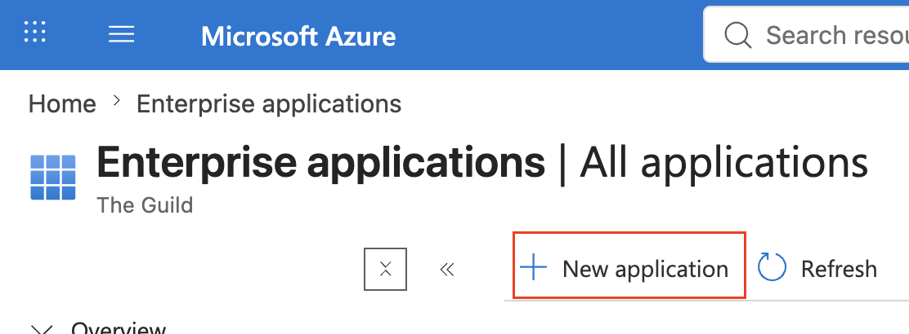

On the **Browse Microsoft Entra Gallery** page, select **Create your own application**.

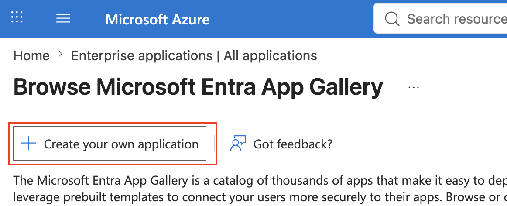

Enter a descriptive name, select the option to integrate an application not found in the gallery,
and create the application.

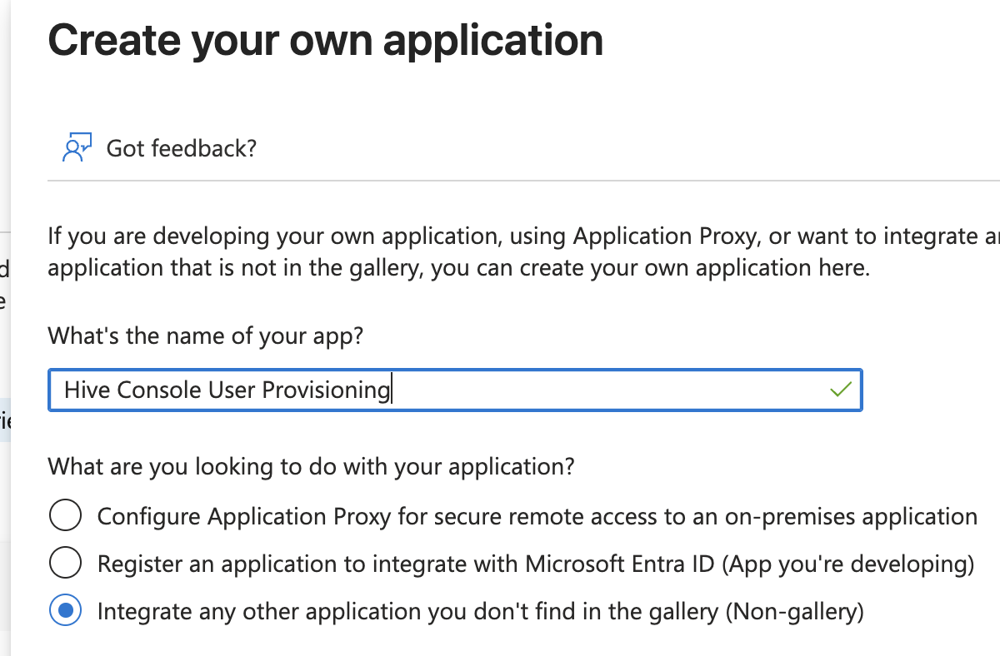

</Step>

<Step>
#### Configure the SCIM Connection

Open the application's provisioning settings, then open **Connectivity** and enter these values:

| Setting               | Value                                                      |
| --------------------- | ---------------------------------------------------------- |
| Authentication method | **Bearer authentication**                                  |
| Tenant URL            | `https://api.graphql-hive.com/scim/v2/`                    |
| Secret token          | An organization access token with `scim:provision` granted |

Test the connection, then save the configuration.

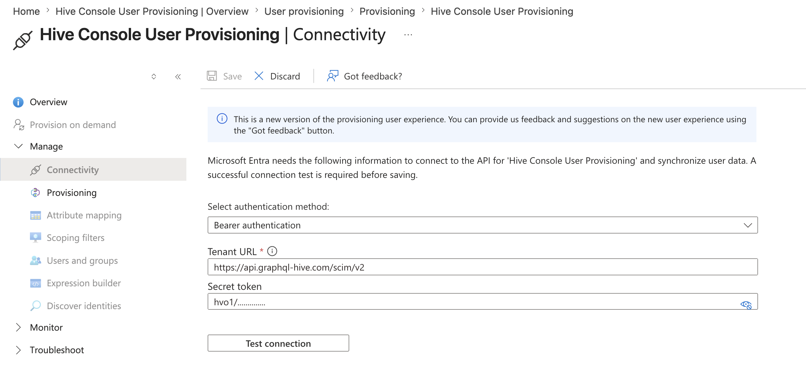

</Step>

<Step>
#### Configure User Attribute Mappings

Open **Attribute mapping**, select **Users**, and configure these mappings:

| Source attribute                                              | Target attribute               | Mapping type | Matching precedence |
| ------------------------------------------------------------- | ------------------------------ | ------------ | ------------------- |
| `userPrincipalName`                                           | `userName`                     | Direct       |                     |
| `userPrincipalName`                                           | `externalId`                   | Direct       | 1                   |
| `Switch([IsSoftDeleted], , "False", "True", "True", "False")` | `active`                       | Expression   |                     |
| `mail`                                                        | `emails[type eq "work"].value` | Direct       |                     |

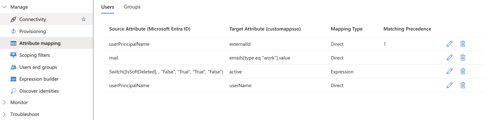

This configuration uses `userPrincipalName` as the SCIM `externalId`. Ensure that the OIDC claim
configured as Hive Console's **User ID Claim** returns the same value, as described in
[Match SCIM and OIDC User Identities](#match-scim-and-oidc-user-identities).

</Step>

<Step>
#### Configure Group Attribute Mappings

On the **Attribute mapping** page, select **Groups** and configure these mappings:

| Source attribute | Target attribute | Mapping type | Matching precedence |
| ---------------- | ---------------- | ------------ | ------------------- |
| `objectId`       | `externalId`     | Direct       | 1                   |
| `members`        | `members`        | Direct       |                     |
| `displayName`    | `displayName`    | Direct       | 2                   |

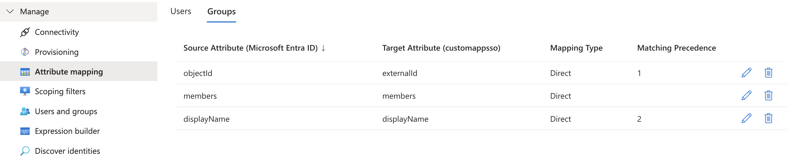

</Step>

<Step>
#### Configure the Provisioning Scope

Open **Scoping filters** and edit the scope settings. Enable user and group provisioning, then
select these object actions:

- For users, select **Create** and **Update**.
- For groups, select **Create**, **Update**, and **Delete**.

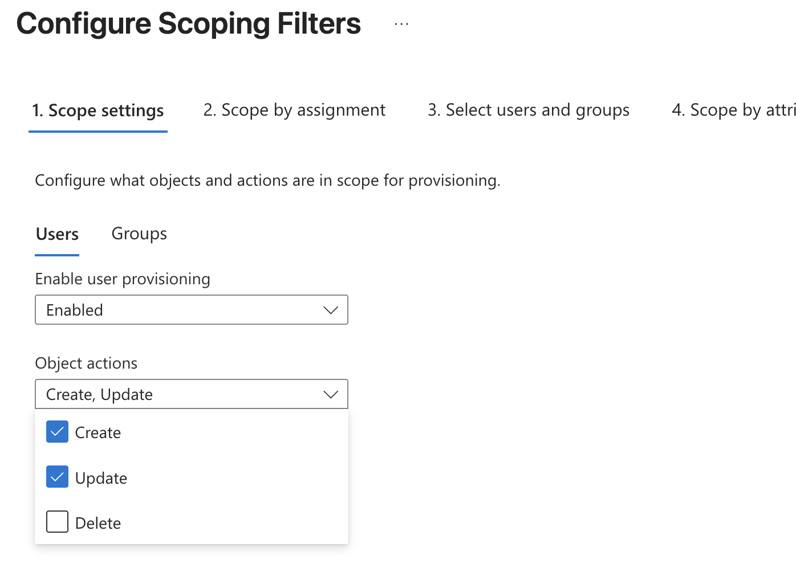

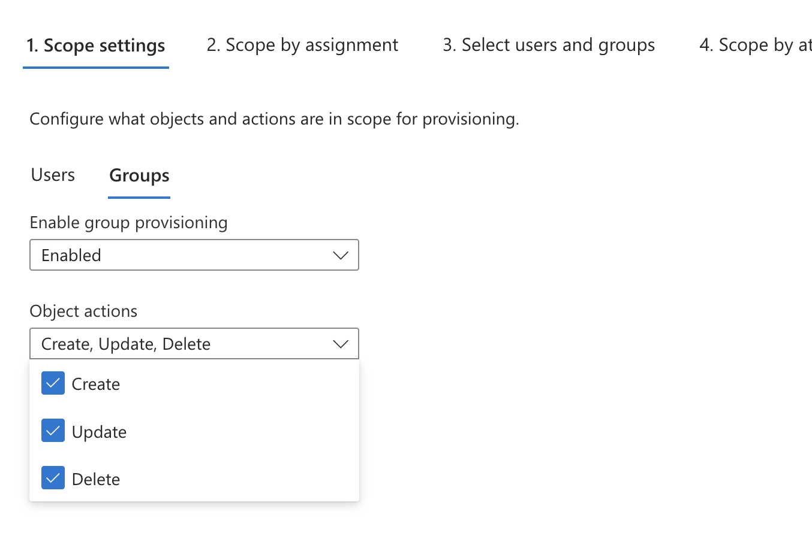

Save the configuration.

</Step>

<Step>
#### Assign Users and Groups

Assign the users and groups that you want to provision to the enterprise application, then enable
provisioning. The initial synchronization can take some time. When it finishes, the provisioned
users and groups appear in Hive Console.

Open **Members** > **Groups** in Hive Console and create the required role mappings for each
provisioned group.

</Step>
</Steps>

### Okta

<Steps>
<Step>
#### Create an App Integration

In the Okta Admin Console, open **Applications** > **Applications** and select **Create App
Integration**.

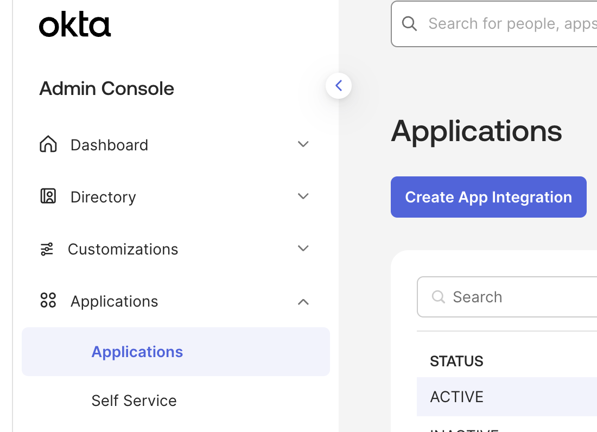

Select **SWA - Secure Web Authentication**, then select **Next**. This application provides the SCIM
integration; users continue to authenticate to Hive Console through your organization's OIDC
provider.

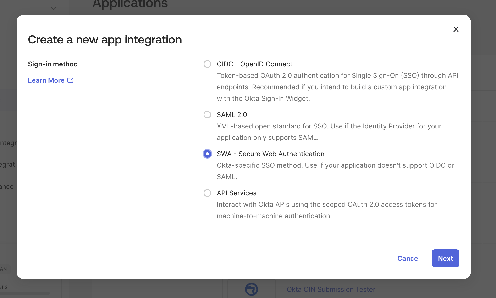

</Step>

<Step>
#### Configure the Application

Enter a descriptive app name and the Hive Console URL that users should open. You can use your
organization's OIDC sign-in URL so that selecting the application directs users to the correct
authentication flow.

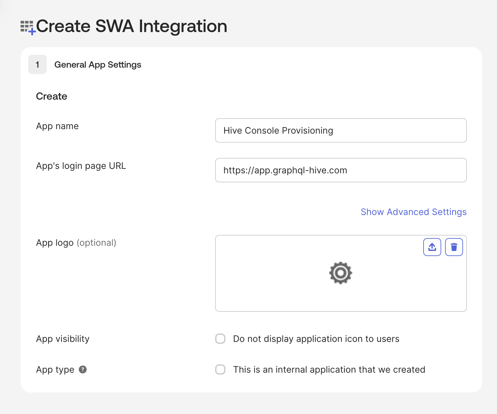

Under **How will your users sign in?**, use email as the application username and allow Okta to
update it when the application is created or updated. Then select **Finish**.

<Callout>
  This sign in configuration is never used in practise, as your users will sign
  in through SSO. The purpose of this application is sorely to provision users.
</Callout>

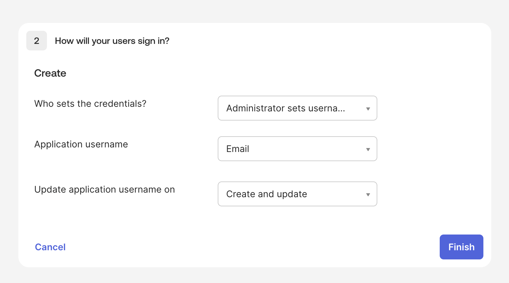

</Step>

<Step>
#### Enable SCIM Provisioning

On the application's **General** tab, edit the app settings. Under **Provisioning**, select **SCIM**,
then save the configuration. Okta adds a **Provisioning** tab to the application.

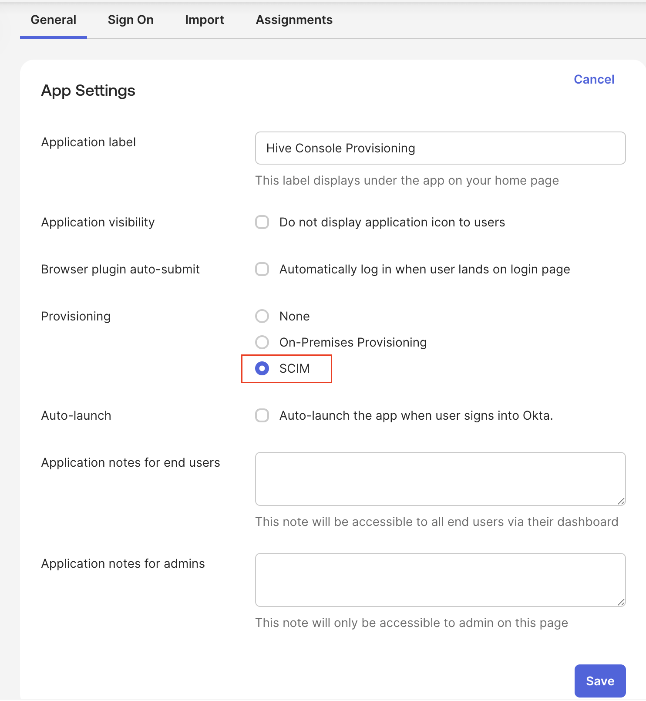

</Step>

<Step>
#### Configure the SCIM Connection

Open **Provisioning** > **Integration**, edit the SCIM connection, and enter these values:

| Setting                           | Value                                                      |
| --------------------------------- | ---------------------------------------------------------- |
| SCIM connector base URL           | `https://api.graphql-hive.com/scim/v2/`                    |
| Unique identifier field for users | `email`                                                    |
| Authentication Mode               | **HTTP Header**                                            |
| Authorization                     | An organization access token with `scim:provision` granted |

Select the supported provisioning actions shown in the screenshot: **Push New Users**, **Push Profile Updates** and **Push Groups**..

Select **Test Connector Configuration**. After the connection test succeeds, save the
configuration.

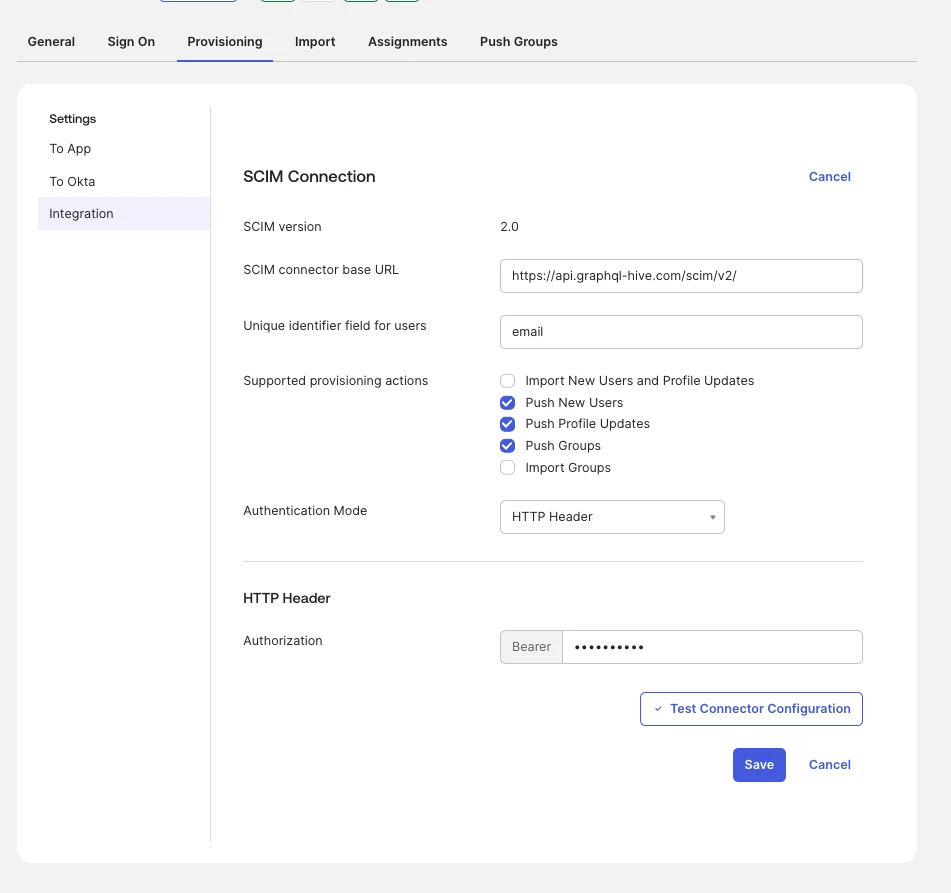

</Step>

<Step>
#### Enable User Provisioning Actions

Open **Provisioning** > **To App**, edit the settings, and enable these actions:

- **Create Users**
- **Update User Attributes**
- **Deactivate Users**

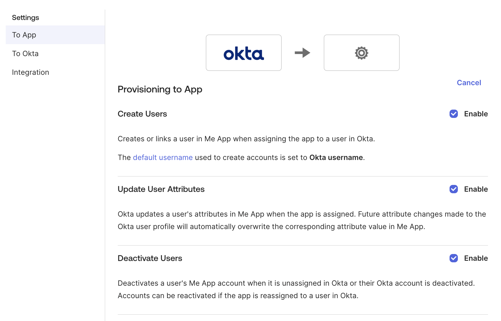

</Step>

<Step>
#### Verify User Attribute Mappings

On the **To App** page, verify that the user attributes include these mappings:

| SCIM attribute | Okta value or expression                                   |
| -------------- | ---------------------------------------------------------- |
| `userName`     | The application username configured on the **Sign On** tab |
| `givenName`    | `user.firstName`                                           |
| `familyName`   | `user.lastName`                                            |
| `email`        | `user.email`                                               |
| `emailType`    | `(user.email != null && user.email != "") ? "work" : ""`   |
| `displayName`  | `user.displayName`                                         |

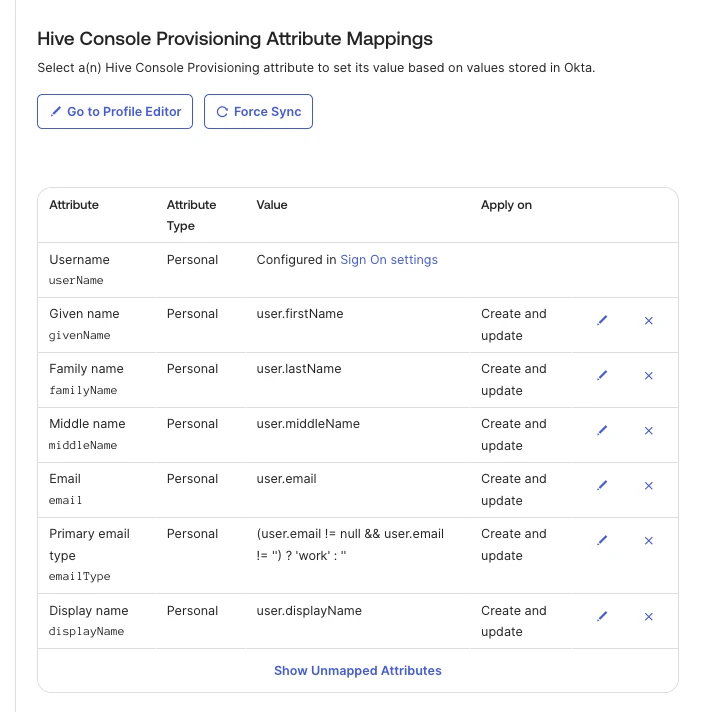

The `customExternalId` mapping sends the stable Okta user ID as the SCIM `externalId`. Ensure that
the OIDC claim configured as Hive Console's **User ID Claim** returns the same Okta user ID, as
described in [Match SCIM and OIDC User Identities](#match-scim-and-oidc-user-identities).

</Step>

<Step>
#### Assign Users and Push Groups

On the application's **Assignments** tab, assign the users and groups that should access Hive
Console. To synchronize group objects and memberships, also configure **Push Groups** for each group
that Hive Console should receive.

The initial synchronization can take some time. When it finishes, the provisioned users and groups
appear in Hive Console. Open **Members** > **Groups** and create the required role mappings for each
provisioned group.

</Step>
</Steps>

## Troubleshooting

### A User Cannot Be Provisioned

- Confirm that an OIDC provider is connected to the organization.
- Confirm that the user's email belongs to a domain registered and verified in the OIDC settings.
- Confirm that the SCIM request includes a valid email in `emails` or uses an email address as
  `userName`.
- Check for another provisioned user with the same `externalId` or `userName`.

### A Provisioned User Cannot Sign In

- Confirm that the user is active in the identity provider.
- Compare the user's SCIM `externalId` with the value returned by the configured OIDC **User ID
  Claim**. They must match exactly.
- Confirm that the user's email domain is verified and that they are signing in through the
  organization's OIDC sign-in URL.

### A User Can Sign In but Has No Access

- Confirm that the identity provider pushed the user's group memberships.
- Open **Members** > **Groups** and confirm that at least one of the user's groups has a role mapping.
- Check that the mapping includes the resources the user is trying to access.

### The Identity Provider Connection Test Fails

- Use the base URL ending in `/scim/v2/`.
- Confirm that the organization access token has not expired or been revoked.
- Confirm that the token has the **Provision users and groups** (`scim:provision`) permission.
- Create a new token if the original token value is no longer available.

## Identity Provider References

Refer to your identity provider's SCIM documentation for the location and naming of its provisioning
settings:

- [Okta SCIM 2.0 protocol reference](https://developer.okta.com/docs/api/openapi/okta-scim/guides/scim-20/)
- [Microsoft Entra ID provisioning with SCIM](https://learn.microsoft.com/en-us/entra/identity/app-provisioning/use-scim-to-provision-users-and-groups)
