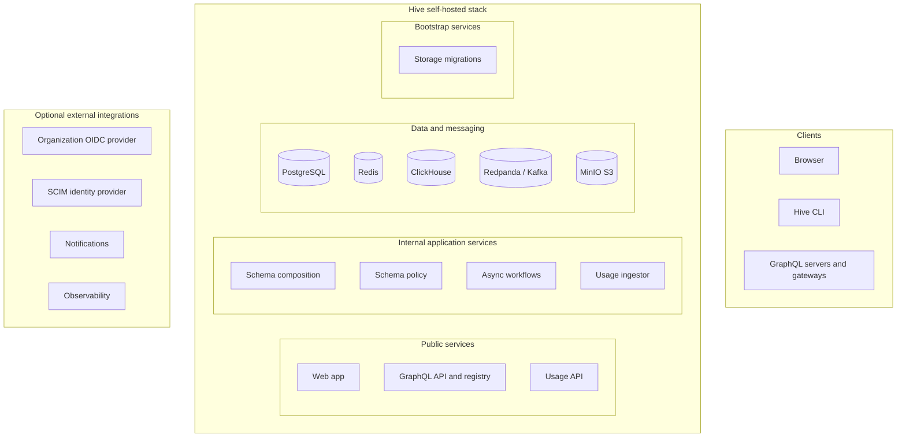

import { Callout } from "@hive/design-system/hive-components/callout";
import { Card, Cards } from "@hive/design-system/hive-components/card";

If you cannot use the hosted Hive Console service, you can run Hive Console on your own
infrastructure. The self-hosted version is free and open source. Its
[source code is available on GitHub](https://github.com/graphql-hive/console).

<Callout>
  Self-hosted Hive Console does not include every feature of the hosted service.
  The High-Availability CDN and billing integrations are not available.
  Self-hosted installations can use the fallback artifact distribution endpoints
  provided by the `server` service.
</Callout>

If you want to host a gateway rather than the schema registry, see the documentation for
[Hive Router](https://github.com/graphql-hive/router?tab=readme-ov-file#hive-router-rust) or
[Hive Gateway](/docs/gateway).

## Prerequisites

The quickest way to evaluate Hive Console is with the provided community Docker Compose stack. You
need:

- Docker Engine or Docker Desktop
- Docker Compose v2, invoked as `docker compose`
- OpenSSL for generating secrets
- Internet access to the [Hive Console images on GHCR](https://github.com/orgs/graphql-hive/packages)
- Persistent disk space for the databases, broker, cache, and object storage

## Architecture



The community Compose stack starts the following infrastructure:

- **PostgreSQL 16** for users, organizations, projects, targets, schemas, checks, and configuration
- **ClickHouse** for GraphQL operation usage data
- **Redis** for caching and short-lived data
- **Redpanda** as a Kafka-compatible broker for usage reports
- **MinIO** as S3-compatible storage for schema artifacts and audit logs
- **Caddy** as a reverse proxy for MinIO

It also starts these Hive services:

- `app`: the Hive Console web application
- `server`: the GraphQL API, authentication, and fallback artifact distribution endpoints
- `schema`: schema validation, composition, and artifact generation
- `policy`: schema policy validation
- `workflows`: asynchronous work, including emails, webhooks, and alerts
- `usage`: receives operation usage reports and publishes them to Redpanda
- `usage-ingestor`: processes usage reports and stores them in ClickHouse
- `migrations`: applies PostgreSQL and ClickHouse migrations before `server` starts
- `s3_provision_buckets`: creates the required MinIO buckets

The service dependencies and currently bundled image versions are defined in
[`docker-compose.community.yml`](https://github.com/graphql-hive/console/blob/main/docker/docker-compose.community.yml).

<Callout type="warning">
  The bundled stack runs a single instance of each dependency and stores its
  data on the local filesystem. It is intended as an evaluation environment and
  as a starting point for a custom deployment, not as a production-ready
  architecture.
</Callout>

## Run Hive Console Locally

### 1. Choose a Release

Use the Compose file and Hive images from the same release. Available versions are listed on the
[GitHub Releases page](https://github.com/graphql-hive/console/releases) with the `hive@` prefix.

The latest release at the time this guide was updated is `hive@11.11.1`:

```bash
export HIVE_VERSION="11.11.1"

curl -fL \
  -o docker-compose.community.yml \
  "https://raw.githubusercontent.com/graphql-hive/console/hive@${HIVE_VERSION}/docker/docker-compose.community.yml"

export DOCKER_REGISTRY="ghcr.io/graphql-hive/"
export DOCKER_TAG=":${HIVE_VERSION}"
```

The trailing slash in `DOCKER_REGISTRY` and the leading colon in `DOCKER_TAG` are required. Pinning
both the Compose file and images prevents an upgrade from unexpectedly changing only part of the
stack.

### 2. Generate Local Secrets

Run the following commands in the same shell:

```bash
export HIVE_APP_BASE_URL="http://localhost:8080"

export POSTGRES_DB="registry"
export POSTGRES_USER="postgres"
export POSTGRES_PASSWORD="$(openssl rand -hex 32)"

export CLICKHOUSE_USER="clickhouse"
export CLICKHOUSE_PASSWORD="$(openssl rand -hex 32)"

export REDIS_PASSWORD="$(openssl rand -hex 32)"

export MINIO_ROOT_USER="minioadmin"
export MINIO_ROOT_PASSWORD="$(openssl rand -hex 32)"

export HIVE_ENCRYPTION_SECRET="$(openssl rand -hex 16)"
export CDN_AUTH_PRIVATE_KEY="$(openssl rand -hex 32)"
export SUPERTOKENS_REFRESH_TOKEN_KEY="1000:$(openssl rand -hex 64):$(openssl rand -hex 64)"
```

Hive's native authentication implementation also requires an RSA access-token key:

```bash
KEY_NAME="$(openssl rand -hex 16)"
PRIVATE_KEY_PEM="$(openssl genpkey -algorithm RSA -pkeyopt rsa_keygen_bits:2048)"
PUBLIC_KEY_PEM="$(printf '%s\n' "$PRIVATE_KEY_PEM" | openssl rsa -pubout)"

PRIVATE_KEY_DATA="$(
  printf '%s\n' "$PRIVATE_KEY_PEM" |
    awk 'NF {if (NR != 1 && $0 !~ /-----END/) print}' |
    tr -d '\n'
)"

PUBLIC_KEY_DATA="$(
  printf '%s\n' "$PUBLIC_KEY_PEM" |
    awk 'NF {if (NR != 1 && $0 !~ /-----END/) print}' |
    tr -d '\n'
)"

export SUPERTOKENS_ACCESS_TOKEN_KEY="${KEY_NAME}|${PUBLIC_KEY_DATA}|${PRIVATE_KEY_DATA}"
```

The `SUPERTOKENS_*` variable names are retained for compatibility; the current stack does not run a
separate SuperTokens service.

<Callout type="info">
  Save the generated values in a protected secret store or in a local file that
  you can source before operating the stack. A Docker Compose `.env` file does
  not execute command substitutions such as `$(openssl rand -hex 32)`, so store
  the resolved values rather than these commands. Do not commit secrets to
  source control.
</Callout>

### 3. Validate and Start the Stack

Validate the resolved configuration before pulling images:

```bash
docker compose -f docker-compose.community.yml config --quiet
docker compose -f docker-compose.community.yml pull
docker compose -f docker-compose.community.yml up -d --wait
docker compose -f docker-compose.community.yml ps
```

The one-shot `migrations` service applies PostgreSQL and ClickHouse migrations automatically. The
`server` service starts only after migrations and MinIO bucket provisioning complete successfully.
If startup fails, inspect those services first:

```bash
docker compose -f docker-compose.community.yml logs migrations s3_provision_buckets
```

The Compose file creates `.hive/` next to itself and bind-mounts the persistent data into that
directory:

```text
.hive/postgres
.hive/clickhouse/db
.hive/broker/db
.hive/redis/db
.hive/minio/db
```

<Callout type="warning">
  Deleting `.hive/` deletes the installation's PostgreSQL, ClickHouse, Redpanda,
  Redis, and MinIO data. Back up this directory before destructive local
  maintenance.
</Callout>

### 4. Open Hive Console

Open [http://localhost:8080](http://localhost:8080), create an account, then create an organization,
project, and target. Generate a registry token with read and write access from the target's settings.

The local endpoints are:

| URL or port                              | Purpose                                      |
| ---------------------------------------- | -------------------------------------------- |
| `http://localhost:8080`                  | Hive Console web application                 |
| `http://localhost:8081`                  | Usage-reporting API                          |
| `http://localhost:8082/graphql`          | GraphQL API and subscriptions                |
| `http://localhost:8082/artifacts/v1/...` | Fallback artifact distribution endpoints     |
| `http://localhost:8083`                  | Caddy proxy to the MinIO S3 API              |
| `http://localhost:9000`                  | Direct MinIO S3 API                          |
| `http://localhost:9001`                  | MinIO administration console                 |
| `localhost:9092`                         | Redpanda Kafka listener                      |
| `http://localhost:9644`                  | Redpanda metrics and administration endpoint |

### 5. Publish a Schema

Install the Hive CLI:

<Cards>
  <Card
    href="/docs/api-reference/cli#binary"
    title="Install Hive CLI as a binary"
  />
  <Card
    href="/docs/api-reference/cli#nodejs"
    title="Install Hive CLI from NPM"
  />
</Cards>

Create a schema file:

```graphql title="schema.graphql"
type Query {
  hello: String!
}
```

Configure the CLI to use your local instance and replace `<registry-token>` with the token generated
in Hive Console:

```json title="hive.json"
{
  "registry": {
    "endpoint": "http://localhost:8082/graphql",
    "accessToken": "<registry-token>"
  }
}
```

Add `hive.json` to `.gitignore`, then publish the schema:

```bash
hive schema:publish ./schema.graphql
```

The published schema appears in the target's **Schema** tab.

### 6. Stop the Stack

Stop the containers without removing the bind-mounted data:

```bash
docker compose -f docker-compose.community.yml down
```

## Optional Configuration

### Listen Address

To change which interface Hive services bind to, set `SERVER_HOST` (default `::`) and, if needed,
`SERVER_HOST_IPV6_ONLY=1` to disable IPv4 fallback for the IPv6 wildcard host.

For the community Compose stack, keep `SERVER_HOST` as `::` or `0.0.0.0`. Loopback values such as
`127.0.0.1`, `::1`, or `localhost` can make published ports and service-to-service communication
unreachable. `SERVER_HOST_IPV6_ONLY=1` cannot be combined with an IPv4 literal such as `0.0.0.0`.

See the [Fastify listen reference](https://fastify.dev/docs/latest/Reference/Server/#listentextresolver)
for host resolution details.

### Data Retention

The migration service accepts optional ClickHouse TTL settings:

```bash
export CLICKHOUSE_TTL_TABLES="1 YEAR"
export CLICKHOUSE_TTL_DAILY_MV_TABLES="1 YEAR"
export CLICKHOUSE_TTL_HOURLY_MV_TABLES="30 DAY"
export CLICKHOUSE_TTL_MINUTELY_MV_TABLES="24 HOUR"
```

Numeric day counts are also accepted. When configured, migrations apply the retention changes and
update each organization's retention limit to the longest configured period.

## Production Considerations

The community Compose file is configured for `localhost`. Changing only `HIVE_APP_BASE_URL` is not
enough for a remote deployment because the public GraphQL, subscription, and artifact URLs in the
file also default to `localhost`. A remote deployment needs overrides for all public URLs, an HTTPS
reverse proxy, and routing for the web application, GraphQL and WebSocket API, artifact endpoints,
and usage API.

Before using Hive Console in production:

- Replace the single-node PostgreSQL, ClickHouse, Redpanda, Redis, and MinIO containers with managed
  services or properly operated equivalents.
- Configure backups and test restoration procedures.
- Restrict infrastructure ports. The bundled MinIO and Redpanda ports must not be exposed directly
  to the public internet.
- Configure `workflows` with an SMTP or Postmark email provider instead of the default `sendmail`.
- Configure monitoring, metrics, tracing, and error reporting. The community stack does not include
  Prometheus, Grafana, an OpenTelemetry Collector, or Sentry.
- Preserve all encryption and authentication secrets during upgrades.
- Read every intervening entry in the [self-hosting changelog](/docs/schema-registry/self-hosting/changelog),
  back up the installation, and fetch the Compose file from the target release before upgrading.

Service-specific configuration is documented in the source repository:

- [`app`](https://github.com/graphql-hive/console/tree/main/packages/web/app/README.md)
- [`server`](https://github.com/graphql-hive/console/tree/main/packages/services/server/README.md)
- [`schema`](https://github.com/graphql-hive/console/tree/main/packages/services/schema/README.md)
- [`policy`](https://github.com/graphql-hive/console/tree/main/packages/services/policy/README.md)
- [`workflows`](https://github.com/graphql-hive/console/tree/main/packages/services/workflows/README.md)
- [`usage`](https://github.com/graphql-hive/console/tree/main/packages/services/usage/README.md)
- [`usage-ingestor`](https://github.com/graphql-hive/console/tree/main/packages/services/usage-ingestor/README.md)
- [`storage` and migrations](https://github.com/graphql-hive/console/tree/main/packages/services/storage/README.md)
