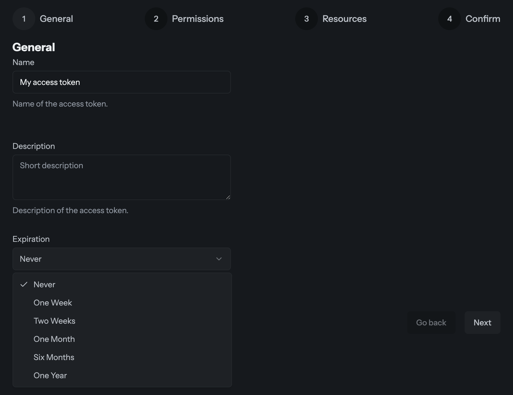

As part of our ongoing commitment to security best practices, you can now define an expiration date for all new access tokens, including Organization, Project, and Personal Access Tokens (PATs).

## Why it matters

Previously, access tokens in Hive were persistent until manually revoked. While convenient, long-lived tokens increase the risk of unauthorized access if a secret is accidentally leaked or improperly stored. Automatic expiration minimizes risk by ensuring that tokens have a limited lifespan.

## Getting Started

When creating a new token in your settings, you will now see an Expiration step in the wizard. Simply select your desired timeframe, and Hive will handle the rest. You may choose between **7 days**, **14 days**, **a month**, **6 months**, or **a year**.

Existing tokens will remain active and will not expire to avoid breaking current workflows. But if you need to do a token rotation, now is the perfect time to try out our new feature!

[You can learn more about access tokens through our documentation](/docs/schema-registry/management/access-tokens).
