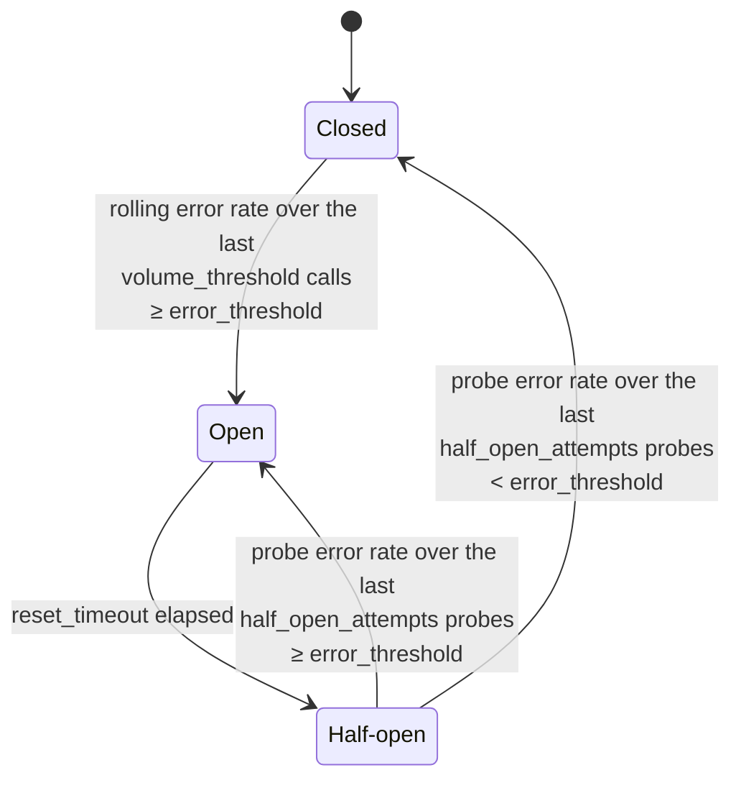

import { Callout } from "@hive/design-system/hive-components/callout";

[Hive Router](/docs/router) now includes a built-in
[**circuit breaker**](/docs/router/guides/performance-tuning#circuit-breaker) for subgraph execution.
When a subgraph starts failing, the breaker stops sending requests to it for a configurable period,
so the router fails fast for clients and gives the subgraph time to recover instead of piling on
more traffic.

## Why a circuit breaker?

Without one, a struggling subgraph keeps absorbing traffic until each request burns its full
`request_timeout`. The router accumulates in-flight calls, latency spikes, and the unhealthy
subgraph never gets a chance to catch up.

With the breaker enabled, once the rolling error rate of a subgraph crosses a threshold, the
router short-circuits subsequent calls with a `SUBGRAPH_CIRCUIT_BREAKER_REJECTED` error - no
network call, no timeout wait, no extra pressure on the upstream.

## How it works

The breaker is a classic three-state machine, evaluated per subgraph on **count-based rolling
samples** rather than time windows:

| State         | Behaviour                                                                                                                                                                                                                         |
| ------------- | --------------------------------------------------------------------------------------------------------------------------------------------------------------------------------------------------------------------------------- |
| **Closed**    | Normal operation. Outcomes are recorded in a rolling sample of the last `volume_threshold` calls.                                                                                                                                 |
| **Open**      | Every request is rejected immediately with `SUBGRAPH_CIRCUIT_BREAKER_REJECTED`. No traffic reaches the subgraph.                                                                                                                  |
| **Half-open** | After `reset_timeout`, probe requests are allowed through and recorded in a rolling sample of the last `half_open_attempts` outcomes. Once that sample is full, the next probe decides whether the breaker re-closes or re-opens. |



## What counts as a failure

The breaker only reacts to outcomes that indicate the **subgraph itself is unhealthy**:

- **Network and transport errors** - DNS failures, connection refused, TLS errors, broken
  connections, transport-level timeouts.
- **Invalid or empty responses** - non-JSON or empty bodies, anything the executor can't turn
  into a usable response.
- **Per-subgraph `request_timeout` expirations** - chronic timeouts eventually trip the breaker
  instead of being paid on every call.
- **HTTP status codes in `error_status_codes`** - `500`, `502`, `503`, `504` by default.

## Configuration

Circuit breaker settings live under `traffic_shaping`, and can be applied globally to all
subgraphs or selectively overridden per subgraph:

```yaml title="router.config.yaml"
traffic_shaping:
  all:
    circuit_breaker:
      enabled: true
      error_threshold: 50% # open when ≥ 50% of requests fail
      volume_threshold: 5 # evaluate after at least 5 requests
      reset_timeout: 30s # retry after 30s
      half_open_attempts: 10 # probe sample size in half-open
      error_status_codes: [500, 502, 503, 504]
  subgraphs:
    accounts:
      circuit_breaker:
        error_threshold: 70% # accounts is more tolerant
        error_status_codes: [503, "5xx"] # fully replaces the global list
```

`error_status_codes` accepts exact codes and wildcards like `"5xx"` or `"50x"`, so you can opt
into broader matching where it makes sense. Per-subgraph overrides are merged field-by-field with
the global config; the only exception is `error_status_codes`, which fully replaces the global
list when set.

## Subscriptions

Subscriptions participate in the breaker too, with two important rules:

- **Establishment errors count.** A failed subscription handshake is recorded just like a query
  failure.
- **Mid-stream errors don't.** Once a subscription is up, errors on the long-lived stream do not
  flip the breaker state - so a chatty subscription can't poison the breaker for unrelated query
  traffic.

When the breaker is open, new subscription attempts are short-circuited with
`SUBGRAPH_CIRCUIT_BREAKER_REJECTED` surfaced through the SSE stream body, so clients can react.

## Observability

The breaker is observable end-to-end via OpenTelemetry. Every metric and span carries a
`subgraph.name` attribute so you can group and filter per subgraph in your metrics backend.

| Metric                                                | Type    | Description                                                                                     |
| ----------------------------------------------------- | ------- | ----------------------------------------------------------------------------------------------- |
| `hive.router.circuit_breaker.short_circuits_total`    | counter | Requests rejected by the breaker without reaching the subgraph.                                 |
| `hive.router.circuit_breaker.failures_total`          | counter | Subgraph responses or transport errors counted as a failure.                                    |
| `hive.router.circuit_breaker.state`                   | gauge   | Current state per subgraph: `0` = closed/half-open, `1` = open.                                 |
| `hive.router.circuit_breaker.state_transitions_total` | counter | State transitions, with `circuit_breaker.from_state` and `circuit_breaker.to_state` attributes. |

On the corresponding `graphql.subgraph.operation` span, rejected calls record
`hive.graphql.error.count`, `hive.graphql.error.codes` containing
`SUBGRAPH_CIRCUIT_BREAKER_REJECTED`, and a `graphql.error` span event - so failed subgraph hops
show up as proper errors in your tracing UI instead of looking superficially "ok".

<Callout type="info">
  The circuit breaker is **disabled by default**. It only becomes active once a
  `circuit_breaker` block is configured with `enabled: true`. Once that block is
  present, any omitted fields use the documented defaults.
</Callout>

---

- [Circuit Breaker guide](/docs/router/guides/performance-tuning#circuit-breaker)
- [`circuit_breaker` configuration reference](/docs/router/configuration/traffic_shaping#circuit_breaker)
