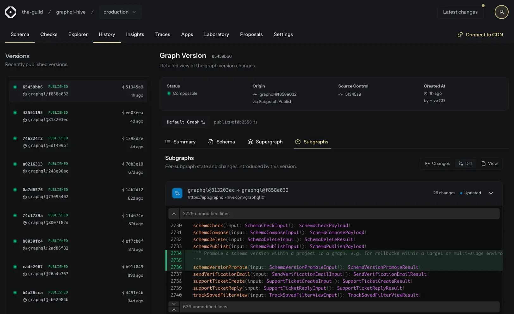
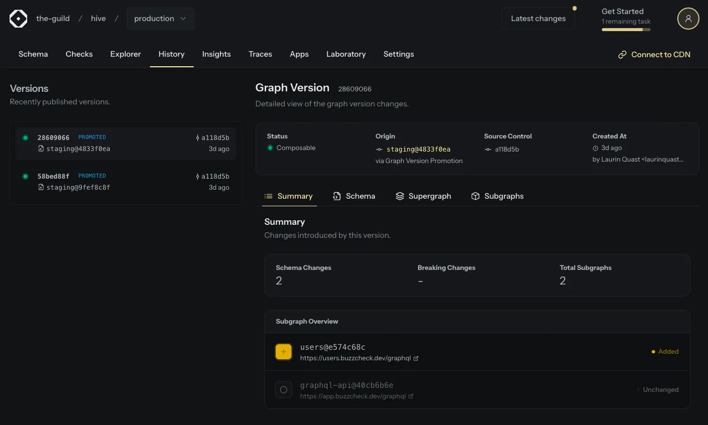
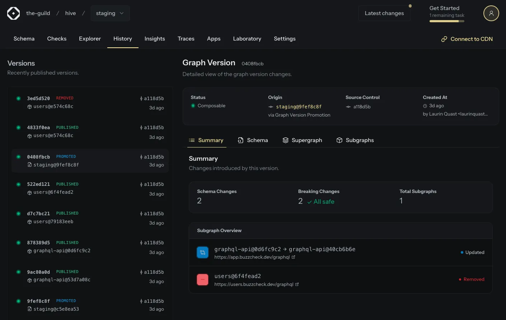

Hive Console now supports schema version promotions and rollbacks through a new CLI command, making it easier to manage multi-environment workflows and recover from problematic deployments.



## Supergraph Promotions

You can now promote a composed schema version from one target environment to another without republishing subgraphs.



This enables more flexible workflows across staging, preview, and production environments while ensuring schema consistency between targets.

```bash
hive schema:promote \
  --from the-guild/hive/staging \
  --to the-guild/hive/production
```

When promoting a schema version, Hive Console creates a new schema version in the destination target using the exact same composed supergraph from the source target. The Hive CDN state is then updated to reflect the promotion automatically.

## Supergraph Rollbacks

The same promotion mechanism can also be used within a single target to roll back to a previous schema version.



This allows platform teams to quickly recover from issues introduced by newly published subgraphs without needing to remove or republish schemas.

```bash
hive schema:promote \
  --version 9e93a510-6ae7-4361-92d2-bd2370c3b8a8 \
  --to the-guild/hive/production
```

The schema version ID can be retrieved from the Console dashboard.

## Improved Subgraph Changelogs

Promotions and rollbacks often involve multiple subgraph changes at once. To make these transitions easier to understand, we introduced an improved schema version view with detailed subgraph-level changelogs.

You can now quickly inspect how individual subgraphs changed between schema versions during promotions and rollbacks.

## Supergraph Changelogs

New schema versions now also include a detailed changelog for the changes on the supergraph. Previously, only a changelog for the public facing API schema existed.

## Conclusion

Schema promotions and rollbacks have been one of the most requested Hive features, and we’re excited to finally ship them.

These new workflows give platform teams more confidence when deploying changes, managing environments, and responding to production incidents.

We’d love to hear your feedback.

---

- [Using Schema Promotions](/docs/schema-registry#promote-and-rollback-schema-versions)
- [Schema Promotion CLI Reference](/docs/api-reference/cli#promote-a-schema)
