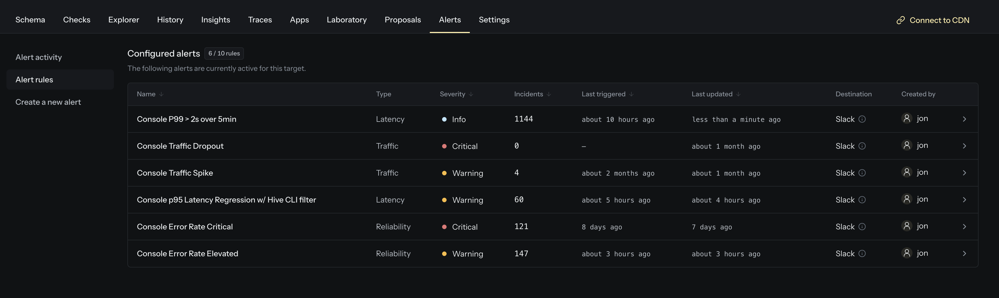
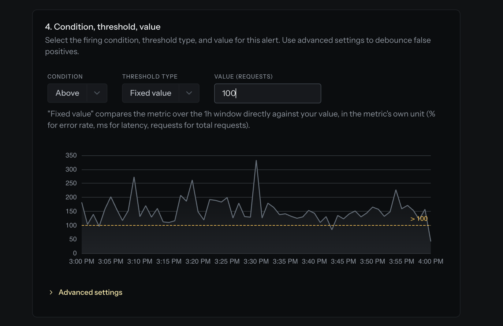
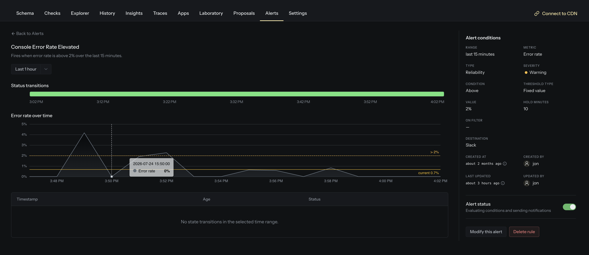

Hive already tells you _what_ your GraphQL API is doing: every operation, its error rate, and its
latency, all in [Usage Insights](/docs/schema-registry/usage-reporting). Today we're adding the piece
that tells you the moment something goes wrong: **Metric Alerts**.

Metric Alerts continuously watch your GraphQL API's live operational metrics and notify you (in Slack, MS
Teams, or a webhook) as soon as they cross a threshold you define. No more finding out about a
latency regression or an error spike from your users first.

## Alert on the metrics that matter

Create a rule in a few clicks and point it at any of your key metrics:

- **Total requests**: catch traffic drops (a deployment that broke a client) or unexpected surges.
- **Error rate**: know immediately when errors climb above an acceptable level.
- **Latency**: alert on p75, p90, p95, or p99 latency to stay ahead of performance regressions.

Each rule watches its metric over a rolling **range**, anywhere from 1 minute up to 7 days, and
fires when your condition is met.

## Fixed thresholds or relative change

Thresholds come in two flavors:

- **Fixed value**: _"error rate above 5%"_ or _"p95 latency above 500ms"_.
- **% change vs. previous**: compare the current window to the one before it and fire on a swing,
  like _"traffic dropped 50% compared to the previous hour"_.

Add a **hold** period so brief spikes that clear on their own don't page you, tag each rule with an
**Info / Warning / Critical** severity, and, with **saved filters**, scope an alert to a specific
set of operations or clients.

## Notifications only when it counts

Every rule moves through a clear lifecycle (**Normal → Pending → Firing → Recovering**), and Hive
only notifies you on the transitions that matter: when an alert **starts firing** and when it
**recovers**. Firing episodes are grouped into **incidents**, and the **Alert activity** feed gives
you a full timeline of every state change across the API.

Metric Alerts reuse the Slack, MS Teams, and webhook channels you've already set up, and a single
rule can notify several destinations at once. Prefer to watch before you wire up paging? Leave the
destinations empty and the rule still tracks its state in the UI, a handy test mode.

## Get started

Open any target, head to the **Alerts** section, and create your first rule. For the full details
(metrics, conditions, the alert lifecycle, the webhook payload, and limits) see the
[Metric Alerts documentation](/docs/schema-registry/metric-alerts).
