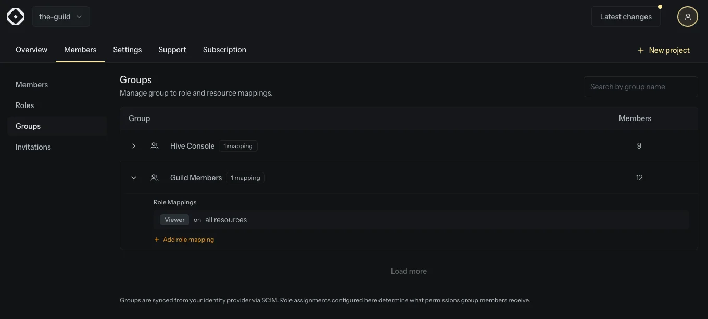
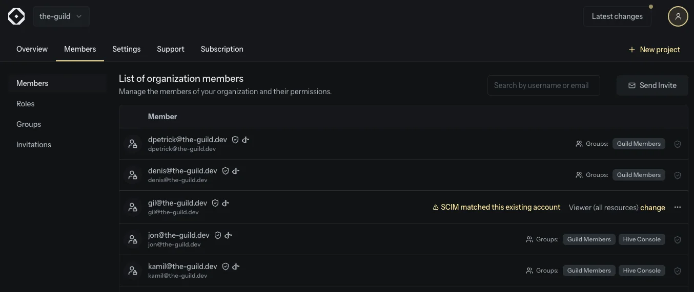
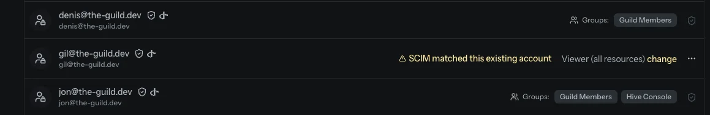

Organizations using OpenID Connect (OIDC) can now automate user and group lifecycle management in
Hive Console with **SCIM 2.0 provisioning**.

Connect an identity provider such as Okta or Microsoft Entra ID to provision users, synchronize
groups and memberships, and deactivate users when they should no longer have access. Your identity
provider remains the source of truth, reducing manual account administration and keeping Hive access
aligned with your organization's directory.

## Assign Access Through Groups

Synchronized groups can have one or more **role mappings** in Hive Console. Each mapping combines a
Hive role with either every organization resource or a specific selection of projects, targets,
services, and app deployments.

A user's permissions are combined from all of their group mappings. This makes it possible to grant
broad read access through one group and more focused permissions, such as schema check approval for
selected services, through another.

## Keep the User Lifecycle in Your Identity Provider

SCIM provisioning supports creating, updating, disabling, and re-enabling users, as well as
synchronizing groups and their memberships. Changes made in your identity provider flow into Hive
Console, including permission changes caused by updated group memberships.

## Safely Adopt Existing Accounts

When SCIM matches an existing organization member, Hive Console does not replace their access
immediately. Instead, it records a provisioning conflict and keeps the member's existing role and
status effective until an organization administrator confirms that SCIM should manage the account.

The **User Provisioning** settings show how many accounts need confirmation and link to a filtered
view of the **Members** page. Administrators can review each member's pending SCIM status and group
memberships before allowing SCIM management. After confirmation, the identity provider controls the
member's active status and their access is derived from SCIM group role mappings.

After validating your setup, you can configure your organization's OIDC provider to require SCIM
provisioning. When enabled, only active SCIM-provisioned users can access the organization through
OIDC, while organization administrators retain access as a safeguard.

## Get Started

Create an organization access token with the **Provision users and groups** permission, connect your
identity provider to Hive's SCIM endpoint, resolve any existing-account conflicts, and configure role
mappings for your synchronized groups.

---

- [SCIM provisioning documentation](/docs/schema-registry/management/scim-provisioning)
