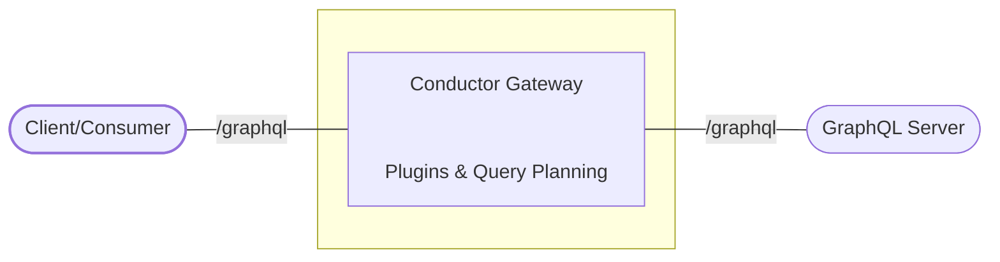
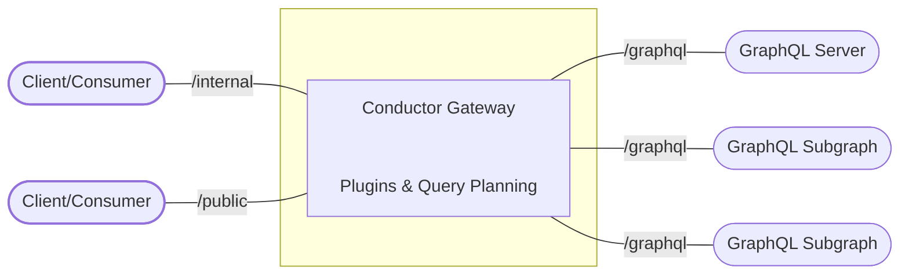

After months of intense development, we're thrilled to announce the public launch of
[Conductor](https://the-guild.dev/graphql/gateway)!

## For the Community, Embracing All GraphQL Projects

Conductor has been crafted with a clear vision: to empower developers with their advanced GraphQL
needs:

- **Built with Rust**: Focused on performance and reliability, leveraging Rust's safety and
  concurrency capabilities.
- **Exceptional Developer Experience**: We understand that developer experience is crucial. That's
  why Conductor is designed to be intuitive, straightforward, and hassle-free, allowing you to focus
  on what matters most - building great and performant GraphQL applications.
- **Real open-source**: Conductor is designed to be accessible to everyone, it is open-source (MIT)
  and free - and will always be. You can self-host it, and you have full access to all the plugins
  typically reserved for enterprise plans in other solutions. This includes rate limiting, caching,
  authentication, persisted queries, open telemetry, and federation capabilities.
- **Supporting Diverse GraphQL Architectures**: Whether you're working with federated, or standalone
  APIs, Conductor is versatile enough to handle it all. Our goal is to provide a gateway that adapts
  to all graphql projects' needs.
- **Community-Driven Development**: As a community-focused organization, The Guild is constantly
  seeking feedback and contributions. Our roadmap is public! Your insights and suggestions will
  shape the future of Conductor, making it a tool by the community, for the community.

## Unpacking Conductor's Feature Set

Conductor isn't just another tool; it's a comprehensive solution for managing your GraphQL
architecture. Here's a glimpse of what it offers:

- **GraphQL Spec Compliance**: Fully adheres to the GraphQL specification, ensuring reliable and
  standard-compliant behavior.
- **Advanced Gateway Capabilities**: Serves as a dynamic very thin layer with minimal overhead
  between GraphQL consumers and servers, enhancing GraphQL runtime with robust plugins for caching,
  authentication, rate limiting, CORS, persisted queries (trusted documents), and OpenTelemetry.
- **Distributed Schemas with Experimental Federation Support**: Conductor integrates seamlessly with
  Apollo Federation, managing all aspects from query planning to response merging. However, it's
  important to note that the federation query planner in Conductor is still in its experimental
  phase. Users may encounter certain limitations or issues, and we are actively working on it.
- **Flexible and Scalable**: Whether you're working on a small project or a large enterprise
  application, Conductor scales with your needs. Its architecture is modular, and can fully
  efficiently utlize your hardware resources.
- **Extensible Endpoint Configuration**: Allows exposure of multiple GraphQL endpoints from a single
  instance with configurable plugins per endpoint.
- **VRL (Vector Routing Language) Support**: Offers limitless possibilities for custom logic,
  plugins, and response transformers.
- **Comprehensive Security & Monitoring**: Built-in support for various authentication methods,
  authorization, rate limiting, and OpenTelemetry for monitoring.
- **Flexible runtime**: Conductor runs either as a binary (and dockerized), and can also run on the
  Edge (CloudFlare Worker).

## How Does It Work?

Conductor acts as a gateway/proxy between your consumers and your GraphQL server. It intercepts the
GraphQL requests and responses and applies the configured plugins to them. The plugins can be used
to modify the request and response, or to add new features to your GraphQL server.

A simple diagram of how Conductor works is shown below:



The following diagram is more detailed and shows how Conductor can support multiple GraphQL servers,
and to expose multiple GraphQL endpoints:



By allowing multiple GraphQL servers to be exposed through a single GraphQL endpoint, Conductor can
be used to implement Federation and other distributed GraphQL patterns.

In addition, Conductor allow you to expose multiple GraphQL endpoints, each with a different set of
plugins. This allows you to expose the same GraphQL server with different workflows, and have
fine-grained control over your GraphQL traffic.

## Benchmarking and Performance

In the development of Conductor, a key focus has been on performance. We've actively engaged in
benchmarking Conductor against other GraphQL gateways to ensure it not only meets but exceeds
industry standards.

- **Transparent Benchmarking Process**: To provide a clear and objective comparison, we're
  participating in the
  [GraphQL Gateways Benchmark](https://github.com/the-guild-org/gateways-benchmark) tests. This
  initiative offers a transparent and consistent benchmarking process, allowing for a fair
  comparison across different gateways.
- **Follow Our Progress**: For detailed insights and updates on how Conductor stacks up in various
  scenarios, we invite you to follow the ongoing benchmarking process. Keep an eye on the GraphQL
  Gateways Benchmark repository, particularly the
  [pull request that adds Conductor](https://github.com/the-guild-org/gateways-benchmark/pull/254).
  This repository provides a comprehensive and accurate benchmark testing across different tools,
  ensuring a level playing field and transparent results.
- **Stay Updated on Our Progress**: For detailed insights and live updates on how Conductor is
  performing in various benchmark scenarios, follow the ongoing process at our GitHub repository,
  specifically the
  [pull request that adds Conductor](https://github.com/the-guild-org/gateways-benchmark/pull/254).
  While we are still refining the numbers, the preliminary results are promising, and we're excited
  to share them with you soon.

About GraphQL Gateways Benchmark Repository, you can learn more about it in
[this blog post](https://the-guild.dev/blog/state-of-graphql-gateways-in-2023)

## Use It Today!

Conductor's configuration can be defined in both YAML and JSON formats. The config file contains
several key sections:

- **Server**: Configure the HTTP server settings, including port and host.
- **Logger**: Set up logging levels for Conductor's operations.
- **Sources**: Define the GraphQL sources/endpoints that Conductor will interact with. We support
  both monolith GraphQL and Federation sources.
- **Endpoints**: Specify the GraphQL endpoints Conductor will expose, including path, source, and
  plugins.
- **Plugins**: List global plugins that apply to all endpoints, including CORS, authentication, and
  more.

### Configuration File Example

```yaml
server:
  port: 9000

logger:
  level: info

sources:
  - type: graphql
    id: my-source
    config:
      endpoint: https://my-source.com/graphql

endpoints:
  - path: /graphql
    from: my-source
    plugins:
      - type: graphiql

plugins:
  - type: cors
    config:
      allowed_origin: '*'
```

### Running Conductor

Conductor supports various methods of deployment to cater to different user preferences and
requirements. Currently, it's fully compatible with Docker, and we're excited to announce that npx
support is coming soon!

#### Running with Docker:

Docker provides a convenient and consistent way to deploy Conductor. Here's how you can run
Conductor using Docker:

```sh
docker run -v ./conductor.config.yaml the-guild-org/conductor:latest
```

#### Npx Support (Coming Soon):

We are also working on bringing npx support for Conductor. This will offer an even more
straightforward way to run Conductor. Stay tuned for updates!

Once available, you'll be able to run Conductor with just a simple command:

```sh
npx @graphql-conductor/bin ./conductor.config.yaml
```

### How to Get Involved

- **Try the Alpha Version**: Experience Conductor for yourself, available now in its alpha version.
  No need to join anything - simply download, install, and start using it!
- **Provide Feedback and Contribute**: We value your insights. Feel free to share feedback, report
  bugs, or contribute to the codebase. Your involvement is key to refining Conductor.

### The Journey Ahead

This alpha release marks just the beginning. Our commitment to continuous improvement means we're
always adding new features and ensuring Conductor remains cutting-edge. By using Conductor now,
you're not just adopting a new tool; you're actively participating in the evolution of a
community-driven, open-source, and free GraphQL gateway.
