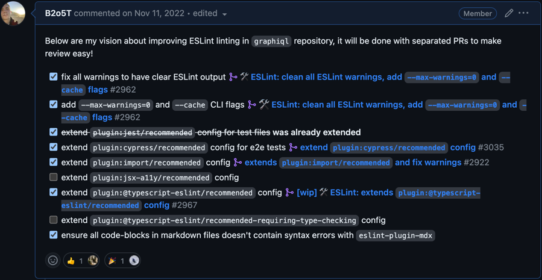
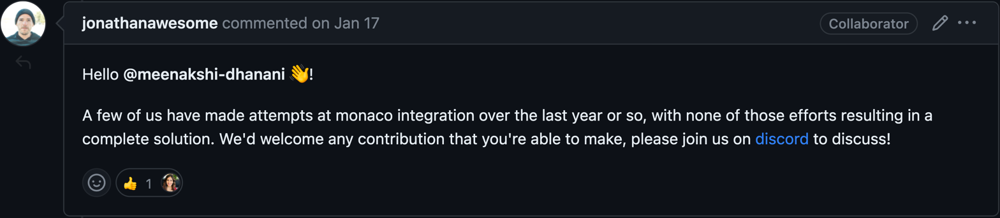

import { Anchor } from '@theguild/components'

## Intro

10 months ago
[GraphiQL 2 was released](https://github.com/graphql/graphiql/releases/tag/graphiql%402.0.0) with a
completely new design and new components library named
[`@graphiql/react`](https://github.com/graphql/graphiql/tree/main/packages/graphiql-react).

Unfortunately previously planned in the [roadmap](https://github.com/graphql/graphiql/issues/2328)
most-waited features as integration [monaco-editor](https://github.com/microsoft/monaco-editor) and
new docs explorer (aka Query Builder) were not introduced.

After months and months, no progress was made, and I was called to join forces and help the
community.

<Callout type="info">
  **About me:** I am Dimitri POSTOLOV, software engineer from The Guild. You may know me as a
  maintainer of [GraphQL-ESLint](https://the-guild.dev/graphql/eslint/docs) and
  [Nextra](https://nextra.site).
</Callout>

## How I Started Maintaining Library

### Put Out the Lights on the Christmas Tree 🎄

When I started to maintain GraphiQL the first thing first was ESLint improvements, because ESLint
output contained a lot of warnings. The below comment from some issue is a perfect allegory that
names it `flashing like a Christmas tree` 😅.

{/* prettier-ignore */}
<Anchor
  href="https://github.com/graphql/graphiql/issues/2169#issue-1139208125" className="mt-6 block"
></Anchor>

So I proposed to extend various ESLint plugins' `recommended` configs.

{/* prettier-ignore */}
<Anchor
  href="https://github.com/graphql/graphiql/issues/2894#issue-1445996198" className="mt-6 block"
></Anchor>

### Replacing Deprecated Reach UI ⚠️

GraphiQL 2 was released with [Reach UI](https://reach.tech) unstyled a11y-first components library.
Unfortunately, after some months of releasing GraphiQL 2, Reach UI was marked as deprecated, no
longer maintained and still doesn't have the official support of React 18. So community started to
receive warnings while installing GraphiQL 2.

```ansi filename="Terminal" copy=false
├─┬ graphiql 2.4.7
│ └─┬ @graphiql/react 0.17.6
│   ├─┬ @reach/combobox 0.17.0
│   │ ├── ✕ unmet peer react@"^16.8.0 || 17.x": found 18.2.0
│   │ ├── ✕ unmet peer react-dom@"^16.8.0 || 17.x": found 18.2.0
│   │ ├─┬ @reach/auto-id 0.17.0
│   │ │ ├── ✕ unmet peer react@"^16.8.0 || 17.x": found 18.2.0
│   │ │ ├── ✕ unmet peer react-dom@"^16.8.0 || 17.x": found 18.2.0
│   │ │ └─┬ @reach/utils 0.17.0
│   │ │   ├── ✕ unmet peer react@"^16.8.0 || 17.x": found 18.2.0
│   │ │   └── ✕ unmet peer react-dom@"^16.8.0 || 17.x": found 18.2.0
│   │ ├─┬ @reach/descendants 0.17.0
│   │ │ ├── ✕ unmet peer react@"^16.8.0 || 17.x": found 18.2.0
│   │ │ └── ✕ unmet peer react-dom@"^16.8.0 || 17.x": found 18.2.0

...a long list of warnings
```

### Deep Dive into GraphiQL 🌊

When I come to a new project I always start by reading the codebase, trying to reproduce active
issues and fix them, and note some things that I can improve in the project in general. Below is a
list of various improvements that were made by me:

1. Updated Cypress to v12 from v4 [#2893](https://github.com/graphql/graphiql/pull/2893).

1. Avoid unnecessary renders component's tree with
   [`eslint-plugin-react-usememo`](https://github.com/arthurgeron/eslint-plugin-react-usememo)
   [#3124](https://github.com/graphql/graphiql/pull/3124).

1. Updated all examples to use React 18 [#3185](https://github.com/graphql/graphiql/pull/3185).

1. Excluded `"dependencies"` from bundle for `@graphiql/react`, `@graphiql/plugin-explorer` and
   `@graphiql/plugin-code-exporter` [#3229](https://github.com/graphql/graphiql/pull/3228) and
   [PR](https://github.com/graphql/graphiql/pull/3229).

1. Removed unnecessary `<div />` wrappers [#3235](https://github.com/graphql/graphiql/pull/3235).

1. Simplified Next.js and Vite examples with `monaco-graphql`
   [#3140](https://github.com/graphql/graphiql/pull/3140) and
   [#3281](https://github.com/graphql/graphiql/pull/3281).

1. And
   [more...](https://github.com/graphql/graphiql/pulls?q=is%3Apr+sort%3Aupdated-desc+author%3AB2o5T+is%3Aclosed)

## GraphiQL 3

Integration of `monaco-editor` and `monaco-graphql` always was a top priority, since I started
maintaining this monorepo, but to achieve it, a stable release should be released first ☝️.

So I decided to propose to release GraphiQL 3 without Reach UI and replace him with maintained
libraries [Radix](https://radix-ui.com) and [Headless UI](https://headlessui.com) and to make
another major release with `monaco-editor` bumped as GraphiQL 4.

|    Version    |           What is inside            |
| :-----------: | :---------------------------------: |
|  GraphiQL 2   |        CodeMirror / Reach UI        |
|  GraphiQL 3   |  CodeMirror / Radix / Headless UI   |
| GraphiQL 4 🔜 | Monaco-Editor / Radix / Headless UI |

<p className="mt-3 text-center italic">Table of comparison versions of GraphiQL</p>

With all the above changes I also included a tab reorders feature:


{/* prettier-ignore */}
<p className="mt-3 text-center italic">Tab reorders made by
  [@mylesmmurphy](https://github.com/mylesmmurphy)
  [#3111](https://github.com/graphql/graphiql/pull/3111)</p>

Try GraphiQL 3 by installing it with your favourite package manager:

```sh npm2yarn
npm i graphql@3
```

## GraphiQL 4 🔜

14 months ago the initial issue was created on the integration `monaco-editor` in GraphiQL.

{/* prettier-ignore */}
<Anchor
  href="https://github.com/graphql/graphiql/issues/2326#issue-1208525253" className="mt-6 block"
></Anchor>

but no real progress in GraphiQL was made (except
[`graphiql-prototype`](https://github.com/jonathanawesome/graphiql-prototype) by
[@jonathanawesome](https://github.com/jonathanawesome)).

<Callout type="warning">
  **Note:** I call it `no real progress` because `graphql-prototype` was prototype written from
  scratch that doesn't integrate into the current GraphiQL monorepo.
</Callout>

<Anchor
  href="https://github.com/graphql/graphiql/issues/2326#issuecomment-1385847481"
  className="mt-6 block"
>
  
</Anchor>

I already started on such difficult integration, here my initial PR
[#3234](https://github.com/graphql/graphiql/pull/3234), or you can try it in the following
[preview URL](https://deploy-preview-3234--graphiql-test.netlify.app) (the alpha version will be
available soon too).

{/* prettier-ignore */}
<Anchor href="https://deploy-preview-3234--graphiql-test.netlify.app" className="mt-6 block"></Anchor>

### Roadmap

- [x] Avoid loading unused languages in `monaco-editor`
      [#3285](https://github.com/graphql/graphiql/pull/3285)

- [x] **(WIP)** Integrate `monaco-editor`/`monaco-graphql`
      [#3234](https://github.com/graphql/graphiql/pull/3234)

- [ ] JSONC comments in variables / headers editors
      [#780](https://github.com/graphql/graphiql/issues/780)

- [ ] Migrate to pnpm & turbo [#3058](https://github.com/graphql/graphiql/issues/3058)

- [ ] New docs explorer aka Query builder [#2327](https://github.com/graphql/graphiql/issues/2327)

- [ ] GraphiQL website [#3059](https://github.com/graphql/graphiql/issues/3059)

- [ ] GraphQL-ESLint plugin [#3057](https://github.com/graphql/graphiql/issues/3057)

## Conclusion

I hope you learned of the current state of GraphiQL and what is coming. Follow me on
[GitHub](https://github.com/B2o5T) and [Twitter](https://twitter.com/B2o5T), see you soon 👋!

<style jsx global>{`
  .nextra-content h3,
  .nextra-toc li a {
    font-family: 'Text Font', 'Custom Glyphs Font', sans-serif;
  }
  .nextra-content table {
    display: table;
    margin-left: auto;
    margin-right: auto;
  }
  .contains-task-list {
    margin-top: 1.5rem;
  }
`}</style>
