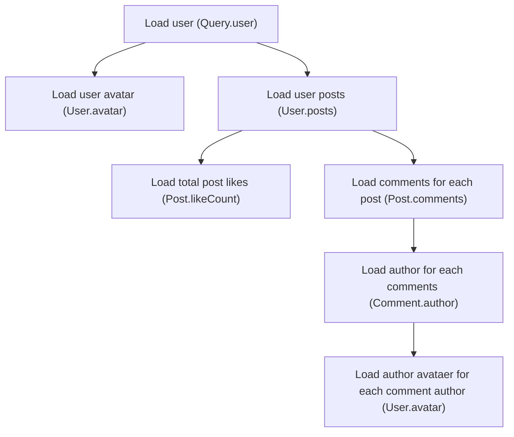
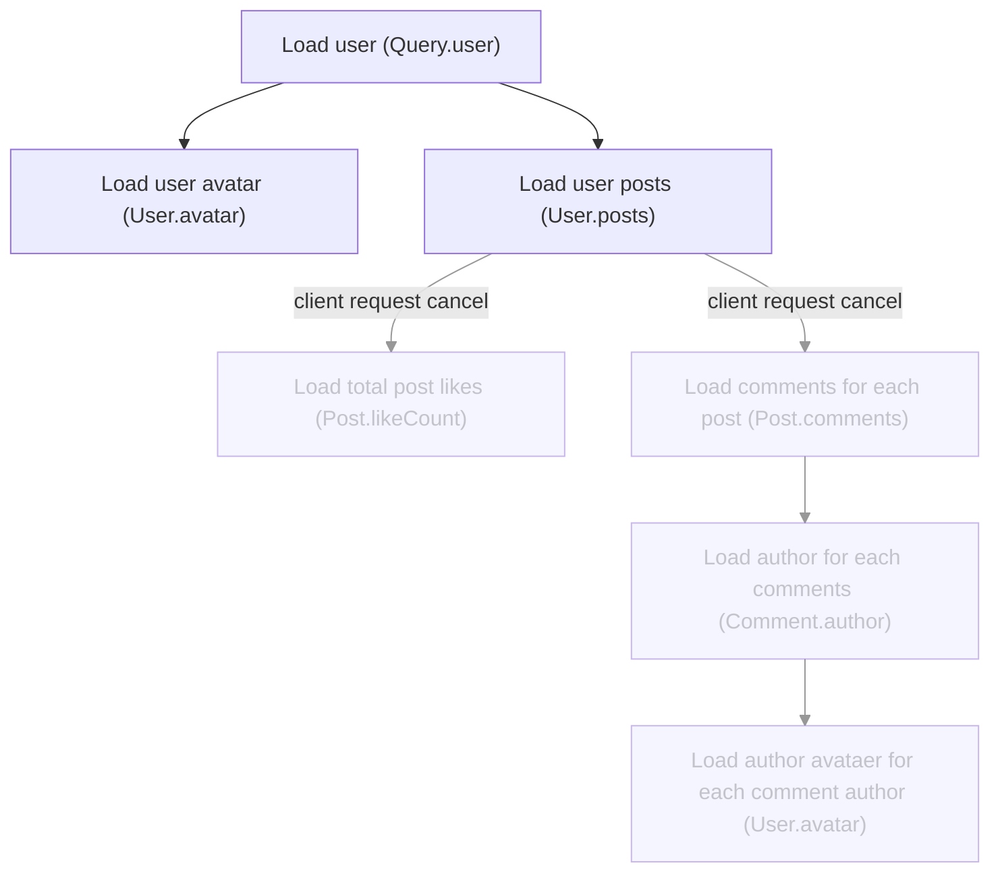

Canceling in-flight requests in an application if a user navigates away from a view has become a
standard in modern applications. GraphQL client libraries such as Apollo Client and urql support
this by default. But is it also possible to cancel ongoing logic on the server if the client stops
the request?

## `AbortController` and `fetch` on the Client {/* eslint-disable-line mdx/remark */}

After the introduction of the
[`fetch` API](https://developer.mozilla.org/en-US/docs/Web/API/Fetch_API), sometime later we also
got the [`AbortController` API](https://developer.mozilla.org/en-US/docs/Web/API/AbortController).
These both in combination made HTTP request cancellation logic straightforward.

In the following React code snippet, we implement a React hook that uses fetch for fetching some
data using the `useEffect` hook. The `fetch` call receives the `AbortSignal` from an
`AbortController` . Within the cleanup function returned from `useEffect`, that is invoked when the
component containing this hook unmounts, the request is aborted via the call of the `abort` method
on the `AbortController`.

```tsx filename="React AbortController example"
function useProfileData() {
  const [state, setState] = useState()

  useEffect(() => {
    const controller = new AbortController()
    async function fetchData() {
      const response = await fetch('/graphql', {
        method: 'POST',
        body: JSON.stringify({ query: '{ me { id  name } }' }),
        headers: { 'Content-Type': 'application/json' },
        signal: controller.signal
      })
      const data = await response.json()
      setState(data)
    }

    fetchData().catch(err => console.log(err))
    return function onUnmount() {
      controller.abort()
    }
  }, [])

  return state
}
```

When checking the network tab within the browser, we can see that the request was canceled.

<Callout>
  **Note:** When a pending fetch request is canceled, the Promise returned from the fetch call will
  reject with a [`DOMException`](https://developer.mozilla.org/en-US/docs/Web/API/DOMException)`. It
  is recommended to always add a catch handler for your fetch calls to avoid unhandled promise
  rejections.
</Callout>

All modern GraphQL clients use this under the hood for optimizing the user experience, as it is
unnecessary to load data that is no longer needed, e.g. because the user navigated away to another
view. This is especially true for devices where low data/roaming usage is desired.

## Isomorphic APIs

One of the great things about JavaScript is that APIs that were formerly exclusive to browser
environments are finally being added to various server-side runtimes. Whether Bun.js, Deno or
Node.js, all of them support both the `fetch` and `AbortController` API in recent versions!

| Runtime | fetch              | AbortController    |
| ------- | ------------------ | ------------------ |
| Node.js | ✅ (since v18.0.0) | ✅ (since v15.4.0) |
| Deno    | ✅ (since v1.0.0)  | ✅ (since v1.0.0)  |
| Bun     | ✅ (since v1.0.0)  | ✅ (since v1.0.0)  |

This enables us to run the exact same code from the client example on our server.

In addition to `AbortController` now being able on the server, all kind of libraries that do
asynchronous tasks such as IO, can similarly to the `fetch` API accept an `AbortSignal` option for
canceling any pending work in case the calling code is no longer interested in the result. An
example of this could be that a request from the client has been canceled and the server no longer
needs to load all the data and construct a response as requested previously.

## Cleaning up Resources and Pending Tasks Is Hard

While this is not particularly true for all programming languages, JavaScript servers are by default
single-threaded and no new thread or worker process is spawned for every incoming HTTP request.
Thus, we can not simply kill a thread or worker process that is performing some work in case the
request got aborted.

Because of that, cleaning up resources and canceling pending tasks is a cumbersome task that is left
to the user instead of being performed through magic.

On top of that a lot of tooling and libraries, yet need to catch up and provide the APIs (e.g. pass
`AbortSignal`) to allow cleaning up resources.

Some examples (on the server in case of an aborted client request):

- Abort a non-transactional, expensive, and long-running SQL query (or query/read on any other
  database)
- Abort pending HTTP requests to third-party services for fetching some data
- Abort the GraphQL execution and stop the resolver waterfall calls for resolving all the data
  specified by the GraphQL operation sent by the client

The latter point is a superset of the two former points, as in most cases within the GraphQL
execution, the business logic as called within or specified in your resolvers will result in a
variation of reads from remote services or databases.

A good enough solution for many people could be to only have the latter and only further optimize
for the former two points when additional performance gains are justified.

## How GraphQL Execution Cancelation Works

When a GraphQL operation is sent to the server, the server will start executing the operation by
calling the resolver functions as specified by the GraphQL operation selection set. Some resolver
functions are light and will just read a property from an object, whereas others will call a remote
service or database.

Here is an example GraphQL operation causing the server to call several services in sequence.

```graphql filename="Example GraphQL Operation"
query Profile($userId: ID!) {
  user(id: $userId) {
    id
    name
    avatar {
      id
      url
    }
    posts(first: 10) {
      edges {
        node {
          id
          title
          body
          likeCount
          comments(first: 5) {
            edges {
              node {
                id
                body
                author {
                  id
                  name
                  avatar {
                    id
                    url
                  }
                }
              }
            }
          }
        }
      }
    }
  }
}
```

Here is a simplified view of what kind of operations will be performed as the resolvers are called.
The arrows indicate what action and resolver will be executed after another one has finished. For
simplification, we only show the resolvers that are performing IO operations.



So given the above operation, if the client cancels the request at the stage
`Load user posts (User.posts)`, there is no need for the server to perform all the resolver calls
and data-fetching happening after that point. Furthermore, event the pending
`Load user posts (User.posts)` call could be canceled.



## Why We Forked GraphQL.js

GraphQL.js is the reference implementation of the GraphQL specification. GraphQL.js is also the
GraphQL engine that is used by almost all JavaScript GraphQL servers that exist today.

The reference implementation serves as a proofing ground for new features (e.g. the `@stream` and
`@defer` directives). However, there is one major drawback with GraphQL.js. Things generally move
slow and the process of testing new features and provide feedback is cumbersome as you will have to
maintain your own fork. If you want to test out multiple newly proposed features at the same time,
it gets even more complicated. We wanted to take that burden from GraphQL server builders!

When we revived Yoga Server, we wanted to make in-progress “GraphQL specification” features easily
accessible. That is why we forked GraphQL.js and now maintain this fork, where new features can be
enabled via flags.

This also allowed us to add support for passing `AbortSignal` for the GraphQL execution, which
allows canceling the GraphQL data resolving waterfall in case the incoming request got canceled.

## How to Enable GraphQL Execution Cancelation in GraphQL Yoga

Execution cancellation is not yet a feature that is enabled by default as we are still gathering
intel on its behavior in a real-world environment (on our [Hive](https://the-guild.dev/graphql/hive)
GraphQL API).

For now, opting into this feature is achieved via a plugin.

```ts filename="GraphQL Yoga cancelation plugin"
import { createYoga, useExecutionCancellation } from 'graphql-yoga'
import { schema } from './schema'

// Provide your schema
const yoga = createYoga({
  plugins: [useExecutionCancellation()],
  schema
})

// Start the server and explore http://localhost:4000/graphql
const server = createServer(yoga)
server.listen(4000, () => {
  console.info('Server is running on http://localhost:4000/graphql')
})
```

After that, you should immediately benefit from GraphQL execution cancellation without having to do
any further optimizations.

Depending on whether you are performing other advanced GraphQL optimizations such as data-fetching
lookaheads or similar, you might also want to implement `AbortSignal` propagating in those API
surfaces. For that, we recommend reading the
[Yoga documentation on GraphQL execution cancellation](https://the-guild.dev/graphql/yoga-server/docs/features/execution-cancellation).

## Conclusion

HTTP request and database read cancelations are powerful tools that can be handy when encountering
performance problems for often aborted paths.

Similarly, aborting the GraphQL execution can potentially free up a lot of resources otherwise
wasted for fetching data and constructing a response that is no longer needed.

Writing cancelation logic for HTTP requests and database read cancelation can be cumbersome, but
implemented via an abstraction layer if needed.

Yoga server is a powerful JavaScript runtime agnostic GraphQL Server that supports GraphQL execution
cancellation.
[You can learn more here](https://the-guild.dev/graphql/yoga-server/docs/features/execution-cancellation).

If you are facing related or other issues with GraphQL APIs, feel free to reach out! We offer a wide
range of services and are experts in building and maintaining GraphQL API tooling.
