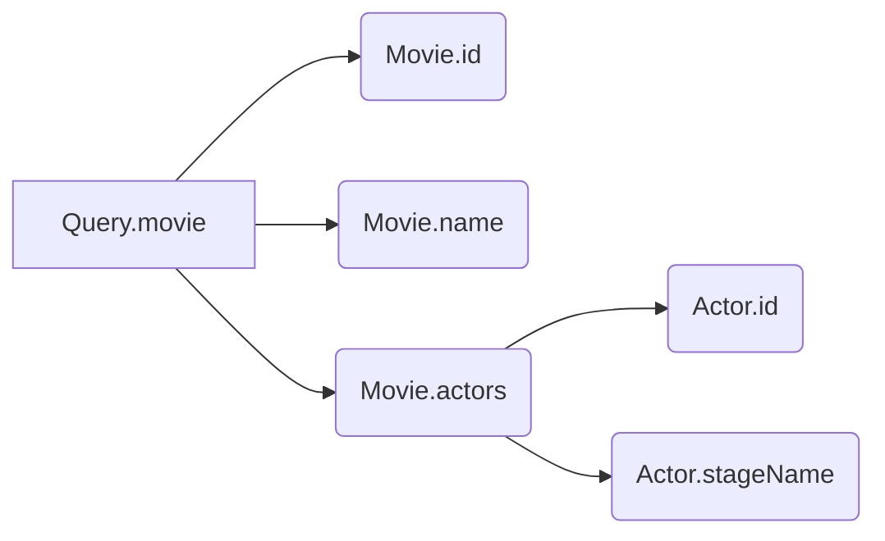

import { Callout } from '@theguild/components'

Resolvers are the fundamental building blocks of a GraphQL server. To build a robust and scalable GraphQL server, we must understand how to write GraphQL resolvers effectively. In this blog post, we will explore how it works, and advanced concepts such as deferring resolve, resolver chain, and mappers.

## What are resolvers?

In a GraphQL server, a resolver is a function that "resolves" a value. Resolving a value means doing arbitrary combination of logic to return a value:

* returning a value statically
* fetching data from a database or an external API to return a value
* executing a complex business logic to return a value

Each field in a GraphQL schema has an optional corresponding resolver function. When a client queries a field, the server executes the resolver function to resolve the field.

Given this example schema:

```graphql
type Query {
  movie(id: ID!): Movie
}

type Movie {
  id: ID!
  name: String!
  actors: [Actor!]!
}

type Actor {
  id: ID!
  screenName: String!
}
```

We can write a _resolvers map_ like this:

```ts filename="resolvers.ts"
const resolvers = {
  Query: {
    movie: () => {}, // `Query.movie` resolver
  },
  Movie: {
    id: () => {}, // `Movie.id` resolver
    name: () => {}, // `Movie.name` resolver
    actors: () => {}, // `Movie.actors` resolver
  },
  Actor: {
    id: () => {}, // `Actor.id` resolver
    stageName: () => {}, // `Actor.stageName` resolver
  },
}
```

We will discuss how the code flows through resolvers when the server handles a request in the next section

## Code flow and resolver chain

Using the same schema, we may receive a query like this:

```graphql
query Movie {
  movie(id: "1") {
    id
    name
    actors {
      id
      stageName
    }
  }
}
```

Once the server receives this query, it starts at `Query.movie` resolver, and since it returns a nullable `Movie` object type, two scenarios can happen:

- If `Query.movie` resolver returns `null` or `undefined`, the code flow stops here, and the server returns `movie: null` to the client.
- If `Query.movie` resolver returns anything else (e.g. objects, class instances, number, non-null falsy values, etc.), the code flow continues. Whatever being returned - usually referred to as _mapper_ - will be the first argument of the Movie resolvers i.e. `Movie.id` and `Movie.name` resolvers.

This process repeats itself until the a GraphQL scalar field needs to be resolved. The order of the resolvers execution is called the _resolver chain_. For the example request, the resolver chain may look like this:



We must return a value that can be handled by the Scalars. In our example:

- `Movie.id` and `Actor.id` resolvers must return a non-nullable value that can be coerced into the `ID` scalar i.e. `string` or `number` values.
- `Movie.name` and `Actor.stageName` resolver must return a non-nullable value that can be coerced into the `String` scalar i.e. `string`, `boolean` or `number` values.

<Callout type="info" emoji="💡">
  You can learn about GraphQL Scalar, including native Scalar and coercion concept, in this guide [here](https://the-guild.dev/blog/the-complete-graphql-scalar-guide)
</Callout>

It is important to remember that we will encounter runtime errors if resolver returns unexpected values. Some common scenarios are:

- a resolver returns `null` into a non-nullable field
- a resolver returns a value that cannot be coerced into the expected scalar type
- a resolver returns a non-array into an array field, such as `Movie.actors`

## Implement resolvers - or not

---

In this article, we will use the following schema as an example:

```graphql
type Query {
  movie(id: ID!): Movie
  novel(id: ID!): Novel
}

type Character {
  id: ID!
  name: String!
  bestFriend: Character
}

type Movie {
  id: ID!
  name: String!
  characters: [Character!]!
}

type Novel {
  id: ID!
  name: String!
  characters: [Character!]!
}
```

Schema notes:

* There are two queries: `movie` and `novel` to return a `Movie` and a `Novel` object type, respectively.
* Each `Movie` and `Novel` object type has a field `characters` that returns a list of `Character` object type.
* `Character` object type has a field `bestFriend` that returns another `Character` object type.

To power the schema, we can use the following object as the data source:

```javascript
const database = {
  movies: {
    "1": {
      id: "1",
      name: "Harry Potter and the Half-Blood Prince"
      characterIds: ["1", "2", "3", "4"]
    },
    "2": {
      id: "2",
      name: "Harry Potter and the Deathly Hallows - Part 1"
      characterIds: ["1", "2", "3"]
    },
    "3": {
      id: "3",
      name: "Harry Potter and the Deathly Hallows - Part 2"
      characterIds: ["1", "2", "3"]
    }
  },
  novels: {
    "1": {
      id: "1",
      name: "Harry Potter and the Half-Blood Prince"
      characterIds: ["1", "2", "3", "4"]
    },
    "2": {
      id: "2",
      name: "Harry Potter and the Deathly Hallows"
      characterIds: ["1", "2", "3"]
    }
  },
  characters: {
    "1": {
      id: "1",
      firstName: "Harry",
      lastName: "Potter",
      bestFriendCharacterId: "2"
    },
    "2": {
      id: "2",
      firstName: "Hermione",
      lastName: "Granger",
      bestFriendCharacterId: "1"
    },
    "3": {
      id: "3",
      firstName: "Ron",
      lastName: "Weasley",
      bestFriendCharacterId: "1"
    }
    "4": {
      id: "4",
      firstName: "Albus",
      lastName: "Dumbledore",
      bestFriendCharacterId: null
    }
  }
};
```

Database notes:

* Each first-level key-value represents a table i.e. there are three tables: `movies`, `novels`, and `characters` in this database.
* Like a real relational database, the records contain references to other records using IDs else.getComputedStyle. each `character` record has a `bestFriendCharacterId` field that references another `character` record.
* For this example, let's imagine every time we query data from the database, it is an asynchronous operation like in real life.

### Example: Resolvers Implementation

Let's start by implementing the `movie` query resolver statically to visualise the resolver chain concept:

```javascript
// 1.
const resolvers = {
  Query: {
    movie: () => {
      // 2.
      return {
        id: "1",
        name: "Harry Potter and the Half-Blood Prince"
        // 3.
        // ...
      }
    },
  },
};
```

Notes:

1. This is a resolver map:
   * It contains an object with keys that match the schema's types e.g. `Query`, `Movie`, `Character`.
   * Each key of an object is a resolver function that resolves a field of the corresponding type. e.g. `Query.movie` resolves a `Movie` type.
2. This is where the `Query.movie` resolver resolves the `Movie` type. Note: we are not using the database yet to keep it simple.
   * The object returned here corresponds to the `Movie` type in the schema.
   * The returned object has `id` field and `name` field that matches the schema's `Movie` type, and will be returned to the client with the current implementation.
3. However, what about the `characters` field? Without returning any value here, the client cannot query for characters in this movie. We will implement it in the next section.

#### Resolving `characters` Field - The Wrong Way

It is very tempting to call the database to resolve for the characters in the movie:

```javascript
const resolvers = {
  Query: {
    movie: () => {
      return {
        id: "1",
        name: "Harry Potter and the Half-Blood Prince"
        // 1.
        characters: ["1", "2", "3"].map(characterId => {
          // 2.
          return database.characters[characterId]
        })
      }
    },
  },
};
```

1. This is where we attempt to resolve the `characters` field of the `Movie` type using the linked `characterIds`.
2. For each character ID, we attempt to fetch the character from the database.

However, this is the wrong way to resolve the `characters` field. Here, we are sending three asynchronous requests to the database to fetch the characters. This function is always called whenever `Query.movie` is triggered, which is unnecessary and inefficient when the client does not request for the `characters` field. This is called "eager-resolve".

Furthermore, each character may or may not have a best friend, which is another `Character` type. The client can query for the `bestFriend` field of each character:

```graphql
query {
  movie {
    characters {
      # client can query for abitrairy depth of bestFriend
      bestFriend {
        bestFriend {
          bestFriend {
            name
            # ... and so on
          }
        }
      }
    }
  }
}
```

At the `Query.movie` resolver, we do not know how deep the client will query for the `bestFriend` field. On the other hand, if we decide to resolve for certain level of `bestFriend` here, and if the client does not request for the `bestFriend` field, we will have to make unnecessary requests to the database for each `bestFriend`.

#### Resolving `characters` Field - The Right Way Using Mapper

The right way to resolve `characters` field is to defer the resolving logic to the `Movie.characters` field resolver:

```javascript
const resolvers = {
  Query: {
    movie: () => {
      // 1.
      return {
        id: "1",
        name: "Harry Potter and the Half-Blood Prince",
        characterIds: ["1", "2", "3"]
      }
    },
  },
  // 2.
  Movie: {
    // 3.
    characters: (parent) => {
      // 4.
      return parent.characterIds.map(characterId => database.characters[characterId]);
    }
  },
  // 5.
  Character: {
    // ...
  }
};
```

1. We are still statically resolving the `Movie` type in the `Query.movie` resolver. When we do not return an object with the exact shape of the schema's `Movie` type, it is commonly known as returning a Movie *mapper*.
2. We create a `Movie` object in the resolver map to match the schema's `Movie` type.
3. When we return anything into a `Movie` node (like the `Query.movie` resolver), the `Movie` type resolver/s are triggered if they are declared.
4. `Movie.characters` resolver is triggered to return of an array of `Character` mappers...
5. And each `Character` mapper returned in (4.) will run any `Character` type resolver/s if they are declared.

Putting everything together, here's the complete implementation of the resolvers using the database:

```javascript
const resolvers = {
  Query: {
    // 1.
    movie: (_, { id }) => {
      return database.movies[id];
    },
  },
  Movie: {
    characters: ({ characterIds }) => {
      return characterIds.map(characterId => database.characters[characterId]);
    }
  },
  Character: {
    // 2.
    name: ({ firstName, lastName }) => `${firstName} ${lastName}`,
    // 3.
    bestFriend: ({ bestFriendCharacterId }) => {
      if(!bestFriendCharacterId) {
        return null;
      }
      return database.characters[bestFriendCharacterId]
    }
  }
};
```

1. Now, we use the `id` argument to resolve the `Movie` type dynamically from the database.
2. We resolve the `name` field of the `Character` type by combining the `firstName` and `lastName` fields of the `Character` mapper.
3. We resolve the `bestFriend` field of the `Character` type by fetching the `Character` mapper using the `bestFriendCharacterId` field of the `Character` mapper.
   * Since `bestFriend` returns another `Character` wrapper, it will recursively handle any arbitrary depth of `bestFriend` field requested by the client.

TODO:

* Write an example client query and show the resolver chain in action
* Pit fall: Explain inconsistent mapper usage issue when implementing resolver chain

## How to Implement Resolver Chain Safely

### 1. With GraphQL Code Generator's typescript-resolvers Plugin

### 2. With GraphQL Code Generator's Server Preset

## Summary
