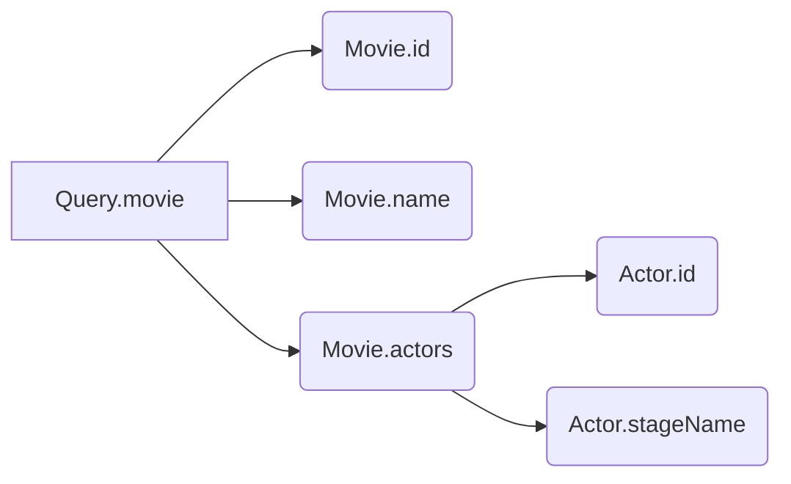

import { Callout } from '@theguild/components'

Resolvers are the fundamental building blocks of a GraphQL server. To build a robust and scalable GraphQL server, we must understand how to write GraphQL resolvers effectively. In this blog post, we will explore how it works, and advanced concepts such as deferring resolve, resolver chain, and mappers.

## What Are Resolvers?

In a GraphQL server, a resolver is a function that "resolves" a value. Resolving a value means doing arbitrary combination of logic to return a value:

* returning a value statically
* fetching data from a database or an external API to return a value
* executing a complex business logic to return a value

Each field in a GraphQL schema has an optional corresponding resolver function. When a client queries a field, the server executes the resolver function to resolve the field.

Given this example schema:

```graphql filename="src/graphql/schema.graphql"
type Query {
  movie(id: ID!): Movie
}

type Movie {
  id: ID!
  name: String!
  actors: [Actor!]!
}

type Actor {
  id: ID!
  stageName: String!
}
```

We can write a _resolvers map_ like this:

```ts filename="src/graphql/resolvers.ts"
const resolvers = {
  Query: {
    movie: () => {}, // `Query.movie` resolver
  },
  Movie: {
    id: () => {}, // `Movie.id` resolver
    name: () => {}, // `Movie.name` resolver
    actors: () => {}, // `Movie.actors` resolver
  },
  Actor: {
    id: () => {}, // `Actor.id` resolver
    stageName: () => {}, // `Actor.stageName` resolver
  },
}
```

We will discuss how the code flows through resolvers when the server handles a request in the next section

## Code Flow and Resolver Chain

Using the same schema, we may receive a query like this:

```graphql
query Movie {
  movie(id: "1") {
    id
    name
    actors {
      id
      stageName
    }
  }
}
```

Once the server receives this query, it starts at `Query.movie` resolver, and since it returns a nullable `Movie` object type, two scenarios can happen:

- If `Query.movie` resolver returns `null` or `undefined`, the code flow stops here, and the server returns `movie: null` to the client.
- If `Query.movie` resolver returns anything else (e.g. objects, class instances, number, non-null falsy values, etc.), the code flow continues. Whatever being returned - usually called _mapper_ - will be the first argument of the Movie resolvers i.e. `Movie.id` and `Movie.name` resolvers.

<Callout type="info" emoji="💡">
  There are four positonal arguments of a resolver function:
  - `parent`: the value returned by the parent resolver.
    - For root-level resolvers like `Query.movie`, `parent` is always `undefined`.
    - For other object-type resolvers like `Movie.id` and `Movie.name`, `parent` is the value returned by parent resolvers like `Query.movie`
  - `args`: this is the arguments passed by client opertaions. In our example query, `Query.movie` resolver would receive `{ id: "1" }` as `args`
  - `context`: An object passed through the resolver chain. It is useful for passing information between resolvers, such as authentication information, database connection, etc.
  - `info`: An object containing information about the operation, such as operation AST, path to the resolver, etc.
</Callout>

This process repeats itself until the a GraphQL scalar field needs to be resolved. The order of the resolvers execution is called the _resolver chain_. For the example request, the resolver chain may look like this:



We must return a value that can be handled by the Scalars. In our example:

- `Movie.id` and `Actor.id` resolvers must return a non-nullable value that can be coerced into the `ID` scalar i.e. `string` or `number` values.
- `Movie.name` and `Actor.stageName` resolver must return a non-nullable value that can be coerced into the `String` scalar i.e. `string`, `boolean` or `number` values.

<Callout type="info" emoji="💡">
  You can learn about GraphQL Scalar, including native Scalar and coercion concept, in this guide [here](https://the-guild.dev/blog/the-complete-graphql-scalar-guide)
</Callout>

It is important to remember that we will encounter runtime errors if resolver returns unexpected values. Some common scenarios are:

- a resolver returns `null` into a non-nullable field
- a resolver returns a value that cannot be coerced into the expected scalar type
- a resolver returns a non-array into an array field, such as `Movie.actors`

## Implementing Resolvers

### Implementing Resolvers - Or Not

If an empty resolver map is provided to the GraphQL server, the server will still run, however, it will return `null` for every root-level field in the schema. This means if a root-level field like `Query.movie`'s return type is non-nullable, we will encounter runtime error.
If object type resolvers are omitted, the server will try to return the property of the same name from `parent`. Here's what `Movie` resolvers may look like if they are omitted:

```ts
const resolvers = {
  Movie: {
    id: (parent) => parent.id,
    name: (parent) => parent.name,
    actors: (parent) => parent.actors,
  },
}
```

This means if `Query.movie` resolver returns an object with `id`, `name`, and `actors` properties, we can omit the `Movie` and `Actor` resolvers:

```ts
const resolvers = {
  Query: {
    movie: () => {
      return {
        id: "1",
        name: "Harry Potter and the Half-Blood Prince",
        actors: [
          { id: "1", stageName: "Daniel Radcliffe" },
          { id: "2", stageName: "Emma Watson" },
          { id: "3", stageName: "Rupert Grint" },
        ]
      }
    },
  },
}
```

In this very simple example where we are returning static values, this will work. However, in a real-world scenario where we may fetch data from a database or an external API, we must consider the response data shape, and the app performance. We will try to simlulate a real-world scenario in the next section.

### Implementing Resolvers for Real-World Scenarios

Below is an object this can be used as an in-memory database:

```ts
const database = {
  movies: { // Movies table
    "1": {
      id: "1",
      movieName: "Harry Potter and the Half-Blood Prince",
    }
  },
  actors: { // Actors table
    "1": {
      id: "1",
      stageName: "Daniel Radcliffe"
    },
    "2": {
      id: "2",
      stageName: "Emma Watson"
    },
    "3": {
      id: "3",
      stageName: "Rupert Grint"
    }
  },
  "movies_actors": { // Table containing movie-actor relationship
    "1": { // Movie ID
      actorIds: ["1", "2", "3"]
    },
  }
}
```

We usually pass database connection through context, so we might update `Query.movie` to look like this:

```ts
const resolvers = {
  Query: {
    movie: (_, { id }, { database }) => {
      const movie = database.movies[id]; // Database access counter: (1)

      if (!movie) {
        return null;
      }

      return {
        id: movie.id,
        name: movie.movieName,
        actors: (database.movies_actors[id] || []) // (2)
          .actorIds.map(actorId => {
            return database.actors[actorId] // (3), (4), (5)
          })
      }
    },
  },
}
```

This works, however, there are a few issues:

- We are accessing the database 5 times every time `Query.movie` runs. However, the client may not request for `actors` field, so we are making unnecessary database calls. This is called eager resolve.
- We are doing mapping `movie.movieName` in the return statement. This is fine here but our schema may scale to have multiple fields returning Movie, and we may have to repeat the same mapping logic in multiple resolvers.

To fix these issues, we can use _mappers_ and _deferred resolve_ concepts:

```ts
type MovieMapper = { // 1.
  id: string;
  movieName: string;
}
type ActorMapper = string; // 2.

const resolvers = {
  Query: {
    movie: (_, { id }, { database }): MovieMapper => {
      const movie = database.movies[id];

      if (!movie) {
        return null;
      }

      return movie // 3.
    },
  },
  Movie: {
    // 4.
    name: (parent: MovieMapper) => parent.movieName, // 5.
    actors: (parent: MovieMapper, _, { database }): ActorMapper[] => database.movies_actors[parent.id].actorIds, // 6.
  },
  Actor: {
    id: (parent: ActorMapper) => parent, // 7.
    stageName: (parent: ActorMapper, _, { database }) => database.actors[parent].stageName, // 8.
  }
}
```

1. We define a `MovieMapper` type to represent the shape of the object returned by `Query.movie` resolver.
2. Similarly, we define `ActorMapper` to be returned wherever `Actor` type is expected. Note that `ActorMapper` is a `string` representing the ID of an actor in this case, instead of an object.
3. The `MovieMapper` is returned by `Query.movie` resolver, and it becomes the `parent` of `Movie` resolvers in (5) and (6).
4. We can skip implementing `Movie.id` resolver because by default it passes `MovieMapper.id` property safely.
5. Since `MovieMapper` has `movieName` property, but the GraphQL type expects String scalar for `name` instead. So, we need to map mapper's `movieName` to the schema's `Movie.name` field.
6. `MovieMapper` doesn't have `actors` property, so we must find all the related actors from the database. Here, we expect an array of `ActorMapper` (i.e. an array of `string`) to be returned, which is the `actorIds` array in the database. This just means the `parent` of each `Actor` resolver is a string in (7) and (8)
7. Because each `ActorMapper` is the ID of an actor, we return the `parent` instead of `parent.id` 
8. Similarly, we use `parent` as the ID of the actor to fetch the actor's `stageName` from the database.

By using mappers and deferred resolve techniques, we avoid unnecessary database calls and reduce code duplication. The next time we need to write a resolver that returns `Movie`, `Actor` objects, we can simply return the corresponding mapper objects.

### Implementing Resolvers with Mappers and Deferred Resolve Best Practices

We saw the benefits of using mappers and deferred resolve techniques in the previous section. Here are some TypeScript best practices to keep in mind when implementing resolvers, failing to enforce them may result in runtime errors:

- Mappers MUST be correctly typed as the return type of a resolver and the parent type of the next resolver.
- Object resolvers MUST be implemented if the expected schema field does not exist in the mapper or, the mapper's field cannot be coerced into the expected schema type of the same name.

At a small scale, it is easy to keep track of the types and mappers. However, as our schema grows, it becomes harder to maintain the typing and remembering which resolvers to implement. 
This is where [GraphQL Code Generator](https://the-guild.dev/graphql/codegen) and Server Preset (`@eddeee888/gcg-typescript-resolver-files`) can be used to enforce strong type-safety and to reduce the risk of runtime errors using code analysis.

To get started, install the required packages:

```sh npm2yarn
npm i -D @graphql-codegen/cli @eddeee888/gcg-typescript-resolver-files
```

Next, create a `codegen.ts` file in the root of your project:

```ts
import type { CodegenConfig } from "@graphql-codegen/cli";
import { defineConfig } from "@eddeee888/gcg-typescript-resolver-files";

const config: CodegenConfig = {
  schema: "src/graphql/schema.graphql",
  generates: {
    "src/graphql": defineConfig({
      resolverGeneration: "minimal",
    }),
  },
};
export default config;
```

Then, add mappers into `schema.mappers.ts` file, in the same directory as `schema.graphql`:

```ts filename="src/graphql/schema.mappers.ts"
type MovieMapper = {
  id: string;
  movieName: string;  
}
type ActorMapper = string;
```

Finally, run codegen to generate resolvers:

```sh npm2yarn
npm run graphql-codegen
```

We will see generated resolver files in `src/graphql` directory:

```ts
// src/graphql/resolvers/Query/movie.ts
import type { QueryResolvers } from "./../../types.generated";
export const movie: NonNullable<QueryResolvers["movie"]> = async (
  _parent,
  _arg,
  _ctx,
) => {
  /* Implement Query.movie resolver logic here */
};

// src/graphql/resolvers/Movie.ts
import type { MovieResolvers } from "./../types.generated";
export const Movie: MovieResolvers = {
  /* Implement Movie resolver logic here */
  actors: async (_parent, _arg, _ctx) => {
    /* Movie.actors resolver is required because Movie.actors exists but MovieMapper.actors does not */
  },
  name: async (_parent, _arg, _ctx) => {
    /* Movie.name resolver is required because Movie.name exists but MovieMapper.name does not */
  },
};

// src/graphql/resolvers/Actor.ts
import type { ActorResolvers } from "./../types.generated";
export const Actor: ActorResolvers = {
  /* Implement Actor resolver logic here */
  id: async (_parent, _arg, _ctx) => {
    /* Actor.id resolver is required because Actor.id exists but ActorMapper.id does not */
  },
  stageName: async (_parent, _arg, _ctx) => {
    /* Actor.stageName resolver is required because Actor.stageName exists but ActorMapper.stageName does not */
  },
};

```

By providing mappers, codegen is smart enough to understand that we want to defer resolve, and we need to write logic for `Movie.actors`, `Movie.name`, `Actor.id` and `Actor.stageName` resolvers to ensure we don't encounter runtime errors.

<Callout type="info" emoji="💡">
  Learn how to set up GraphQL Code Generator and Server Preset for GraphQL Yoga and Apollo Server in this guide [here](https://the-guild.dev/graphql/codegen/docs/guides/graphql-server-apollo-yoga-with-server-preset).
</Callout>

## Summary

In this article, we have discussed how resolvers work in a GraphQL server resolver code flow and resolver chain, and how to write resolvers effectively using mappers and defer resolve techniques. Finally, we add GraphQL Code Generator and Server Preset to automatically generate resolver types and resolvers that need implementation to ensure strong type-safety and reduce runtime errors.