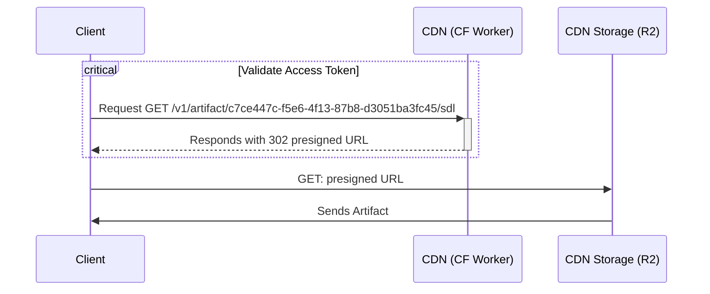

As we are building the GraphQL schema registry Hive we are constantly facing interesting problems
and challenges that we need to solve.

In this post we will talk about how we are using Cloudflare Workers to provide authenticated highly
available access to GraphQL schema artifacts, e.g. SDL (Schema Definition Language), the service
lists or the Supergraph.

## The Problem

The availability of the GraphQL schema artifacts is mission-critical for the success of the Hive
clients to work flawless, even if there is an incident on the GraphQL Hive side.

The schema artifacts might be consumed by GraphQL Gateways, and any outage could prevent them from
shipping to production.

That is why from the beginning we decided to use Cloudflare Workers as a CDN for the GraphQL schema
artifacts.



However, in the first iteration of the token was generated based on the target id (think of it as
project id) and an application secret and, thus, static.

That means if this key would accidentally leak to the outside world, it would be impossible to
invalidate it. Some of our customers were justifiably concerned about this.

We needed a new solution that allows generating and deleting many different access keys in parallel,
without drastically impacting the performance of the CDN.

On top of that, we needed the old "legacy" CDN access tokens still to be usable (and also be able to
invalidate those!) alongside the new ones, as we did not want to break consumers that already access
the CDN.

## The Solution

First we needed to decide upon a store in which we can store the hashes of the new CDN access
tokens.

We were already using the Cloudflare R2 (S3 Buckets) for storing the schema artifacts. As these
artifacts are as close to the Cloudflare Workers as possible we decided that this might be the best
solution, compared to e.g. a remote Redis or PostgreSQL instance with increased latency.

Cloudflare Workers KV was not an option, as GraphQL Hive supports both hosted (cloud) and
self-hosted (community) deployments, where the latter should be able to run without the need for ANY
external (paid) cloud services. We did not have a KV replacement available, on the other site there
are many S3 compatible storage solutions such as MinIO available.

The whole flow for accessing the CDN artifacts looks like the following.


E.g. a request for fetching the access token would look like the following with `cURL`.

```bash filename="cUrl command for fetching an CDN artifact"
curl -v \
  -H 'X-Hive-CDN-Key: kAZlQN8U7q8pMsAMVpA0fBeRvvbaKt1h9JniZbi3+5k=' \
  https://cdn.graphql-hive.com/v1/c7ce447c-f5e6-4f13-87b8-d3051ba3fc45/sdl
```

```bash filename="cUrl output"
/artifacts/v1/c7ce447c-f5e6-4f13-87b8-d3051ba3fc45/sdl > GET
302 < Found
location < Header: https://6d5bc18cd8d13babe7ed321adba3d8ae.r2.cloudflarestorage.com/artifacts/c7ce447c-f5e6-4f13-87b8-d3051ba3fc45/sdl
Found.
```

In order to get this new feature shipped flawlessly, we needed to roll it out incrementally. After
some conceptualizing we came up with the following phases:

- Phase 1: Automatically write new "generated" legacy access tokens to the R2 buckets
- Phase 2: Run a migration to import all "legacy" access tokens in the R2 buckets
- Phase 3: Roll out the new CDN access token validation for legacy tokens
- Phase 4: Roll out the new CDN access token format and management UI in the web application

## Phase 1

At a first glance Phase 1 and Phase 2 almost seem identical, however to distinguish between these
two, and the need to roll out these changes separately is crucial for ensuring integrity of the
application.

In our web application we have a button "Connect to CDN", that automatically generates the old
"static" legacy access token for a target/project.

If we would not alter this implementation to also write this access token to the R2 bucket, there
might be a timing issue as the CDN access key of a target/project created shortly/during the
database migration or after it might not be available on the R2 bucket and furthermore be no longer
valid once we roll out Phase 3.

In addition to the R2 bucket, we also wanted to write a reference to the access token to our
PostgreSQL database, as we want to store some meta information such as an access token alias for the
web app later on.

We ended up with a database schema like this.

```sql
CREATE TABLE "public"."cdn_access_tokens" (
  "id" uuid PRIMARY KEY DEFAULT uuid_generate_v4()
  , "target_id" uuid NOT NULL REFERENCES "targets"("id") ON DELETE CASCADE
  , "s3_key" text UNIQUE NOT NULL
  , "first_characters" text NOT NULL
  , "last_characters" text NOT NULL
  , "alias" text NOT NULL
  , "created_at" timestamp with time zone NOT NULL DEFAULT NOW()
);
```

## Phase 2

After Phase 1 was rolled, we could continue with writing a database migration for seeding/importing
all the legacy access tokens into both the R2 bucket and our PostgreSQL database.

For this we just used a cursor paginated SQL query for reading the targets (to which a CDN access
token is related to) and then run some logic for writing the data to the designated locations.

```ts filename="Slonik and Zod for safely reading paginated results from PostgreSQL"
import { CommonQueryMethods } from 'slonik'
import * as zod from 'zod'

const TargetsModel = zod.array(
  zod.object({
    id: zod.string(),
    created_at_cursor: zod.string()
  })
)

async function getPaginationTargets(
  connection: CommonQueryMethods,
  cursor: null | Cursor
): Promise<zod.TypeOf<typeof TargetsModel>> {
  const query = sql`
    SELECT
      "id"
      , to_json("created_at") as "created_at_cursor"
    FROM
      "targets"
    ${
      cursor
        ? sql`
            WHERE
              ("created_at" = ${cursor.lastCreatedAt} AND "id" > ${cursor.lastId})
              OR "created_at" > ${cursor.lastCreatedAt}
          `
        : sql``
    }
    ORDER BY
      "created_at" ASC
      , "id" ASC
    LIMIT
      200
  `

  const items = await connection.query(query)
  return TargetsModel.parse(items.rows)
}
```

The R2/S3 key for the legacy access token would be `<bucket-name>/cdn-legacy-keys/<target-id>/`. In
that key we store the bcrypt hash of the static legacy CDN access token.

After we successfully ran this database migration, we could check the PostgreSQL database and R2 in
order to see an equal amount of entries.

## Phase 3

This was the scariest phase. After we seeded the new access token storage, it was now time to switch
the token validation method.

Instead of verifying the CDN access token using an encryption secret environment variable, we would
now instead load the R2 key based on the artifact target id being accessed.

E.g. for the URL `/v1/artifact/c7ce447c-f5e6-4f13-87b8-d3051ba3fc45/sdl`, we would load the R2 key
`<bucket-name>/cdn-legacy-keys/c7ce447c-f5e6-4f13-87b8-d3051ba3fc45/` and then check the hash stored
in that key, against the provided access key (the `X-Hive-CDN-Key` header value).

In case the key does not exist, or the hash would not match the access token, that means it is no
longer valid/invalid, which is later on our mechanism for allowing users to invalidate the legacy
token.

On top of that, to prevent reading from R2 for every request and speed up the token validation for
subsequent requests, we utilized the
[Cache API](https://developers.cloudflare.com/workers/runtime-apis/cache/) for storing the token
validation result for 5 minutes.

That means if an access token is invalidated (the R2 key is deleted), it might take up to 5 minutes
until the change is propagated. However, we felt like this is a great trade-off for by-passing
reading from R2 and running bcrypt for verifying the access token against the hash.

```ts filename="Using the Cache API for caching access token verification"
const validateLegacyCDNAccessToken = async (args: {
  targetId: string
  accessToken: string
  s3: S3Config
  requestCache: Cache
  waitUntil: FetchEvent['waitUntil']
}): Promise<boolean> => {
  const cacheKey = new Request(
    [
      'https://key-cache.graphql-hive.com',
      'legacy',
      args.targetId,
      encodeURIComponent(args.accessToken)
    ].join('/'),
    {
      method: 'GET'
    }
  )

  const response = await args.requestCache.match(cacheKey)

  if (response) {
    const responseValue = await response.text()

    const isValid = responseValue === '1'
    return isValid
  }

  const withCache = async (isValid: boolean) => {
    const promise = args.requestCache.put(
      cacheKey,
      new Response(isValid ? '1' : '0', {
        status: 200,
        headers: {
          // cache for 5 minutes
          'Cache-Control': `s-maxage=${60 * 5}`
        }
      })
    )

    // don't block the request by the cache
    args.waitUntil(promise)

    return isValid
  }

  const key = await args.s3.client.fetch(
    [args.s3.endpoint, args.s3.bucketName, 'cdn-legacy-keys', args.targetId].join('/'),
    {
      method: 'GET'
    }
  )

  if (key.status !== 200) {
    return withCache(false)
  }

  const isValid = await bcrypt.compare(args.accessToken, await key.text())
  return withCache(isValid)
}
```

After everything was implemented and properly tested via our integration test suite, we finally
rolled it out to production. And... everything was on fire.


We quickly responded with rolling back the latest changes and then it was time for debugging...


## Phase 3.1

Now we needed to figure out what exactly was going wrong that let the new validation method fail.
This was especially hard, as debugging Cloudflare Worker code is fairly cumbersome.

We were already using [Cloudflare Analytics](https://www.cloudflare.com/analytics/) for exporting
metrics in our Grafana Dashboard. So the first idea was to add the new validation method with
excessive logging and run it along-side the old validation method.

After, this change was deployed, we quickly saw that reading the access tokens from R2 went fine,
however, validating the access tokens failed.

After way much more time than we would like to have spent on debugging this, we finally realized
that we had used the wrong secret for generating the legacy access tokens before they were hashed
and written to R3.

That basically meant we would have to prune all `cdn_access_token` database records and re-run our
migration with the correct secret.

After a bit of careful and manual tinkering with the production database and a deployment later, the
database migration from Phase 2 was now run with the correct secret.

On the dashboard, we could now finally see the new validation method to succeed.


That mean it was now safe to re-apply the changes from Phase 3 and roll them out to production.

This time everything went smooth and as expected.

The analytics now showed that most requests hit the cached access key validation and we had no
clients complaining.


## Phase 4

Now the legacy tokens being handled properly, we could now focus on deploying the new access tokens
and building the UI for creating/deleting both the existing legacy access tokens and new access
tokens.

The new access keys should be stored at `<bucket-name>/cdn-keys/<target-id>/<access-key-id>`. That
allows having an infinite amount of access keys. The value written to
`<bucket-name>/cdn-keys/<target-id>/<access-key-id>` is the bcrypt hash of the private key that is
part of the access token issued to the user.

```text
accessToken = "hv2" + base64(accessKeyId + ":" + privateKey)
```

The `privateAccessKeyId` is never stored anywhere on our side, only the hash.

The `"hv2"` prefix is a convenience for us for quickly identifying whether an access key sent to us
is a legacy or new access token.

E.g. for the URL `/v1/artifact/c7ce447c-f5e6-4f13-87b8-d3051ba3fc45/sdl`, we would load the R2 key
`<bucket-name>/cdn-keys/c7ce447c-f5e6-4f13-87b8-d3051ba3fc45/<access-key-id>`.

We can read the `accessKeyId` from the `X-Hive-CDN-Key` header value.

```ts filename="Logic for decoding the incoming CDN access token"
export interface CDNToken {
  keyId: string
  privateKey: string
}

/**
 * We prefix the token so we can check fast wether a token is a new one or a legacy one.
 */
const keyPrefix = 'hv2'

export function isCDNAccessToken(token: string) {
  return token.startsWith(keyPrefix) === true
}

const decodeError = { type: 'failure', reason: 'Invalid access token.' } as const

/**
 * Safely decode a CDN token that got serialized as a string.
 */
export function decodeCdnAccessTokenSafe(token: string) {
  if (isCDNAccessToken(token) === false) {
    return decodeError
  }

  token = token.slice(keyPrefix.length)

  const str = globalThis.atob(token)
  const [keyId, privateKey] = str.split(':')
  if (keyId && privateKey) {
    return { type: 'success', token: { keyId, privateKey } } as const
  }
  return decodeError
}
```

Once we decoded the incoming access token we can then read the R2 key value e.g.
`<bucket-name>/cdn-keys/c7ce447c-f5e6-4f13-87b8-d3051ba3fc45/c7de111c-f5g9-4f13-87b8-d1267ba3ge95`
and then check the user-sent `privateKey` against the hash stored there.

For subsequent requests, the same cache logic as for the legacy tokens is reused.

The UI part was pretty straight-forward and less challenging to build, however it was still part of
this project.

The new token overview:


Creating a new token:


We successfully deployed this to production and then informed all our clients that are waiting for
this feature. 🎉

In addition, this is of course now also available for the self-hosted Hive users.

## Conclusion

This was an exciting and challenging project to solve and Cloudflare provides useful tools for
solving these kinds of problems.

On the other hand debugging Cloudflare tooling is often frustrating and cumbersome, documentation is
also often scarce or non-existing for more advanced use-cases.

Nevertheless, we are happy to finish this project successfully and are looking forward to all the
future challenges!

In case you did not know, Hive is fully open-source and self-hostable! You can find all the code,
steps and pull requests on GitHub!

- https://github.com/kamilkisiela/graphql-hive/pull/1003
- https://github.com/kamilkisiela/graphql-hive/pull/1043
- https://github.com/kamilkisiela/graphql-hive/pull/1005
- https://github.com/kamilkisiela/graphql-hive/pull/1114
- https://github.com/kamilkisiela/graphql-hive/pull/1120
- https://github.com/kamilkisiela/graphql-hive/pull/1127
- https://github.com/kamilkisiela/graphql-hive/pull/1130
- https://github.com/kamilkisiela/graphql-hive/pull/1142
- https://github.com/kamilkisiela/graphql-hive/pull/1143
- https://github.com/kamilkisiela/graphql-hive/pull/1061
