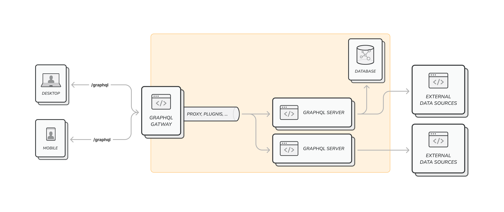
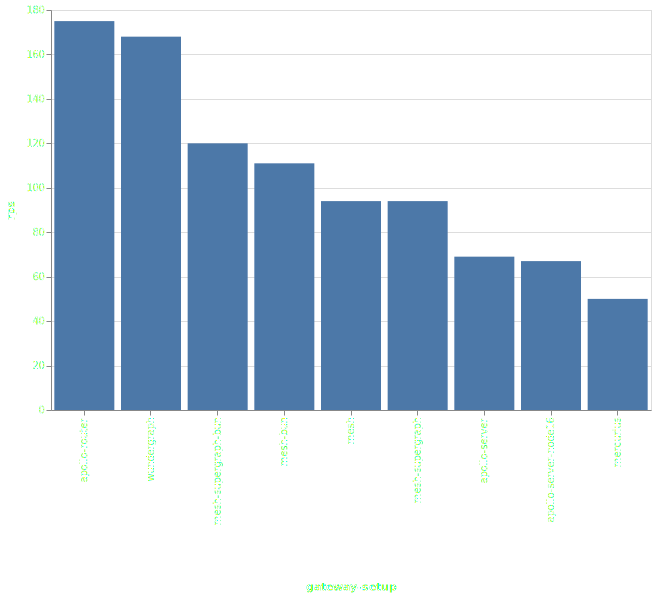
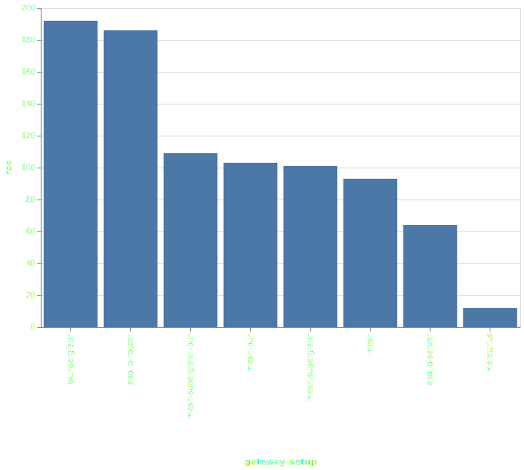
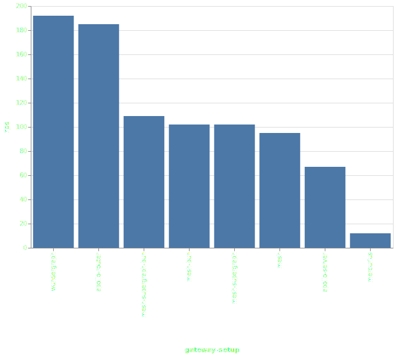
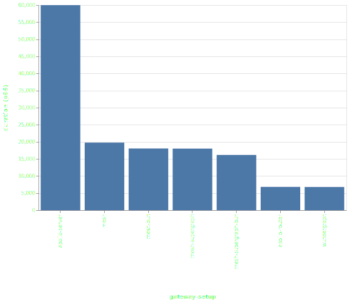

import { Callout } from '@theguild/components'

The GraphQL ecosystem is growing rapidly, and solutions to complex problems are more accessible than
ever before.

One of the most common questions about GraphQL is how to extend or enrich it. This can be achieved
by adding custom flows, securing your `/graphql` endpoint, improving performance through caching,
orchestrating upstream calls for distributed GraphQL, or monitoring and tracing it.

Either a specific ad-hoc solution or a gateway designed specifically for GraphQL can solve all of
the following problems.

**In this blog post, we'll cover The Guild's (and other companies) six-month journey of researching,
exploring, and creating a report on the state of GraphQL gateways in 2023. We compared, tested, and
benchmark various open-source solutions, and we'd like to share our process thus far.**

<Callout type="info" emoji="❣️">
  We would like to thank our partners and customers who took part in that journey!
</Callout>

## But First, What's a GraphQL Gateway?

A GraphQL gateway follows a workflow that adds functionality and acts as a proxy between the
consumer and the actual GraphQL server(s) running the GraphQL schema(s). An architecture diagram of
this setup will look like the following:

<Callout type="info" emoji="">
  <></>
</Callout>

In the architecture chart above, the GraphQL gateway responsible for exposing your GraphQL server
externally and adding capabilities to it. The GraphQL server, on the other hand, implements the
actual GraphQL schema and runs resolvers, dataloaders, and any other custom code required for
fetching and connecting your data or entities.

Incorporating a GraphQL gateway into your architecture can help to offload some of the common
features and capabilities from your GraphQL server. Here's a (partial) list of things that a GraphQL
gateway can do:

1. **Caching** in GraphQL can be implemented in various ways, but it doesn't need to be tightly
   coupled to your schema implementation. A GraphQL gateway can handle caching for the GraphQL
   server(s) to reduce network traffic to the actual server. This approach also results in a more
   lightweight and easier-to-maintain GraphQL server implementation.
2. **Authentication** and **authorization** can be managed by the GraphQL gateway. If you are using
   JWT or any other standard, you can verify the token, permissions, and scopes at the gateway
   level. Then, you can pass the authentication metadata (such as user ID) to the GraphQL server.
   This way, your GraphQL server does not need to handle authentication and can focus solely on
   implementing your application's business logic.
3. When it comes to GraphQL servers, **security** is also a concern. By placing a GraphQL gateway in
   front of your GraphQL server, you can easily protect your GraphQL API from malicious queries and
   guard against [common attack vectors](https://escape.tech/blog/tag/graphql-vulnerability/).
4. A GraphQL gateway can also help **harden** your API and prevent the leakage of sensitive
   information, error details, or even PII.
5. **Policy** validations are also a popular feature in GraphQL. Things like rate-limiting,
   depth-limit, or complexity limit can all be implemented in your gateway instead of the server.
6. A GraphQL gateway can also address the lack in **modern features like real-time or
   subscriptions** in your GraphQL server. The gateway can expose a real-time network transport,
   such as WebSocket or SSE, to the consumers while sending a regular HTTP request to the upstream
   GraphQL server.
7. **Schema filtering** can also be implemented at the gateway level, allowing for different sets of
   features, fields, and types to be exposed on each endpoint.
8. And it can also do easy things, like rendering the latest version of **GraphiQL** for you, with
   the all the enabled transports configured (WebSocket/SSE/HTTP).

## Benchmarking and Comparing GraphQL Gateways

To understand and compare the GraphQL gateway landscape, we began by collecting information about
existing solutions. This included:

1. Which distributed GraphQL specifications are supported.
2. How the product/library is used (as code or as a product).
3. What features are supported.

For our current benchmarks setup, we made the following decisions to ensure a fair comparison
between GraphQL gateways:

1. We used a distributed GraphQL specification to check the performance of a complex setup that
   requires the gateway to take a significant part of the execution flow. We chose the
   [Federation](https://the-guild.dev/graphql/hive/federation) (v1) specification since it is widely
   used and supported by many gateways.
2. We disabled response caching to ensure a complete request flow is executed.
3. We compared responses to ensure that all gateways respond in the same way.
4. We tracked all available vitals and metrics, such as network traffic, CPU, and RAM.
5. We tested different use cases to simulate real-life scenarios with different flows, such as peak
   times or upstream server delays.
6. We are running all scenarios for every change, and have a complete overview of the results and
   the stats of every gateway.
7. We are running Rust-based servers for the subgraphs implementation, to ensure it's never becoming
   a bottleneck.

For the benchmark, we picked the following gateways:

1. [**Apollo-Server**](https://www.apollographql.com/docs/apollo-server/): a JS/TS library for
   implementing GraphQL servers or gateways.
2. [**Apollo-Router**](https://www.apollographql.com/docs/router/): the Rust-based product for
   running Apollo Federation.
3. [**Wundergraph**](https://wundergraph.com/): a Go-based GraphQL gateway and platform.
4. [**GraphQL-Mesh**](https://the-guild.dev/graphql/mesh): a JS/TS GraphQL gateway based on
   [**GraphQL-Yoga**](https://the-guild.dev/graphql/yoga-server), that also supports
   anything-to-GraphQL, also supports any other API protocol (REST, OpenAPI, gRPC, SOAP, etc) as
   subgraphs

In addition to that, we used various runtimes for the JavaScript/TypeScript solutions:
[Node.js](https://nodejs.org/en) (18 and 20), and [Bun](https://bun.sh).

Also, all scenarios are running within Docker container environment, on a stable runner (a dedicated
GitHub Actions runner, that runs 1 concurrent job, to avoid race conditions or missing resources),
and limitations for memory and CPU.

**This decisions above are subject to change, mainly because we want to introduce more options and
more scenarios.**

The [entire source code is open-source](https://github.com/the-guild-org/gateways-benchmark), and we
encourage developers to help us with the following:

- Share more use-cases and realistic scenarios; either by changing the specification used, gateways
  tested, plugins, execution flow or parameters.
- Improve the code of the actual gateways and help to improve the GraphQL ecosystem.

## The Numbers

### `constant-vus-over-time`

> [You can find here the latest results, report and statistics](https://github.com/the-guild-org/gateways-benchmark/blob/main/federation-v1/scenarios/constant-vus-over-time/README.md#overview-for-constant-vus-over-time)

This is the naive, simplest setup with no additional adjustments; the gateway is running the
Federation v1 specification, with a large query (2 top level fields, and 4~7 nested levels,
different entities across multiple subgraphs, and some fragments spreads).

- **VUs:** 300
- **Time:** 10 minutes
- **CPU limit:** 2
- **Memory limit:** 4GB

| Gateway              | RPS ⬇️ |        Requests         |         Duration         | Notes                                                                        |
| :------------------- | :----: | :---------------------: | :----------------------: | :--------------------------------------------------------------------------- |
| apollo-router        |  175   | 105605 total, 0 failed  | avg: 923ms, p95: 2598ms  | ✅                                                                           |
| wundergraph          |  168   | 100951 total, 0 failed  | avg: 900ms, p95: 2583ms  | ✅                                                                           |
| mesh-supergraph-bun  |  120   |  72820 total, 0 failed  | avg: 2400ms, p95: 4116ms | ✅                                                                           |
| mesh-bun             |  111   |  67229 total, 0 failed  | avg: 2606ms, p95: 4439ms | ✅                                                                           |
| mesh                 |   94   |  57124 total, 0 failed  | avg: 3092ms, p95: 3723ms | ✅                                                                           |
| mesh-supergraph      |   94   |  56839 total, 0 failed  | avg: 3109ms, p95: 3815ms | ✅                                                                           |
| apollo-server        |   69   | 41971 total, 980 failed | avg: 4282ms, p95: 3174ms | ❌ 980 failed requests, 980 non-200 responses, 980 unexpected GraphQL errors |
| apollo-server-node16 |   67   |  40578 total, 0 failed  | avg: 4432ms, p95: 6252ms | ✅                                                                           |
| mercurius            |   50   | 30432 total, 50 failed  | avg: 5912ms, p95: 6121ms | ❌ 50 failed requests                                                        |

export const Card = ({ children }) => (
  

    {children}
  

)

<Card></Card>

Here are some insights worth mentioning:

✅ Almost gateways tested were able to process all requests without any failures (side note: when
CPU limit is lower, some JS gateways are failing to respond to requests, and the requests are
failing with a timeout or connecting drop, as you can see with `apollo-server` on Node.js 18).

🏆 **Apollo-Router** and **Wundergraph** are the fastest gateways, with an average response time of
900ms and a p95 of 2500ms, while under pressure of incoming requests.

🚅 The fastest JS-based gateway is GraphQL-Mesh (almost x2 than other JS-based), and when running on
Bun runtime, it's even faster (x1.5).

📈 The peak memory usage of **Apollo-Router** was around 400MB, while **Wundergraph** needed more
resources (x3, 1.3GB) to handle the same amount of requests. Memory consumption of **GraphQL-Mesh**
in the test above was 550MB on Bun, and 1.4GB on Node.js 18.

📊 `mercurius` (Fastify-based) failed to handle ~50 requests.

### `constant-vus-subgraphs-delay`

> [You can find here the latest results, report and statistics](https://github.com/the-guild-org/gateways-benchmark/tree/main/federation-v1/scenarios/constant-vus-subgraphs-delay#overview-for-constant-vus-subgraphs-delay)

Same as **`constant-vus-over-time`** but with a random delay (20~150ms) for all upstream HTTP calls.
This scenario forces the gateway to keep more in-flights requests in-memory, and creates a more
realistic scenario.

- **VUs:** 300
- **Time:** 10 minutes
- **CPU limit:** 2
- **Memory limit:** 4GB

| Gateway             | RPS ⬇️ |        Requests        |          Duration          | Notes                                                                     |
| :------------------ | :----: | :--------------------: | :------------------------: | :------------------------------------------------------------------------ |
| wundergraph         |  192   | 115808 total, 0 failed |  avg: 1311ms, p95: 2017ms  | ✅                                                                        |
| apollo-router       |  186   | 112402 total, 0 failed |  avg: 1123ms, p95: 2335ms  | ✅                                                                        |
| mesh-supergraph-bun |  109   | 65876 total, 0 failed  |  avg: 2664ms, p95: 4510ms  | ✅                                                                        |
| mesh-bun            |  103   | 62060 total, 0 failed  |  avg: 2832ms, p95: 4791ms  | ✅                                                                        |
| mesh-supergraph     |  101   | 61344 total, 0 failed  |  avg: 2875ms, p95: 3437ms  | ✅                                                                        |
| mesh                |   93   | 56112 total, 0 failed  |  avg: 3154ms, p95: 3838ms  | ✅                                                                        |
| apollo-server       |   64   | 38683 total, 92 failed |  avg: 4652ms, p95: 6050ms  | ❌ 92 failed requests, 92 non-200 responses, 92 unexpected GraphQL errors |
| mercurius           |   12   |  7838 total, 0 failed  | avg: 23393ms, p95: 24457ms | ✅                                                                        |

<Card></Card>

Here are some insights worth mentioning:

🏆 Similar to the previous test, **Apollo-Router** and **Wundergraph** are the fastest gateways,
with an average response time of 1100ms and a p95 of 2300ms, while under pressure of incoming
requests.

🚅 The fastest JS-based gateway is **GraphQL-Mesh** (almost x2 than other JS-based), and when
running on Bun runtime, it's even faster (x1.5).

📈 The increased time of in-flight requests and the combination of Go runtime, led **Wundergraph**
use 2.6GB of RAM, while **Apollo-Router** was able to handle the same amount of requests with 600MB
of RAM.

📈 **GraphQL-Mesh** running on Bun was also able to handle a significant amount of requests with
just 600MB of RAM.

### `constant-vus-subgraphs-delay-resources`

> [You can find here the latest results, report and statistics](https://github.com/the-guild-org/gateways-benchmark/blob/main/federation-v1/scenarios/constant-vus-subgraphs-delay-resources/README.md#overview-for-constant-vus-subgraphs-delay-resources)

Same as **`constant-vus-subgraphs-delay-resources`** but with additional resources (CPU and RAM) and
more concurrent VUs.

- **VUs:** 500
- **Time:** 10 minutes
- **CPU limit:** 4
- **Memory limit:** 8GB

| Gateway             | RPS ⬇️ |         Requests         |          Duration          | Notes                                                                           |
| :------------------ | :----: | :----------------------: | :------------------------: | :------------------------------------------------------------------------------ |
| wundergraph         |  192   |  115980 total, 0 failed  |  avg: 1808ms, p95: 3277ms  | ✅                                                                              |
| apollo-router       |  185   |  111874 total, 0 failed  |  avg: 1674ms, p95: 3630ms  | ✅                                                                              |
| mesh-supergraph-bun |  109   |  65985 total, 0 failed   |  avg: 4451ms, p95: 7530ms  | ✅                                                                              |
| mesh-bun            |  102   |  61716 total, 0 failed   |  avg: 4756ms, p95: 7949ms  | ✅                                                                              |
| mesh-supergraph     |  102   |  61806 total, 0 failed   |  avg: 4746ms, p95: 5971ms  | ✅                                                                              |
| mesh                |   95   |  57722 total, 0 failed   |  avg: 5109ms, p95: 5981ms  | ✅                                                                              |
| apollo-server       |   67   | 40608 total, 2610 failed | avg: 7387ms, p95: 59998ms  | ❌ 2610 failed requests, 2610 non-200 responses, 2610 unexpected GraphQL errors |
| mercurius           |   12   |   7941 total, 0 failed   | avg: 38437ms, p95: 41293ms | ✅                                                                              |

<Card></Card>

Here are some insights worth mentioning:

📊 More CPU and more RAM were able to push the gateways tested to better results. **Apollo-Router**
didn't seem to use most of the provided RAM (only needed 700MB) while **Wundergraph** has high
memory consumption (almost 3GB).

📈 The ability of **GraphQL-Mesh** to use Node.js' `cluster` feature pays off when more CPUs are
available to use.

📊 Under pressure, `apollo-server` (JS) was not able to some percentage of the requests.

### `ramping-vus`

> [You can find here the latest results, report and statistics](https://github.com/the-guild-org/gateways-benchmark/tree/main/federation-v1/scenarios/ramping-vus#overview-for-fed-v1-ramping-vus)

Same as the previous setup, but this scenario aims to push the gateway to the limit by **running a
gradual increase of VUs**. Some gateways are lagging behind or breaks at such scale (with the
limitation of resources), and it's easier to spot the top capacity of requests it can handle while
under pressure.

- **VUs:** 50 -> 2000 (ramping)
- **Time:** 10 minutes
- **CPU limit:** 4
- **Memory limit:** 8GB

The chart below measures the **p95** of the request duration (lower is better).

| Gateway             | duration(p95)⬇️ | RPS |         Requests         |                       Durations                        | Notes                                                                           |
| :------------------ | :-------------: | :-: | :----------------------: | :----------------------------------------------------: | :------------------------------------------------------------------------------ |
| wundergraph         |     6798ms      | 168 |  102752 total, 0 failed  |  avg: 2665ms, p95: 6799ms, max: 18164ms, med: 2218ms   | ✅                                                                              |
| apollo-router       |     6826ms      | 172 |  104975 total, 0 failed  |  avg: 2565ms, p95: 6827ms, max: 18279ms, med: 2098ms   | ✅                                                                              |
| mesh-supergraph-bun |     16168ms     | 120 |  74289 total, 0 failed   |  avg: 8354ms, p95: 16169ms, max: 40017ms, med: 7648ms  | ✅                                                                              |
| mesh-supergraph     |     18031ms     | 105 |  64859 total, 0 failed   |  avg: 9598ms, p95: 18032ms, max: 25650ms, med: 9483ms  | ✅                                                                              |
| mesh-bun            |     18066ms     | 109 |  67768 total, 0 failed   |  avg: 9245ms, p95: 18067ms, max: 44697ms, med: 8680ms  | ✅                                                                              |
| mesh                |     19777ms     | 98  |  60981 total, 0 failed   | avg: 10275ms, p95: 19777ms, max: 27667ms, med: 10122ms | ✅                                                                              |
| apollo-server       |     60000ms     | 75  | 48009 total, 7489 failed | avg: 13363ms, p95: 60001ms, max: 60717ms, med: 4289ms  | ❌ 7489 failed requests, 7489 non-200 responses, 7489 unexpected GraphQL errors |

<Card></Card>

Here are some insights worth mentioning:

🏆 **Apollo-Router** and **Wundergraph** are the fastest gateways and are able to process all
requests, with an average duration of 6500ms.

❌ **Apollo-Server** and mercurius (JS-based) fails to handle the load, and both are failing to
respond to requests (with a timeout or connection drop). From the JS-based solution,
**GraphQL-Mesh** is the only one able to handle all requests.

### The Fine Print

Here are some important points to consider regarding the gateways tested in this benchmark:

- **Federation specification compatibility:**
  - Among the list of gateways tested, only `apollo-server`, `apollo-router`, and `graphql-mesh`
    fully support the Federation v1 specification without any adjustments. Other servers, such as
    `wundergraph`, do not have full support (Federation v2 specification is fully supported at the
    moment only by `apollo-router`, `apollo-server` and `graphql-mesh`).
  - We used the Federation Supergraph specification during the server runs, which is an artifact
    produced from a successful composition of subgraphs. Some gateways, like `wundergraph` and
    `mercurius`, do not support this specification, and a list of services was provided with a
    real-time composition based on GraphQL introspection.
  - We chose to use Federation v1 and not Federation v2 for this test because it is widely adopted
    and more supported by available gateways.
- **Node.js runtimes:**
  - For Node.js, we used version 18 (LTS) of the engine.
  - In some of the scenarios mentioned above, we used Bun (recently released v1).
- **Fair comparison:**
  - All gateways were running the same GraphQL schema, and the same GraphQL query was executed.
  - All gateways were running as Docker containers, using the latest available version (and were
    kept updated using Renovate).
  - Resources were limited to 1 CPU and 1GB RAM for all gateways in all scenarios.
- **Subgraphs metrics:**
  - In all the scenarios mentioned, all subgraphs consumed approximately 3% of the CPU and 10MB of
    memory. We measured this to ensure that the subgraphs were not becoming the bottleneck and
    affecting the results.
- **Not only Federation**:
  - The expectation from a GraphQL gateway is to do more than query planner - while GraphQL-Mesh and
    Wundergraph has broader scope and supports more use-cases, the Apollo tools are tailored to the
    Apollo ecosystem, and built for a specific purpose.

### What Did We Learn?

- **Compatibility** is a big issue in the GraphQL ecosystem. The lack of a standard specification
  for GraphQL gateways makes it hard to compare and benchmark different solutions. We hope that
  future specifications will be more widely adopted and supported by the community.
- **Performance** is a big concern for GraphQL gateways. The ability to handle a large number of
  requests and to scale easily is a must-have for any GraphQL gateway. Resource consumption is also
  a big concern, and it's important to aim to keep the memory and CPU usage low, to avoid
  bottlenecks and to keep the cost low.
- **Runtime environment matters:** Node.js is great, but we are keeping an eye on other runtimes,
  such as Bun. We are also looking forward to seeing more solutions built with these runtimes. Rust
  keeps RAM lower when written correctly, and Go is also a great option for building GraphQL
  gateways, but memory consumption could be higher.

### Keeping This Report Updated

We welcome contributions from the community. If you notice any incorrect configuration, setup, or
any other issue that affects the results or the comparison, please
[reach out to us and report a GitHub issue](https://github.com/the-guild-org/gateways-benchmark/issues/new).
This will help us keep this benchmark up to date and ensure a fair comparison.

We also encourage companies and developers to improve their stack. We would love to update this blog
post when significant changes in results occur (the results in the repository are always up to
date!).
