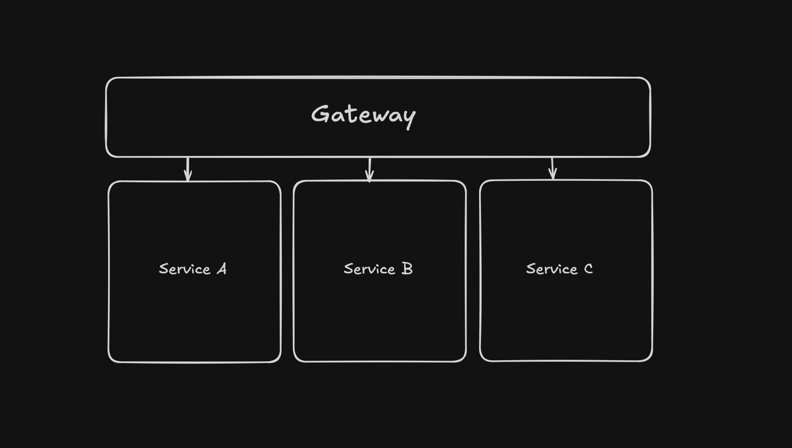
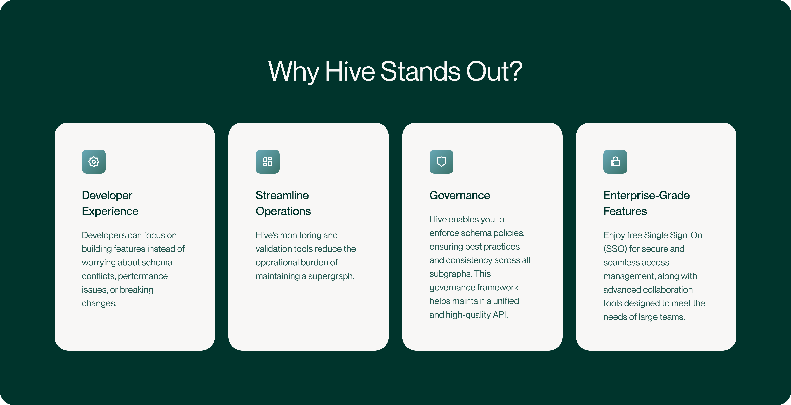

In the world of modern APIs, GraphQL has taken the spotlight for its flexibility, efficiency, and
developer-centric approach to querying data. But as applications grow, so do the complexities of
managing APIs across teams and services. That's where Supergraphs and federated GraphQL come into
play, taking GraphQL to the next level by enabling distributed teams to collaborate effectively on a
unified graph. The Hive GraphQL API platform empowers you with the tools to master the challenges of
Federated GraphQL

In this article, we'll dive into the concept of Supergraphs with
[Federation](https://the-guild.dev/graphql/hive/federation) and explore how Hive supercharges your
supergraph with essential tools for monitoring, collaboration, and governance.

## What's a Supergraph?

A **supergraph** is a unified data graph created by combining several smaller, independently managed
subgraphs. It serves as the backbone of large-scale GraphQL implementations, where different teams
or microservices manage their own subgraphs but contribute to the overall system. This allows your
architecture to scale while maintaining the simplicity and power of a single, unified API.

By [federating multiple subgraphs into a supergraph](/graphql/hive/federation), organizations can
delegate responsibilities across teams while ensuring that consumers still interact with a single
API. To see an example in action, check out our
[documentation here](https://the-guild.dev/graphql/hive/docs/get-started/apollo-federation?utm_source=the_guild&utm_medium=blog&utm_campaign=supercharge-your-subgraph-with-hive).

## Understanding Apollo Federation

[**Apollo Federation**](https://www.apollographql.com/docs/federation/?utm_source=the_guild&utm_medium=blog&utm_campaign=supercharge-your-subgraph-with-hive)
is an implementation of Subschema Directive-based
[Type Merging](https://the-guild.dev/graphql/stitching/docs/approaches/type-merging?utm_source=the_guild&utm_medium=blog&utm_campaign=supercharge-your-subgraph-with-hive) that
is defined by the Apollo Federation Specification. This technique allows for multiple GraphQL
services to work together as a single, cohesive API. Instead of one massive schema, you have smaller
schemas (aka subgraphs) that represent different parts of your system. Federation makes these
subgraphs interoperable and composable, enabling teams to **independently** maintain services while
contributing to the supergraph.

Here's a simplified view of the architecture:

- **Subgraphs**: Services owned by individual teams with their GraphQL schemas.
- **Gateway**: A gateway that resolves queries by creating a query plan to direct them to the
  relevant subgraphs, unifying all subgraphs into a single supergraph.

This decoupled structure improves **scalability**, allows for
[microservice-like architecture](https://microservices.io/patterns/microservices.html?utm_source=the_guild&utm_medium=blog&utm_campaign=supercharge-your-subgraph-with-hive),
and enables more agile teams.

## Challenges of Managing a Supergraph

Although a supergraph provides scalability and flexibility, its management involves several
complexities:

- **Version Control and Schema Evolution**: Modifications in a single subgraph can ripple through
  the entire supergraph, affecting its overall functionality.
- **Performance Tracking and Optimization**: With the integration of numerous services, monitoring
  and maintaining performance across the whole API becomes increasingly complex.
- **Coordination and Oversight**: With multiple teams working on the same supergraph, ensuring
  consistency and effective governance becomes crucial yet challenging.

## Enters Hive

**[GraphQL Hive (Hive)](/graphql/hive)** is a powerful, open source solution designed to address the
challenges of managing a supergraph. It's a GraphQL API management platform that provides
observability, schema registry, and collaboration tools to keep your supergraph organized and
performant.

## Key Features of Hive

- **Schema Registry** Simplify schema publishing, federated service composition, and detecting
  breaking changes.
  - **Composition Error Prevention:** Avoid runtime errors by validating integrity of all your
    subgraph schemas.
  - **Schema Explorer:** Navigate through your schema and check ownership and usage of types.
  - **Version Control System:** Track schema modifications across multiple environments from
    development to production.
  - **Schema Checks:** Identify any breaking changes before they reach production. Evolve your
    schema with confidence.
- **Observability** Advanced tools to gain deep insights into API performance and user experience.
  - **GraphQL consumers:** Track GraphQL requests to see how schema is utilized and by what
    applications.
  - **Overall performance:** Track and analyze overall GraphQL API performance.
  - **Query performance:** Pinpoint slow operations to identify performance bottlenecks.
- **Schema Management** Evolve your GraphQL API with confidence.
  - **Prevent breaking changes:** Integrated Schema Registry with GraphQL Monitoring for confident
    API evolution.
  - **Schema Policy:** Lint, verify, and enforce best practices across your federated GraphQL
    architecture.
  - **Detect unused fields:** Detect unused fields in your GraphQL schema for efficiency and
    tidiness.
- **Security** Safeguard your GraphQL API through secure deployment practices.
  - **Persisted operations**: pre-register GraphQL operations that will be executed against the
    GraphQL API

## Why Choose Hive for Your Supergraph?

GraphQL Hive offers the **observability, control, and collaboration** tools you need to run a
successful supergraph architecture. While Hive works seamlessly with **any** Apollo Federation
gateway, we also offer
[Hive Gateway](https://the-guild.dev/graphql/hive/docs/gateway?utm_source=the_guild&utm_medium=blog&utm_campaign=supercharge-your-subgraph-with-hive),
the
[only 100% Apollo Federation-compatible gateway solution](https://the-guild.dev/blog/federation-gateway-audit?utm_source=the_guild&utm_medium=blog&utm_campaign=supercharge-your-subgraph-with-hive).
Here's why Hive stands out:

- **Enhanced Developer Experience**: Developers can focus on building features instead of worrying
  about schema conflicts, performance issues, or breaking changes.
- **Streamlined Operations**: Hive's monitoring and validation tools reduce the operational burden
  of maintaining a supergraph.
- **Governance**: Hive enables you to enforce schema policies, ensuring best practices and
  consistency across all subgraphs. This governance framework helps maintain a unified and
  high-quality API.
- **Enterprise-Grade Features**: Enjoy free Single Sign-On (SSO) for secure and seamless access
  management, along with advanced collaboration tools designed to meet the needs of large teams.

  

## Conclusion

Apollo Federation transformed how we scale GraphQL across large teams and distributed services. Now,
GraphQL Hive takes it even further by offering powerful tools to manage, monitor, and optimize your
supergraph. With Hive, you can confidently build, deploy, and maintain a high-performing, scalable,
and collaborative GraphQL architecture.

**Ready to enhance your API management?** Get started by
[setting up your federated GraphQL services on GraphQL Hive](https://the-guild.dev/graphql/hive/docs/get-started/apollo-federation?utm_source=the_guild&utm_medium=blog&utm_campaign=supercharge-your-subgraph-with-hive)
today and take the first step toward a more efficient, scalable, and collaborative GraphQL
ecosystem.
