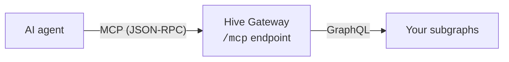

import { Callout } from '@hive/design-system/hive-components/callout'
import { Tabs } from '@hive/design-system/tabs'

The [Model Context Protocol (MCP)](https://modelcontextprotocol.io/) is the standard AI agents use
to discover and call external tools. With the `@graphql-hive/plugin-mcp` plugin, Hive Gateway
becomes an MCP server: you pick the GraphQL operations you want to expose, and each one becomes a
tool that agents can list and execute, complete with typed input and output schemas derived from
your supergraph.



The gateway takes care of loading the schema, generating input and output schemas, validating
arguments and formatting responses. You only define which operations become tools. The plugin
implements the `initialize`, `tools/list`, `tools/call`, `resources/list`, `resources/read` and
`resources/templates/list` MCP methods.

<Callout type="warning">
  The MCP plugin is in beta. Its configuration and behavior may change between releases as the
  protocol and the plugin evolve, and these docs are updated alongside it.
</Callout>

<Callout type="info">
  The plugin is available on the JavaScript distributions of Hive Gateway (the `hive-gateway` CLI
  with a `gateway.config.ts`, or the `@graphql-hive/gateway-runtime` package). It requires Node.js
  20 or later.
</Callout>

## Installation

```sh npm2yarn
npm i @graphql-hive/plugin-mcp
```

The package ships both CommonJS and ESM builds and needs `graphql` as a peer dependency.
[Langfuse](https://langfuse.com/) is an optional peer dependency, only needed when you use the
built-in [Langfuse description provider](/docs/gateway/mcp/description-providers).

## Quick start

Register the plugin with the operations you want to expose. The simplest tool is an inline query.

<Tabs items={['Gateway CLI', 'Gateway Runtime']}>

{/* Gateway CLI */}

<Tabs.Tab>

```ts title="gateway.config.ts"
import { defineConfig } from '@graphql-hive/gateway'
import { useMCP, type MCPConfig } from '@graphql-hive/plugin-mcp'

const mcp: MCPConfig = {
  name: 'my-api',
  tools: [
    {
      name: 'get_users',
      source: {
        type: 'inline',
        query: `query ($limit: Int) { users(limit: $limit) { id name } }`
      }
    }
  ]
}

export const gatewayConfig = defineConfig({
  plugins: ctx => [useMCP(ctx, mcp)]
})
```

Then start the gateway as usual, for example with `hive-gateway supergraph`.

</Tabs.Tab>

{/* Gateway Runtime */}

<Tabs.Tab>

```ts title="gateway.ts"
import { createGatewayRuntime } from '@graphql-hive/gateway-runtime'
import { useMCP } from '@graphql-hive/plugin-mcp'

const gateway = createGatewayRuntime({
  supergraph: 'supergraph.graphql',
  plugins: ctx => [
    useMCP(ctx, {
      name: 'my-api',
      tools: [
        {
          name: 'get_users',
          source: {
            type: 'inline',
            query: `query ($limit: Int) { users(limit: $limit) { id name } }`
          }
        }
      ]
    })
  ]
})
```

</Tabs.Tab>

</Tabs>

The MCP endpoint is served at `/mcp` next to your GraphQL endpoint. Change it with the `path`
option.

### Define tools with directives

Instead of listing tools in the configuration, you can annotate named operations in `.graphql` files
with the `@mcpTool` directive and point the plugin at them:

```graphql title="operations/weather.graphql"
query GetWeather($location: String!)
@mcpTool(name: "get_weather", description: "Get current weather") {
  weather(location: $location) {
    temperature
    conditions
  }
}
```

```ts title="gateway.config.ts"
useMCP(ctx, {
  name: 'my-api',
  operationsPath: './operations'
})
```

Every operation carrying `@mcpTool` is registered as a tool automatically. Operations without the
directive stay available as sources for tools declared in the configuration. All operations must be
named; anonymous operations are not supported. The [Tools](/docs/gateway/mcp/tools) page covers the
`@mcpDescription` and `@mcpHeader` directives as well.

### Define tools in YAML or JSON

The configuration object is plain data, so it can live in a YAML or JSON file that you load and pass
to `useMCP`:

```yaml title="mcp.yaml"
name: weather-api
version: 1.0.0

tools:
  - name: get_weather
    source:
      type: inline
      query: |
        query GetWeather($location: String!) {
          weather(location: $location) {
            temperature
            conditions
          }
        }
    tool:
      title: Current Weather
```

## Try it out

MCP speaks JSON-RPC over HTTP, so `curl` is enough to check the server:

```sh title="List the tools"
curl http://localhost:4000/mcp \
  -H "Content-Type: application/json" \
  -d '{"jsonrpc":"2.0","id":1,"method":"tools/list"}'
```

```sh title="Call a tool"
curl http://localhost:4000/mcp \
  -H "Content-Type: application/json" \
  -d '{"jsonrpc":"2.0","id":2,"method":"tools/call","params":{"name":"get_weather","arguments":{"location":"London"}}}'
```

Point any MCP client (an IDE assistant, an agent framework, or the MCP Inspector) at
`http://localhost:4000/mcp` to use the tools interactively.

## Next steps

- [Tools](/docs/gateway/mcp/tools): tool sources, directives, input and output shaping, hooks and
  annotations.
- [Resources and dynamic operations](/docs/gateway/mcp/resources): serve documents alongside your
  tools and load operations from an external source at runtime.
- [Description providers](/docs/gateway/mcp/description-providers): manage tool and field
  descriptions in Langfuse or your own service.
- [Configuration reference](/docs/gateway/mcp/configuration): every option of the plugin.
- [Runnable examples](https://github.com/graphql-hive/gateway/tree/main/packages/plugins/mcp/examples)
  in the Hive Gateway repository.
