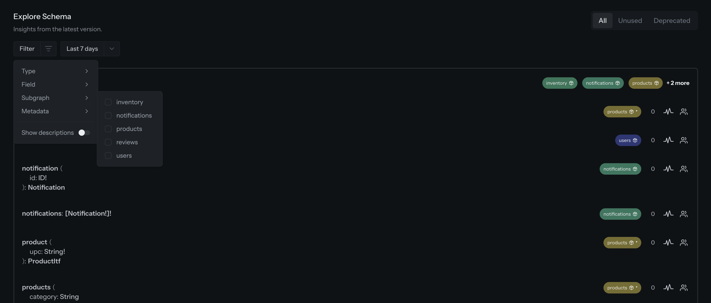

The Schema Explorer has always shown you the whole supergraph. That is the right default, but in a
federated project with dozens of subgraphs it makes answering "what does my team actually own here?"
harder than it should be. Today we are adding a subgraph filter and bringing every Explorer filter
together into a single menu.

## TL;DR

- Filter the Explorer by one or more subgraphs, on the main view as well as Unused and Deprecated.
- Every filter now lives in one **Filter** menu instead of a row of separate controls.
- Filters are stored in the URL, so a filtered view is a link you can share with your team.

## Filter by subgraph

Pick one or more subgraphs and the Explorer narrows to the types and fields those subgraphs own,
including the type pages and the Unused and Deprecated views. Select several and you will see
everything owned by any of them, which is the useful shape when a team owns more than one subgraph.

Ownership comes from the supergraph, so the Subgraph filter appears in federated projects. Single
schema and stitching projects are unaffected.

## One menu for every filter

Selecting a type, searching for a field, filtering by metadata and toggling descriptions previously
sat side by side in the page header. They now live in the same **Filter** menu, with an active filter
shown as a chip you can edit or clear without reopening the menu. The date range stays visible next
to it, and the All / Unused / Deprecated tabs move up next to the page title, where they read as what
they are: separate views rather than another filter.

Head to the Explorer in any federated target to try it.

---

[Learn more about the Schema Explorer](/docs/schema-registry/explorer)
